# 101 开发人员如何撰写合同指南

> 原文：<https://blog.devgenius.io/101-guide-on-how-to-write-a-contract-as-a-developer-f861bbc57193?source=collection_archive---------6----------------------->

格伦·卡斯滕斯-彼得斯在 [Unsplash](https://unsplash.com?utm_source=medium&utm_medium=referral) 上拍摄的照片

我将在本文中作为例子展示的合同类型主要是所谓的“固定预算”合同

## 所以，首先…

如下图所示，你写下代表合同中心目的的标题，然后写下所有参与实体应该会面达成协议的日期，然后你陈述参与的“当事人”或“实体”。

你将写下并阐明你或你的公司将如何在文件中被提及，然后你也将阐明你的客户也将如何被提及，最后你将提供的产品或服务将如何被提及。

在这种情况下，在这个例子中，你将把自己命名为**‘服务提供者’**，把你的客户命名为**‘服务请求者’**，把你提供的服务或产品命名为**‘请求产品’**；你可以给每个实体起一个最合适的名字，只要它是专业的，并且以一种正式的方式称呼所有的实体。

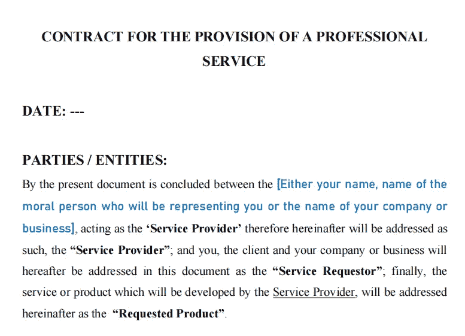

## 现在，在接下来的部分…

“陈述”*(每一部分，无论是副标题还是类别，都必须用大写字母书写)*你将首先介绍你公司的信息，你的客户也必须这样做，尽管这取决于你的客户将如何被表述，这将取决于合同这一部分的结构；正如您将在下图中看到的，您的客户有两种选择，由一个**‘道德人’**代表，这个人或一群人在与合同相关的任何事情上承担有限的责任；而**“自然人”**可以是直接和明确地作为“服务请求者”的执行官或 CEO 本身。

*(到底什么是道德人，什么是自然人，有不同的概念和定义；但是对于这种唯一的情况，只要记住这两个)*。

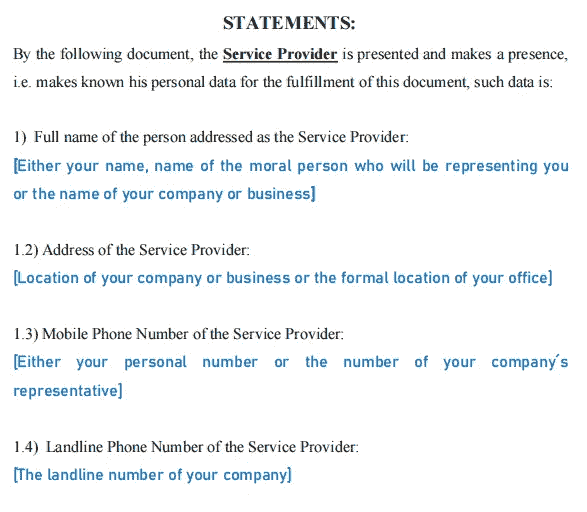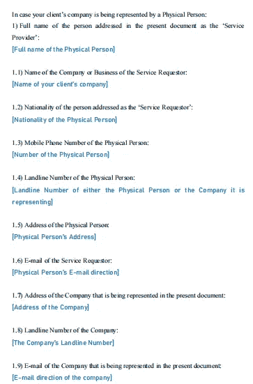

## 现在，这是合同的主体，

这显然是最重要的部分，取决于你如何构建它，将取决于在提供服务或项目的整个过程中，你和你的客户之间的相互待遇如何。

你可以按任何顺序写下合同条款*(显然，这将取决于你想要以何种方式组织它)*，尽管“与合同相关的法律”部分应该总是放在最后。

**所以，首先**，所提供服务的目的，*(这是在声明和审查合同之前应该并且必须讨论的事情，就像你到底要开发什么和为了什么，这些总是被标记为一个软件的‘先决条件’， 很明显，这是你必须先与你的客户讨论的事情)*在这个合同示例中，我以一种确保客户不会将“请求的产品”用于与讨论内容无关的任何其他事情的方式来编写它。

最后，你写下交付日期，这显然是项目必须提交给你的客户的时间，这也是你必须与你的客户澄清的先决条件的一部分*(换句话说，这是你根据对完全完成项目可能需要的时间的估计而确定的最后期限)*。

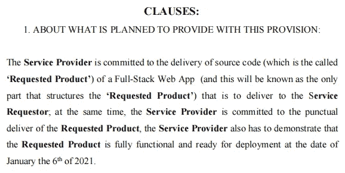

现在，在这一小节中，我重申,“要求的产品”不会被使用，也不会被出售给合同的外部实体*(或第三方实体)*，也不会被用于与客户讨论过的产品未涵盖的任何目的；除非你真的在为中介制作软件，否则你必须澄清你开发的软件不能卖给与你客户的公司或业务无关的任何人。

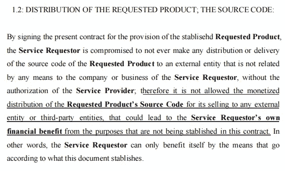

## 所以，现在有些东西你必须永远公平，但对你的客户严格:你应得的报酬

首先，你澄清你的付款总额，对于我写在方括号之间的内容，你必须这样写:

**$30，000.00(三万美元 00/100 新台币)**

*(****)Ntl。诅咒。缩写的意思是国家货币*** *，在该金额的书面部分，您显然必须填写属于您目前居住的国家的货币，在本例中，我只是决定将其填写为美元，尽管我目前并不居住在那里)。*

就在那之后，我决定在这份合同范本中写下，预付款是必须的*(建议你加上这一点，因为这是你或你和你的公司对你和你的客户之间可能出现的任何不便的保证)*，这只是付款总额的一小部分*(很明显，一旦客户支付给你，你必须从总额中扣除这一部分；否则，由于显而易见的原因，似乎你向你的客户收取的费用超过了设定的金额)*，我决定只收取最终付款总额的 1/4，但你可以设定你想要的任何数量或百分比*(显然，这个金额必须对你的客户公平)*。

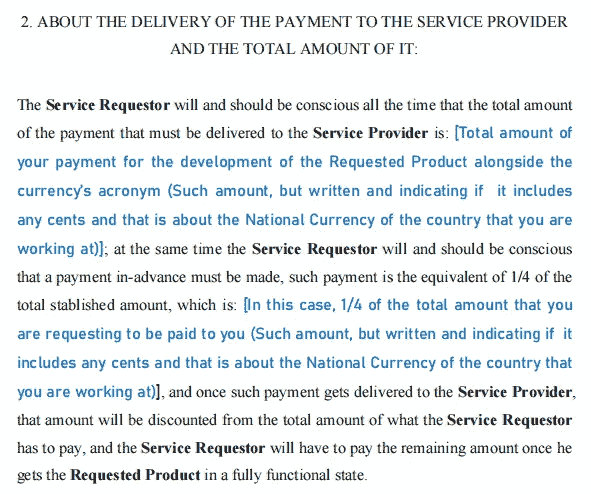

现在，你将讨论提前付款，客户何时必须付款，如果不及时付款将面临什么制裁；在这个例子中，主要的制裁将是，在预付款的固定日期之后的每一天，它将获得最终总付款的 25%的奖金，并且一旦客户已经支付了该金额以及所有奖金，该制裁将停止。

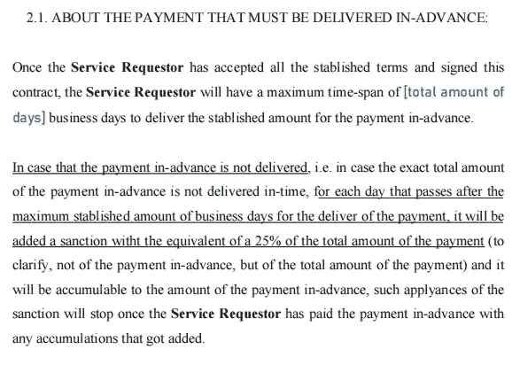

之后，在下一小节中必须讨论的是客户必须为“请求的产品”向您支付的工作日数量，以及在什么条件下您的客户必须向您支付的可用工作日开始，最后是如果您的客户没有及时支付，将会面临什么样的制裁。

*(在本例合同中，我决定建立与预付款相同的制裁)。*

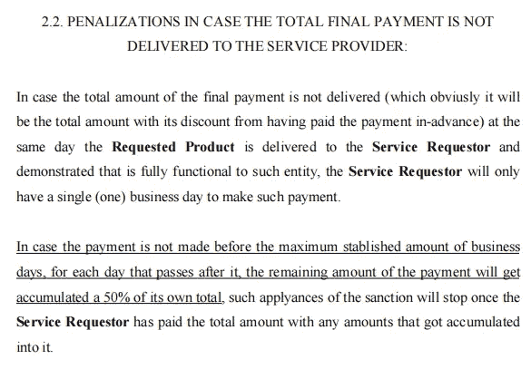

现在，下一节将告诉你和你的客户在某些条件下有什么样的保证，例如当客户决定取消所要求产品的开发时，在这个例子中，如果客户在规定的截止日期前 1 天或 1 周取消项目，它将不得不支付最终付款金额的一半，并且再次对未及时支付该金额进行相应的制裁。

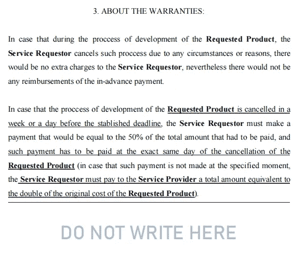

*(作为额外信息。关于这部分，这里的* ***不要写*** *“水印的存在是为了让你的客户知道，在合同签订之前和之后，这里都不会增加任何东西；因为这些空白区域可能会让人觉得可能会在不让客户知道的情况下添加一些内容，因此，也可能会给客户留下不信任的感觉。*

*(这也适用于当你是以任何方式主要受合同影响的一方时，你应该对任何有任何空格的内容保持警惕和小心，因为如上所述，任何内容都可以在没有你的同意和从未让你知道合同的任何变化的情况下添加到那里)。*

在接下来的部分，你必须告诉你的客户你负责什么，你负责给客户带来什么样的某些因素，作为“请求产品”的一部分，你也可以让你的客户知道你可以对其员工进行培训*(你可以只在必要时添加这一点，我还描述了我将对他的每个需要培训以维护项目源代码的员工收取额外的费用；而且要澄清这一点，那并不意味着你不用为源代码提供文档，因为* ***你明明要写你开发的东西的文档*** *)。*

然后，在同一部分的以下段落中，您将告诉您的客户，您将负责保存项目源代码的备份副本，并且您不会将它出售或分发给与您客户的公司无关，尤其是与合同无关的任何外部实体或方。

在那之后，你将告诉你的客户，在项目交付给他们之后，你将负责修复任何发现的错误；但是你也要告诉你的客户，在这样做之前，你将与源代码的备份副本进行比较，以确保你的客户没有为了让你免费添加更多功能而故意破坏源代码。

为了对两个文件进行快速比较，您可以尝试任何 Hashcode-generators，并将每个报告有错误的文件与原始文件进行比较……或者您可以在报告有错误的部分直观地比较文件。

同样，所有这些都是必要的，以确保您的客户不会为了免费获得额外的功能而故意破坏源代码。

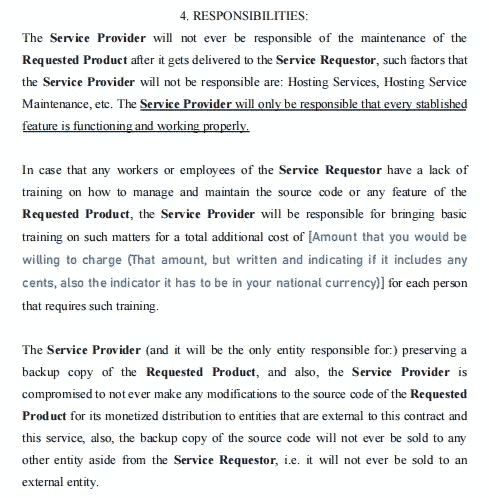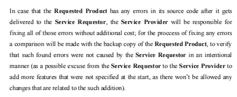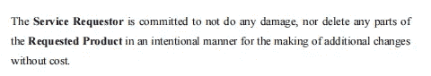

在下一小节中，您将向您的客户澄清，合同中任何参与实体/方的信息都不会分发或出售给任何外部实体。总之，当涉及到你的个人信息和客户的个人信息时，没有什么可担心的。

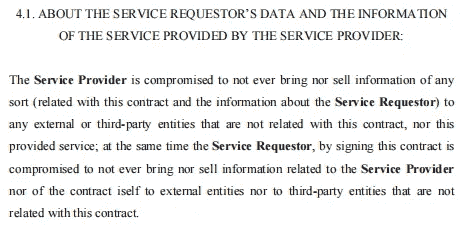

现在，最能确保所有声明得到尊重的部分，或者是避免声明被破坏或不被尊重的部分，是合同将附加或涉及的法律；你可以添加任何你需要或觉得必要的，尽管在这个例子中，我相信我添加的是最必要的。

*(另外，我决定只包括每项法律的标题，以便尽可能地总结所有内容，但我将提到隐含的参考，即我在示例合同中包括了这些法律的哪些条款)。*

## 所以，首先是联邦国家法律:

> > "**联邦国家版权法** " *(名称可能因您目前居住的国家而异)*，这些将保护您的源代码免受之前声明的、可能的以及*(显然)*不允许您的客户向任何外部实体销售或分发源代码*(仅当您没有为中介开发项目时)*。

*(从这一条我只包括了与软件或代码相关的)。*

> > "**墨西哥联邦刑法"**，现在你一定想知道我为什么要包括我的国家的刑法，就像前面提到的一样，我只是包括了与这种情况最相关的条款，即:

**>如果由于发生的任何事情导致您的公司或您客户的公司丢失任何数据，并且这些事情明显与已确定和讨论的项目有关。**

*以及从这两种情况衍生出的许多其他事情。*

*> >**“墨西哥合众国政治宪法**”，其中我仅包含了与保护个人数据相关的条款，以确保您的客户和您的个人数据*(以及您的员工数据，如果您有)*不会被合同中的任何参与方分发或出售；显然，你必须包括那些来自你现在居住的国家的人。*

*> >“**国家刑事诉讼法**”，我把它包括进来只是为了加强合同中关于保护个人数据的先前法律部分。*

*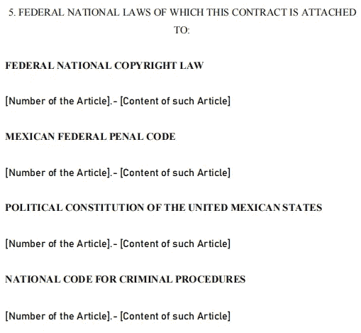*

*在那之后，我写下了合同可能涉及的国际法，我只包括了“世界人权宣言”，其中我包括了关于保护自己数据的部分。*

*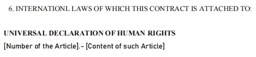*

*对于合同这一部分的最后一小节，我决定纳入我目前居住的州的法律以及与合同相关的法律。*

**

*最后，签名部分，在这里，如果你在这一页的下面或后面留有任何空格都没有关系，因为在这一页之后的任何内容都是不适用的或无效的；显然，只有在这最后一节之前的所有内容，在与客户的项目结束之前都是有效的。*

*这里不仅要有你和你委托人的签名，还要有你的证人和你委托人的证人的签名；合同见证人确保每个实体/方在签署合同后达成协议，因此完全需要他们也签署合同。*

**(通常每一方/实体至少有 2 个见证人，但在本示例合同中，我决定为每一方/实体增加 1 个见证人)。**

*此外，每个参与方/实体都必须在合同的每一页上签名。*

*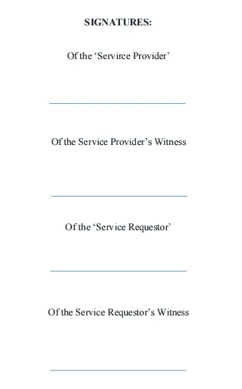*

***就是这样！**，你刚刚学会了如何签订一份足够好的合同，这份合同对你的工作条件是公平的，对你将在项目上花费的时间是公平的，并使这些时间变得有价值，对你的客户*也是公平的(但是，正如一开始提到的，在客户必须交付给你的报酬方面是严格的)*。*