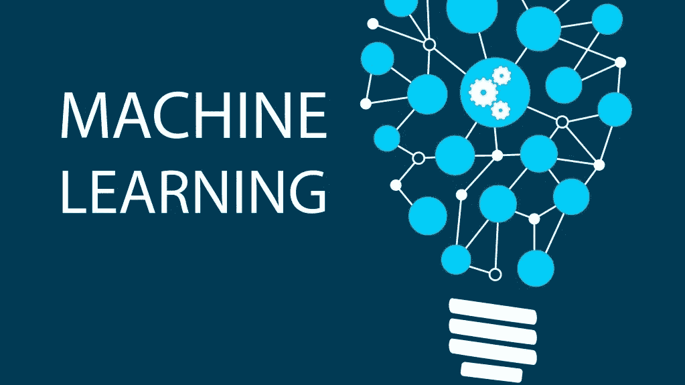
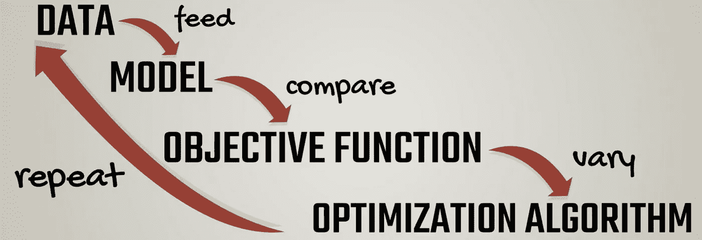

# 101 机器学习算法的构建模块

> 原文：<https://blog.devgenius.io/101-of-building-blocks-of-machine-learning-algorithm-19a28e372db?source=collection_archive---------4----------------------->

机器学习的概念并不新鲜，它的历史可以追溯到 20 世纪 50 年代，当时艾伦·图灵创建了图灵测试来确定计算机是否具有真正的智能。为了通过测试，计算机必须能够欺骗人类，让他们相信它也是人类。从那时起，所有的大公司都在研究机器学习，并实现了自己的算法或基于机器学习的产品，如微软的 Kinect、IBM 的 Watson、脸书的 DeepFace 算法、谷歌的 Brain 等等。

## 机器学习到底是什么，是由什么组成的？

ML 可以被认为是一个黑盒，你给 ML 算法输入，它训练自己，然后给出想要的输出。这就像训练一个孩子去做一项特殊的任务，然后在训练之后，他参加了一场考试并通过了考试。机器学习算法要工作，需要 4 个基本要素。

1.  数据
2.  模型
3.  目标函数
4.  最优化算法

## 数据

数据无处不在，没有数据，机器学习就什么都不是。20 世纪 90 年代，当科学家开始为计算机编写程序来分析大量数据并得出结论或从结果中学习时，关于 ML 的工作从知识驱动的方法转向了数据驱动的方法。在 ML 中，来自历史事件的数据用于训练算法。通常，在大型数据集中，2/3 用于训练算法，1/3 用于测试。

## 模型

数据输入到模型中，模型通常是一个特定的函数或算法。下面给出了一个简单模型的例子

> y = xw + b

其中 y =输出，x =输入，w =重量，b =偏差

这是最基本的 ML 模型方程，基于这个方程我们可以创建更复杂的模型。这个模型被称为线性模型。权重和偏差是该公式中的可学习参数，其值被随机初始化，但是可以被调整和控制以获得期望的输出。

## 目标函数

当模型根据数据进行训练时，必须进行比较，以检查它与现实的接近程度。这就是目标函数发挥作用的地方。目标函数是模型的输出与目标有多接近的度量。

## 最优化算法

在目标函数检查被训练的模型离目标有多远之后，我们必须修正算法，以便具有最大的准确性或最优化。优化算法使用目标函数值并改变模型参数。重复这个过程，直到我们得到目标函数最佳的参数值。

机器学习类似于人的学习。一个人需要大量的实践和错误，才能在正确的方向下完美地完成一项任务。没有人天生或一开始就是完美的。机器学习也是如此。机器也需要练习才能变得完美。上述四个要素有助于机器学习算法在大量的尝试和错误之后达到最佳阶段和完善。机器学习和人类学习的区别在于，通过适当的数据集和模型，机器可以比普通人学习得更快，从而帮助人类实现他们的最终目标，这就是机器学习的用途。

快乐学习。

如果你喜欢这篇文章，请点击拍手👏按钮下面几下，以示支持！

更多文章，请访问 [**Nestedif**](http://Medium.com/Nestedif) 主页