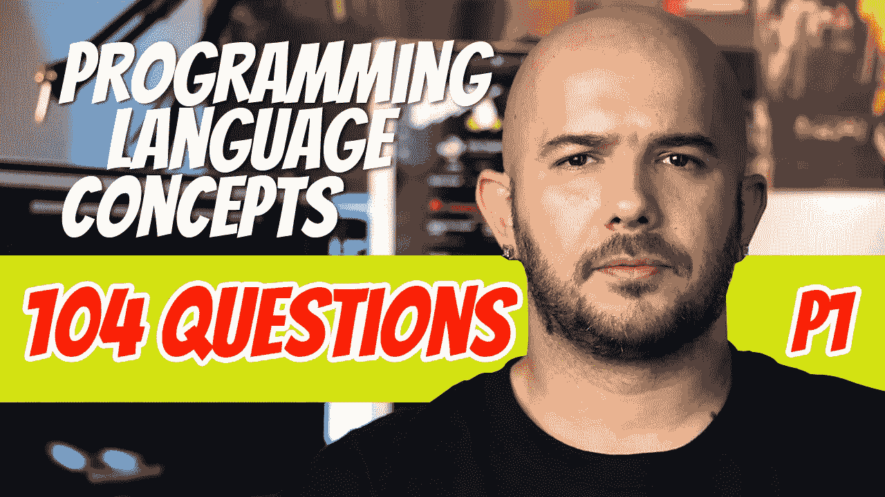

# 104 编程语言问答(P1)

> 原文：<https://blog.devgenius.io/104-programming-language-conceptual-questions-and-answers-p1-8de4591299fe?source=collection_archive---------2----------------------->

我用来学习新话题的最简单的方法之一是就这个话题做笔记，然后把这些笔记变成问题和答案。记住问题的答案似乎更自然。我能够在不到几个小时的时间里记住这 104 个问题和答案。我想开始做一些我觉得很有趣的话题。首先，这里有一些关于编程语言概念(PLC)的问答。我现在正在读你的思想，答案是**是的**，会有更多。

## 1.说出学习 PLC 的 3 个理由。

-更好地理解当前的编程语言
-计算技术的进步
-表达思想的能力增强
-学习新编程语言的能力增强。
-更好地理解选择哪种编程语言。

## 2.说出最适合的 5 个编程领域和语言。

-科学(Fortran，ALGOL 60)
-商业(COBOL)
- AI (Lisp，Scheme，Prolog)
- Web (PHP，Java，JavaScript)
-游戏(C，C++)

## 3.评估编程语言的 4 个标准是什么？

-可读性
-可写性
-可靠性
-成本

## 4.在可靠性方面，整体简单性意味着什么？

-简单语言的基本结构相对较少

## 5.什么是特征多重性？

-有多种方法来完成同一项任务。即 count++或 count = count + 1

## 6.定义正交性。

-可以组合一小组基本构造来构建语言的数据和控制结构。

## 7.正交性与什么密切相关？

-简单

## 8.真的还是假的？过于简单可能是个问题。

-没错

## 9.真的还是假的？太正交会出问题？

-没错

## 10.举一个数据类型问题的例子。

- C89 没有布尔类型，因此 x = 1 是不明确的，可以表示 x =整数 1 或 x =真

## 11.填写单词语义(________)应该直接从 _________(形式)开始

-含义
-语法

## 12.为什么简单性和正交性是可写性的一个问题？

-大量的功能会导致一些功能的误用和高级功能的废弃

## 13.正交性什么时候有助于可写性？

-当特征不过度正交时

## 14.什么时候语言是有表现力的？

-如果一种语言具有使执行普通任务更容易的特征，那么它就是表达性的。

## 15.可靠性…什么是类型检查？

-在编译或运行时检查类型错误

## 16.什么时候类型检查是首选？

-在编译期间，因为运行时检查开销很大

## 17.什么是异常处理？

-在运行时拦截错误并处理这些错误。

## 18.什么是混叠？

-将两个或多个名称分配给同一个存储单元。

## 19.可读性和可写性如何影响可靠性？

-如果一种语言很难阅读，它就很难调试。如果写得不自然，就更有可能含有 bug。

## 20.列举一些评估编程语言时要考虑的成本。

-培训程序员的成本
-编译成本
-执行成本
-实施成本

## 21.什么是优化，为什么被认为是成本中的一个因素？

优化是为了节省时间或空间。优化会增加编译时间。

## 22.语言成本最重要的贡献者是什么？

-可靠性、维护和程序开发

## 23.说出其他一些评估编程语言的标准。

-通用性
-便携性
-定义明确。

## 24.大多数流行语言都是围绕什么架构设计的？

-冯·诺依曼建筑

## 25.基于冯·诺依曼架构的语言叫什么？

-命令式语言

## 26.命令式语言基于什么？

冯·诺依曼建筑。

## 27.在命令式语言中，变量名代表什么？

-记忆细胞

## 28.在命令式语言中，赋值语句代表什么？

-数据在内存和 CPU 之间来回移动。

## 29.说出编程设计方法。

-自顶向下设计或逐步细化
-数据抽象
-面向对象设计

## 30.哪种语言帮助普及了面向对象编程？

-闲聊

## 31.说出编程语言的四个类别。

-命令式、函数式、逻辑式和面向对象式

## 32.描述一种函数式编程语言。

-定义和调用函数的能力。

## 33.描述一种逻辑语言。

-包含一组事实和规则。

## 34.面向对象语言通常是 _______ _______ 的扩展。

-命令式语言

## 35.真的还是假的？标记语言是编程语言？

-假的

## 36.说出一些语言的取舍

-可靠性与执行成本
-可写性与可读性
-可写性与可靠性

## 37.说出一种编程语言的实现方法。

-汇编

## 38.什么是编译？

-编译器将源代码翻译成机器语言的过程

## 39.编译的优势是什么？

-快速程序执行

## 40.编译器有哪些阶段？

-词法分析器、语法分析器、中间代码生成器、优化器、代码生成器

## 41.词法分析器是做什么的？

-丢弃注释并将字符聚集到词位中。

## 42.语法分析器是做什么的？

-检查语法错误并从词位创建解析树。

## 43.中间代码生成器是做什么的？

-检查语义错误并将程序翻译成类似于汇编的中间语言。

## 44.优化器是做什么的？

-试图使程序更小更快。

## 45.代码生成器是做什么的？

-将中间代码翻译成机器语言。

## 46.真的还是假的？编译器的所有阶段都使用符号表。

-没错

## 47.链接器的目的是什么？

-将不同模块的代码组合成一个程序
-包含调用库例程的代码
-包含与操作系统通信的代码

## 48.链接器的输出是什么？

-可执行映像

## 49.什么是纯解读？

-由解释程序执行程序，无需将源代码翻译成低级形式。

## 50.口译的优势是什么？

-适合调试

## 51.口译的一些缺点是什么？

-缓慢执行
-执行期间需要更多空间

## 52.描述混合实施系统。

-源代码被生成为中间代码，并发送给解释器。

## 53.Java 编译器产生什么类型的中间代码？

-字节码

## 54.Java 的解释器叫什么？

- Java 虚拟机(JVM)

## 55.Java 解释器执行什么类型的编译？

-实时编译

## 56.什么是实时编译？

-在执行时将字节码翻译成机器码

## 57.哪些编程语言依赖于预处理器？

- C 和 C++

## 58.预处理程序是做什么的？

-从源代码中提取嵌入式命令，并在编译前删除它们。
-例如，# include“mylib . h”被复制到源代码中

## 59.什么是编程环境？

-软件开发工具集。

## 60.什么是 IDE？

-提供一组通过 UI 访问的集成工具的环境。

## 61.谁开发了 Plankalkul？

康拉德·楚泽

## 62.浮游生物有什么用？

-适合表达计算。

## 63.Plankalkul 是什么意思？

-程序演算

## 64.真的还是假的？Plankalkul 从未实现过。

-没错

## 65.Plankalkul 中最简单的数据结构是什么？

-一位

## 66.从 Plankalkul 中的单个位可以派生出哪些类型？

-浮点和整数

## 67.填空。在 Plankalkul 中，浮点使用了 _ _ _ _ _ _ _ _ _ _ _ _ _ _ _ _ _ _ _ _ _ _ 符号和隐藏位

-二进制补码

## 68.真的还是假的？在 Plankalkul 中，if 语句有一个可选的 else 语句。

-假的

## 69.Plankalkul 有 goto 语句吗？

-没有

## 70.填空。Plankalkul 有一个类似于 ________ 中的 for 语句。

帕斯卡

## 71.Plankalkul 包含断言吗？

-是的

## 72.什么是断言？

-显示程序变量之间当前关系的数学表达式。

## 73.机器码有些什么问题？

-难以阅读
-绝对寻址使修改变得繁琐。

## 74.说出两种伪代码语言。

-短代码和速度代码

## 75.短代码是谁开发的？

约翰·莫奇里

## 76.真的还是假的？短代码由数学表达式的编码版本组成。

-没错

## 77.在短代码中变量是如何命名的？

-使用字节对代码。

## 78.短代码是编译的还是解释的？

-已解释

## 79.在短代码时代，解释的另一个名称是什么？

-自动编程

## 80.谁开发了 Speedcode？

IBM 701 的约翰·巴科斯

## 81.701 被扩展成虚拟的 _____ _____ ____。

-三点计算器

## 82.真的还是假的？速度代码比机器码更有效？

-没错

## 83.谁开发了 UNIVAC 编译系统？

格蕾丝·赫柏

## 84.格蕾丝·赫柏开发的编译系统叫什么名字？

- A-0，A-1 和 A-2

## 85.格蕾丝·赫柏开发的编译系统做了什么？

-将伪代码扩展成机器码。

## 86.Fortran 是谁开发的？

IBM 704 的约翰·巴科斯

## 87.Fortran 编译器的主要目标是什么？

-生成代码的速度

## 88.真的还是假的？Fortran 编译器的效率几乎是手工编译的一半。

-没错

## 89.填空。________ 是第一种被广泛接受的编译型高级语言

- Fortran

## 90.真或假。Fortran 我有输入输出格式。

-没错

## 91.在 Fortran I 中，一个变量名可以包含多少个字符？

-最多 6 个

## 92.真的还是假的？Fortran I 有用户定义的子程序。

-没错

## 93.真的还是假的？Fortran 中有一个 if/else 语句。

- False，只有一个 if 语句

## 94.在 Fortrain I 中程序员是如何将变量声明为整数的？浮点怎么样？

-通过以 I、J、K、L、M 或 N 开头的名字，变量是隐式整数。所有其他的都是浮点数

## 95.Fortran II 增加了什么功能？

-子程序的独立编译

## 96.真的还是假的？Fortran III 是最成功的 Fortran 版本。

-假的。Fortran 从未被广泛分发。

## 97.第一个标准化的 Fortran 版本是什么？哪一年？

-1966 年 Fortran IV。

## 98.Fortran IV 增加了哪些特性？

-变量的显式类型声明
-将子程序作为参数传递给其他子程序的能力
-逻辑 IF 构造

## 99.Fortran 什么时候收到了 IF 语句的 ELSE？

- Fortran 77

## 100.Fortran 什么时候开始支持小写字母的？

- Fortran 90

## 101.说出 Fortran 90 中实现的其他特性。

-递归
-动态数组、指针和多重选择语句

## 102.Fortran 90 标准化包括什么？

-要删除的功能列表

## 103.Fortran 什么时候获得了面向对象的能力？

- Fortran 2003

## 104.说出 Fortran 2008 中添加的一项功能

-更好地支持并发编程

# 想要更多吗？

[*P1。104 编程语言 Q & A*](https://medium.com/@dinocajic/104-programming-language-conceptual-questions-and-answers-p1-8de4591299fe)
[P2。95 编程语言 Q & A](https://medium.com/@dinocajic/95-programming-language-q-a-p2-4a7d87b89903)[P3。123 编程语言 Q & A](https://medium.com/@dinocajic/123-programming-language-q-a-p3-f4d5c141382)
[P4。77 编程语言 Q&A](https://medium.com/@dinocajic/77-programming-language-q-a-p4-71f7dc5cab3e)[P5。146 编程语言 Q & A](https://medium.com/dev-genius/146-programming-language-q-a-p5-d6ad7550c4a0)
[P6。94 编程语言 Q & A](https://medium.com/dev-genius/94-programming-language-q-a-p6-d7e00de0f48)
[P7。141 编程语言 Q & A](https://medium.com/@dinocajic/141-programming-question-q-a-p7-5b4a4325e886)

迪诺·卡希奇目前是 [LSBio(寿命生物科学公司)](https://www.lsbio.com/)、[绝对抗体](https://absoluteantibody.com/)、 [Kerafast](https://www.kerafast.com/) 、[珠穆朗玛生物科技](https://everestbiotech.com/)、[北欧 MUbio](https://www.nordicmubio.com/) 和 [Exalpha](https://www.exalpha.com/) 的 IT 负责人。他还担任我的自动系统的首席执行官。他有十多年的软件工程经验。他拥有计算机科学学士学位，辅修生物学。他的背景包括创建企业级电子商务应用程序、执行基于研究的软件开发，以及通过写作促进知识的传播。

你可以在 [LinkedIn](https://www.linkedin.com/in/dinocajic/) 上联系他，在 [Instagram](https://instagram.com/think.dino) 上关注他，或者[订阅他的媒体出版物](https://dinocajic.medium.com/subscribe)。

阅读 Dino Cajic(以及 Medium 上成千上万的其他作家)的每一个故事。你的会员费直接支持迪诺·卡吉克和你阅读的其他作家。你也可以在媒体上看到所有的故事。