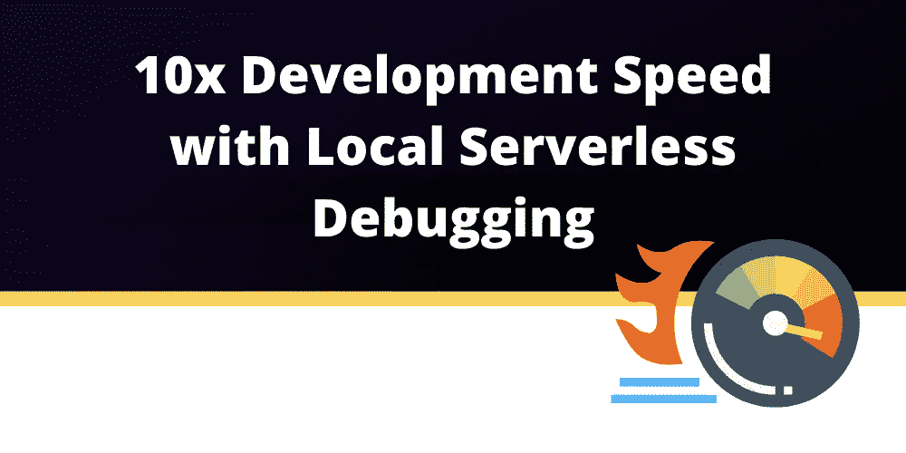
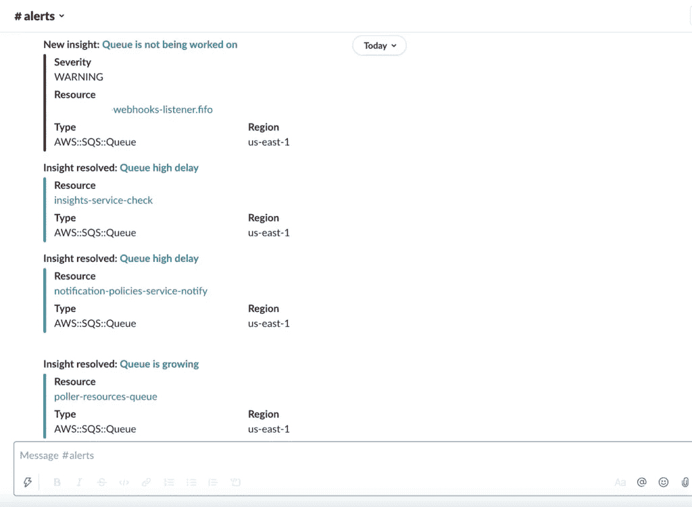
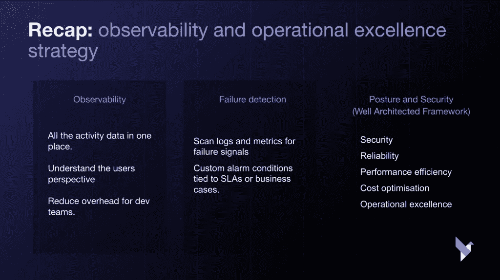

# 通过本地无服务器调试，开发速度提高 10 倍

> 原文：<https://blog.devgenius.io/10x-your-development-speed-with-local-serverless-debugging-224e5f6e7961?source=collection_archive---------3----------------------->

在本文中，您将了解如何通过本地无服务器调试将开发速度提高 10 倍。

诸如“当您将应用程序扩展为数百万个请求时会发生什么？”，“走向无服务器时代后会发生什么？”，“长得怎么样？”，或者“如何在无服务器上构建应用程序并在本地工作？”将得到解决。

在开发领域，**的最终目标**是**增加你可以添加到产品中的商业价值**。这就是本文的全部目标——向**展示如何提高开发速度以更快地达到目标**。

# 无服务器开发速度

让我们深入了解一下无服务器开发的速度。阻止许多人转向无服务器的是 it 的发展。

你可以把它比作一个整体架构，一旦投入生产，它将**难以扩展、难以部署、难以维护**。但是它的好处是，开发起来并不太糟糕。从微服务和无服务器架构的另一面来看，你真的**在享受云的好处**。问题是你所有的资源，你的数据库，你的 S3 桶，你的 Lambda 函数都是分离的。**这可不是本地开发最容易的事情，就在你的电脑上**。

也可以更慢。那会让事情慢下来，因为你真的有两个选择。

你可以**上传到云**，当你想做一些改变，然后测试它，看看它是否工作，或者你可以**尝试在本地开发**，但是会有一些额外的设置。所以你真的不希望每次做出改变时都部署到云上，因为你将不得不等待 10 秒到 2 分钟甚至 5 分钟才能上传。所以，如果你多次做这些改变，那不会是一个好结果。你会在那里浪费很多时间。所以今天我们将专注于本地开发是什么样子，设置是什么样子，以及如何做。

你已经决定了“好吧，我想使用无服务器系统，但是现在我想构建一个项目”。您的下一步是决定您想要使用哪个框架。这绝不是一份详尽的清单。当你开始构建一个无服务器的应用程序时，这可能是你脑子里想的更多的东西。从实验的角度考虑这个项目，一直到生产。

如果你只是想**建立一个快速的 Lambda 函数，测试一下**。建立模拟网站时使用[AWS SAM](https://aws.amazon.com/serverless/sam/)；你有一个连接到后端的前端，也许是一些认知，Amplify 是一个很好的选择。然后在无服务器上提升到生产级别。

> 了解更多关于[为生产优化 AWS Lambda](https://dashbird.io/blog/optimizing-aws-lambda-for-production/)的信息。

**无服务器很棒，因为它与云无关**。它的规模将会非常大。接下来，我们将分享一些例子，展示基于无服务器框架调试生产工作负载的情况。

# 本地调试无服务器的最佳实践

在开始演示之前，让我们先讨论几个最佳实践。

当你构建一个函数时，你要记住的一件事是**保持许多小函数优先于一个大函数**。

原因是，当你调试这个东西的时候，如果你有一个大函数，你会发现，“好吧，我的应用程序坏了，我该怎么去修复它？”

你要拉起，你要去你的[监控工具](https://dashbird.io/aws-lambda-monitoring/)，比如 CloudWatch。

你可能会发现哪个函数坏了，但是你会花更长的时间**找出问题到底出在代码的什么地方**,相比之下，当你有很多小函数时，当错误出现时，需要通过**更少的代码**。你可以更快地发现那个错误。

> 了解在线 Spa 和美容预约管理工具 MangoMint 如何[显著加快他们的无服务器开发周期和团队流程](https://dashbird.io/customers/mangomint/)。

然后第二个也是最后一个今天真正要强调的最佳实践是**局部迭代**。

它的思想是，通过将您的更改推送到云上，您可以为一个迭代获得许多本地迭代。原因是上传和下载需要等待时间。如果你可以设置你的应用程序，使其能够在本地完成这些循环，那绝对是你想要做的。

三年前 [Dashbird](https://dashbird.io/) 是在无服务器的早期采用者的学习基础上创建的。如今，Dashbird 已经连接了超过 5000 个 AWS 帐户，并接收监控数据。从这个池中，有可能看到**构建无服务器的当前趋势**以及**开发者和组织倾向于犯的主要错误**。

让我们看看无服务器监控和调试[的规模](https://dashbird.io/blog/serverless-for-enterprises-large-scale-projects/):

*   有哪些需要牢记的要点，如何节省时间，降低风险？
*   为什么云中的可观察性、监控和调试如此困难？

与容器化的以服务器为中心的工作负载相比，**的首要原因是**实际上要处理的云资源数量**呈指数级增长。例如，10 台服务器变成了 500 个功能。**

所有这些资源或功能都有日志、指标、跟踪和大量分布在 CloudWatch 日志中的数据。**都有不同的配置**。

它们相互作用，理解如何使用应用程序变得非常困难。例如，如果任何类型的调试有任何问题。或者是否对性能有影响，或者某些东西运行缓慢或不能按预期工作。

# 本地无服务器调试演示

# 大规模无服务器监控和调试

# 第一个挑战:大数据集

当构建一个无服务器应用程序时，一个挑战会出现成千上万次，这个挑战与**拥有太多资源**有关。

这些资源中的每一个都产生了大量的数据。要理解并能够有效地导航，需要掌握很多东西。这一挑战可以分为三类，下面将进行介绍。

但是首先，**有哪些接近可观察性的方法**？

监控数据呈指数级增长。它被锁在筒仓里，有很多噪音，信号隐藏在噪音中。许多结构化或非结构化的监控数据可能很难转化为有意义的数据，例如:

*   费用是多少？
*   潜伏期有什么变化？
*   商业事件是什么样的？
*   你有多少种注册方式
*   有多少支付通过系统进行？

要解决这个问题，我们先退一步。

[可观测性](https://dashbird.io/blog/monitoring-vs-observability/)是什么意思？其定义是，它是一种**度量，衡量系统的内部状态可以从其外部输出的知识中推断出来的程度。在无服务器监控的环境中，想法是:我们能通过分析系统输出或告诉我们的所有外部输出来理解我们的应用程序的状态吗？**

**无服务器应用具有可观测性**。如果您的所有服务都是无业务服务器的，那么可以通过查看云环境中的各种数据源来了解它们。如果你在使用这些服务，可以说没有什么是你不能真正理解的。他们正在产生数据。您有指标，这些指标是应用程序中正在发生的事情的最基本的指示。每个事件都有日志。如果在事件或任何应用程序事件中出现异常、超时或任何相关情况，每个位置都会被记录下来。并且 **X-Ray 将自动跟踪整个环境中的请求**。你必须有一个 API 网关请求，这个请求进入一个函数，这个函数可能进入另一个函数，这个函数进入 DynamoDB 和 SQS 等等。

x 射线是一种服务，它给你一个单次执行的跟踪。它还为您提供了一个**服务地图**，展示了您的云环境中的不同资源是如何相互交互的。此外，还有 CloudTrail 访问日志，它基本上记录了 AWS 中的 API 请求，因此您可以看到访问了哪些服务。

另一件需要注意的事情是**所有的资源都有配置，这些配置可以改变**。这包括内存供应 Lambda 函数、超时、API 网关的安全性。像“他们使用授权人吗？”，或者“他们使用什么集成？”以及“他们是否启用了日志记录？”应该会出现。所有这些信号也是从配置端驱动的。如果你把这些都放在一起，理论上你会对正在发生的事情有一个很好的理解。

问题是查看所有这些数据，处理这些数据，设置警报，并真正了解正在发生的事情是非常困难的。

它还需要大量的定制、学习和研究。

因此，对于正在扩展无服务器的组织来说，下一步真正要考虑的是**如何让您的应用程序活动数据对用户或开发人员可用**。你能快速简单地回答这些问题吗？

*   您能有效地搜索日志或查询指标吗？
*   您了解逻辑业务部门的微服务级别运行状况或活动吗？
*   您能了解您的用户实际上是如何体验这些应用程序的吗？
*   单个端点收到多少请求？
*   这个或那个特性用了多少？
*   应用程序不同部分的延迟是多少？

试着**了解系统**的成本和故障，并思考如何快速完成这项工作**，这样你就不会在五天工作周**中花两天时间处理那种数据负载。

这是你应该考虑的第一个问题。Dashbird 是这样做的服务之一，它首先通过**映射整个云环境**，然后自动将所有数据接收到一个地方。这使得任何人都可以轻松地询问查询、查看微服务级别的数据或负责任的数据。

市场上有[种不同的工具](https://dashbird.io/blog/ultimate-guide-to-serverless-monitoring-platforms/)也能做到这一点。但是在过去的三年里，事实证明 Dashbird 帮助[公司在无服务器](https://dashbird.io/customers/) **方面取得了成功，超过了一定的规模**。

# 第二个挑战:各种已知和未知

当您开始在无服务器上扩展时，第二个挑战出现了**。正是**大量已知和未知的事情**可能发生在您的应用程序上，使其无法工作或无法有效执行。**

想象一下这个场景:500 个函数和一堆不同的 DynamoDB 表、API 网关、SQS 队列。它们可能会变得很慢、耗尽内存、超时、出现代码异常等。

那么当一个组织扩展时会发生什么呢？**所有这些场景都需要以某种方式进行监控**。因此，当发生任何事情时，您会收到警报，或者至少知道问题所在。那么你的用户就不会告诉你“嘿，这真的坏了。”

同样，问题是**你如何分析所有这些不同数据源的信号**？

解决方案是开发一个**警报管理策略**,用于您的指标、您的日志，甚至可能是配置更改，比如您的功能配置中的有害更改。另一个您应该警惕的情况是 IAM 策略的**变化——例如，如果函数的访问策略中存在太多风险。想想所有这些可能影响客户的变化。**

你能做的第一件事是**减少了解这些类型故障的时间**,这样你就能迅速采取适当的行动。关于警报的另一件事是**你需要在进行部署和迭代时变得自信**。这对于产品更新和以最小的风险发布新版本尤其重要。

如果你启动了某个功能，然后它在前五分钟就失灵了，那么**随着时间的推移，你做出改变的信心就会受到影响**。但是如果你有适当的警觉——如果你能对任何失败做出快速反应，那么**信心水平也会增加**。显然有不同类型的部署，在这些部署中**你最初只能为 10%的用户群**发布一些特性，然后从那里开始。

用户实际上并不知道他们的系统有多少不同的故障。这是因为有时这些真的很难注意到，甚至可能几年都不被注意到。

**定义对应用的期望** —像直接端点应该多快这样的 SLA？在你的函数执行中，你允许什么级别的失败？在你必须修理它之前多久是可接受的？

如果您想一想**期望是什么**和**您需要实现什么**，并且**有能力执行这些警报**，那么您就已经准备好进行扩展了。

# 分析数据的明确方法

Dashbird 动态分析了大量数据。来自日志、指标和配置数据。例如，如果您有任何类型的崩溃超时或任何指标，不仅仅是函数，还有数据库、队列、流或您的 Lambda 日志，那么那些**将立即被捕获**。今天，在你的应用程序的不同部分有 80 个预置的检查。

一个正在形成势头的趋势正在有计划地进行。您可以通过多种方式在云结构中配置警报。自动化和使用 API 是一个很好的实践，因为它可以扩展并在一个微服务中实施。但是，如果您的组织将此作为一项政策，那么构建不同微服务的所有团队都将拥有针对您的基础架构的成熟警报覆盖。

# 第三个挑战:安全性、法规遵从性、性能和最佳实践

这使我们面临第三个挑战。你有可观察性——你有能力理解你的应用程序，并能分析那里的活动。您可以快速调试和排除故障。如果出了什么问题，你会立刻知道。

现在，最后但不是最不重要的事情。**管理安全性、合规性、性能成本和整体最佳实践**。

回到堆栈、数百种资源的激增——这里的风险是，如果你在某个地方有一个**过时的 Lambda 函数**，它有很多权限进行查询或使用你的 AWS APIs 它可以访问任何数据库。**想象一下攻击者以某种方式获得了它的访问权限**。也许它有**过时的包**或者其他一些场景。如果事情变得混乱，并开始花费你很多钱怎么办？想象一下，您的 DynamoDB 由于一个恶意的流氓函数一直攻击它而扩展？

**所有这些不同的**风险管理、可靠性管理、成本管理方面在规模上都会变得具有挑战性。根据行业和产品的不同，您需要消除环境风险，并**持续审计环境风险**。

**在我看来，除了常识之外，这里最好的起点是 [AWS 架构良好的框架](https://aws.amazon.com/architecture/well-architected/)。所以这为你提供了**五大支柱**。这是一份 70 页的白皮书，还有镜头。它有机器学习镜头、无服务器镜头和物联网镜头。他们正在开发更多的镜头。**

这是一个很好的资源去理解、内化和评估你的系统。无服务器的现实是，你有太多的工作要做，以至于纸上谈兵或掌握知识会变得很困难。

自动化在这里绝对非常重要。除了**架构良好的框架**，社区中还有大量的知识。有不同的松弛组和不和谐组。外面有很多知识，但是很难应用到现实世界的环境中。

**另一件在组织内很难做到的事情是，即使你或几个人知道，也不意味着你团队中的 10 或 20 个人实际上知道不同服务的最佳实践和安全方面。在整个团队中传递知识并持续执行那些最佳实践也很难。**

关于架构良好的框架——有一个架构良好的实验室**。你可以去实验室，自己做**教程和演练**。这些给你第一手的经验来保护应用程序或评估你的应用程序的风险。完全是一个**免费源**。**

**具体来说，在无服务器中有许多不同的常见违规行为。最常见的一种**是放弃资源**，这些资源基本上可以成为攻击机会**和攻击面**。所以**别忘了那些功能**。如果你有几年前的函数，你可能想看看包并更新关于它们的一切。在无服务器中有很多浪费，但是数据库供应、Lambda 函数、内存供应——不要在代码中等待。**

****备份数据库**。我认为过去的一年真的很简单。如果你正在运行一个不应该失败的东西，或者它失败了，你可以回头看看发生了什么。**

**始终建议对 API 网关进行日志记录和详细监控。也许只是失败的部分，因为否则的话，你的保险可能会太贵。第五个最常见的事情是人们**没有标记他们的资源**，以及**没有明确的命名约定。这也导致了混乱。****

****

**Dashbird 有 100 多项检查，我们会不断地对您的资源进行检查，以基本确定上述所有内容。我们每天都在增加。**

# **卓越运营概述**

****

****三大支柱**为无服务器添加秤监控方法。**

****可观察性** —将所有数据集中到一个地方，了解用户，减少开发团队的开销。**

**尽早发现你的失败。不要让你的用户通知你你的应用不工作。为您的业务或应用定义自定义条件，并**配置它们**。**

**如果什么都没有出现，那就意味着一切正常，然后管理好姿态和安全。这是一个更复杂的**问题，也是一个更抽象的命题**，但是如果你正在扩展的话，一定要尽快。考虑安全性、可靠性、成本，有很多好方法可以做到这一点。**

**延伸阅读:**

*   **[监控无服务器应用的终极指南](https://dashbird.io/blog/ultimate-guide-monitoring-serverless-applications/)**
*   **[如何在 Lambda 调试上节省数百小时](https://dashbird.io/blog/how-to-save-hundreds-hours-debugging-lambda/)**
*   **[您应该监控的λ指标](https://dashbird.io/blog/lambda-metrics-monitoring-what-matters/)**
*   **[AWS Lambda 调试仪表板](https://dashbird.io/aws-lambda-debugging-dashboard/)**
*   **[AWS API 网关调试](https://dashbird.io/api-gateway-debugging-troubleshooting/)**