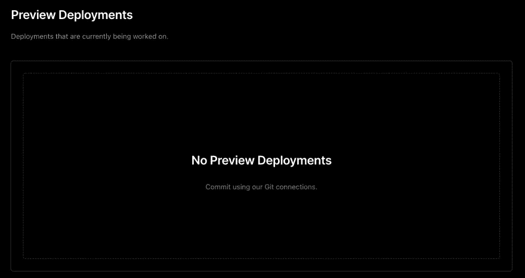
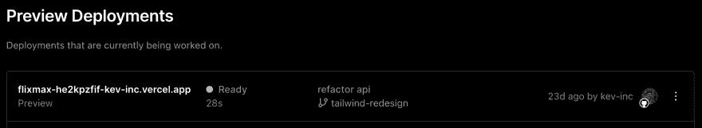

# 使用 Vercel 的预览部署提高您团队的工作效率

> 原文：<https://blog.devgenius.io/10x-your-teams-productivity-with-vercel-s-preview-deployments-3fd413087a8f?source=collection_archive---------21----------------------->

由[卡尔·海尔达尔](https://unsplash.com/@carlheyerdahl?utm_source=medium&utm_medium=referral)在 [Unsplash](https://unsplash.com?utm_source=medium&utm_medium=referral) 上拍摄

众所周知，我喜欢使用 Vercel。它不仅为我提供了免费的托管和无服务器功能，还帮助我作为一名 web 开发人员通过 CI/CD 提高了工作效率。在本文中，我将向您展示您的团队如何使用 Vercel 的免费预览部署来提高生产率。

什么是预览部署？简而言之，它们是您的分支的部署，而不是您的“主”分支，并且它们有一个唯一的 URL，这样您或您的代码评审人员就不必切换分支或克隆来预览变更。

例如，您在 Vercel 上托管了一个域为`myverycoolproject.vercel.app`的项目，它链接到 GitHub 上的“主”分支。如果您有另一个分支，并且创建了一个 PR，Vercel 会自动检测到这一点，并将您的更改部署到一个单独的 URL，可能类似于`myverycoolproject-f9n834234.vercel.app`。有了这个预览 URL，它允许您立即在 PR 中部署变更，而不影响您的主部署。您的团队可以在几秒钟内预览 PR 的更改，并审查 PR。一旦 PR 被批准和合并，主部署将被更新。

对我来说，这节省了很多时间，因为我不必手动更改分支并在我的设备上运行项目(或者有时甚至克隆项目)。它使代码审查变得轻而易举，这提高了项目的可靠性和代码质量。我觉得这是一个非常重要的特性，应该存在于 web 开发项目的每个 CI/CD 管道中，所以现在就试试吧！

要了解如何将 Vercel 集成到您的项目中，请在这里查看我的其他文章:

 [## 如何为您的 NodeJS 项目设置持续集成

### 持续集成(CI)是一种软件开发实践，它将您的代码与主分支频繁地合并…

kev-the-dev.medium.com](https://kev-the-dev.medium.com/how-to-setup-continuous-integration-for-your-nodejs-project-6f8eb907cae2)  [## 如何使用 Vercel 为 NodeJS 项目设置连续部署

### 免费为您的 NodeJS 设置连续部署，再也不用担心再次部署

kev-the-dev.medium.com](https://kev-the-dev.medium.com/how-to-set-up-continuous-deployment-for-nodejs-projects-using-vercel-514878d3f52a)