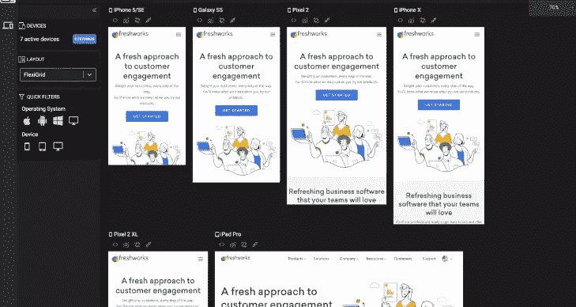
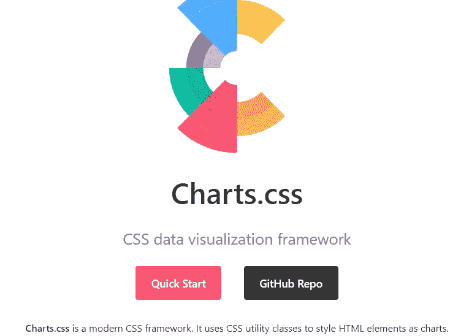
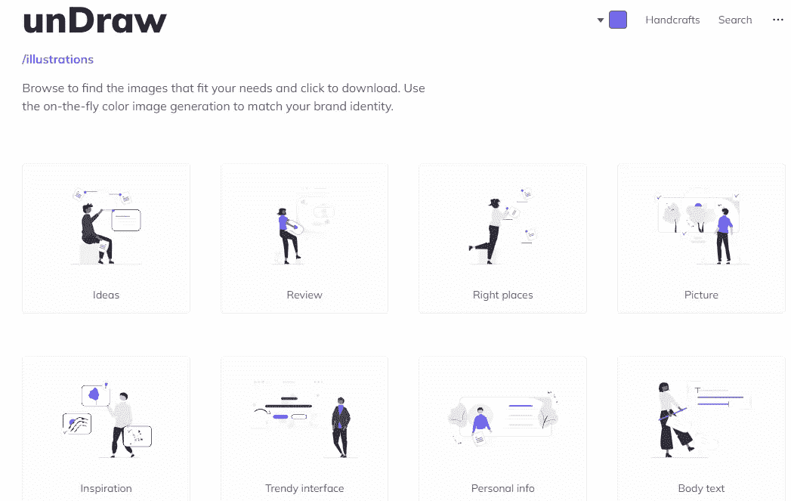
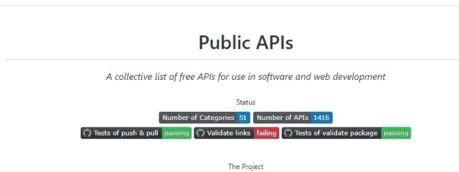
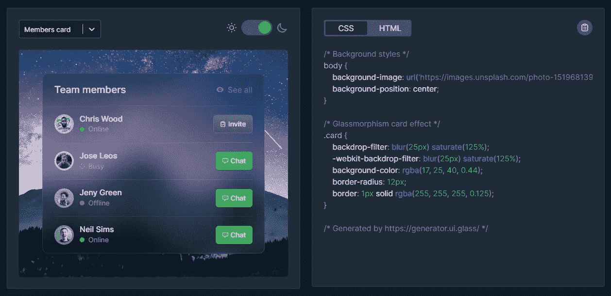
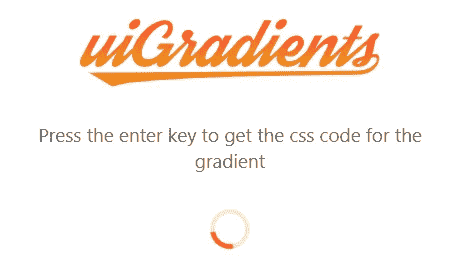
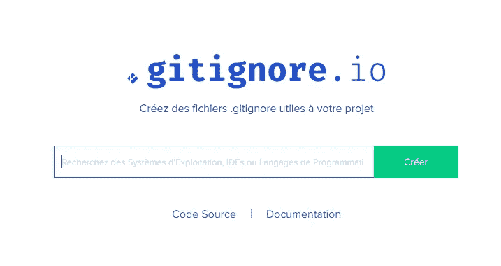
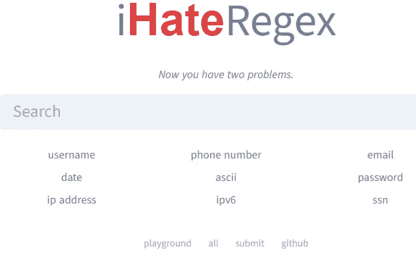
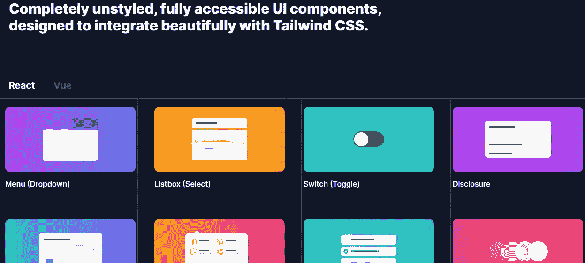
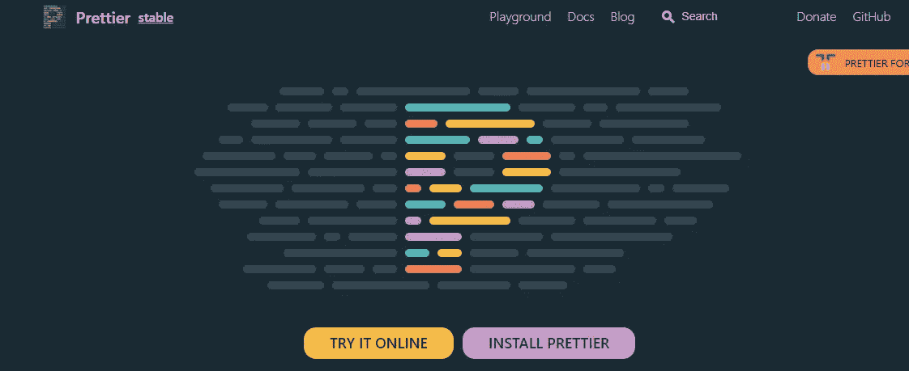

# 你应该在 2022 年使用的 11 个惊人的前端开发工具

> 原文：<https://blog.devgenius.io/11-amazing-frontend-development-tools-that-you-should-use-in-2022-b12c64caa346?source=collection_archive---------1----------------------->

## 2022 年每个前端开发者应该使用的有用工具列表。

安东尼·里埃拉在 [Unsplash](https://unsplash.com?utm_source=medium&utm_medium=referral) 上的照片

如今，前端开发是科技行业的一个巨大领域。许多公司和创业公司都在投入大量资金雇佣前端开发人员。原因很简单，前端变得比以往任何时候都重要。

现在是 2022 年，你需要创造漂亮且实用的用户界面，让用户有很好的体验。在过去的几年里，随着我们可以使用的新技术和新功能的出现，网络已经有了很大的改进。不仅仅是 HTML 和 CSS。

现在，作为一名前端开发人员，您将有许多需要学习的技能和每天必须完成的大量任务。这就是为什么作为开发人员，我们总是需要新的工具和资源来使我们的生活变得更容易。

好在网上有很多免费的工具，是开发者为你我这样的开发者做的。

因此，在本文中，我将与您分享一些有用的前端开发工具，您可以使用它们来提高您的工作效率，让您的生活更加轻松。让我们开始吧。

# 1.响应地

[作为回应](https://responsively.app/)是一个非常棒的开发工具，如果你想以 5 倍的速度开发应用和网站，作为一名前端开发人员，你必须拥有它。

图片由作者从 Responsively(媒体外部的外部链接)捕获。

这个工具有很多有用的特性，你可以在项目中受益。可以免费下载使用。

# 2.Charts.css

如果你想创建令人惊叹的数据可视化图表，这个工具正适合你。 [Charts.css](https://chartscss.org/) 实际上是一个 css 框架，它使用实用程序类，以便于开发人员使用 HTML 和 CSS 构建图表。

图片由作者从 Charts.css(介质外的外部链接)中截取。

该工具允许您创建不同类型的图表，如条形图、折线图、三维图表等。

# 3.拉开

Undraw 是一个流行的工具，它有一个 SVG 图像和插图库，您可以在自己的项目中使用。

图片由作者从 Undraw(媒体外部的外部链接)获取。

您可以搜索任何类型的插图，并选择您想要的颜色。所有图像都可以下载 SVG 或 PNG 格式。

# 4.公共 API

使用 API 是前端开发中常见的事情。这就是为什么[公共 API](https://github.com/public-apis/public-apis)库给了你一个可以在你的项目中使用的免费 API 集合。

作者从公共 API(媒体外部的外部链接)捕获的图像。

该集合提供了不同类别的大量 API，超过 50 个类别的近 1500 个 API。

# 5.玻璃形态 CSS 生成器

这是一个在线的[生成器工具](https://ui.glass/generator/)，可以让你轻松地为页面元素创建玻璃态效果。

图片由作者从 Glassmorphism 生成器(外部链接)捕获。

您可以根据需要自定义效果，并生成在项目中使用的代码。

# 6.ui 渐变

UIGradients 是另一个有用的生成器工具，可以让你生成令人惊叹的彩色渐变。

作者从 UiGradients(外部链接)捕获的图像。

它有一个很棒的渐变集合，你可以用在你的项目中。当你选择了你想要的颜色渐变，你就可以得到 CSS 代码或者下载 JPG 图片。

# 7.gitignore.io

gitignore.io 是最好的工具之一，您可以使用它来轻松地为您的项目创建`.gitignore`文件。

图片由作者从 gitignore.io(外部链接)截取。

# 8.iHateRegex

如果你不擅长正则表达式或者你讨厌它们，那么只有一个工具可以帮你解决这个问题。它是 [iHateRegex](https://ihateregex.io/) ，一个非常有用的工具，可以让你轻松地编写正则表达式并在你的代码中使用它们。

图片由作者从 iHateRegex(外部链接)获取。

该工具附带了一个常见的重要正则表达式的备忘单，您可以在代码中使用它。只要看看就知道我在说什么了。

# 9.剧院. js

[Theatre.js](https://www.theatrejs.com/) 是一个强大的 JavaScript 动画库，允许你使用可视化编辑器制作 DOM 元素和 WebGL 的动画。

图片由作者捕捉自 Theatre.js(外部链接)。

除此之外，该工具将所有 JavaScript 变量动画化，并让您轻松制作微交互。你可以查看他们的网站了解更多细节。

# 10.无头用户界面

[Headless UI](https://headlessui.dev/) 是一个很棒的 UI 组件库，它为 React 和 Vue 提供了一系列漂亮的非样式组件(下拉菜单、弹出窗口、标签等)。

作者从 Headless UI(外部链接)捕获的图像。

所有可用的 UI 组件都是完全可访问的，并被设计成易于与 Tailwind CSS 集成。该工具有很好的文档，可以预览组件，复制代码等。所以这是节省时间和更有效率的另一种方法。

# 11.较美丽

我不能不提到[更漂亮的](https://prettier.io/)来结束这个列表，它是最容易格式化你的代码以使其易于阅读的免费工具。

图片由作者从 beauty(外部链接)获取。

Prettier 支持多种编程语言，集成了 VScode、Atom、Sublime 等多种代码编辑器。

# 结论

就这样，正如你在上面看到的，这是一个你作为前端开发人员应该使用的 11 个神奇工具的列表。这些工具肯定会帮助您节省时间，更快地完成任务，提高工作效率。

这只是一个很小的列表，还有很多工具可以让你的生活更轻松。你只需要用你的谷歌技能找到它们。

*感谢您阅读这篇文章。此外，如果你觉得我的内容有用，而你不是一个媒体成员，你可以抓住你的媒体成员* [***这里***](https://mehdiouss.medium.com/membership) *(媒体推荐链接)获得无限制的访问媒体上的所有文章，并支持我们作为作家。*

 [## 通过我的推荐链接加入 Medium-Mehdi Aoussiad

### 作为一个媒体会员，你的会员费的一部分会给你阅读的作家，你可以完全接触到每一个故事…

mehdiouss.medium.com](https://mehdiouss.medium.com/membership) 

**延伸阅读:**

 [## 你可能从未用过的 9 个很棒的 CSS 属性

### 非常有用和有趣的 CSS 属性，你应该知道。

javascript.plainenglish.io](https://javascript.plainenglish.io/9-awesome-css-properties-that-you-probably-have-never-used-8cc4c385c3c6)  [## 你可能不知道的 9 个强大的 JavaScript 库

### 每个 web 开发人员都应该知道的有用的 JavaScript 库。

blog.devgenius.io](/9-powerful-javascript-libraries-that-you-probably-dont-know-e923dff81cac)