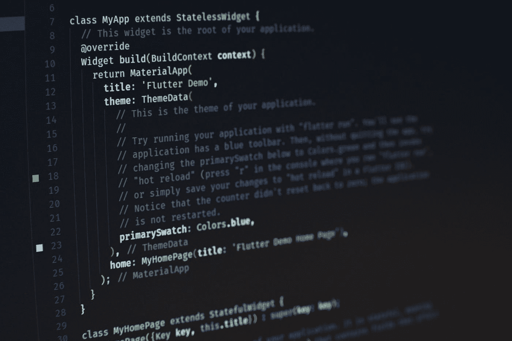

# 11 个简洁的代码提示将帮助你成为顶级程序员

> 原文：<https://blog.devgenius.io/11-clean-code-tips-that-will-assist-you-to-be-a-top-programmer-889cda7d2e40?source=collection_archive---------0----------------------->

## 改进你的编码风格


照片由[黑脸田鸡·萨加诺](https://unsplash.com/@sorasagano?utm_source=medium&utm_medium=referral)在 [Unsplash](https://unsplash.com?utm_source=medium&utm_medium=referral) 上拍摄

显然，编码是一个好的程序员的责任，这样每个人都可以阅读和理解他的代码。

> “任何傻瓜都能写出计算机能理解的代码。优秀的程序员会写出人类能理解的代码。”
> ― **马丁·福勒**

# 我在下面讨论了关于干净代码的 11 个技巧

干净代码不仅仅意味着代码；它也是关于写一个好的&可读的代码，结构化，组织，分析用户需求，设计，构建，测试等等。

# 1.删除评论



Artur Shamsutdinov 在 [Unsplash](https://unsplash.com?utm_source=medium&utm_medium=referral) 上拍摄的照片

当你学习编码时，经常会听到留言。如果它们是有意义的，那也没关系。

注释帮助程序员定义代码。在开发中，代码到处移动。如果评论停留在同一个地方，那么它会给自己和他人造成混乱。

开发人员在这些情况下会分心，所以必须删除注释。但是，最好删除注释和不再需要的注释。

# 2.命名变量

试着养成在代码中使用有意义的名字的习惯。变量、函数、类、参数、模块、包、目录以及更多应该在代码中给出正确名称的东西都有很多名称。

你应该使用大写和小写类或连字符来命名会议，并使用两个或三个单词。试着这样写你的代码。

这将是一个很好的实践，编写一个干净，易于理解的代码&只是有意义的；查看下面的例子

## 例子

```
var a = [67, 78.67, 89] //array of number
```

你需要用一个不好的代码变量的名字声明来提到一个注释。

但是更好的变量名应该是:-

```
var number_of_Array = [67, 78.67, 89]
```

# 3.编写可读的代码

一个具体的一行代码是看不懂的。而且它看起来代码混乱，难以维护。当其他开发人员试图阅读和理解混乱的代码时，这浪费了他们的时间。

可读代码更易于维护。想想下一个必须处理你的代码的人。

因此，总是要努力做好代码的格式。当你在几天后回到你自己的代码去做一些改变时，你也将节省你的时间和精力。

## 例子

下面是一行代码

```
class CarouselRightArrow extends Component { render() { return (<a href="#" className="carousel__arrow carousel__arrow--left" onClick={this.props.onClick}> <span className="fa fa-2x fa-angle-left" /> </a>); } };
```

下面写了同样的代码，看看看起来怎么样。

# 4.功能规则


沙哈达特·拉赫曼在 [Unsplash](https://unsplash.com?utm_source=medium&utm_medium=referral) 上拍摄的照片

对于干净的代码，函数应该很小。不要写一个什么都能处理的函数。这使得编码变得困难。将大函数分解成多个简单函数。

你应该让函数负责一个单一的任务；它将使你的功能清晰易懂，可伸缩，更加灵活。并且尽可能将参数放在函数中。

## 例子

```
function subtract(x, y) {
    return x - y;
}
```

# 5.手动测试代码

写完代码后手动检查。有时候开发人员写代码太快了，以至于他们注意不到错误。很多人甚至不明白自己错在哪里。

所以写完代码后需要检查。您也可以测试该单元。但是，您需要查看最低手册。手工测试在开发中非常重要。它使你的代码干净、灵活、可维护。更改代码和减少 bug 变得更加容易。

# 6.使用空白

适当的空白让你的代码更有条理，更容易阅读。许多人认为这会使代码更难阅读，并影响编译器。

但是真的不是说你可以使用空白来看清楚你的代码。检查下面的例子。

## 例子

这里没有空白，看看它看起来怎么样。

```
let a,b,c;
a=1;
b=2;
c=3;
```

这里是同样的事情，使用空白，但看起来很清楚。

```
let a, b, c;
a = 1;
b = 2;
c = 3;
```

# 7.声明变量

我们可以用不同的方式声明变量。但是，我在下面举了一个例子来理解干净代码和杂乱代码的区别。

## 例子

```
let a;
let b = 1;
```

在代码上面，我已经写了，这很好，没有错，但是我们可以让它更干净，而不是像你在下面看到的那样。我知道这两个都很容易阅读，但是对于开发者来说，哪一个更直接更容易知道它的目的呢？

```
let a; b=1;
```

这和我在一行中写的一样。

# 8.赋值

可以用多种方式为变量赋值。但是哪一个容易哪一个难你得懂。

## 例子

这里三个变量在三行中分配三个值。

```
let a, b, c;
a = 1;
b = 2;
c = 3;
```

这也没问题，但是你可以在一行中很容易地指定相同的值。还有更清晰的方法可以做到这一点。我们可以做和下面完全一样的事情。

```
let[a, b, c] = [1, 2, 3];
```

# 9.组织文件和项目

每个代码都需要有组织的文件和文件夹，这样你和其他人就可以方便地进行搜索。

如果你的项目没有组织好，下次你会很难找到它。


由[真诚媒体](https://unsplash.com/@sincerelymedia?utm_source=medium&utm_medium=referral)在 [Unsplash](https://unsplash.com?utm_source=medium&utm_medium=referral) 上拍摄

# 10.避免重复

一遍又一遍地重复一件事是一种代码气味。代码气味是你知道感觉不对劲的东西。看起来不对是因为你做错了。

所以很明显，处理不断重复的代码的最佳方式是将它放在自己的函数或方法中。将一项任务分解成更小的部分，确保至少 90%的部分是可重复使用的。始终确保您的代码是可重用的。

# 11.代码重构

看其他代码，自定义，让代码更清晰。我喜欢用“压缩”这个词，意思是让它更简单、更小

重构代码是一项非常好的技能；它会让你意识到发生了什么，当你重构的时候，它会变得更好，过一段时间再回到你的代码，增强它，这总是一个好的实践

# 应该永远把这些词记在心里

1.代码读的比写的多。

2.糟糕的代码是一种“负担”

3.糟糕的代码增加了“技术债务”

4.糟糕的代码会毁掉产品和公司。

5.对旧代码的修改变得危险而复杂。

# 结论

在这篇文章中，我试图给出一些关于干净代码的提示。我希望你喜欢它，并应用你自己的代码。感谢您的阅读。