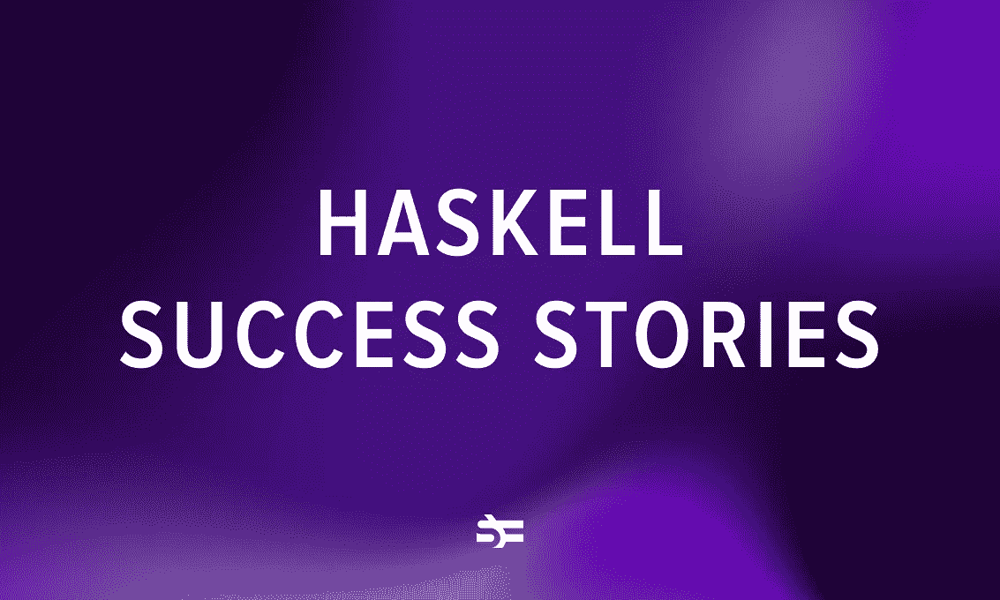
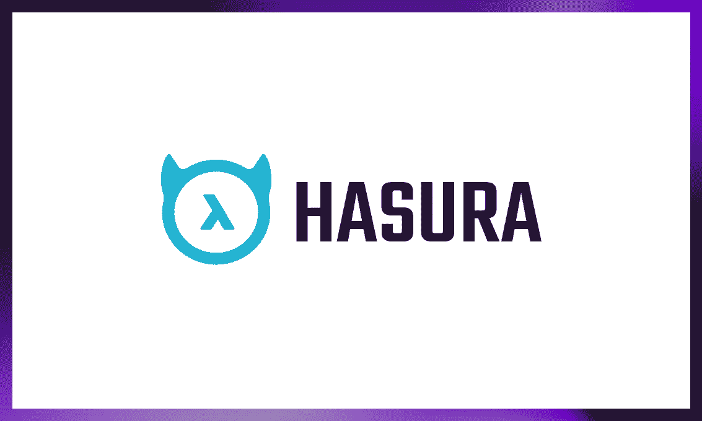
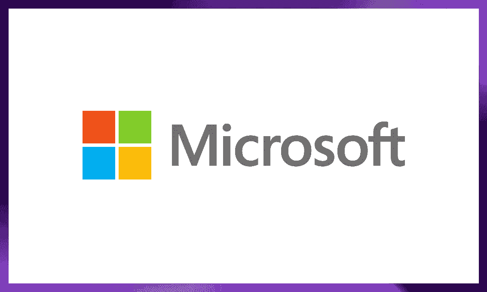
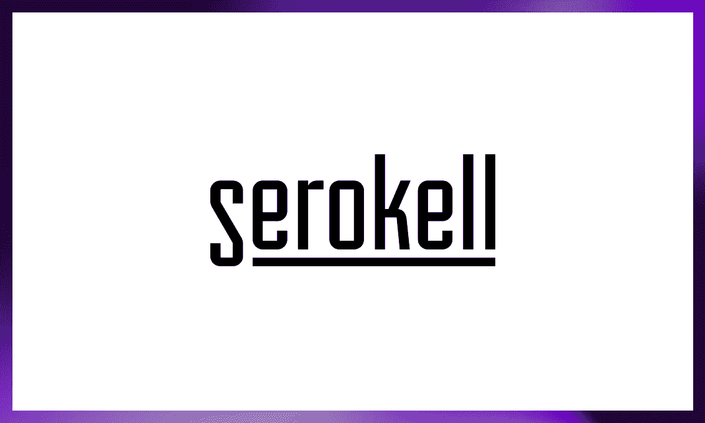

# 在生产中使用 Haskell 的 11 家公司

> 原文：<https://blog.devgenius.io/11-companies-that-use-haskell-in-production-28aa06ac3556?source=collection_archive---------6----------------------->

## 了解为什么大公司都在使用 Haskell

在编程语言中，Haskell 并不是最常见的选择(比如 JavaScript)，也不是让很多工程师兴奋的选择(比如 [Rust](https://serokell.io/blog/rust-guide) )。

同时，它在软件开发的某些子领域吸引了一批忠实的追随者。像 GitHub、微软、特斯拉和 Meta 这样的大公司在必要的时候会使用这种语言。

这是因为 Haskell 在构建两件事情上是一流的:任何复杂性的自包含系统和特定领域语言(DSL)。

在本文中，我将介绍 Haskell 在金融、区块链、教育、汽车工业和开发工具等领域的成功故事。我将解释为什么大公司决定使用 Haskell，以及在我看来这种语言的未来。

# 11 个 Haskell 成功案例

## 哈苏拉

Hasura 是一个开源的 GraphQL 引擎，可以让您即时访问 GraphQL API 来获取数据。在 Hasura 的 [GitHub 库](https://github.com/hasura/graphql-engine)中，Haskell 是使用最多的语言，其次是 TypeScript、JavaScript、Python 和 Go 等语言。

2022 年初，哈苏拉[以 10 亿美元的估值筹集了 1 亿美元](https://economictimes.indiatimes.com/tech/funding/hasura-raises-100-million-becomes-tenth-startup-unicorn-of-2022/articleshow/89754612.cms)，使他们成为第一只哈斯克尔独角兽。

> Hasura 所做的很多事情可以归结为一个高性能的 JIT 编译器，它是一个处理大量并发负载的 web 服务器。Haskell 允许我们在一个大的代码库上进行协作，并且允许我们在基础设施软件上以创业一样的速度前进，而不会破坏东西。 [*【来源】*](https://hasurahq.medium.com/partnering-with-well-typed-and-investing-in-the-haskell-community-118e952a57e8)

你可以通过阅读[这篇博文](https://hasura.io/blog/from-zero-to-hipster-haskell-in-production-97ea99d90c3b/)来了解更多关于 Hasura 与 Haskell 的经历。

## 开源代码库

[GitHub](https://github.com/) 使用 Haskell 来实现[语义](https://github.com/github/semantic)，这是一个用于解析、分析和比较源代码的命令行工具。

根据 GitHub 的说法，Haskell 是这个目的的一个很好的选择，因为 Haskell 在处理源代码方面的优势。作为它的一些最有价值的特性，他们提到了强类型、惰性评估、纯粹性以及用户定义自己的控制流的丰富可能性。

> 语义项目涉及解析、分析(评估)和比较源代码，因此我们牢牢扎根于编程语言理论(PLT)的学术领域，并花费大量时间将现有研究应用于 GitHub 上分析源代码的现实问题。Haskell 非常适合这个领域。它的语言特性允许简洁、正确和优雅地表达我们使用的数据结构和算法。 [*【来源】*](https://github.com/github/semantic/blob/master/docs/why-haskell.md)

在这里阅读更多关于为什么 GitHub 选择使用 Haskell 进行语义[的信息。](https://github.com/github/semantic/blob/master/docs/why-haskell.md)

## 元

众所周知，Meta 是 Haskell 的用户，也是 Haskell 基金会的最大赞助商之一。

Meta 参与的三个 Haskell 项目值得一提:

*   [适马](https://engineering.fb.com/2015/06/26/security/fighting-spam-with-haskell/)，一个每秒处理超过一百万次请求的反滥用平台。
*   [收集](https://glean.software/)，一个收集和处理关于源代码的事实的系统。
*   Haxl ，一个高效简洁的数据获取框架。

以下是他们对哈斯克尔的评价:

> Haskell 是一种纯函数式编程语言，因其富于表现力的类型系统、丰富的库生态系统和高质量的实现而在编程社区中备受推崇。这种属性的组合使得能够快速开发具有强正确性和安全保证的健壮软件。 [*【来源】*](https://engineering.fb.com/2014/06/10/web/open-sourcing-haxl-a-library-for-haskell/)

## 微软

微软在 [Bond](https://github.com/microsoft/bond) 中使用 Haskell，这是一个处理模式化数据的跨平台框架。

Bond 的 [Haskell 部分](https://hackage.haskell.org/package/bond)主要是`gbc`，一个命令行代码生成工具，可以使用 Bond 生成 C++和 C#代码。

很长一段时间以来，[微软研究院](https://www.microsoft.com/en-us/research/)也通过雇佣[西蒙·佩顿·琼斯](https://en.wikipedia.org/wiki/Simon_Peyton_Jones)来大力支持 Glasgow Haskell 编译器(GHC)。

## IOHK

[IOHK](https://iohk.io/) 用 Haskell 实现了 [Cardano](https://cardano.org/) 区块链平台及其智能合约语言——[普路托斯](https://developers.cardano.org/docs/smart-contracts/plutus/)。他们选择它是因为 [Haskell 非常适合](https://www.youtube.com/watch?v=CffrvwIW0JY)金融和区块链等领域的高保证代码。

> *如果你看看加密货币领域过去十年的历史，就会发现我们被糟糕的代码导致的交易失败所困扰。我们充斥着多重签名失败，人们可以窃取数亿美元。道琼斯黑客是我们行业中最著名的黑客——仅仅因为我们有我们想要做的事情的意图，但现实是代码并不符合这个意图。*
> 
> 所以你需要一种编程语言，它能给你更高程度的确定性和更大的工具箱，并且更加精确。它就像一把手术刀，可以让你非常仔细地实施事情，所以你知道它会正确地工作。 [*(来源)*](https://forkast.news/video-audio/watch-charles-hoskinson-co-founder-of-ethereum-and-iohk-on-why-cardano-is-a-better-platform-part-i-2-2/)

## 特斯拉

几年来，特斯拉一直定期雇佣 Haskell 的工程师和实习生。

关于他们工作的具体细节没有太多的信息。根据 Reddit 上的一篇帖子的评论，他们使用 Haskell 生成 C 代码，然后编译成车辆固件。

## 渣打银行

[渣打银行](https://www.sc.com/en/)是一家跨国银行和服务公司。他们使用 Haskell 和 Mu(Haskell 的一种严格的方言)，向交易员和定量分析师提供内部技术。

他们喜欢 Haskell，因为它纯粹，避免隐藏状态，支持大规模并行，并且是静态类型的。同时，他们需要能够与渣打银行现有的生态系统完美融合的东西。

为此，他们在 2009 年开发了自己的内部方言 Haskell，Mu。从那以后，他们一直在使用它。

根据团队成员 Marten Agren 的一次谈话，当前的代码库包括至少 500 万行 Mu 代码和 100 万行 Haskell 代码。

要了解更多关于渣打银行 Haskell 的信息，您可以观看上面提到的 [HIW 2021](https://www.youtube.com/watch?v=A70SN7vFsKU) 演讲。

## 雀斑

[雀斑](https://freckle.com/en-us/)是一个根据学生技能调整的在线学习平台。他们将 Haskell 用于所有的后端服务和大部分工具。

> Haskell 的拥护者通常提到的所有事情在我们的经验中都是真实的:作为一种生产语言，它具有令人难以置信的高性能和丰富的库生态系统。用 Haskell 这样的富类型系统开发业务逻辑是一种你无法向从未做过的人描述的体验。当然，还有基本级别的安全性，但是更高一级的安全性实际上是用类型来描述业务逻辑。产生的代码是健壮的、自描述的，并且易于重构。

在我们对 Pat Brisbin 的[采访](https://serokell.io/blog/haskell-in-production-freckle)中，你可以读到更多关于雀斑使用 Haskell 的经验。他们还有一个活跃的[工程博客](https://tech.freckle.com/)，你可以去看看。

## 伽罗瓦

[伽罗瓦](https://galois.com/)是一家专门为不可接受失败的领域研发可信软件系统的公司。他们已经发布了几个与政府机构如 NASA 或 NSA 合作的开源项目。

他们最有趣的项目之一是 [Copilot](https://copilot-language.github.io/) ，这是一个基于流的 DSL，用于编写和监控嵌入式 C 程序。该框架是在美国宇航局航空安全计划的支持下开发的，并已被美国宇航局用于监控无人机的试飞。

## 塞罗凯尔

在 Serokell，我们在大多数日常软件开发项目中使用 Haskell 取得了巨大成功。我们用它构建了卡尔达诺区块链的[结算层](https://serokell.io/project-cardanosl)、泰佐斯区块链的[编程语言](https://serokell.io/project-lorentz-indigo)、[加密货币交易所](https://serokell.io/project-omega-media)、拥有自己 DSL 的[多货币钱包](https://serokell.io/project-ariadne)等等。

如果您在构建 Haskell 应用程序方面需要帮助，我们随时恭候。[联系我们](https://serokell.io/#contacts)安排一次 30 分钟的免费咨询，与一位高管谈论你的目标和要求。

# Haskell 的优势

上面的公司列出了 Haskell 最重要的三个好处:

*   表达型系统。
*   强大的正确性保证。
*   轻松重构。

此外，尽管 Haskell 对于日常用途来说是一种很好的编程语言，但我们可以将两种流行的用例分开。

第一种是需要强有力担保的复杂系统(如 Cardano 这样的区块链和 Klarna 这样的金融科技项目)。

第二个是编译器和 DSL。在我们的列表中，这个用例的例子是像 Bond、Semantic、Copilot 这样的项目。

这两个用例都极大地受益于 Haskell 的优点，并设法避开了它的大部分缺点。它们完全可以被称为 Haskell 的“杀手级应用”。

如果你正在考虑这两个领域的项目，选择 Haskell 很难出错。

# 哈斯克尔的未来

如您所见，Haskell 在两个不同的领域占据了强势地位。像[依赖型](https://serokell.io/blog/why-dependent-haskell)、[线性型](https://www.tweag.io/blog/2017-03-13-linear-types/)和[液体哈斯克尔](https://www.tweag.io/blog/2022-01-19-why-liquid-haskell/)这样的附加物将进一步提高这个位置。

与此同时，像 Rust 和 TypeScript 这样的新编程语言已经席卷了通用软件开发领域。它们融合了 Haskell(以及 FP 的一般优点)的许多优点，同时也关注优秀的开发人员体验，更加平易近人。

Haskell 能和这些语言竞争吗？很有可能，是的。

最近，在改进 Haskell 的开发工具和体验方面投入了大量的努力。就在去年， [Haskell 基金会](https://haskell.foundation/)成立，以支持该语言及其生态系统。 [IHP web 框架](https://serokell.io/blog/ihp-interview)为许多非 Haskellers 用户提供了一个类型安全的 web 开发入门。有大量新的教育内容出现，其中一些在我们的[博客](https://serokell.io/blog)上。

随着越来越多的人接触到现代编程语言中的 FP 习惯用法，对于开发人员来说，迁移到像 Haskell 这样的纯函数式编程语言变得越来越容易，这极大地有利于该语言及其生态系统。

因此，我们 Serokell 公司的人对这种语言的未来以及它仍能给软件开发世界带来的所有创新感到兴奋。

如果你想了解函数式编程世界的最新动态，请在 Twitter 上关注我们。

*最初发布于*[*https://sero Kell . io*](https://serokell.io/blog/top-software-written-in-haskell)*。*