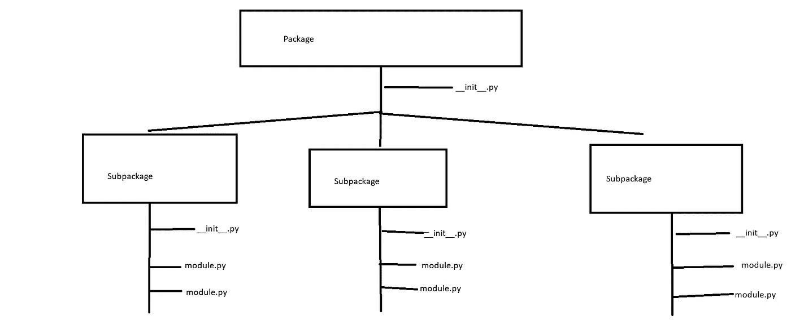

# # 11 Python 模块、库、包和 framekworks 的区别——Python 适合初学者

> 原文：<https://blog.devgenius.io/11-the-difference-between-python-modules-libraries-packages-and-framekworks-python-for-28f8964cb5b?source=collection_archive---------9----------------------->

## 程序员的备忘单

就像我在上一篇文章的结尾所说的，这次我将解释 Python 模块、库、包和框架之间的区别。尽管这是一个更高级的主题，作为初学者你不必担心，但我将在这里介绍它，这样你就可以从一开始作为一名程序员就知道它们的区别和相似之处。如果有人忘记了不同之处，这篇文章也可以作为更高级的 python 程序员的备忘单。


照片由[简·kopřiva](https://www.pexels.com/@koprivakart?utm_content=attributionCopyText&utm_medium=referral&utm_source=pexels)从[派克斯](https://www.pexels.com/photo/photo-of-a-red-snake-3280908/?utm_content=attributionCopyText&utm_medium=referral&utm_source=pexels)拍摄

## 为什么我们使用模块、库、包和框架

我们使用模块、库、包和框架来节省我们的工作。我们可以用别人的代码来简化我们的代码。

## Python 模块

*   将相关代码分组——一个文件中的一组相关代码
*   您可以定义*函数*、*类*(我们将在本系列的后面了解这两件事)、变量*和*可运行代码**

```
# filename: bot.py
import user_interaction # Importing the module (file) - like we did with random

user_interaction.greet_user() # Using a function from the imported file
user_interaction.goodbye_user() # Using a function from the imported file
```

```
# filename: user_interaction.py
user_name = '' # "Initializing" the user_name variable - I will explain in future lesson
def greet_user(): # greet_user function (runs the code inside of it)
    global user_name # Using global keyword - you do not have to understand this
    user_name = input('What is your name? ') # Asking the user for a name and storing it in user_name (already known)
    print('Welcome ' + user_name + '! Nice to see you here!')

def goodbye_user():# goodbye_user function (runs the code inside of it)
    global user_name # Using global keyword - you do not have to understand this
    print('Goodbye ' + user_name + '! Nice you have been here!')
```

在上面的例子中，我们通过用户名问候用户，这是我们之前要求的。之后，我们向用户告别。在这个例子中，我使用了函数( *def* )和关键字 *global* ，作为初学者，你不必理解这些(我们将在本系列的后面讨论这些)，只要把它想象成 *print()* 函数(**我们在它里面运行代码**)。不管怎样，也许你已经能理解这段代码了！你可以用**导入**和**使用** *功能*，*类*或*变量*从一个 ***模块*** 进入**两种不同的方式**:

对于我们的解释——*user _ interaction . py*文件:

```
# filename: user_interaction.py

test_variable = 10 # A variable to test modules and variables
user_name = ''
def greet_user(): # A function to test modules and functions
    global user_name
    user_name = input('What is your name? ')
    print('Welcome ' + user_name + '! Nice to see you here!')

def goodbye_user():
    global user_name
    print('Goodbye ' + user_name + '! Nice you have been here!')

class Top: # A class with a function to test modules and classes
    def run_top(self):
        print("top")
```

导入模块的第一种方式—首选方式:

```
# filename: bot.py

# First way:
import module # module = name of the module
module.function()# function = name of the function

module.class # class = name of class - we have to use a method
class.method() # But that is more advanced stuff

module.variable # variable = name of the variable - print it out with print()

# Example for this:
import user_interaction

# Functions and modules
user_interaction.greet_user()
user_interaction.goodbye_user()

# Classes and modules
top = user_interaction.Top()
top.run_top()

# Variables and modules
print(user_interaction.test_variable)
```

第二种方式同从模块导入…:

```
# filename: bot.py

# Second way
from module import function/class/variable # module = name of the module
function() # function = name of the function

class # class = name of class - we have to use a method
class.method() # But that is more advanced stuff

variable # variable = name of the variable - print it out with print()

# Example for this:
# Example for this:
from user_interaction import greet_user # can use gree_user from user_interaction
from user_interaction import Top # can use Top from user_interaction
from user_interaction import test_variable # can use test_variable from user_interaction

# Functions and modules
greet_user()
goodbye_user() # cannot use that because it is not imported

# Classes and modules
top = Top()
top.run_top()

# Variables and modules
print(test_variable)
```

你看你是不是想用整个模块这种方法不对——**使用导入模块和 module.function 等。相反。**

## Python 包

*   包基本上是模块的集合
*   组织你的模块(当你有很多模块的时候)
*   允许分层结构(*包*->-*子包*->-*模块*)



我的精彩图画解释了包装的层次结构

*   包或子包必须包含 __init__。包含相关包/子包的初始化代码的 py 文件

## Python 库

*   库基本上是包的集合
*   包括一个领域的大量可重用的有用代码

## Python 框架

*   类似于图书馆，但更复杂
*   包含程序的基本构建(你围绕它构建你的程序)
*   大公司用它来构建自己的应用程序，如谷歌、Instagram 或网飞

就像我说的，初学者不好学。像*功能*或者*类*这样的词也是新的！但是不用担心！**作为初学者，你不需要知道其中的区别。**

和往常一样，如果你有任何关于 Python 或编码的问题，请在下面的评论中提出。

**直到那时！**

*l0ckD2wN*