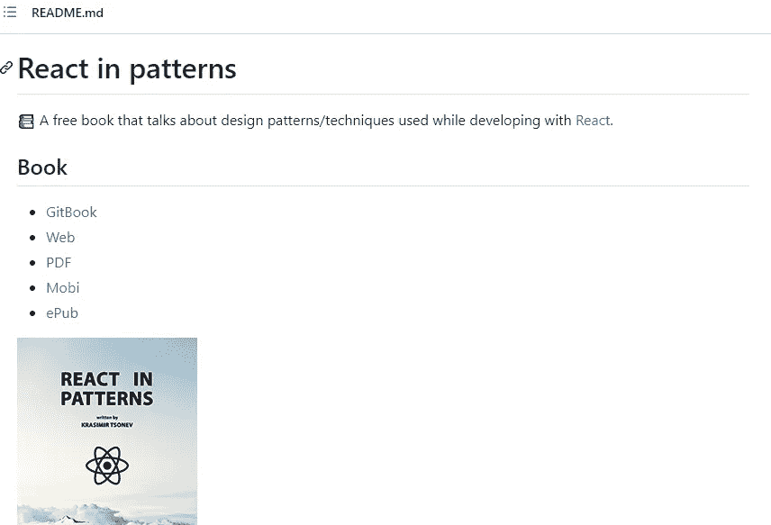

# 成为专业 React 开发人员的 11 个有用的 GitHub 库

> 原文：<https://blog.devgenius.io/11-useful-github-repositories-to-become-a-pro-react-developer-530c565eac2a?source=collection_archive---------0----------------------->

## 2022 年每个 web 开发者都应该知道的 Awesome React GitHub 仓库。

照片由[保持编码](https://unsplash.com/@keepcoding_school?utm_source=medium&utm_medium=referral)在 [Unsplash](https://unsplash.com?utm_source=medium&utm_medium=referral) 上

如今，由于 React 的流行和它惊人的强大功能，大多数新的 web 开发人员都在学习 React。是的，有很多优秀的 JavaScript 框架，但是 React 始终是构建用户界面的首选 JavaScript 库。

React 为您提供了所需的所有功能，让您更容易创建速度极快的网站和 web 应用程序。这就是为什么对掌握这个强大的 JavaScript 库的开发人员有很高的要求。

React 是每个 web 开发人员都应该具备的技能之一，尤其是对于那些希望在大型科技公司和初创公司工作的人来说。此外，React 有一个良好的生态系统，其中充满了工具和技术，您可以使用它们来简化您的开发过程。

所以如你所见，有很多原因可以推动你学习这个强大的 JavaScript 库，并变得擅长它。如果你正在考虑学习 React 或者你已经开始学习了，那么你应该记住，有很多惊人的资源可以帮助你成为 React 大师。

这就是为什么在这篇文章中，我决定与您分享一个有用的 GitHub 库列表，它可以帮助您学习并成为一名专业的 React 开发人员。所以让我们开始吧。

# 1.30 天的反应

[React 30 天](https://github.com/Asabeneh/30-Days-Of-React)是一个编码挑战，给你一个循序渐进的指导，帮助你在 30 天内学会 React。

这个令人惊叹的 GitHub 资源库拥有你从头开始学习 React 所需的一切( *React 基础、练习、项目等等*)。

作者从 React 的 30 天中捕获。

要开始学习这个知识库，您只需要掌握一些 HTML、CSS 和 JavaScript 知识。您可以查看下面这篇我写的关于 JavaScript 特性的文章，这些特性是您在学习 React 之前需要了解的。

 [## 学习 React 之前应该了解的 JavaScript 特性

### 在做出反应之前，先学习这些 JavaScript 特性

javascript.plainenglish.io](https://javascript.plainenglish.io/8-javascript-features-to-know-before-learning-reactjs-aac8b7748b30) 

# 2.Awesome React 存储库

这是另一个牛逼的 [GitHub 仓库](https://github.com/enaqx/awesome-react)叫做牛逼的 React。它包含了非常有用的关于 React 生态系统的知识和资源的集合。

由作者从 GitHub 捕获。

这个惊人的资源库几乎拥有帮助您成为专业 React 开发人员所需的一切(*资源、工具、技巧、教程等等*)。该库非常受欢迎，它有超过 50k GitHub 明星。

# 3.漂亮的反应钩

这个疯狂的 [GitHub 库](https://github.com/antonioru/beautiful-react-hooks)包含了一系列非常棒非常有用的 React 钩子，你可以用它们来加速 React 应用的编码过程。

该图片是作者从 GitHub 获取的。

你只需要选择你想要使用的钩子，然后你就可以得到所有你需要的源代码及其解释。

# 4.反应模式

[React in Patterns](https://github.com/krasimir/react-in-patterns) 是一本非常棒的免费书籍，涵盖了很多关于 React 设计模式和技术的有用知识。你可以阅读 GitHub 库中的所有内容，而不必下载这本书。

由作者从 GitHub 捕获。

GitHub 知识库由 Krasimir Tsone 创建，拥有超过 11k 颗恒星，每天有数百人阅读。

# 5.真实世界反应应用

我猜你从名字就能猜出来。这个有用的 [GitHub 知识库](https://github.com/jeromedalbert/real-world-react-apps)整理了一个开源的真实 React 应用列表，你可以从中学习。你可以查看所有的应用程序及其代码库。

图片是作者从 GitHub 上截取的。

该库拥有近 3000 个 GitHub stars，6 名贡献者更新了该库，并添加了更多真实世界的 React 应用。

# 6.应对编码挑战

这个棒极了的 [GitHub 知识库](https://github.com/alexgurr/react-coding-challenges)包含了一系列 React 编码挑战和练习，可以帮助你了解更多关于 ReactJS 的知识，也可以为面试做准备。

由作者从 GitHub 捕获。

该库在 GitHub 上有超过 2k 颗星，有近 5 个贡献者向其添加新内容。

# 7.回答面试问题

这是另一个非常有用的[存储库](https://github.com/sudheerj/reactjs-interview-questions)，包含 500 个 React 可能的面试问题及其答案和解释。

图片是作者从 GitHub 上截取的。

如果你正在准备关于 React 或前端开发的面试，这个知识库肯定对你很有价值，你可以从中学到很多知识。

# 8.React 挂钩备忘单

一个带有 React hooks Cheatsheet 的[库](https://github.com/ohansemmanuel/react-hooks-cheatsheet),其中包含可编辑的实例和代码。这是一个很好的资源库，可以帮助您轻松了解重要的 React 挂钩。

图片由作者从 [React hooks Cheatsheet](https://react-hooks-cheatsheet.com/) (外链)截取。

这个 React hooks cheatsheet 的资源库有近 1k GitHub stars，有 5 名开发人员参与了这个项目。

# 9.30 秒的反应

[30 秒的 React](https://github.com/30-seconds/30-seconds-of-react) 是一个非常棒的资源库，它提供了一个有用的 React 代码片段集合，您可能需要在开发过程中使用。

由作者从 GitHub 捕获。

该集合包含代码片段，其中包含对主题和您需要了解的重要概念的解释。除此之外，您还可以在 Codepen 上查看代码片段。

# 10.反应位

React Bits 是所有 React 开发人员都应该知道的 React 模式、技术、技巧和诀窍的非常有价值的文档。

图片是作者从 GitHub 上截取的。

该库拥有超过 12k 个 GitHub stars，有近 70 个贡献者更新和添加新内容。

# 11.React 类型脚本备忘单

如果你是一名经验丰富的 React 开发人员，并且刚刚开始使用 TypeScript，那么这个 [GitHub 资源库](https://github.com/typescript-cheatsheets/react)就是为你准备的。它附带了有用的 React 类型脚本备忘单，您可以轻松地从中学习。

作者从 [React 类型脚本备忘单](https://react-typescript-cheatsheet.netlify.app/)中捕获(外部链接)。

知识库非常受欢迎，它在 GitHub 上有超过 36k 颗星星。这意味着它非常有用。

# 结论

这是 11 个有用的 GitHub 库的列表，可以帮助你成为一名优秀的专业 React 开发者。正如您所看到的，这些存储库充满了 ReactJS 的知识和价值。

最棒的是一切都是免费的。你不必为从这些知识库中获得的所有资源和知识付费。因此，你只需要采取行动，开始尽可能多地学习，就能成为一名专业开发人员。

*感谢您阅读本文。此外，如果你发现我的内容有用，而你不是一个媒体成员，你可以抓住你的媒体成员* [***这里***](https://mehdiouss.medium.com/membership) *(媒体推荐链接)获得无限制的* ***访问媒体上的所有内容*** *并支持我们作为作家。*

 [## 通过我的推荐链接加入 Medium-Mehdi Aoussiad

### 阅读 Mehdi Aoussiad(以及媒体上成千上万的其他作家)的每一个故事。您的会员费直接支持…

mehdiouss.medium.com](https://mehdiouss.medium.com/membership) 

**延伸阅读:**

 [## 9 个强大的 Node.js 工具，成为 2022 年更好的开发者

### 你应该知道这些有用的 Node.js 工具，才能成为一名优秀的开发者。

javascript.plainenglish.io](https://javascript.plainenglish.io/x-powerful-nodejs-tools-to-become-a-better-developer-in-2022-ec83ff1bb67d)  [## 2022 年你应该知道的 10 个强大的反应工具

### 牛逼的 React 开发者工具，帮你为项目写干净的代码。

javascript.plainenglish.io](https://javascript.plainenglish.io/10-powerful-react-tools-that-you-should-know-in-2022-76efa7fa711d)