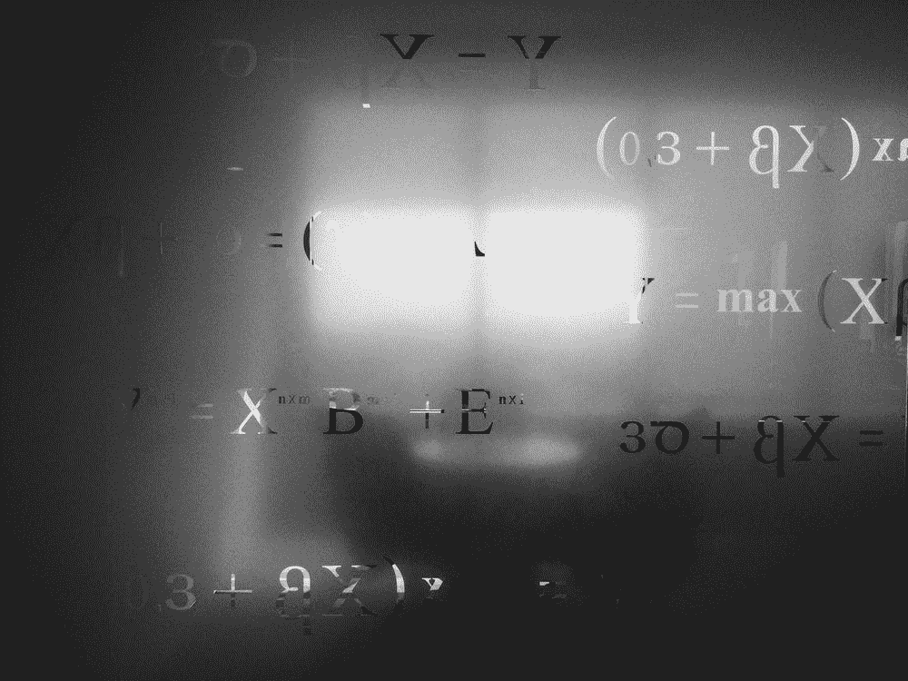

# 算术运算符:Python 完整教程—第 12 部分

> 原文：<https://blog.devgenius.io/12-arithmetic-operators-in-python-711990e3ae47?source=collection_archive---------13----------------------->



由 [Saad Ahmad](https://unsplash.com/@saadahmad_umn) 在 [Unsplash](https://unsplash.com/s/photos/math-equations-and-symbols) 上拍摄的照片

**在我们开始之前，让我告诉你:**

*   这篇文章是 Python 完全初学者到专家课程
    的一部分，你可以在这里[找到它](https://medium.com/@samersallam92/python-complete-beginner-to-expert-course-f7626916df30)。
*   所有资源都可以在下面的“资源”部分找到。
*   这篇文章也可以作为 YouTube 视频[在这里](https://youtu.be/rMMaGvEvjxc)获得。

[https://youtu.be/rMMaGvEvjxc](https://youtu.be/rMMaGvEvjxc)

## 介绍

在 Python 中处理数字时，可能需要将一个数字加到另一个数字上，或者从另一个数字上减去一个数字。因此，要在 Python 中处理数字，您应该熟悉 Python 中可用的算术运算以及这些运算所支持的运算符。

**因此，本课将涵盖以下要点:**

1.  [算术运算符](#50a3)
2.  [加法(+)](#80ff)
3.  [减法(-)](#0516)
4.  [乘法(*)](#f5fe)
5.  [除法(/)](#5ae7)
6.  [模数(%)](#adf4)
7.  [求幂运算(**)](#cb68)
8.  [楼层划分(//)](#fc21)

## 1.算术运算符

这些运算符与数值(数字)一起使用，以执行常见的数学运算，如乘法(*)、除法(/)、加法(+)，等等……
如前一课所述，对于每个运算符，您必须知道该运算符采用的操作数数量、操作数数据类型以及结果数据类型。

对于算术运算符，对于每个运算符:

*   它需要两个操作数
*   操作数应该是数字。
*   结果是一个数字。

现在让我们看一个关于每个操作符的例子。

## 2.加法(+)

**输入:**

```
a = 10
b = 20
c = a + b
print(c)
```

**输出:**

```
30
```

正如您在前面的示例中看到的那样，“+”是一个表示加法的运算符，它接受两个操作数“a”和“b”。这两个操作数都是数字，最终结果“c”也是数字，正如你看到的，它的值是 30。

## 3.减法(-)

**输入:**

```
c = a - b
print(c)
```

**输出:**

```
-10
```

正如您在前面的例子中看到的，如果您想使用另一个操作符，只需使用它的相关符号。所以做减法只能用“-”

## 4.乘法(*)

**输入:**

```
c = a * b
print(c)
```

**输出:**

```
200
```

## 5.除法(/)

**输入:**

```
c = a / b
print(c)
```

**输出:**

```
0.5
```

## 6.模数(%)

模数是除法运算后的余数，用“%”号表示。

**输入:**

```
c = a % b
print(c)
```

**输出:**

```
10
```

正如您在前面的示例中看到的，上面的模数运算符的结果是“10”，因为如果您将 10 除以 20，您将得到 0.5，余数是 10。

## 7.幂运算(**)

或者换句话说，幂算子。

**输入:**

```
#let b equal to 2 
b = 2
c = a ** b
print(c)
```

**输出:**

```
100
```

在上面的例子中，你可以说“a”的“b”次方，结果将存储在“c”中。

## 8.楼层划分(//)

在 Python 中，有一个用于楼层划分的运算符，这个运算符用“//”表示。

**输入:**

```
#let us redefine the variables
a = 10
b = 20
c = a // b
print(c)
```

**输出:**

```
0
```

正如您在前面的例子中看到的，结果是“0 ”,因为 10 除以 20 是 0.5，但是您没有使用除法运算符；这就是底数除法，这意味着:您将首先进行除法运算，然后您将应用底数函数，该函数将任何数字(在本例中是除法运算符的结果)向下舍入到最接近的整数。

## 现在，让我们总结一下我们在这篇文章中学到的内容:


安·H 在[像素上拍摄的照片](https://www.pexels.com/)

*   **算术运算符:**与数值(数字)一起使用，执行常见的数学运算。
*   算术运算符只接受两个操作数，这些操作数应该是数字。
*   操作员操作的最终结果是**号。**

***附:*** *:万分感谢您花时间阅读我的故事。在你离开之前，让我快速地提两点*

*   *首先，要想直接在你的收件箱里看到我的帖子，请在这里订阅*[](https://medium.com/@samersallam92/subscribe)**，你可以在这里关注我*[](https://medium.com/@samersallam92)**。***
*   ***第二，作家在媒介上制造了数以千计的****$****。为了无限制地访问媒体故事并开始赚钱，* [***现在就注册成为媒体会员***](https://medium.com/@samersallam92/membership)**其中* *每月只需花费 5 美元。通过此链接* *报名* [***，可以直接支持我，不需要你额外付费。***](https://medium.com/@samersallam92/membership)***

**

萨梅尔·萨拉姆** 

## **Python 初学者到专家的完整课程**

**[View list](https://medium.com/@samersallam92/list/python-complete-beginner-to-expert-course-32d3a941c05e?source=post_page-----711990e3ae47--------------------------------)****21 stories**************

**要回到上一篇文章，您可以使用以下链接:**

**[第 11 部分:Python 数字](/11-python-numbers-2ecb942ee525)**

**要阅读下一篇文章，您可以使用以下链接:**

**[第 13 部分:比较运算符](/python-complete-course-part13-comparison-operators-be85ac47361b)**

## ****资源:****

*   **GitHub[T43【此处。](https://github.com/samersallam/python-complete-beginner-to-expert-course/tree/main/Arithmetic%20Operators)**