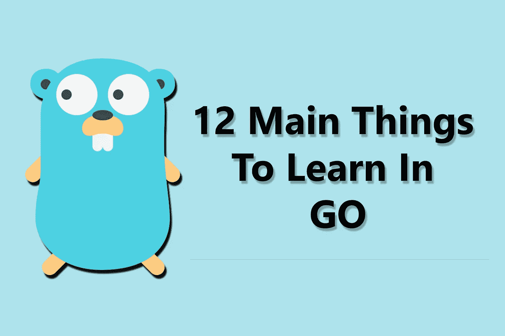
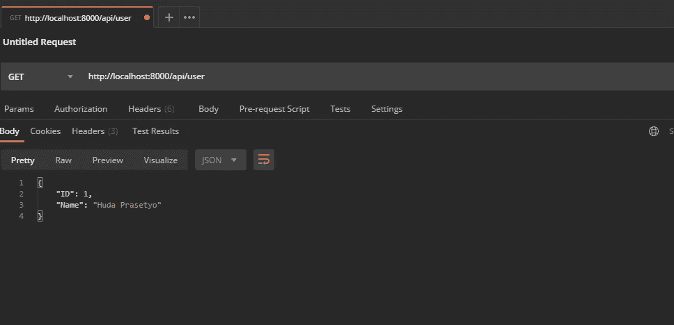

# 在 Golang 要学的 12 件事

> 原文：<https://blog.devgenius.io/12-main-things-to-learn-in-go-44d16383444d?source=collection_archive---------0----------------------->

下面是开始用 Golang 写代码时要学习的主要内容。



在 Golang 要学的 12 件事

在我们进入主题之前，也许你想尝尝我的 Golang 开胃菜？下面是链接！

[](https://github.com/hudaprs/gopattern) [## hudaprs/gopattern

### Go 模式与 Golang 本地使用 PostgreSQL，JWT 和 GORM。MVC 模式(不包括视图)分页角色管理…

github.com](https://github.com/hudaprs/gopattern) 

好了，我们现在要谈围棋了，多兴奋啊！

那么，围棋是什么？根据维基百科:

> Go 是一种静态类型的编译编程语言，由 Robert Griesemer、Rob Pike 和 Ken Thompson 在 Google 设计。Go 在语法上类似于 C，但是具有内存安全、垃圾收集、结构化类型和 CSP 风格的并发性。

所以基本上是 C 语言的现代，我觉得 XD。而且它支持并发，速度相当快！

**我不打算在这里解释和编写更多的围棋代码，但我只想告诉你在围棋中需要学习的主要东西。但是，我会给你一个参考来学习更复杂的解释。**

# 学习围棋有什么要求？

## 1.你以前从来没有学过 C 语言

所以当我开始学习围棋时，我基本上是一名 PHP & JavaScript 开发人员。当我开始学习围棋时，它比我想象的更难，因为它就像从通常的代码旋转了 180 度。问题实际上在于代码和概念本身，因为代码比 JavaScript 更不同。但是，**不要担心，如果你开始不断学习，你就会明白 GO 代码在做什么。**

## 2.你从 C 想迁移到哪里去

哇，这对你来说可能是一个很大的机会，因为如果你有 C 编程的基础，你会很容易学会这个围棋程序。

# 我们开始吧

以上是主要介绍。说到主要，下面是围棋中要学的 **12 个主要东西**，一起来跳！

## 1.书写 Hello World

也许这只是一件简单的事，对吗？但这很重要！当你开始学习一门新语言时，你必须编写你的第一个程序。在 Go 中，你必须在你的项目文件夹中有一个主文件，我把它命名为 **main.go** ，把这个包命名为 **main** 。下面是在 GO 中打印 hello world 的代码。

围棋世界你好

要运行该代码，只需在终端中编写以下代码

```
go run main.go
```

这取决于你如何命名文件。

## 2.变量

学习如何在 GO 中编写变量，在 GO 中编写变量就像这样:

围棋中的变量

所以如果你处理 GO，你会看到或者写下变量。

## 3.包装

那么什么是包呢？包就像是你的文件或者文件夹的名称空间。通常，在 GO 中，包用于为你的程序创建单独的模块。下面是例子。

我有一个名为**控制器**的包，我放在**你的项目/控制器**文件夹中。

控制器包

那么现在，我如何调用那个 **HelloController** 函数呢？为此，我简单地在名为 **main.go** 的根文件中写入我刚刚在**步骤 1** 中创建的文件。

调用 HelloController 函数

因此，您可以通过键入以下命令来运行:

```
go run main.go
```

## 4.功能

所以在 GO 中，创建一个函数有点不同，函数必须返回正确的数据类型，如果你想返回一个字符串，你必须定义字符串。这是代码。

GO 中的功能

## 5.阵列和切片

这是有趣的部分，GO 有一个数组，这是一个常见的数组，但长度必须定义。切片，类似于数组，但是长度没有限制。

这是数组的代码。

围棋中的数组

这是切片的代码。

围棋中的切片

## 6.范围

在我们在那里创建了一个数组/切片之后，我们将如何迭代其中的每个值呢？这是代码。

GO 中的范围

你有没有注意到上面的代码有 **_(下划线)**？是的，没错，那里的下划线叫做**空白标识符**，意思是，变量不会被使用。如果你把下划线改成类似于(index)的东西，你会得到切片本身的索引，试一下好吗？

但是，要小心！如果你有一个变量，而你没有使用它，你会得到一个错误！

## 7.情况

GO 中的条件类似于另一种语言，这是代码。

GO 中的条件

**记住，围棋里没有三元运算符！但是你可以创建你自己的自定义函数来实现。**

## 8.用于返回 JSON 的映射

Map 就像是里面的一个对象，通常用于保存数组或里面的对象或单个对象，但在这种情况下，我只做一个简单的 map 例子，里面有一个对象。

GO 中的地图

如果你在你的机器上运行代码，它将输出地图数据类型，如果你在浏览器中输出，它将看起来像 JSON，我将很快做一个例子。

## 9.两颗北极指极星

好的，这是在其他语言之间切换的独特部分，如果你从 C 语言开始，你会熟悉指针，如果你不，你会开始摇头，只是在开玩笑。所以指针的作用是，指针是用来把你的数据存储到你的内存地址的。

你困惑吗？下面是一个简单的例子，**如果你有数据，你将把数据存储到指针**。希望这有意义，然后让我们看看代码。

go 中的指针

代码是不言自明的。当您与数据库中的真实数据进行交互时，这将更有意义。

## 10.结构

该结构就像面向对象程序中的类，但在 GO 中有一点不同，我将使用该结构制作一个简单的应用程序，就像 OOP 一样。

GO 中的结构

看，这就像面向对象的东西，但代码不同。如果运行该代码，您将得到

```
I Have vehicle named Bus.
```

## 11.连接

接口就像是你的应用程序的蓝图，如果你定义了某个接口，就像是“你必须这么做，你实现的代码必须有这个功能”。

这是给你的代码，如果你还不明白的话。

界面转到

上面的代码只是为了计算正方形的边长。但是，我将函数连接到接口，所以我编写了具有**结果()**函数的 **SquareArea** 接口，并期望返回整数。所以当我想计算正方形的边长时，我必须拥有名为 **result()** ，的函数，详见 **getResult()** 函数。

我知道界面让你困惑。但是如果你编码并坚持一段时间，它会通过的。

## **12。网页**

最后，是网络。你知道这意味着什么吧？所以，他我要用 GO 做一个简单的 API，然后把 JSON 发送给客户端。

代码应该是这样的。

GO 中的 Web

因此，我将在测试 API 的 **Postman** 应用程序中对此进行测试。顺便说一下结果。别忘了运行应用程序。

```
go run main.go
```



API 结果

# 结论

好了，这就是围棋中需要学习的 12 项主要知识。我希望你们能明白这里发生了什么，如果你们不明白，请留下评论。

如果你们从 JavaScript 或者 C 语言之外的地方开始，理解围棋可能会更困难。但是如果你坚持学习，你一定会完全理解并爱上 GO XD。

谢谢大家！下一篇文章再见！

# 以下是学习围棋的参考资料

## 1.Traversy 媒体(Go 速成班)

旅游媒体 Golang 速成班

## 2.旅行媒体(Go REST API)

旅行媒体 Golang REST API

## 3.教程边缘

教程 Edge Go