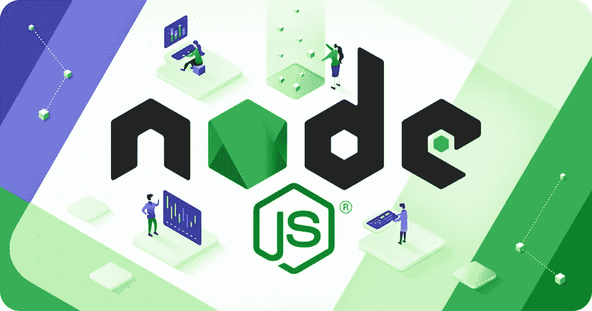
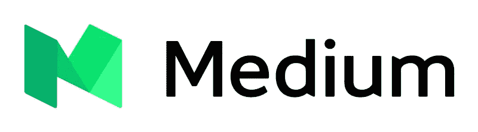
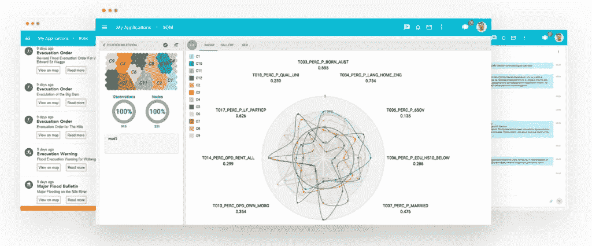
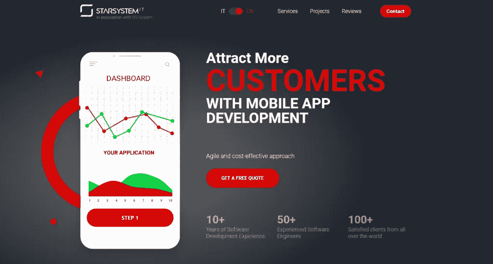
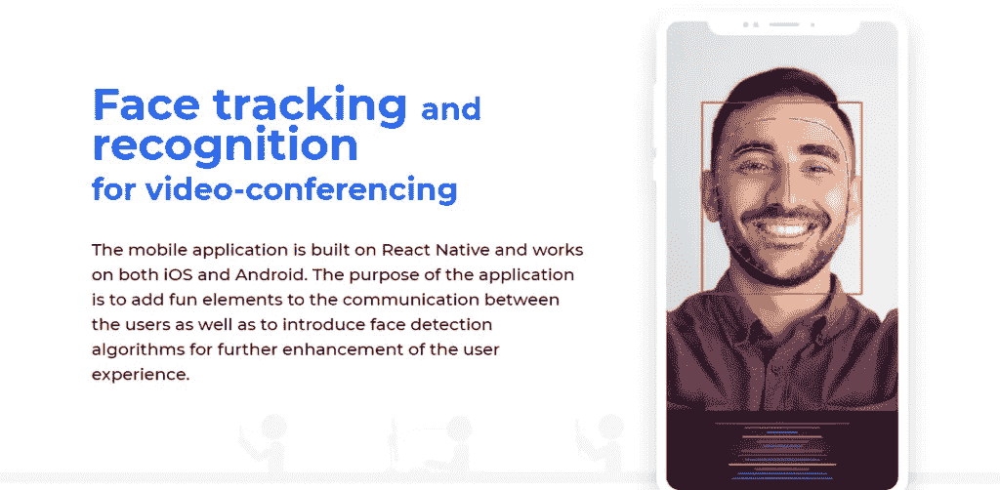
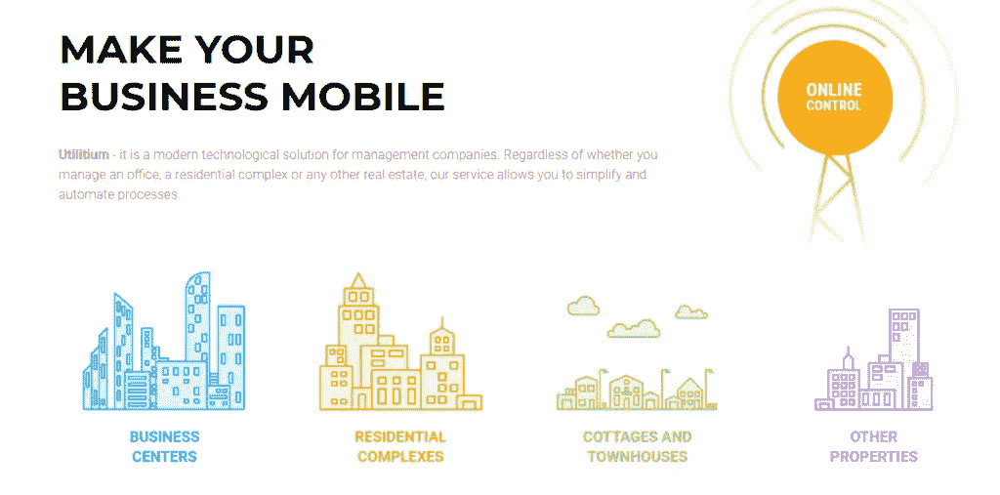

# 12 种 Node.js 应用程序及其示例

> 原文：<https://blog.devgenius.io/12-types-of-node-js-applications-with-examples-28026b267c28?source=collection_archive---------4----------------------->

在本文中，我们将了解为什么流行的互联网平台选择 Node.js 作为其应用程序的后端。使用已知资源的示例，您将了解 12 种基于 Node.js 的应用程序。

Node.js 是一个免费的开源平台，运行在 JavaScript 上，允许您快速高效地创建项目。Node.js 应用程序在性能方面非常快。

# 为什么要用 Node.js？

每个开发人员都想引入一个允许用户同时利用许多特性的应用程序。

**Node.js 为开发者提供了这样的设施——人们可以创建高度可扩展的应用程序，允许用户一次发出多个请求。**它显示了一个单向流程，而没有显示每个用户请求的新线程。

此外，它通过允许访问数据库来执行输入/输出操作。Node.js 为 web 应用程序形成后端数据，以确认更好地支持一次同步通信。

# Node.js 的特性

*   JavaScript 框架
*   服务器端基于谷歌浏览器的 V8 引擎
*   丰富的模块库可供开发人员使用
*   非阻塞输入/输出
*   轻量级选手
*   快速将 JavaScript 代码转换成机器码
*   拥挤的模块生态系统包含您需要的全部必要数据库
*   利用 npm 程序包管理器
*   异步和事件驱动的特性
*   全栈开发语言。

**让我们来看看使用 Node.js 可以创建什么类型的应用程序**

# 1.社交媒体应用和平台

最知名的社交媒体应用和平台如 **Twitter、LinkedIn 也是使用 JavaScript 框架用 Node.js** 编写的。

网络应用和平台需要高效可靠。它们包含用户的敏感信息，如联系电话、电子邮件地址和借记卡信息，以防任何交易。

随着网络的发展，系统需要更新，因为用户的需求增加了。

因此，Node.js 在水平方向(在系统中添加新节点)和垂直方向(通过添加额外资源来升级现有节点)上都提供了公平的机会。

# 商务化人际关系网

LinkedIn 于 2002 年推出。现在它的活跃用户数量已经接近 7 亿。最初，开发人员使用 Ruby on Rails 基于流程的系统来构建应用程序。随着公司的扩大，升级是必要的。

Ruby on Rails 没有针对 JSON 翻译进行优化。因此，它无法提供 LinkedIn 所需的性能。工程团队尝试了 Node.js，最终，他们得到了想要的结果。

# 2.在线出版平台

最著名的在线发布平台之一 Medium 也是基于 Node.js 的应用程序。

Medium 是一个像 WordPress 和 Blogger 一样的免费博客平台。它还提供了阅读每月有机访问者的惊人和独特的文章的设施。

据统计，2016 年，媒体平台上发布了近 800 万篇文章。最初，开发人员使用 Node.js(应用程序的核心)管理大部分工作。但是随着时间和要求的进步，他们把它分成单独的部分来执行其他工具。

# Cartovera

[**Cartovera 是基于 Node.js 的应用**](https://os-system.com/cases/cartovera/) **大多被学者用来展示他们的 R & D 项目。**该应用程序允许用户在标准组中评论、讨论和分享反馈。

最初，它的页面使用 ExtJS，ext js 使用高 RAM。由于加载时间较长，这影响了潜在用户。Node.js 是用分布式服务器实现的，用于水平扩展工具，并且适用于开发人员。

# 3.远程协作工具

**Trello 是 Node.js 实时应用的完美范例之一。**开发远程协作应用程序需要一个小时，因为大多数公司都是远程处理业务。

这些应用程序可以帮助员工在办公室外工作时提高绩效。在远程办公的时代，处理挑战并向前迈进是很容易的，因为这些应用程序配备了新颖的工具。

# 远程协助

[远程协助](https://os-system.com/cases/webrtc/)是基于实时应用实例的 Node.js 之一。该应用程序基于 React Native 构建，可在 Android 和 Apple 设备上运行。

**用于技术人员和用户之间的交流。**借助该应用程序，您可以轻松地进行远程维修。

# 服务文档

[**服务单据**](https://os-system.com/cases/service-doc/) 是 Node.js 中的一个基于实时应用的例子**，用于法律文书的创建和审核。**

应用程序形成中使用的技术是 Node.js、MongoDB、HTML、CSS、XML 和 React.js。它还提供编辑工具和来自行业专家的在线建议门户。

# 4.单页应用和网站

你想创建像 Gmail 或 Google Maps 那样质量最好的 Node.js 单页应用吗？Node.js 是你问题的终极解决方案。

通过重写当前网页，这些网络应用程序只适合浏览器上的一个页面。它是一种桌面 web app，主要用于网络平台和项目管理工具的开发。

# 谷歌邮箱

Gmail 是一个 Node.js 单页应用程序，通过恢复到 AJAX 立即显示最近的邮件。Node.js 的快速运行时环境允许高效地处理繁重的数据库负载。Node.js 的这一特性有助于处理特殊的单页面平台和工具。

# 操作系统的登录页面

我们为意大利市场和 T2 市场创建了一些登陆页面。这两个单页网站都基于 Node.js，有动画案例、合作伙伴评论和联系方式。它是一种桌面 web 应用程序。

# 5.实时聊天应用

Node.js 实时聊天应用是一款标准时间应用，广泛应用于在线交流。这些应用程序促进了音频、视频和文本消息的传输，既可以一对一也可以一对多组。

使用事件 API 和 I/O 技术，开发者可以创建任何难度的 Node.js 实时聊天应用。基于 Node.js 的实时聊天应用使用即时短信和互联网中继技术。

# 视频会议工具

[视频会议应用](https://os-system.com/cases/video-conference/)构建于 React Native 之上，编写于 Node.js 后端。它可以在安卓和苹果设备上运行。

使用的技术有 Node.js、React Native、MS SQL、Rest API、WebSockets、WebRtc、XMPP、HTTP、XML-RPC、HTTPS。这个应用程序**允许使用 WebRTC 进行音频通话、视频通话、屏幕捕捉、面部过滤器、动画面具和面部检测。**

# 远程协助

[远程协助是基于一个实时聊天应用实例的 Node.js。](https://os-system.com/cases/webrtc/)该应用基于 React Native、Node.js、MongoDB、Twilio WebRTC、Cognito、SES 技术构建。

它在安卓和苹果设备上都可以使用。它用于技术人员和用户之间的交流。有了这个应用程序，你可以很容易地进行远程维修。

# 6.物联网

IoT Node.js 项目是指通过互联网共享和交换信息的物理工具，如信标和传感器。

应用程序显示的数据来自服务器。这些服务器从使用 Node.js 构建的物联网设备接收数据。物联网系统不是那么简单，因为该系统由多个设备组成。

Node.js 数据库服务器为开发私有和公共物联网系统提供了最合适的解决方案。

今天，人类正从这些物联网设备中获得许多好处，因为它们为技术世界打开了神奇的机会之门。以下是一些物联网工具的示例。

# 物联网项目

[物联网](https://os-system.com/cases/iot/) Node.js 项目可以让你比较设备的性能与其标准性能。这有助于我们理解和识别异常。

本项目使用的技术是 Node.js。本项目的主要目的是提高维护频率，提高过程质量，以避免设备故障。

这有助于用户在任何事故发生之前识别机器的异常行为。

# 7.微服务架构

Node.js 微服务的例子有 Utilitium 和 ServiceDoc。这些应用程序是通过收集独立的模块创建的，每个模块在应用程序的正常运行中都扮演着自己的角色。

不断开发和测试模块，以形成一个完整的应用程序。这种架构类型有助于大型企业的形成。

这些应用的开发团队分布在各地，地域广阔。Node.js 微服务架构项目由 Express 和 Koa 框架组成。

# 服务文档

Service Doc 是基于微服务架构应用实例的 Node.js，用于法律文件的创建和验证。

它还提供编辑工具和行业专家的在线建议门户。当与 Docker 结合使用时，它会在各自的容器中显示干净且区分良好的结果。

# 公用事业

[Utilitium](https://en.utilitium.com/) 是 Node.js 基于微服务应用实例之一，用于物业的管理。现在你可以轻松控制商业中心，住宅区，别墅，联排别墅和其他财产。

# 8.电子学习平台

Node.js web 应用程序的一个例子是电子学习平台，如 Quizlet。Quizlet 是全球排名最大的在线学习媒体之一。

Node.js 增强的响应能力、丰富的生态系统、快速的 web 应用程序开发、健康的结构和流畅的 JSON 支持使 Quizlet 每月处理超过 1800 万的访问者和 3000 万活跃学习者。

# 9.在线支付服务

Node.js 在线支付服务之一是 Paypal。它提供在线交易解决方案。其用户超过 2 亿，支付交易额约 80 亿。最初，它作为一个 Java 应用程序工作。

但随着时间的推进和现代用户的需求，开发者尝试将其写在 Node.js 后端。

从 Java 应用程序切换到 Node.js 会产生显著的效果。现在它的代码行更少了。这就是为什么它工作得更快。与前一版本相比，页面加载时间快了 200 毫秒。

# 10.电子商务平台和应用

Node.js 电子商务平台之一是易贝。电子商务应用需要高度功能化。

他们必须承受沉重的负荷。因为许多用户将搜索、购物、下订单或进行交易。Node.js 框架非常适合处理大型复杂的网站，因为它采用了基于事件的非阻塞技术。

# 通过易趣网购买

易贝于 1995 年发射升空。现在，它拥有近 2 亿活跃用户。最初，它基于 java 和 JVM 技术栈。整个工作量都围绕着它。

这项技术运行良好，但由于大量的数据负载，系统停止了有效的工作。

这个问题导致了这个问题，所以开发人员决定使用最好的和可信的框架来获得稳定性。在所有的研究之后，他们使用 Node.js 技术来扩展他们的平台并获得可伸缩性。

# 11.拼车应用

Node.js 项目的一个例子是优步。它是一个顶级的 ridesharing Node.js 应用程序。优步在全球范围内工作，因此为了处理多个用户请求，需要每天更新技术。

开发人员的 Node.js 实现对于应用程序数据处理非常有效。

Node.js 在拼车应用中最好的一个特点是，你可以很容易地改变一个系统，而不用重启它。

# 12.流媒体应用和服务

Node.js 流媒体应用项目的一个例子是网飞。它是排名最高、全球最受欢迎的流媒体应用之一。

由于 Node.js 强大的开源功能，它们的完整设置是用 node . js 编写的。Node.js 中独特的模块生态系统允许工程师开发交互式视频流平台。

# 结论

正如我们所知，样本 Node.js 应用程序为开发人员提供了所有这样的模块，在这些模块的帮助下，您可以构建高度可扩展的平台，允许多个用户同时请求，如 PayPal、网飞、YouTube、优步和脸书或任何您想要的东西。

它显示了单向的工作功能，而没有显示每个用户请求的新页面。

此外，它通过允许访问数据库来执行输入/输出操作。 **Node.js 为 web 应用形成后端数据，以确认更好地支持一次同步通信。**

简而言之，基于 Node.js 的应用高度可扩展、高效、具有改进的快速数据处理和丰富的模块生态系统。

*原载于 2020 年 11 月 11 日*[*【https://os-system.com】*](https://os-system.com/blog/12-types-of-node-js-applications-with-examples/)*。*