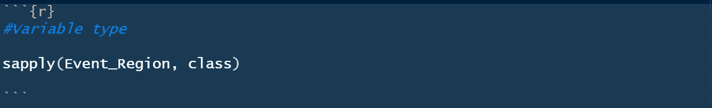
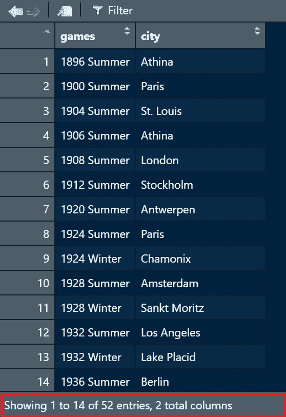

# 120 年的奥林匹克历史

> 原文：<https://blog.devgenius.io/120-years-of-olympic-history-4ae8515f0465?source=collection_archive---------10----------------------->

## 25 个问题探索性数据分析

来源:微软必应

# 介绍

根据维基百科，现代**奥运会**是主要的国际体育赛事，包括夏季和冬季体育比赛，来自世界各地的数千名运动员参加各种比赛。

奥运会被认为是世界上最重要的体育比赛，有 200 多个国家参加。奥运会通常每四年举行一次，自 1994 年以来，在这四年期间，奥运会每两年在夏季奥运会和冬季奥运会之间交替举行。

本项目使用的数据集是从**[***kaggle***](https://www.kaggle.com/datasets/heesoo37/120-years-of-olympic-history-athletes-and-results)下载的**

**这个数据集提供了一个机会来询问奥运会是如何随着时间的推移而变化的，包括询问妇女、不同国家、不同运动和其他事件的参与和表现。**

**从 1896 年到 2016 年的奥运会都包含在这个数据集中。数据集包含两个文件:运动员文件和区域文件。**

**我们将使用 R Studio 中的 **R 编程语言在我们的探索性数据分析中回答 **25 个问题**。**这些问题中的一些受到了
[***techTFQ***](https://youtu.be/XruOBp7yPXU)使用 SQL 所做的事情的启发。我决定用 R 编程来回答问题，并增加了几个其他问题。**

**我为每个问题编写了不言自明的代码，即使您不是 R 用户，也可以在结果输出的帮助下理解每行代码在做什么，因为您已经熟悉了这个项目中使用的数据集。**

**然而，在我们深入回答这些问题之前，我们将加载我们将使用的库，并将我们的数据集导入到 **R Studio** 中**

# **加载库并将 CSV 数据集文件导入 R Studio。**

## **加载库**

****

**让我们导入 CSV 数据集。我们将运动员 _ 事件和 noc _ 区域 CSV 文件分别命名为**事件**和**区域**。**

## **导入数据集**

****

## ****让我们快速了解一下我们的变量和数据框架****

****

**colnames(Event)告诉我们事件数据帧中的所有变量。结果如下所示。**

****

****事件数据帧的变量****

****

**colnames(Region)告诉我们区域数据框中的所有变量。结果如下所示。**

****

****区域数据帧的变量****

****

**glimpse(事件)的结果如下所示**

****

****事件数据帧一瞥****

**在事件数据帧中有 271，116 行和 15 列。**

****

**扫视(区域)的结果如下所示**

****

****一瞥地区数据帧****

**区域数据框中有 230 行和 3 列**

**在清理我们的数据之前，让我们通过**“NOC”**变量加入**事件&区域**数据帧，并作为新的数据帧存储在对象**“Event _ Region”**中**

****

****事件和区域数据帧的内部连接。****

## **数据清除**

**让我们看看刚刚创建的新数据框中的变量。**

****

**列名(Event_Region)的结果如下所示**

****

**Event_Region 数据框的变量**

**我们需要清理变量名，以确保名称的一致性。**

****

**现在，让我们检查一下数据框中的变量类型。**

****

**变量类型如下所示，其中包括“字符型”和“数值型”变量。**

****

**可变类型输出**

**让我们删除 notes 变量，因为我们在分析中不需要它。**

****

**删除“notes”变量。**

****

**注释变量已成功从 out 中删除**

****让我们来看看我们的数据框摘要****

********

****汇总输出****

**让我们将变量性别、季节和奖牌从**人物**转换为**因素**，因为它们是**分类变量。****

****

****变量转换****

****

****变量转换****

****

****变量转换****

**让我们使用**应用函数**验证我们的变量是否已经成功转换**

****

**变量类型**

****

**变量已被转换为因子变量。**

**在奥运历史数据集的探索性数据分析中，我们将回答以下 25 个问题。**

# **问题**

**1.举办了多少届奥运会？
2。列出所有奥运会及其举办城市。
3。列出所有参加过 1896 年夏季奥运会的地区。
4。提及参加每届奥运会的国家总数。
5。哪届奥运会参赛国家最多和最少？
6。哪个民族或国家参加了每一届奥运会？
7。获得奥运会前 5 名奖牌获得者。成功是由获得的奖牌总数来衡量的。
8。每个国家总共获得了多少枚金牌、银牌和铜牌？一个国家必须把每块奖牌中的至少一块带回家。
9。列出尼日利亚在每届奥运会上获得的所有金牌、银牌和铜牌。
10。列出每个国家在每届奥运会上获得的金、银、铜牌总数。
11。哪个国家从未获得过金牌，但却获得了银牌或铜牌？
12。尼日利亚运动员在哪个运动项目中获得的奖牌最多？
13。分析尼日利亚赢得足球奖牌的每届奥运会，记录获得的奖牌总数。
14。说出每届夏季奥运会的运动项目。
15。哪届奥运会只举办过一次？
16。每届奥运会有多少不同的运动项目？
17。哪个性别参加奥运会最多？
18。全年的参与者总数是多少？
19。全年的性别参与细分情况如何？**

**20.男女运动员获得的金牌、银牌和铜牌总数分别是多少？
21。列出 15 岁以下的金牌获得者。
22。谁是获得过金牌的年龄最大的运动员？23。获得金牌最多的前 10 名运动员是谁？
24。根据获得的奖牌数(金牌、银牌或铜牌)获得前 10 名运动员。25。哪个年龄段参与游戏最多？**

**问题 1: 举办了多少届奥运会？**

****

****问题 1 代码****

****

****问题 1 结果输出****

**问题 2:列出所有奥运会及其举办城市。**

****

****问题 2 代码****

****

****问题 2 结果输出****

**列出参加过 1896 年夏季奥运会的每个地区。**

****

****问题 3 代码****

****

****问题 3 结果输出****

****问题 4:** 说出参加每届奥运会的国家总数。**

****

****问题 4 代码****

****

****问题 4 结果输出****

****问题 5:** 哪届奥运会参赛国家最多和最少？**

****

****问题 5 代码****

****

****问题 5 结果输出****

**哪个民族或国家参加了每一届奥运会？**

****

****第六题代码****

****

****第六题成绩输出****

****问题 7:** 从奥运会中获得奖牌最多的 5 个国家。成功是由获得的奖牌总数来衡量的。**

****

****问题 7 代码****

****

****问题 7 结果输出****

**问题 8: 每个国家总共获得了多少枚金牌、银牌和铜牌？一个国家必须把每块奖牌中的至少一块带回家。**

****

****问题 8 代码****

****

****问题 8 结果输出****

****问题 9:** 列出尼日利亚在每届奥运会上获得的所有金牌、银牌和铜牌。**

****

****问题 9 代码****

****

****问题 9 结果输出****

**问题 10:列出每个国家在每届奥运会上获得的金、银、铜牌总数。**

****

****问题 10 代码****

****

****问题 10 结果输出****

**哪个国家从未获得过金牌，但却获得了银牌或铜牌？**

****

****问题 11 代码****

****

****问题 11 结果输出****

****问题 12:** 尼日利亚运动员在哪个运动项目上获得的奖牌最多？**

****

****问题 12 代码****

****

****问题 12 结果输出****

****问题 13:** 分析尼日利亚获得足球奖牌的每届奥运会，记录尼日利亚获得的奖牌总数。**

****

****问题 13 代码****

****

****问题 13 结果输出****

**问题 14: 说出每届夏季奥运会的运动项目。**

****

****第 14 题代码****

****

****问题 14 结果输出****

**哪个奥运会只举办过一次？**

****

****问题 15 代码****

****

****问题 15 结果输出****

**问题 16:每届奥运会有多少个不同的项目？**

****

****问题 16 代码****

****

****问题 16 结果输出****

****问题 17:** 哪个性别参加奥运会最多？**

****

****问题 17 代码****

****

****第 17 题结果输出****

****问题 18:** 全年总参与人数是多少？**

****

****问题 18 代码****

****

****问题 18 结果输出****

****问题 19:** 这一年中的性别参与情况如何？**

****

****问题 19 代码****

****

****第 19 题结果输出****

**问题 20: 男女运动员获得的金牌、银牌和铜牌总数分别是多少？**

****

****问题 20 代码****

****

****问题 20 结果输出****

****问题 21:** 列出 15 岁以下的金牌得主。**

****

****问题 21 代码****

****

****问题 21 结果输出****

**问题 22: 获得过金牌的年龄最大的运动员是谁？**

****

****问题 22 代码****

****

****问题 22 结果输出****

****问题 23:** 获得金牌最多的前 10 名运动员是谁？**

****

****问题 23 代码****

****

****问题 23 结果输出****

****问题 24:** 根据获得的奖牌数(金牌、银牌和铜牌)获得前 10 名运动员。**

****

****问题 24 代码****

****

****问题 24 结果输出****

****问题 25:** 什么年龄段的人参与游戏最多？**

****

****问题 25 代码****

****

****问题 25 结果输出****

**所有代码都可以在我的 [***Githup 资源库***](https://github.com/abbeynet77/120-Years-of-Olympic-History) 中找到**

# **结论/见解**

**从以上奥运历史分析，可以得出这样的结论；**

*   **从 1896 年到 2016 年，总共举办了 51 届奥运会。**
*   **第一届奥运会于 1896 年在雅典举行，共有 12 个国家参加。**
*   **以下国家法国、意大利、瑞士和英国参加了从 1896 年到 2016 年的每一届奥运会。**
*   **奖牌数最多的国家是美国，奖牌总数为 5637 枚。**
*   **尼日利亚在 1996 年夏季奥运会上赢得了她最多的金牌。**
*   **从 1896 年到 2016 年，共有 11 个国家从未获得过奥运会金牌，其中包括加纳、冰岛、尼日尔、赞比亚等。**
*   **尼日利亚以总共 50 枚奖牌赢得了她在足球方面的最高奥运奖牌。**
*   **参加奥运会的男性比女性多 46%。**
*   **获得金牌的年龄最大的运动员是查尔斯·雅各布斯和奥斯卡·戈默·斯旺，他们今年 64 岁。**
*   **美国的迈克尔·弗雷德·菲尔普斯二世赢得了奥运会历史上最多的奖牌。**

**非常感谢您的阅读。请**关注我**了解更多探索性数据分析项目和数据分析相关主题。注意安全！**