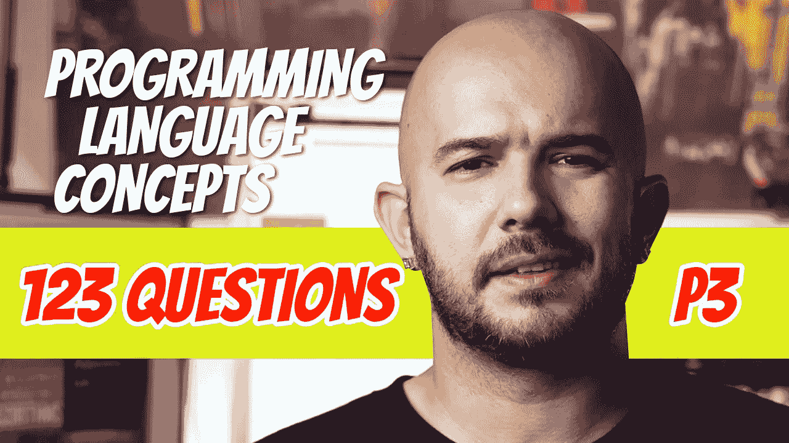

# 123 编程语言问答(P3)

> 原文：<https://blog.devgenius.io/123-programming-language-q-a-p3-f4d5c141382?source=collection_archive---------12----------------------->

在这一部分，我们将讨论一些作为计算机科学家应该知道的常见话题，这些话题与 Objective C、Java、Perl、JavaScript、PHP、Python、Ruby、Lua、C#、通用语言语法和语言语义有关。

## 201.谁开发了 Objective-C？

-布兰德·考克斯和汤姆·洛夫

## 202.真的还是假的？Objective-C 用于编写 MAC OS X。

-没错

## 203.真的还是假的？Objective-C 是 C 的严格超集

-没错

## 204.真的还是假的？Objective-C 是一种混合语言，具有命令式和面向对象的特性。

-没错

## 205.Java 是谁开发的？

詹姆斯·高斯林

## 206.Java 有什么用？

-网络编程，尤其是 Java 小程序和 Android 开发。

## 207.Java 支持并发吗？

-是的。他们被称为线程。

## 208.Java 中堆中的对象是如何释放的？

-通过垃圾收集自动完成。

## 209.垃圾收集有助于避免什么？

-内存泄漏

## 210.真的还是假的？Java 比 c 快。

- False，因为 C 是编译语言，而 Java 是混合实现语言

## 211.列举几个 Java 实现速度快的原因。

详细说明:Applets，比 C++简单安全，编译器免费且容易获得

## 212.真的还是假的？Java 有泛型。

-没错

## 213.谁开发了 Perl？

拉里·沃尔

## 214.在 Perl 中，变量是 _ _ _ _ _ _ _ _ _ 声明的。

-含蓄地

## 215.Perl 变量类型的第一个字符是什么:标量、数组、散列

- S —标量
- @ —数组
- % —散列名称

## 216.真的还是假的？Perl 中数组的长度是动态的。

-没错

## 217.关联数组叫什么？

-哈希

## 218.什么是哈希？

-存储密钥的哈希表

## 219.真的还是假的？Perl 最初是一个用于处理文本文件的 UNIX 工具。

-没错

## 220.JavaScript 是谁开发的？

-布兰登·艾希

## 221.真的还是假的？JavaScript 是标准化的。

-没错

## 222.什么是 JavaScript 标准化名称？

- ECMAScript

## 223.微软的 JavaScript 版本叫什么？

- Jscript

## 224.JavaScript 的解释器在哪里？

-网络浏览器

## 225.JavaScript 是用来做什么的？

HTML 文档的表单验证和动态修改

## 226.真的还是假的？JavaScript 支持继承。

-假的

## 227.PHP 是谁开发的？

拉斯马斯·勒德尔夫

## 228.PHP 在哪里解读？

-网络服务器

## 229.真的还是假的？PHP 支持 OOP。

-没错

## 230.Python 是谁开发的？

吉多·范·罗苏姆

## 231.真的还是假的？Python 是解读出来的。

-没错

## 232.Python 是动态类型的吗？

-是的

## 233.Python 是面向对象的吗？

-是的

## 234.Python 的数据结构是什么？

-元组、列表和字典

## 235.Python 有垃圾回收吗？

-是的

## 236.Python 支持异常处理吗？

-是的

## 237.Python 支持并发吗？

-是的

## 238.Python 支持网络编程吗？

-是的

## 239.日本设计的第一种在美国广泛使用的编程语言是什么？

-露比

## 240.Ruby 是谁开发的？

-松本幸宏

## 241.真的还是假的？Ruby 是面向对象的。

-没错

## 242.真的还是假的？在 Ruby 中，类和对象是动态的。

-没错

## 243.Ruby 中如何指定作用域？

-名义上。局部变量以字母开头。实例变量以@开头。带美元的全局。

## 244.Lua 支持 ________ 和 ________ 编程。

-命令性和功能性

## 245.Lua 支持 OOP 吗？

-没有

## 246.Lua 的数据结构是什么？

- Table(一个关联数组)

## 247.真的还是假的？Lua 是一种混合语言。

-没错

## 248.为什么开发 C#是为了？

-基于组件的软件开发

## 249.谁创造了 C#？

安德斯·海尔斯伯格

## 250.C#中的类型委托是做什么用的？

-实现事件处理程序和回调

## 251.真的还是假的？C#允许自动装箱和自动拆箱。

-没错

## 252.真的还是假的？C#有一个 foreach 语句。

-没错

## 253.什么是标记编程混合语言？

-一种标记语言，其中一些元素可以指定编程动作。

## 254.什么是句法？

-语言的形式

## 255.什么是“语义学”？

-表达的含义

## 256.真的还是假的？描述语法比描述语义更容易。

-没错

## 257.一种语言的字符串叫做 ________。

-句子

## 258._______ 是最低级别的语法单位

-词汇

## 259.一种语言的 _________ 是它的一个词位范畴

-令牌

## 260.语言可以用两种不同的方式正式定义:用 ______ 和用 _______。

-认可和生成

## 261.编译器的语法部分是语言的 ______。

-识别器

## 262.正规语法能描述什么？

-编程语言标记的出现

## 263.上下文无关文法能描述什么？

-整个编程语言的语法

## 264.什么是元语言？

——一种语言用来描述另一种语言。

## 265.真的还是假的？BNF 是编程语言的元语言。

-没错

## 266.BNF 中的每个规则都有一个左侧(LHS)或 ________，以及一个右侧(RHS)或 ________。

-非终端和终端

## 267.什么是语法？

-规则集合

## 268.在 BNF 中，多个规则可以用 ______ 隔开。

-竖线|

## 269.如果 LHS 出现在其 RHS 上，则规则是 ______。

-递归

## 270.一种语言的一个句子带有一个特殊的非终结符，叫做 ____ _____。

-开始符号

## 271.什么是推导？

-规则应用程序序列，其中每个连续的字符串都是通过用一个非终结符定义替换一个非终结符而从前一个字符串派生出来的。

## 272.派生词中的每个字符串，包括开始符号，称为一个 _______ _______。

-句子形式

## 273.真的还是假的？推导一直持续到句子形式不包含非终结符。

-没错

## 274._____ ________ 是指被替换的非终结符总是最左边的非终结符。

-最左边的推导

## 275.求导如何用图形表示？

-在解析树中

## 276.解析树中的节点和叶子代表什么？

-节点:非终端
-叶子:终端

## 277.生成一个有两个或更多不同解析树的句子的语法被称为 _________。

-暧昧

## 278.每个具有明确语法的派生都有一个 ______ 解析树。

独一无二

## 279.当一个 BNF 规则的 LHS 也出现在它的 RHS 的开头时，这个规则被称为 ___ __。

-左递归

## 280.左递归对应于 ______ ________。

-左结合性

## 281.左关联解析树看起来像什么？

-最低的分支出现在左侧

## 282.大多数语言中 if 结构的规则是什么？

else 子句与前面最接近的不匹配 if 匹配

## 283.EBNF 有哪三种分机？

-方括号、花括号、圆括号

## 284.大括号右边的右上标表示什么？

-封闭零件可重复次数的上限

## 285.在 EBNF 用什么代替箭头？

一个冒号

## 286.真的还是假的？竖线用于分隔不同的 RHS。

-假的。放置 alt。新行上的 RHS。没有竖线

## 287.属性语法描述的是什么？

-比上下文无关语法更像编程语言的结构

## 288.什么是静态语义？

-可以在编译时检查的规则

## 289.真的还是假的？属性文法既能描述句法又能描述语义？

-没错

## 290.什么是属性？

-可以赋值的属性

## 291.合成属性有什么用？

-用于沿解析树向上传递语义信息。

## 292.继承的属性有什么用？

-用于在树中上下传递语义信息

## 293.如果一个解析树中的所有属性值都被计算，那么这个树就被称为 ___ ___。

-完全归因

## 294.什么是内在属性？

-叶节点的合成属性，其值在解析树之外确定。

## 295.什么是实际类型？

-存储变量或表达式的实际类型的合成属性。

## 296.什么是预期类型？

-与存储预期表达式类型的非终结符<expr>相关联的继承属性。</expr>

## 297.真的还是假的？有一个普遍接受的符号来描述动态语义。

-假的

## 298.什么是操作语义？

-试图通过指定在机器上运行语句的效果来描述语句的含义。

## 299.操作语义学有数学基础吗？

-没有

## 300._ _ _ _ _ _ _ _ _ _ _ _ _ _ _ _ _ _ _ _ 是基于递归函数理论。

-指称语义学

## 301.描述程序含义的最严谨、最广为人知的形式化方法是什么？

-指称语义学

## 302.在指称语义学中，每个映射函数都有一个 ____、一个 ____、一个 ____。

-域和范围

## 303.在指称语义中，_____ _____ 指定了要映射哪些句法结构。

-句法域

## 304.在指称语义学中，这个范围被称为 _ _ _ _ _ _ _ _ _ _ _ _ _ _ _ _ _ _ _ _。

-语义领域

## 305.指称语义中的 _ _ _ _ _ _ _ _ _ 由程序变量的值组成。

-州

## 306.展示如何用指称语义来表示一个状态。

- s = { <i1 v1="">，<i2 v2="">，…}其中 i =变量名，v =值</i2></i1>

## 307.在指称语义中，任何没有用值初始化的名称都具有特殊值 __。

-不

## 308.VARMP(i，s)产生什么？

- v

## 309.在指称语义学中，大多数结构，比如表达式，被映射到 __ not 状态。

-价值观

## 310.在编程语言标准中使用了什么语义？

-指称语义学

## 311.什么是公理语义学？

-最抽象的技术，用于基于数理逻辑指定语义

## 312.公理语义有什么用途？

-证明程序的正确性

## 313.什么是断言？

-指定程序变量约束的逻辑表达式。

## 314.什么是前提条件？

-描述语句执行前必要约束的断言

## 315.什么是后置条件？

-描述语句执行后对程序变量的新约束的断言

## 316.前置和后置条件是如何表示的？

-在花括号里

## 317.最弱的前提条件是什么？

-限制性最小的前提条件

## 318.推理规则是什么？

-根据其他逻辑陈述的真实性来推断一个逻辑陈述的真实性的方法。

## 319.推理规则的一般形式是什么？

——S1，S2，……，Sx
— — — — — — — — — — — —
S

## 320.什么是公理？

-假设为真的逻辑陈述

## 321.指定语句形式的公理语义的符号是什么？

- {P} S {Q}

## 322.后果法则说明了什么？

-后置条件总是可以被削弱，而前置条件总是可以被加强。

## 323.为了计算逻辑 while 循环的最弱前提条件，需要找到什么？

-循环不变量

# 想要更多吗？

[P1。104 编程语言 Q&A](https://medium.com/@dinocajic/104-programming-language-conceptual-questions-and-answers-p1-8de4591299fe)
P2。95 编程语言 Q&A[*P3。123 编程语言 Q & A*](https://medium.com/@dinocajic/123-programming-language-q-a-p3-f4d5c141382)
[P4。77 编程语言 Q&A](https://medium.com/@dinocajic/77-programming-language-q-a-p4-71f7dc5cab3e)[P5。146 编程语言 Q & A](https://medium.com/dev-genius/146-programming-language-q-a-p5-d6ad7550c4a0)
[P6。94 编程语言 Q & A](https://medium.com/dev-genius/94-programming-language-q-a-p6-d7e00de0f48)
[P7。141 编程语言 Q & A](https://medium.com/@dinocajic/141-programming-question-q-a-p7-5b4a4325e886)

迪诺·卡伊奇目前是 [LSBio(生命周期生物科学公司)](https://www.lsbio.com/)、[绝对抗体](https://absoluteantibody.com/)、 [Kerafast](https://www.kerafast.com/) 、[珠穆朗玛生物](https://everestbiotech.com/)、[北欧 MUbio](https://www.nordicmubio.com/) 和 [Exalpha](https://www.exalpha.com/) 的 IT 主管。他还担任我的自动系统的首席执行官。他有十多年的软件工程经验。他拥有计算机科学学士学位，辅修生物学。他的背景包括创建企业级电子商务应用程序、执行基于研究的软件开发，以及通过写作促进知识的传播。

你可以在 [LinkedIn](https://www.linkedin.com/in/dinocajic/) 上联系他，在 [Instagram](https://instagram.com/think.dino) 上关注他，或者[订阅他的媒体出版物](https://dinocajic.medium.com/subscribe)。

[*阅读迪诺·卡吉克(以及媒体上成千上万其他作家)的每一个故事。你的会员费直接支持迪诺·卡吉克和你阅读的其他作家。你也可以在媒体上看到所有的故事。*](https://dinocajic.medium.com/membership)