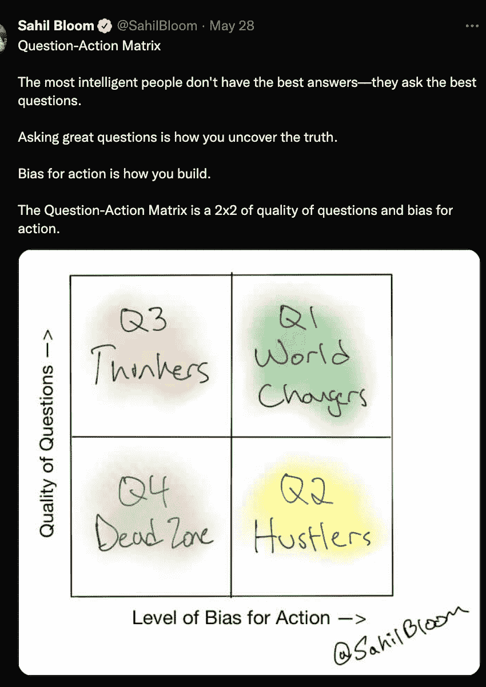

# 成为毒品数据库产品经理的 13 件难事

> 原文：<https://blog.devgenius.io/13-hard-things-i-do-to-be-a-dope-database-product-manager-7064768505f8?source=collection_archive---------5----------------------->

如果你想成为一名产品经理，但还没有读过本·霍洛维茨的《困难的事情》。这本书本身并没有明确地讲述产品管理，但是霍洛维茨为你提供了一个重要的视角。不要相信我的话。他是网景公司的第一任产品经理，网景公司给我们带来了网络浏览器。(没错，你可以把 Internet Explorer 归咎于他们。)

根据你在组织中所处的情况，你可能没有选择在第一天做这些事情中的一件或任何一件。产品经理的首要工作是做需要做的事情，这个博客不是关于这个的。

在《关于困难的困难》一书中，霍洛维茨做了两件我也喜欢做的事情:

(1)他每一章都以现代诗人标志性的嘻哈音乐开始。

(2)他大谈关注重要事物的必要性。你是最重要的，所以我的清单是关于你的。

> 做一次小小的旅行，仇恨者，收起你的思想
> 向前看，不要落后，然后你会看到你发现了什么
> 我抓到了一个笨蛋快死了’因为他想，他会押韵——[安德烈 3000，“整个世界”](https://genius.com/39804)

1.  [持续使用产品](https://www.forrester.com/blogs/product-management-should-you-eat-your-own-cooking/)。

我需要了解产品，以便有效地管理其优先级。作为一名产品经理，我努力从人体工程学的角度捕捉使用产品的感觉。我需要了解来自客户、工程师和现场团队的反馈，以便对他们的问题进行分类、分析和筛选。当然，我宁愿只是提出想法，参加会议，喝咖啡。

2.打破产品。

每个人的产品都有不好的地方。将我的产品推向它们的失败点，为关注什么用例以及在哪里投资提供了无价的清晰。如果是数据库产品，产品经理最好在客户之前了解这些信息。我将我的求知欲引向这个领域。

3.简化信息传递。

这是一个多步骤的过程，直到我的祖母知道我是做什么工作的时候才会完成。当你使用产品信息时，你的目标市场中的每个人都应该确切地知道你在谈论什么。记住，这是要分发给卖家的。

4.用你第三熟练的口语或编程语言解释产品。

对于像我这样的大多数正常人来说，一旦你掌握了第四语言，你的词汇量就会大大减少。如果你可以用一种你没有练习过的语言来解释你的产品，你很可能已经把你的产品简化成简单的术语，这对技术产品经理来说是很难的。

5.当地时间早上很早就起床，与遭遇断电的客户通话。

你必须感受到顾客的痛苦。仅仅听到这些是不够的。如果您是一名数据库产品经理，那么您的一位欧洲客户可能正在打电话，并且由于停机而不得不在半夜醒来。醒来一次，这样您就可以优先为所有客户解决问题。这个比其他的更不可持续，所以要谨慎使用。界限更重要。

6.平均每周一个新的电子表格(这些表格经常被团队成员编辑、重新格式化或美化)。

我非常讨厌电子表格。部分原因是因为脑损伤，以及我随之而来的对[辅助和替代交流](https://www.asha.org/njc/aac/#:~:text=Augmentative%20and%20alternative%20communication%20(AAC)%20describes%20multiple%20ways%20to%20communicate,with%20severe%20expressive%20communication%20disorders.)的依赖(例如，我踱步和打手势。)电子表格是我避开商学院的最初动机。事实证明，商学院的学生在这一点上可能是对的。电子表格对于数据分析和结构化非结构化数据来说都是非常有效的工具。当电子表格被组织在文件夹和书签中时(稍后将详细介绍)，可以帮助我扩展和协作。老实说，我应该更多地使用电子表格，但这太难了。

问问题，并始终是航运

7.告诉许多潜在客户“不要使用该产品！”

销售人员不喜欢这种肌肉，但它是工作中如此重要的一部分。好的产品经理倾向于对客户着迷，但是最好的产品经理知道什么时候放弃你知道你不能解决的问题。

8.追求对客户的使用和价值，而不是金钱。

如果你在一家糟糕的公司工作，这种行为最终会让你陷入困境。钱会来的。你需要客户的使用来基于反馈进行迭代。如果你没有一个[高保真反馈回路](https://uminntilt.com/2011/09/20/high-fidelity-feedback-moves-learning-forward/)，你的产品就不好。谁想买那个？

9.写不完善的文档。

为此，我可以感谢我的老板并跳过我现在的工作。工程师会从他们的角度追求完美，产品营销人员也会从他们的角度追求完美。这是一个痛苦的适应过程，但对于一个运转良好的产品组织的设计过程来说，这是至关重要的。

10.如今，缩小范围很容易，重要的时候扩大范围。

那么多的培训课程和世界上的产品负责人会教你，范围蔓延是所有产品的死亡，你应该不停地迭代。这一点有细微差别。如果你知道一个工程师正在做一些复杂的事情，切换上下文是有风险的，但是他们的第一次迭代并没有为客户交付预期的商业价值，回到绘图板。当然，你需要知道什么时候放弃努力，继续前进。

11.[运行表现比对照](https://kamounlab.medium.com/whats-a-failed-experiment-7ea66fd96f8)差的实验。

如果一个产品经理来自一个实验文化，这是很容易发现的。我是一名 OG 测试和目标用户，极早期优化用户，在我的整个职业生涯中，我已经进行了从 linux 内核到 HTML 的各种实验。充分的测试意味着 [n%的实验](https://www.theguardian.com/technology/2014/dec/03/jeff-bezos-billions-dollars-failures-amazon)会失败，如果你一开始就把问题框定为一个需要学习的实验，那也没关系。

12.听听那些不知道自己在说什么的人。

你应该觉得自己很幸运。初级用户是产品改进的金矿。我无时无刻不在冥想，试图回到[初心](https://en.wikipedia.org/wiki/Shoshin)。如果你认为有人不明白你在说什么，通常这意味着他们给了你宝贵的洞察力，而你可能因为这个列表中的第一个练习而没有。

13.编写 SQL 查询。

在不太遥远的将来，总有一天[没人需要编写 SQL 查询](https://twitter.com/cogramai?lang=en)。今天，我仍然偶尔需要这样做。我尽量不要在小样本上过度拟合或妄下结论。偶尔，我会陷入这种模式，因为我在不清楚的地方寻找答案。对于大多数产品经理来说，偶尔需要写一些 SQL。令人欣慰的是，有更多的工具可供选择，也有更多的方法来进行数据分析，而这些都不涉及 SQL。Databricks 需要推出他们的 MQL 产品。

将这篇博客加入书签。在我列出的“困难的事情”中，组织书签是一项值得尊敬的事情有如此多的信息和文档需要跟踪，不这样做要困难得多。也许这些重要的任务会变得更容易，并被其他具有挑战性的特质所取代。

我想对我的顾客有同理心，并向赢家学习。本·霍洛维茨是这篇博客的灵感来源，因为有些人认为产品管理很容易。他们不能做困难的事情。