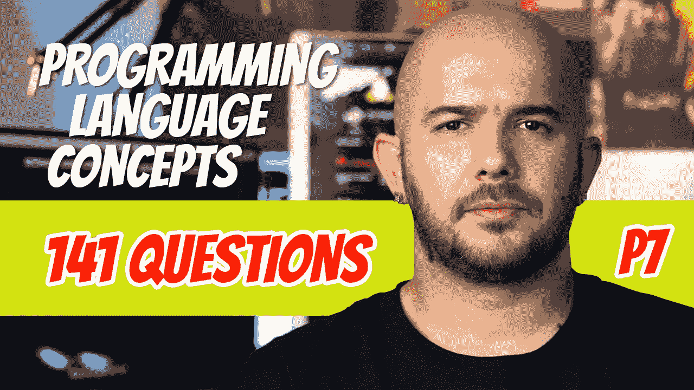

# 141 编程问题问答(P7)

> 原文：<https://blog.devgenius.io/141-programming-question-q-a-p7-5b4a4325e886?source=collection_archive---------6----------------------->

让我们以另外 141 个问题来结束这个系列。我觉得 781 题是你计算机科学探索的一个很好的起点。查看页面底部的链接，查看之前的 640 个问题。

## 641.真的还是假的？C 中的指针可以指向任何变量。

-没错

## 642.在 C 语言中如何获取变量的地址？

-带有与符号(&)

## 643.如果指针指向一个数组，C 和 C++支持哪三种形式的指针算法？

-给指针
加一个整数-从指针
中减去一个整数-减去两个指针

## 644.真的还是假的？后面没有下标的数组名可以用作指向数组第一个元素的指针。

- True
即
int list[10]；
int * ptr；
…
ptr = list；
…
这样就可以做
…
*(ptr+1)
*(ptr+index)
ptr[index]

## 645.真的还是假的？在 C 和 C++中，指针可以指向一个函数。

-没错

## 646.C 和 C++允许 ______ 类型的指针，它可以指向任何类型的值。

-无效*

## 647.函数 malloc 的返回类型是什么？

-无效*

## 648.在 Java 中，引用类型的值类似于指针，只是它必须引用 ______。

-对象

## 649.真的还是假的？不能对引用执行算术运算。

-没错

## 650.C++中的引用是什么？

-另一个变量的别名

## 651.真的还是假的？C++中的引用类型必须在绑定到存储时进行初始化，并且在其生存期内不能引用任何其他变量。

-没错

## 652.引用类型主要用于什么？

-声明参数

## 653.真的还是假的？C#既包括 Java 的引用，也包括 C++的指针。

-没错

## 654.在 C#中，子程序要使用指针，必须包含 _____ 修饰符。

不安全

## 655.真的还是假的？Smalltalk、Python、Ruby 和 Lua 中的所有变量都存储引用并被隐式解引用。

-没错

## 656.说出一个指针有益的领域。

-编写设备驱动程序

## 657.举出两个解决悬空指针问题的建议方案。

-墓碑的使用
-锁和钥匙的使用

## 658.什么是墓碑？

指针变量指向逻辑单元，逻辑单元又指向堆动态变量。

## 659.真的还是假的？当堆动态变量被释放时，逻辑删除仍然存在。

-没错，但它被设置为零。

## 660.什么是锁和钥匙方法？

-指针存储为(键，地址)对，其中键是一个整数值，每个堆动态变量都有一个存储整数锁值的头单元。当分配堆动态变量时，会创建一个锁值，并将其放在堆动态变量的锁单元和指针的键单元中。当指针被解引用时，指针的键值与堆动态变量的锁值进行比较。

## 661.悬空指针问题的最佳解决方案是什么？

-为不再有用的堆动态变量提供隐式释放

## 662.Java 如何处理堆动态变量的释放？

-隐式地使用它们的垃圾收集器。

## 663._______ 是在编程语言中指定计算的基本方法。

-表情

## 664.操作员评估由 _________ 和 _________ 规则管理。

-结合性和优先级

## 665.编程语言中算术表达式的大部分特征都是继承自 ________。

-数学

## 666.在编程语言中，算术表达式由什么组成？

-运算符、操作数、括号和函数调用

## 667.运算符有哪三种类型

-一元:一个操作数
-二元:两个操作数
-三元:三个操作数

## 668.在大多数编程语言中，二元运算符是 _ _ _ _ _ _ _ _ _，出现在它们的操作数之间。

-中缀

## 669.一元运算符可以是 ______ 或 _ _ _ _ _ _ _ _ _。

-前缀或后缀

## 670.真的还是假的？表达式的值可能取决于表达式中运算符的求值顺序。

-没错

## 671.公共语言的运算符优先级规则几乎都是相同的，包括:

- 1.诸子百家的优先级最高
- 2。乘法和除法的优先级低于 1
- 3。加法和减法的优先级低于 2。

## 672.一元加运算符叫什么？

-标识运算符

## 673.一元加运算符为什么叫恒等运算符？

-因为它通常没有效果

## 674.真的还是假的？在 Java 中，一元加号和减号导致短整型和字节型操作数隐式转换为 int 类型。

-没错

## 675.哪种语言只有一个优先级？

杀伤人员地雷

## 676.当一个表达式包含相邻出现的具有相同优先级的运算符时，_ _ _ _ _ _ _ _ _ _ _ _ _ 规则确定首先关联的运算符。

-关联性

## 677.运算符可以有 ______ 或 ______ 结合性。

-左边还是右边。

## 678.真的还是假的？Visual Basic 的取幂运算符是左关联的。

-没错。大多数语言都是右联想的

## 679.真的还是假的？在 APL 中，运算符求值的顺序完全由结合律决定，对于所有的运算符都是从右到左。

-没错

## 680.为什么浮点数往往没有联想？

-溢出问题

## 681.如何覆盖普通的优先级和结合性规则？

-括号

## 682.算术和关系运算符在 Ruby 中是如何实现的？

因为 Ruby 是一种纯粹面向对象的语言

## 683.真的还是假的？Ruby 中的运算符可以被覆盖。

-没错

## 684.在 Lisp 中，运算符是 _ _ _ _ _ _ _ _ _。

-功能

## 685.三元运算符有什么用？

-在基于 C 的语言中形成条件表达式

## 686.什么是副作用？

-操作符或函数调用除了返回值之外还执行其他操作的结果，即 int j = ++ I+I；j 是什么？取决于关联性

## 687.如果任意两个具有相同值的表达式可以互相替换而不影响程序的行为，那么程序就具有 _ _ _ _ _ _ _ _ _ _ _ _ _ _ 的性质。

-参照透明度

## 688.什么是运算符重载？

-允许操作者有多种含义

## 689.在表达式中使用重载运算符会发生什么？

-编译器检查操作数的类型，以确定运算符的正确含义

## 690.类型转换可以是 ________ 或 _ _ _ _ _ _ _ _，可以是显式的或隐式的。

-变窄或变宽

## 691.什么是缩小转换？

-将一个值转换为甚至无法存储原始类型的所有值的近似值的类型。即从整数到字节

## 692.什么是扩大转换？

-将一个值转换为至少可以包含原始类型的所有值的近似值的类型。即 int 到 double

## 693.真的还是假的？收缩转换是安全的。

-假的

## 694.什么叫隐式类型转换？

-胁迫

## 695.什么叫显式类型转换？

-石膏

## 696.什么是混合模式转换？

-运算符可以有不同类型的操作数

## 697.为什么 Java 在执行算术运算之前会把字节变量强制转换成整数？

-建筑。有一种方法可以把整数加在一起，但不是字节。

## 698.为什么强制转换要放在括号中？

-因为类型名可能由多个单词组成:例如长双精度型

## 699.溢出何时发生？

-当操作的结果太大而无法存储在指定的内存量中时

## 700.下溢何时发生？

-当操作的结果太小而无法表示时。

## 701.运行时错误的另一个词是什么？

-例外

## 702.真的还是假的？在 Java 中，浮点除以零是错误的。

-假的。无穷大是一个定义明确的值

## 703._______ ________ 比较两个操作数的值。

-关系运算符

## 704.关系表达式的值通常是多少？

-布尔值

## 705.PHP 中===运算符的用途是什么？

-“等于”运算符防止类型强制
-即“7”= = 7 为真，但“7”= = 7 为假

## 706.如何防止 Ruby 中关系表达式的强制？

-不使用==，而使用 eql？

## 707.真的还是假的？基于 c 的语言赋予或比和更高的优先级。

-假的。并获得比 OR 更高的优先级

## 708.在 C99 之前，C 没有 _ _ _ _ _ _ _ _ _ 型。取而代之的是使用数字。

-布尔值

## 709.在 C 语言中，______ 被认为是错误的。

-零(所有其他值代表真)

## 710.使用 _ _ _ _ _ _ _ _ _ _ _ _ _ _ _ _ _ _ _ _ _ _ _ _ _ _，表达式的值是在不评估其所有子表达式的情况下确定的。

-短路评估

## 711.短路表达式何时会引起问题？

-如果布尔表达式包含副作用，则副作用可能不会发生

## 712._ _ _ _ _ _ _ _ _ _ _ _ _ _ _ _ _ _ _ _ _ 将赋值与一些其他操作结合在一起。

-复合赋值运算符(即 sum+=value)

## 713.哪种语言引入了复合赋值运算符？

- ALGOL 68

## 714.真的还是假的？表达式-count++被解释为-(count++)，而不是(-count)++。

-没错

## 715.赋值是 ______ 关联的。

-没错

## 716.真的还是假的？Java 和 C#只允许在 if 语句中使用布尔表达式。

-没错

## 717.举一个 Perl 中多源赋值语句的例子。

-($第一，$第二，$第三)= (20，40，60)；

## 718.在 ML 中，名字是如何绑定到值的？

-使用 val(即 val 成本=数量*价格；)

## 719.真的还是假的？如果所需的强制是扩大或缩小，Java 和 C#允许混合模式赋值。

-假的。仅加宽

## 720.大多数编程语言需要的两种能力是什么？

-从备选控制流路径中选择
-重复执行语句序列

## 721.提供这两种功能的说法是什么？

-控制声明

## 722.什么是控制结构？

-控制语句和它控制其执行的语句集合

## 723.________ 和 ________ 在 1966 年证明了所有算法都可以只用两个控制语句来表达:一个用于在两个控制流路径之间进行选择，另一个用于逻辑控制的迭代。

-博姆和雅各布尼

## 724.无条件分支语句叫什么？

-转到

## 725.真的还是假的？控制结构的多个出口会造成危险。

-假的

## 726.______ ________ 提供了一种在程序中的两条或多条执行路径之间进行选择的方法。

-选择声明

## 727.选择语句通常有哪两条路径？

-双向和 n 向

## 728.如果在控制表达式中省略了括号，通常使用什么？

-关键字标记，如 then

## 729.在 Ruby 中，整个 if 结构以单词 _____ 结束。

表示“受到某种对待的人”:dividend | reverend

## 730.Python 如何指定复合语句？

-通过使用缩进

## 731.在 Java 中，else 子句总是与 _ _ _ _ _ _ _ _ _ previous 不成对的 then 子句成对出现。

最近的

## 732.真的还是假的？在函数式语言 ML、F#和 Lisp 中，选择器不是语句；它是一个产生值的表达式。

-没错

## 733.在 F#中，当 if 构造没有 else 子句时，then 子句必须返回一个 ____ 类型的值。这个类型只有一个值，写为 _________。

-单位
-()

## 734.____-__________ 语句允许选择任意数量的语句或语句组中的一个。

-多项选择

## 735.C#中多选语句的一个例子是什么？

-开关

## 736.为了在逻辑上分隔交换机中的代码段，必须使用 _ _ _ _ _ _ _ _ _ _ _ _ _ _；c 的 _____ 语句就是一个例子，它退出了 switch 语句

-显式分支
- break

## 737.真的还是假的？在 C#中，允许隐式执行 switch 语句的多个段。

-假的。只有一个。

## 738.在 C#中，每个可选段中的最后一条语句以 _____ 或 _____ 结尾。

-断开
-转到

## 739.真的还是假的？C#允许控制表达式和 case 标签是字符串。

-没错

## 740.真的还是假的？在 PHP 的 switch 语句中，case 值可以是任何标量类型。

-没错

## 741.Ruby 的多选结构被称为 _ _ _ _ _ _ _ _ _ _ _ _ _ _。

- case 表达式

## 742.真的还是假的？Perl、Python 和 Lua 没有多重选择语句。

-没错

## 743.多重选择语句的最佳实现技术是什么？

-分支表(或跳转表)

## 744.在分支表中，表的 ______ 是事例值。

-指数

## 745.在分支表中，表的 _____ 是段值。

-元素

## 746.如何在分支表中匹配案例？

-数组下标

## 747.说出另外两种实现多重选择语句的方法。

-二分搜索法和哈希表

## 748.Scheme 的多重选择器叫什么？

COND

## 749.在 Scheme 中，当使用 COND 时，谓词按顺序计算，直到其中一个计算为 ____。

- #T

## 750.真的还是假的？当谓词后面的 Scheme COND 表达式被求值时，它作为 COND 的值返回。

-没错

## 751.真的还是假的？在 Scheme 的 COND 谓词都不为真的情况下，有一个 ELSE 语句，它的表达式被求值并返回值？

-没错

## 752.当没有一个谓词为真并且 Scheme 的 COND 中没有其他谓词时会发生什么？

- COND 返回一个未指定的值

(COND
(>x y)“x 大于 y”)
(<x y)“y 大于 x”)
(否则“x 和 y 相等”)
)

## 753.______ _______(或循环)导致一条语句或一组语句被执行零次、一次或多次。

-迭代语句

## 754.循环的 ______ 是语句的集合，其执行由迭代语句控制。

-身体

## 755.什么是预测试循环？

-在执行循环体之前测试循环完成条件的循环。

## 756.什么是测试后循环？

-执行循环体后测试循环完成条件的循环。

## 757.计数器控制的循环有一个存储计数的 ______ ________。

-循环变量

## 758.计数器控制回路还具有哪三个参数

-循环变量的初始值
-循环变量的终值
-步长-循环变量的顺序值之差

## 759.C 中 for 循环的三个表达式代表什么？

-第一个表达式:初始化
-第二个表达式:循环控制测试
-第三个表达式:通常用于递增循环计数器，因为它是在每次执行循环体后计算的

## 760.真的还是假的？在 C 中，逗号运算符可用于将多个表达式连接成一个表达式。

-没错

## 761.真的还是假的？因为所有的工作都可以在控制表达式中完成，所以语句的 c 通常是空的。

-没错

## 762.真的还是假的？C99 在其第一个表达式中可以有一个声明。

-没错

## 763.真的还是假的？在纯函数式语言中，内容计数器用于迭代。

-假的。不包含计数器变量，并且使用递归而不是迭代

## 764.F#的函数声明中保留字 rec 表示什么？

-函数是递归的

## 765.真的还是假的？每一个计数循环都可以用一个逻辑循环来构建，但反之则不然。

-没错

## 766.Java 的 while 和 do 语句类似于 C 和 C++的语句，只是控制表达式必须是 ______ 类型。

-布尔值

## 767.如何用函数式语言模拟预测试逻辑循环？

-递归函数

## 768.在循环中，什么是无标签退出的例子？

-休息

## 769.真的还是假的？Java 和 Perl 中的 exit 语句(即 break 和 last)可以指定一个标签。

-没错

## 770.continue 语句在循环中做什么？

-跳过循环体的其余部分

## 771.在基于迭代的数据结构中，迭代语句使用 _ _ _ _ _ _ _ _ _ 来遍历数据结构的元素。

-迭代器

## 772.真的还是假的？在 PHP 中，每个数组都包含一个指向其“当前”元素的内部指针。

-没错

## 773.PHP 中当前函数返回什么？

-内部指针当前指向的元素

## 774.Java 对数组中元素迭代的解决方案是什么？

-增强 for 循环

## 775.在 C#中，迭代器可以通过 _ _ _ _ _ _ _ _ _ 语句访问。

- foreach

## 776.真的还是假的？C#用户可以定义自己的集合，编写自己的迭代器。

-没错

## 777.在 Ruby 中，____ 是由大括号或 do 和 end 保留字分隔的代码序列。

-街区

## 778.下面的代码在 Ruby 中有效吗？它会产生显示的结果吗？

*>>4 . x {放“嘿！”}
嘿！
嘿！
嘿！
嘿！
= > 4*

-它是有效的，并且确实产生显示的结果

## 779.提供一个在 Ruby 中使用 each 语句的例子。

> > list = [2，4，6，8]
=>【2，4，6，8】
>>list . each { | value | puts value }
2
4
6
8
=>【2，4，6，8】

## 780.Ruby 有 _____ 方法，而不是计数循环。

- upto
即
>>1 . up to(5){ | x | print x，" " }
1 2 3 4 5

## 781.真的还是假的？无条件分支语句，或 goto，将控制转移到程序中的指定位置。

-没错

# 想要更多吗？

[P1。104 编程语言 Q&A](https://medium.com/@dinocajic/104-programming-language-conceptual-questions-and-answers-p1-8de4591299fe)
P2。95 编程语言 Q & A[P3。123 编程语言 Q & A](https://medium.com/@dinocajic/123-programming-language-q-a-p3-f4d5c141382)
[P4。77 编程语言 Q&A](https://medium.com/@dinocajic/77-programming-language-q-a-p4-71f7dc5cab3e)[P5。146 编程语言 Q & A](https://medium.com/dev-genius/146-programming-language-q-a-p5-d6ad7550c4a0)
[P6。94 编程语言 Q & A](https://medium.com/dev-genius/94-programming-language-q-a-p6-d7e00de0f48)
[*P7。141 编程语言 Q&A*](https://medium.com/@dinocajic/141-programming-question-q-a-p7-5b4a4325e886)

迪诺·卡希奇目前是 [LSBio(寿命生物科学公司)](https://www.lsbio.com/)、[绝对抗体](https://absoluteantibody.com/)、 [Kerafast](https://www.kerafast.com/) 、[珠穆朗玛生物科技](https://everestbiotech.com/)、[北欧 MUbio](https://www.nordicmubio.com/) 和 [Exalpha](https://www.exalpha.com/) 的 IT 负责人。他还担任我的自动系统的首席执行官。他有十多年的软件工程经验。他拥有计算机科学学士学位，辅修生物学。他的背景包括创建企业级电子商务应用程序、执行基于研究的软件开发，以及通过写作促进知识的传播。

你可以在 [LinkedIn](https://www.linkedin.com/in/dinocajic/) 上联系他，在 [Instagram](https://instagram.com/think.dino) 上关注他，或者[订阅他的媒体出版物](https://dinocajic.medium.com/subscribe)。

阅读 Dino Cajic(以及 Medium 上成千上万的其他作家)的每一个故事。你的会员费直接支持迪诺·卡吉克和你阅读的其他作家。你也可以在媒体上看到所有的故事。