# 2023 年面向所有前端开发人员的 15 款出色的 Chrome 扩展

> 原文：<https://blog.devgenius.io/15-awesome-chrome-extensions-for-all-frontend-developers-in-2023-ccbbbfe651f8?source=collection_archive---------0----------------------->

## 非常有用的 Chrome 扩展，你的下一个项目可能需要它。

妮可·沃尔夫在 [Unsplash](https://unsplash.com?utm_source=medium&utm_medium=referral) 上的照片

作为一名前端开发人员，在处理一个特定的项目时，每天都会有很多不同的任务。此外，您必须不断学习新的技术和编码概念，以便在行业中保持更新。

所以你当然需要真的付出努力。幸运的是，前端开发的伟大之处在于我们有很多免费的工具和资源可以使用。网络上充满了资源和工具，让你的生活变得更加轻松。

Chrome 扩展是这些工具和资源的一部分，我们可以从中受益。我们可以利用它们来提高开发人员的工作效率。

所以在这篇文章中，我将与你分享一些令人惊叹的有用的 Chrome 扩展，你可以作为一个开发者来使用。所以让我们开始吧。

# 1.色彩奇拉

[ColorZilla](https://chrome.google.com/webstore/detail/colorzilla/bhlhnicpbhignbdhedgjhgdocnmhomnp) 是一个流行且有用的 Chrome 扩展，有超过 300 万用户下载。火狐用户也可以使用它。

该扩展提供了许多有用的功能，如吸管，颜色选择，CSS 渐变生成器，等等。它允许你从 Chrome 浏览器的任何一点选择颜色，然后在你的代码中使用它们。

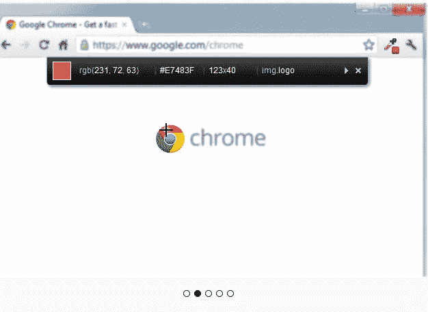

图片由作者从 [Chrome 网上商店](https://chrome.google.com/webstore/detail/colorzilla/bhlhnicpbhignbdhedgjhgdocnmhomnp)获取。

除了颜色选择，这个扩展允许你生成渐变，获得任何网站的调色板，还可以看到最近选择的颜色的历史。

# 2.JSON 查看器

如果你发现很难在浏览器上阅读 JSON 文档，那么这个强大的扩展就是为你准备的。

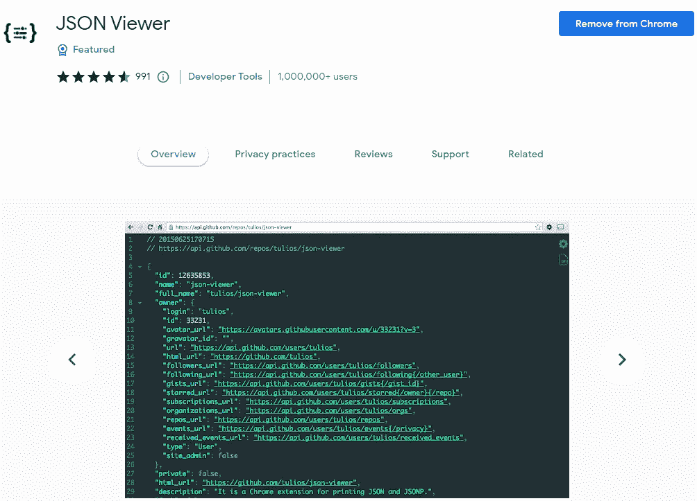

图片由作者从 Chrome 网上商店获取。

[JSON 查看器](https://chrome.google.com/webstore/detail/json-viewer/gbmdgpbipfallnflgajpaliibnhdgobh)自动在浏览器上高亮显示并验证 JSON 数据。因此，这将使您更容易阅读 JSON，尤其是当您想从 API 或其他地方获取一些数据时。

# 3.瓦帕里斯

作为一名开发人员，有时当您从浏览器访问网站或 web 应用程序时，您会对用于创建该网站或应用程序的技术和工具感到好奇。

这就是 [Wappalyzer](https://chrome.google.com/webstore/detail/wappalyzer-technology-pro/gppongmhjkpfnbhagpmjfkannfbllamg?hl=en) 发挥作用的地方。它帮助你识别所有的工具、框架、库和语言，这些工具、框架、库和语言都是用来创建网站或应用程序的。

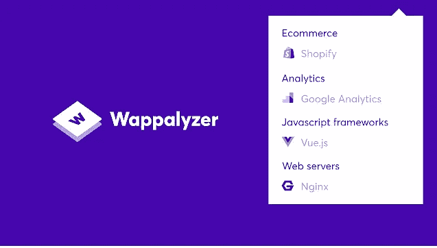

作者从 Chrome 网上商店获取的图片。

该扩展拥有超过 200 万用户，拥有 4.6 颗星的评分。

# 4.吉特亨特

[Githunt](https://chrome.google.com/webstore/detail/githunt/khpcnaokfebphakjgdgpinmglconplhp) 是一个很棒的扩展，可以在浏览器的新标签中突出显示所有 GitHub 趋势项目。

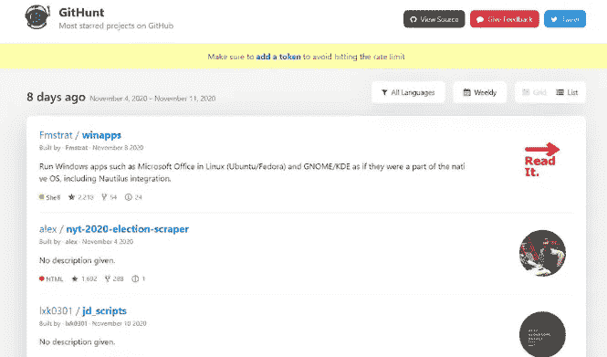

图片由作者从 Githunt 获取。

有了这个扩展，您可以搜索多种语言的项目，阅读项目或存储库的描述，查看 GitHub 星的数量，以及更多功能。

因此，如果您想为开源项目做贡献，或者如果您只是在寻找项目创意，这是一个很好的扩展。

# 5.每日开发

如果你想随时了解最新的技术和开发者新闻，[每日开发](https://daily.dev/)对你来说是一个很好的扩展。它收集了一些最好的开发者内容和技术文章，你可以从中学习。

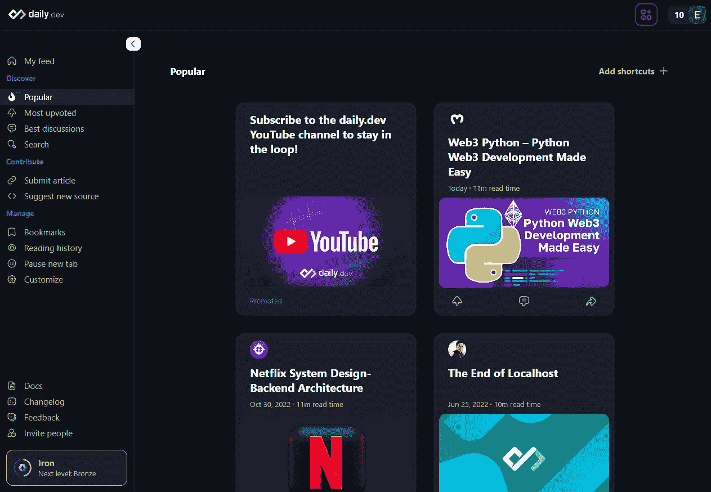

图片由作者从[每日发展](https://daily.dev/)获取。

该扩展拥有超过 10 万用户的五星评级，这意味着它很好，很有用。这对你作为开发人员的知识是一个很好的提升。

# 6.网站调色板

站点调色板是另一个伟大的扩展，它允许你为你的下一个项目轻松地生成调色板。这对于所有前端开发人员和设计人员来说都是一个很好的扩展。

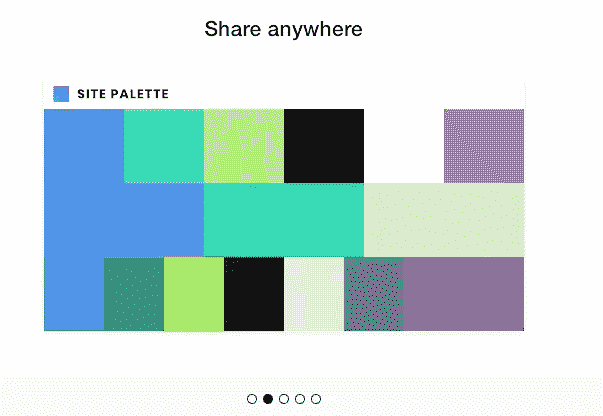

作者从 Chrome 网上商店获取的图片。

该扩展还允许您下载自动生成的草图模板，并且还支持 Adobe 样本。

# 7.字体忍者

这是另一个有用的 [Chrome 扩展](https://chrome.google.com/webstore/detail/fonts-ninja/eljapbgkmlngdpckoiiibecpemleclhh)如果你想在你的浏览器上识别任何网页中使用的字体。除此之外，如果你想的话，你也可以把字体加入书签或者购买。

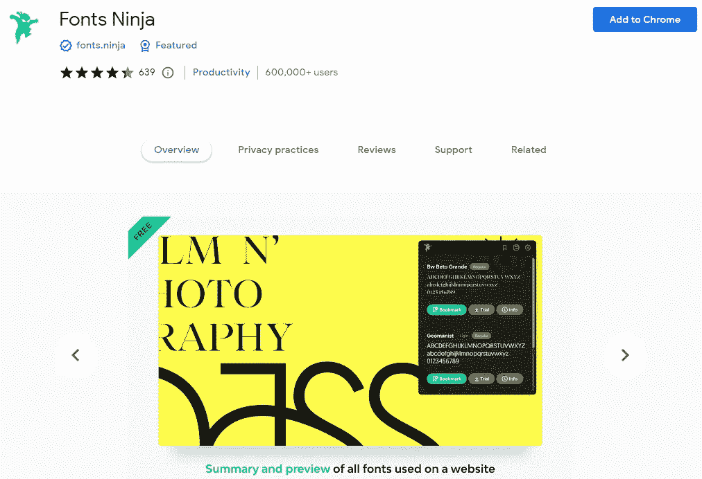

图片由作者从 Chrome 网上商店获取。

该扩展拥有超过 60 万用户，用户评论得分为 4.4 分。

# 8.CSS 窥视者

CSS Peeper 是一个很棒的 Chrome 扩展，可以让你轻松查看网页上的 CSS 样式。这是一个很好的工具来提取一些 CSS 代码，并创建真棒风格指南。

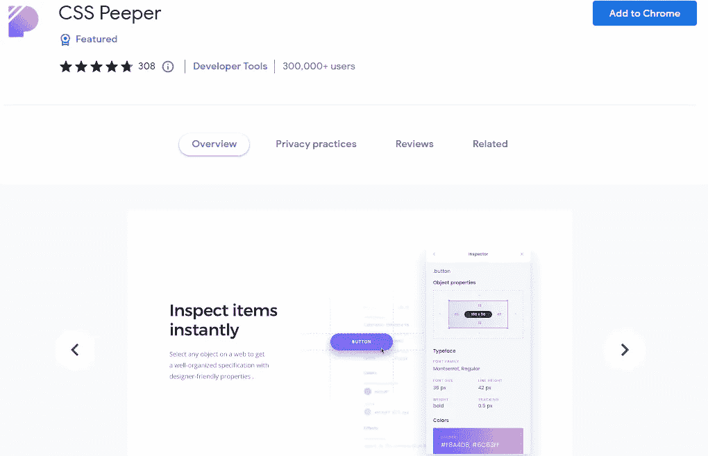

作者从 Chrome 网上商店获取的图片。

超过 30 万用户正在使用这个很酷的扩展，评分为 4.7 分。

# 9.CSS 查看器

这是另一个惊人的[扩展](https://chrome.google.com/webstore/detail/cssviewer/ggfgijbpiheegefliciemofobhmofgce?hl=en)，有点类似于 CSS Peeper。它允许你简单地查看网页上的 CSS 属性。你只需将鼠标悬停在任何你想要的元素上，就可以查看 CSS 了。

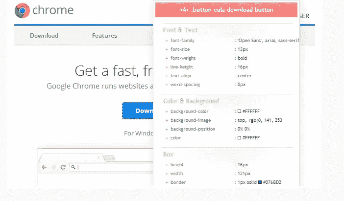

图片由作者从 Chrome 网上商店获取。

该扩展拥有超过 200，000 名用户，用户评级几乎为 5 星。

# 10.React 开发人员工具

如果你在你的项目中使用 ReactJS，这是你应该使用的一个重要且必备的[扩展](https://chrome.google.com/webstore/detail/react-developer-tools/fmkadmapgofadopljbjfkapdkoienihi?hl=en)。它允许您在浏览器中调试 React 代码，还可以访问代码中的所有 React 组件。

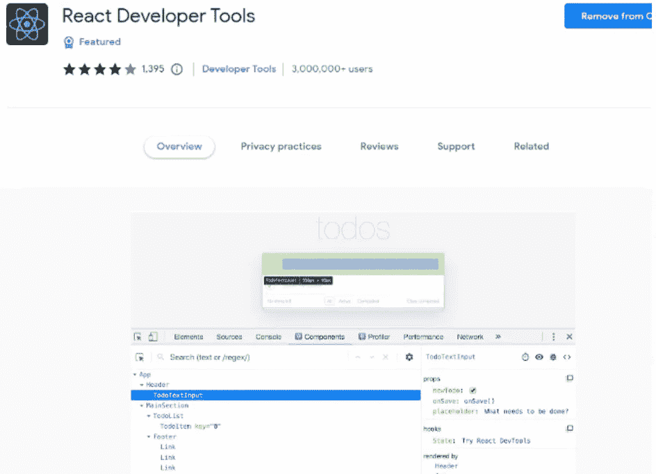

图片由作者从 React dev 工具获取。

几乎所有的 React 开发者都使用这个扩展，它拥有超过 300 万用户。

# 11.织布机

当谈到工作或团队协作的视频聊天时， [Loom](https://chrome.google.com/webstore/detail/loom-%E2%80%93-screen-recorder-sc/liecbddmkiiihnedobmlmillhodjkdmb?utm_source=chrome-ntp-icon) 是一个真正有益的 Chrome 扩展。它使快速传达信息和简单利用视频的力量变得简单。

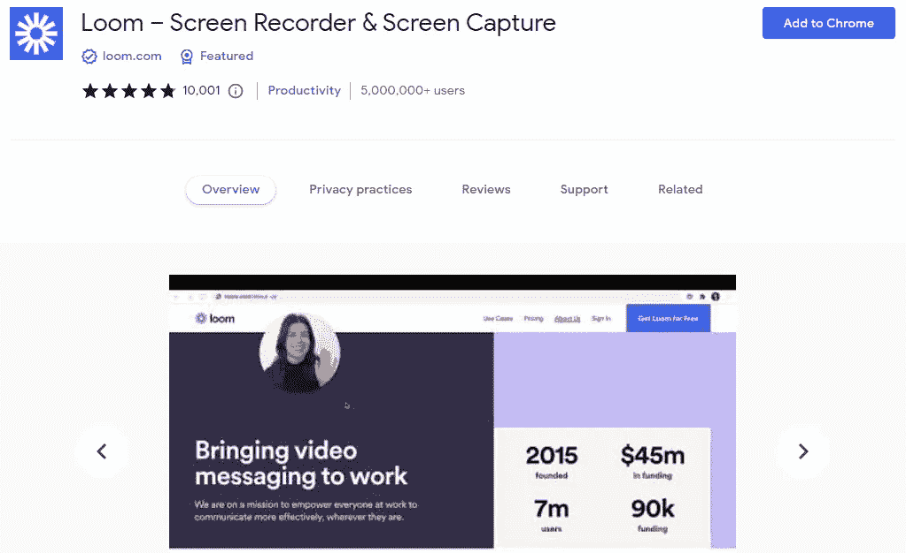

图片由作者从 Chrome 网上商店获取。

Loom 可以让你记录你的屏幕、声音和面部表情，从而在比发送一封电子邮件更短的时间内制作一个可共享的视频。这将有助于减少来回打字，并让你的观点通过第一次。

该扩展拥有超过 500 万用户，获得了非常好的 5 星评级。

# 12.动力

Momentum 是另一个有用的扩展，可以帮助你提高开发人员的生产力。它允许你用一个可定制的仪表板来取代新的标签页，仪表板包括待办事项列表、天气预报和励志名言。

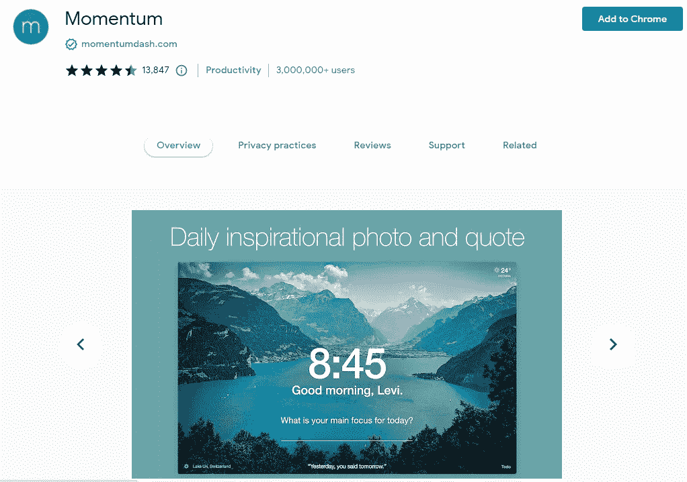

作者从 Chrome 网上商店获取的图片。

新的标签页既能让你平静下来，又能激励你更有效率。它通过每天的照片和报价来帮助你变得有动力，设定每天的焦点，并跟踪你的待办事项。

通过在每个新标签上提醒你一天的目标，这种扩展避免了分心，并有助于对抗拖延。

# 13.响应观众

[响应式查看器](https://chrome.google.com/webstore/detail/responsive-viewer/inmopeiepgfljkpkidclfgbgbmfcennb?hl=en)是一个惊人的扩展，让您能够在一个视图中显示和查看多个屏幕。对于 web 开发人员或任何处理响应式 web 设计的人来说，这是一个很好的扩展。

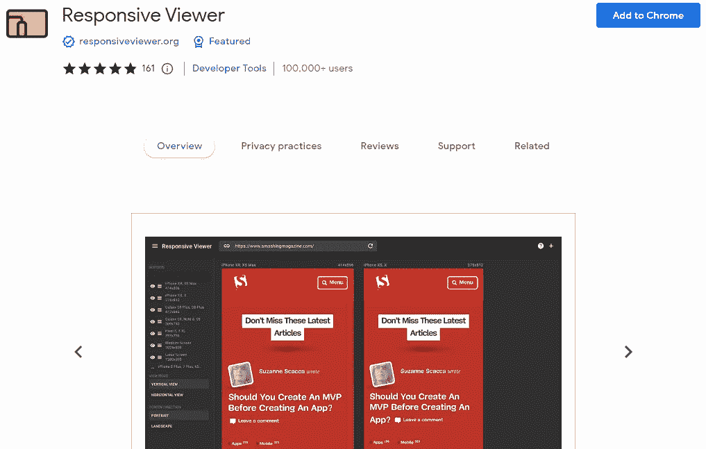

图片由作者从 Chrome 网上商店获取。

因此，该扩展将帮助您测试您的网站或 web 应用程序的响应能力。

# 14.页面标尺

如果你想测量网页上的元素和距离，[页面标尺](https://chrome.google.com/webstore/detail/page-ruler/jcbmcnpepaddcedmjdcmhbekjhbfnlff?hl=en)将是一个有用的扩展。它允许你用一把简单的尺子很容易地测量像素(px)的页面元素。

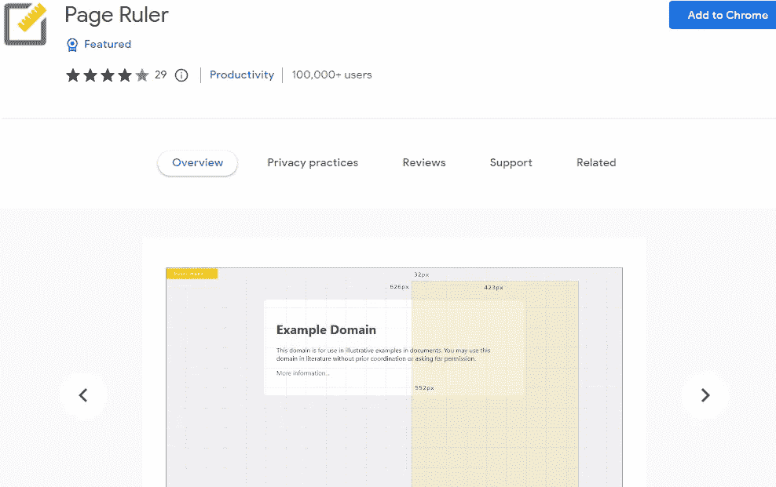

作者从 Chrome 网上商店获取的图片。

当您在页面上移动鼠标时，扩展会绘制一个矩形标尺。标尺的宽度、高度、起点和终点都标有匹配的像素度量。

当您移动光标时，矩形会发生变化，所有数字和度量都会更新。

# 15.语法上

我想我们都知道语法上的，但并不是所有人都使用它。如果你想在网上写作而没有语法错误，这个扩展非常有用。

作者从[抓取的图片语法上](https://app.grammarly.com/)(媒体外的外链)。

作为一名开发人员，我认为你必须使用语法，因为无论你是想写一封专业邮件还是一份简历，你总是需要避免语法错误。

幸运的是，语法检查您所有的语法错误，并帮助您只需点击一下鼠标就可以纠正它们。

# 结论

正如你在这个列表中看到的，这些是一些有用的 Chrome 扩展，你可以作为开发者使用。这些工具可以让你的生活变得更轻松，提高你的工作效率，同时在项目工作中节省时间。

*感谢您阅读本文。此外，如果您发现我的内容有用，并且您不是媒体会员，您可以在此处获取您的媒体会员资格***(媒体推荐链接)以无限制地访问媒体上的所有文章，并支持我们作为作者。**

* [## 通过我的推荐链接加入 Medium-Mehdi Aoussiad

### 阅读 Mehdi Aoussiad(以及媒体上成千上万的其他作家)的每一个故事。您的会员费直接支持…

mehdiouss.medium.com](https://mehdiouss.medium.com/membership) 

**延伸阅读:**

 [## 你可能不知道的 10 个强大的 CSS 属性

### 2022 年，作为一名 web 开发人员，你应该知道的有帮助的 CSS 属性列表。

blog.devgenius.io](/10-powerful-css-properties-that-you-probably-dont-know-1c0c3c2d9406)  [## 每个前端开发者应该在 2022 年建设的 5 个令人敬畏的项目

### 前端开发人员提高技能的有用项目思路列表。

blog.devgenius.io](/5-awesome-projects-every-frontend-developer-should-build-in-2022-fbe2575f88aa)*