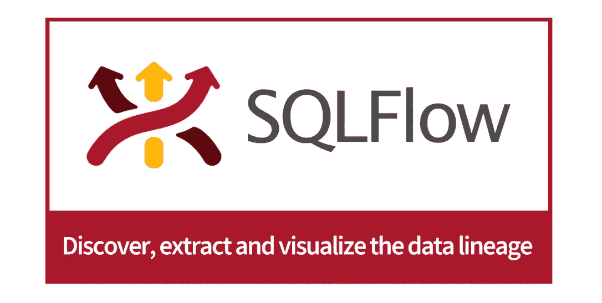

# 15 款最佳数据传承工具 2022 |回顾与比较

> 原文：<https://blog.devgenius.io/15-best-data-lineage-tools-2022-reviews-comparison-9fc5fe690f2d?source=collection_archive---------2----------------------->

如今，数据分析在任何组织中都非常重要，因此我们建议使用 [**数据沿袭工具**](https://www.gudusoft.com/) 。什么是数据沿袭工具？它们是软件系统，帮助公司和 [**数据分析师**](https://www.gudusoft.com/data-analysts-skills/) 了解他们的数据来自哪里以及如何演变。如果您正在为您的公司寻找数据沿袭工具，那么您来对地方了。在本文中，我们将介绍 2022 年市场上可以找到的 **15 种最佳数据沿袭工具。**

# 最佳数据沿袭工具— 1。古杜 SQLFlow

Gudu SQLFlow 凭借其出色的性能在我们的榜单中名列第一。

**下面是 Gudu SQLFlow 的亮点:**

*   提供整体数据流的可视化表示；
*   通过解析 SQL 脚本和存储过程，跨数据库、ETL、商业智能、云和 Hadoop 环境进行自动化 SQL 数据沿袭分析；
*   以图形方式描述所有数据移动；
*   支持 20 多个主要数据库，并且仍在增长；
*   无论 SQL 驻留在哪里，都提供构建谱系的自动化:数据库、文件系统、Github、Bitbucket 等等。；
*   以用户友好、清晰易懂的方式显示数据流。全面了解您的商务智能环境。
*   发现报告错误的根本原因，创造无价的商业信心。
*   简化法规遵从性。 [**数据谱系的可视化**](https://en.wikipedia.org/wiki/Data_lineage) 提供了更大的透明度和审计能力。
*   支持粒度级别的影响分析，深入到表、列和查询级别的沿袭。

# 最佳数据沿袭工具— 2。椭圆形边缘

OvalEdge 在我们的榜单上名列第二。作为数据治理和数据目录工具集，OvalEdge 可用于理解、查找、治理和规范化数据。此外，它可以帮助你以最好的方式提供见解。每个人都可以使用 OvalEdge，包括新手和专业人士。该软件通过搜索您的系统数据库来收集所有可用的数据以创建目录。它将所有这些数据编入索引，并绘制出显示完整数据周期的谱系图。

此外，数据是有组织的，以便您可以轻松地访问每个数据，并获得数据的摘要，以便于理解。此外，您可以使用标签、用户名和其他标签来个性化数据。在 OvalEdge 的帮助下，数据科学家和分析师可以轻松协作。它还可以与不同的数据管理平台、商业智能和分析平台合作，其中包括亚马逊 S3、Salesforce、MySQL、MongoDB 等。最后但同样重要的是，该软件可以通过网络使用，因为它是基于云的，或者安装在 Windows 和 Linux 计算机上。

# 最佳数据沿袭工具— 3。奥克托派

Octopai 也应该在我们的名单中占有一席之地。这是一个数据沿袭自动化软件平台，具有帮助您查找和理解数据的功能，是一个非常快速的数据沿袭工具，易于使用。因为 Octopai 是完全基于云的，所以不需要任何安装。该软件被一些顶级公司使用，包括第一州际银行、QuoteWizard、CooperVision 等。

Octopai 拥有包括数据分析师、 [**数据科学家、**](https://www.gudusoft.com/data-scientists/) 、BI 管理者、BI 开发者、 [**数据工程师、**](https://www.gudusoft.com/data-engineers/) 和数据架构师在内的广泛用户。事实上，Octopai 是一个智能元数据管理工具，它允许用户轻松快速地识别来自不同系统的元数据，并获得 360 度的数据之旅视图，通过简单的搜索，您可以轻松找到任何报告或参考资料。

Octopai 是一款自动化软件，有助于消除手动数据映射。完全基于云使得系统之间的迁移变得容易。此外，该软件兼容微软的 Power BI，因此您可以将商业智能数据从 Octopai 无缝迁移到 Power BI。

# 最佳数据沿袭工具— 4。科里布拉

Collibra 是我们列表中应该提到的另一个数据沿袭工具。作为一个数据智能云工具，Collibra 用于发现任何组织中的可信数据。数据血统只是 Collibra 产品的特性之一，Adobe、Honeywell、T-Mobile、SouthWest 等知名公司也在使用。

Collibra 数据沿袭工具自动从系统中提取沿袭数据，仅收集重要数据以释放资源并保持沿袭最新。提取之后，获得了具有业务友好可视化的详细技术谱系。

在这个工具的帮助下，可以通过表格、业务报告或列来进行影响分析。同时，Collibra 确保数据符合不同的法规，如 GDPR、CCPA 和 BCBS239。特别是，Collibra 数据沿袭工具与 Google Cloud、AWS、Microsoft、Databricks、Snowflake 和 Tableau 兼容。

这是一个云工具，但用户可以在 Windows 和 MAC 电脑、ipads 和 iphones 上安装 Collibra。对于云，用户可以直接从网络或 SaaS 使用它。

# 最佳数据沿袭工具— 5。CloverDX

**CloverDX** 是另一个流行的数据沿袭工具，旨在帮助解决数据挑战。值得注意的是，这个工具非常适合企业数据管理。

此外，CloverDX 具有开发人员友好的可视化设计器，非常适合数据新手，因为它使整个数据设计过程看起来不复杂，是数据迁移的理想工具，因为可重复的任务可以自动化，所以它们总是按时完成。

数据沿袭工具清理数据并帮助修复任何错误，因此它不会影响一致性，也可以在云、Windows 和 Mac 上使用。

# 最佳数据沿袭工具— 6。数据梅尔

Datameer 为所有行业提供数据和分析解决方案，是许多个人和企业的数据沿袭工具的选择之一，易于使用，并得到其团队的良好支持。该平台有两个主要产品，Datameer Spotlight 和 Datameer Spectrum，它们都提供数据工程解决方案。

在 Datameer 产品的帮助下，用户可以使用工具来发现、访问、建模和交付数据，以及帮助数据专家相互协作的协作功能。此外，使用 Datameer 建模和构建数据管道不需要编码，这是一个完整的可视化过程，具有可信的效率。

此外，使用类似谷歌的搜索引擎，用户可以很容易地找到他们需要的工具和数据。Datameer 工具也可以用于其他云解决方案，包括微软 Azure、亚马逊 AWS 和谷歌云。该工具集成的其他平台包括 Oracle、Qlik、Teradata、雪花等。

# 最佳数据沿袭工具— 7。Trifacta

Trifacta 是 2012 年推出的一款数据整理软件。该工具使数据专业人员能够轻松地将人工智能和人类智能结合起来，以访问、转换和自动化数据管道。作为一个众所周知的工具，它被 10，000 多家公司使用。通过提供可视化和可扩展的数据转换解决方案，Trifacta 帮助用户加速数据转换。可视化配置文件是相对交互式的，允许用户选择他们想要使用的特定元素和他们的翻译建议。

该工具允许用户无缝识别错误和异常值并进行纠正，从而确保数据质量。此外，由于 Trifacta，数据管道可以在几分钟内实现自动化。该工具支持几乎所有可用的云和开放 API，包括 SQL、Python、Spark 和 DBT 等系统。Trifacta 仅在云中可用，兼容亚马逊 AWS、微软 Azure、谷歌云、雪花和 Databricks。

# 最佳数据沿袭工具— 8。阿特朗

Atlan 是一个现代化的数据工作空间，用于数据沿袭、目录、质量和探索，是为非技术用户开发的，具有开放的 API 架构，可以快速部署。有了 Atlan，所有的数据资产都可以在强大的搜索算法的帮助下快速发现。此外，该软件的界面直观且相对易于导航，便于发现情报报告和数据表等资产。

数据谱系的自动执行器是 Atlan 机器人，它浏览 SQL 查询历史来创建数据谱系，并发现和分类 PII 数据。通过使用标签、元数据和其他类别，用户可以对数据进行分组。此外，用户可以控制单个用户、团队和组的访问级别。Atlan 兼容多个第三方平台，最著名的是雪花、亚马逊 S3、亚马逊红移、Azure、谷歌云、MySQL、Tableau、Power BI 等等。

# 最佳数据沿袭工具— 9。Alation

Alation 于 2012 年作为数据智能软件推出，由人工智能驱动，有助于数据发现、数据传承和治理、分析和转换。该软件可以与 Alation 云服务结合使用，以加快交付速度。凭借先进的行为分析引擎，Alation 可以找到最具洞察力的见解。由于导航的引导，任何人都可以无缝地使用该软件。对于数据沿袭，该软件有一个智能管理仪表板，遵循以人为中心的方法，并自动化编目、数据分类和管理。

用户可以通过分析报告详细了解数据更改的影响，这有助于他们管理风险。因为软件鼓励协作，用户可以很容易地与他人交流。此外，软件自动提供质量标志、警告等，帮助用户做出最佳决策。该软件集成了诸如 Einstein Analytics、Manta、Tableau、Kyle、Trifacta 等平台，并受到百事可乐、摩托罗拉和 ComED 等顶级机构的欢迎。

# 最佳数据沿袭工具——10。德雷米奥

作为一个数据解放的软件平台，Dremio 可用于迁移数据仓库工作负载，从本地迁移到云，从数据仓库迁移等等。作为 swift 软件，Dremio 有助于消除数据传输瓶颈，并允许用户在不同应用程序之间轻松传输大数据。该软件与 Apache Arrow 协同工作来提供这种速度。因此，数据传输的速度可以提高 1000 倍。

通过使用 Dremio，用户可以使用最好的架构来构建更好的数据血统。并且它与任何计算引擎兼容。借助云数据湖，用户可以使用 Dremio 实现数据分析的现代化，但不会影响他们的工作负载。此外，应该注意的是，它消除了企业在现代化过程中面临的两个主要问题，即分割和重建数据管道。用户可以连接到 Azure、AWS、Preset、Tableau、Qlik、DellEMC、Looker 和其他一些应用程序

# 最佳数据沿袭工具— 11。凯洛

Kylo 是 Teradata 推出的知名软件，用于构建具有五个关键功能的数据管道，包括摄取、准备、发现、监控和设计数据，适用于数据湖平台。Kylo 是开源软件，这使它成为程序员的一个优势，具有元数据管理、数据治理和数据安全特性。通过简单的向导式用户界面(UI)无缝接收数据，该软件具有管道模板机制，允许它连接到任何数据源、数据格式，并将数据部署到任何目标。

Kylo 还提供了准备数据的转换特性，并使用 Apache Spark，这是一个用于数据探索的集成元数据库，一个类似 Google 的搜索系统，以及一种监视提要的现代方法。沿袭过程是可视化的，因此对于非技术用户来说很容易，但是数据分析是自动化的。使用 Apache NiFi，用户可以开发新的管道模板来扩展 Kylo 的功能，两个平台可以无缝集成。

# 最佳数据沿袭工具— 12。托肯

另一个伟大的开源数据血统软件应该在我们的列表中占有一席之地。令牌可用于收集、组织和分析数据湖的元数据。它使用简单，既可以用作元数据信息的连续集合，也可以用作快速执行任务的命令行应用程序。它通常由数据管理员、工程师和分析师使用。

令牌收集所有数据，并将其传送到一个集中的数据目录。因此，用户可以在一个地方管理所有数据集和元数据。通过使用特色 API 编程或简单地使用可用的交互式图表，用户可以创建数据谱系。该软件扫描用户的整个基础设施，以跟踪数据血统。对于数据沿袭，Tokenn 兼容雪花、AWS 红移和 BigQuery。该软件与这些平台无缝集成，用户可以使用 ETL 脚本或查询历史来开始构建过程。用户还可以轻松地将 Tokenn 部署到 GCP、AWS 和其他云平台。

Tokern 还跟踪 PHI、PII 和其他关键数据。此外，还有数据字典来帮助用户管理正确的数据资产。

# 最佳数据沿袭工具— 13。SentryOne 文档

SentryOne 介绍了一种使用文档软件生成数据谱系的简单方法。该软件可以从多个来源生成数据谱系，以提供数据源的全面详细信息以及如何随着时间的推移进行处理。SentryOne 文档可以从多个平台提取数据，包括 SQL Server、Power BI、Azure、SSAS、SSIS、Excel 等。因为这个过程是可视化的，所以很容易监控沿袭中的数据依赖关系。使用这个数据沿袭工具可以轻松管理数据文档任务。此外，它可以用于云中或作为桌面软件。

使用云软件创建数据谱系非常快，而且由于平台托管在云上，用户需要管理的内容更少。此外，用户可以从任何设备轻松访问您的数据和任务。桌面软件为用户提供了更多的管理选项，并且高度可配置。

# 最佳数据沿袭工具— 14。Axon 数据治理

作为 Informatica 产品，Axon 数据治理的主要用途是数据治理和数据沿袭。该软件旨在帮助企业提供可信的数据。它使用人工智能驱动的自动化系统来简化数据发现、共享和质量评估。借助 Axon 数据治理工具，用户可以访问经过整理的数据市场，在那里他们可以轻松找到所需的正确数据。此外，用户可以使用该工具创建数据字典。

使用 Axon 数据治理工具可以可视化数据谱系。该软件根据用户数据字典中的定义自动监控和测量数据质量。如果用户担心安全性，他们可以依靠软件的风险和变更影响评估来确保数据隐私。

# 最佳数据沿袭工具— 15。真实数据

由 Bluetab Solutions 及其开源软件开发的 Truedat 使用户能够将数据转化为有价值的商业资产。它适用于云接收、数据湖治理、数据质量等。使用 Truedat 的一些顶级组织包括 LaLiga、Telcel、BMN、Naturgy 和 Bankia。Truedat 为端到端的数据治理提供了一个解决方案，涉及数据沿袭和数据质量。此外，用户可以从技术视图切换到简单的业务视图，因此该软件是新手和专家的理想选择。

Truedat 集成了其他第三方工具，特别是 MicroStrategy、Google BigQuery、Microsoft Azure、Oracle、Hive、Power BI、Amazon Redshift、S3 等等。

# 结论

感谢你阅读我的文章，如果你喜欢，我会很高兴。然而，由于网上可以找到数百种数据沿袭工具，如果我的列表中没有包括您的最爱，请原谅。欢迎在下面留下评论，让我知道你最喜欢哪个数据沿袭工具，我会很快更新这个**最佳数据沿袭工具**列表！再次感谢！