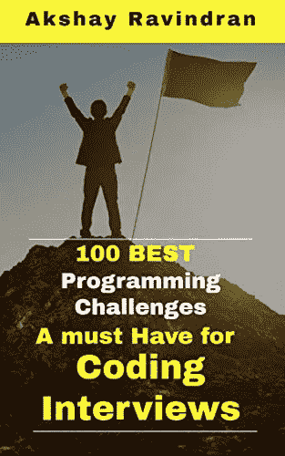

# FAANG 访谈 15+二叉树编码问题

> 原文：<https://blog.devgenius.io/15-binary-tree-coding-problems-from-faang-interview-2ba1ec67d077?source=collection_archive---------6----------------------->

图片由 [Omni Matryx](https://pixabay.com/users/Matryx-15948447/?utm_source=link-attribution&utm_medium=referral&utm_campaign=image&utm_content=5030250) 来自 [Pixabay](https://pixabay.com/?utm_source=link-attribution&utm_medium=referral&utm_campaign=image&utm_content=5030250)

> 二叉树是一种分层的数据结构。根据您在树中存储节点的方式，术语会有所不同。

出于免费的故事。下面是我的 [**好友链接**](https://medium.com/dev-genius/15-binary-tree-coding-problems-from-faang-interview-2ba1ec67d077?source=friends_link&sk=c2aa9497033c82027751c624d19051a3)

嘿，伙计们，我已经分享了很多关于在 [FAANG](https://medium.com/javarevisited/100-days-to-amazon-day-1-b9e07228f079) 中问的技术面试问题，我目前正在研究在 [LinkedIn、雅虎和甲骨文中问的技术面试问题。我一直在研究这些“面试问题”。说到二叉树问题，大部分都是可以解决的，如果你在某类问题上有很强的基础。](https://medium.com/javarevisited/100-days-to-linkedin-challenge-10d84a92b63f?source=your_stories_page---------------------------)

这篇文章是关于让你在解决二叉树问题的基础逻辑中变得强大。

这样当你在面试中遇到一个二叉树问题时，你就知道该用哪种逻辑以及如何解决这个问题了！

Kindle 阅读器免费

如果你在准备面试。即使你已经在工作中安顿下来，让自己了解最新的 [**面试问题**](https://codeburst.io/100-coding-interview-questions-for-programmers-b1cf74885fb7) 对你的**职业** **成长**来说是必不可少的。从这里的**开始你的**准备**！**

# 来自编程访谈的 15+二叉树编码问题

1.  **最低级的共同祖先是什么？如何找到两个给定节点的最低共同祖先？** [**解**](https://medium.com/@akshay_ravindran/day-92-lowest-common-ancestor-f83936e7a558?source=your_stories_page---------------------------)
2.  **如何找出给定的树是否是另一棵树的子树？** [**解**](https://medium.com/@akshay_ravindran/day-45-subtree-of-another-tree-b790a93afd07?source=your_stories_page---------------------------)
3.  **如何迭代遍历二叉树？** [**解**](https://medium.com/javarevisited/the-ultimate-guide-to-binary-trees-47112269e6fc)
4.  **什么是广度优先遍历？如何实施？** [**解**](https://medium.com/@akshay_ravindran/day-34-binary-tree-level-order-traversal-c1587bfdb251?source=your_stories_page---------------------------)
5.  **如何求出一棵树的直径？** [**解**](https://medium.com/@akshay_ravindran/100-days-challenge-to-cracking-the-coding-interview-f0a2b81db6a6?source=your_stories_page---------------------------)
6.  如何以之字形方式遍历树？ [**解**](https://medium.com/@akshay_ravindran/day-49-binary-tree-zig-zag-traversal-d07e769805d7?source=your_stories_page---------------------------)
7.  **什么是深度优先遍历？如何实施？** [**解**](https://medium.com/javarevisited/the-ultimate-guide-to-binary-trees-47112269e6fc?source=your_stories_page---------------------------)
8.  **如何打印二叉树的右侧视图？** [**解**](https://medium.com/@akshay_ravindran/day-41-right-side-view-of-binary-tree-c352cda1e8ec?source=your_stories_page---------------------------)
9.  **如何从前序遍历构造 BST？** [**解决**](https://medium.com/@akshay_ravindran/day-97-construct-bst-from-preorder-847f8e9074e5?source=your_stories_page---------------------------)
10.  **如何找出给定的两棵树是否互为镜像？** [**解决方案**](https://medium.com/javarevisited/the-ultimate-guide-to-binary-trees-47112269e6fc?source=your_stories_page---------------------------)
11.  **如何求二叉树中最深叶子的和？** [**解决方案**](https://medium.com/@akshay_ravindran/day-50-deepest-leaves-sum-b9cfb058c226?source=your_stories_page---------------------------)
12.  **如何将二叉树捕获到 2D 数组中？** [**解**](https://medium.com/@akshay_ravindran/day-38-print-binary-tree-e73bd7487899?source=your_stories_page---------------------------)
13.  **如何合并两个二叉树？** [**解**](https://medium.com/@akshay_ravindran/day-36-merge-binary-tree-8f1b228322ab?source=your_stories_page---------------------------)
14.  **如何发现 BST 中的一对节点是否等于一个目标？** [**解**](https://medium.com/@akshay_ravindran/day-29-2sum-input-is-a-bst-909ddfde6eb9?source=your_stories_page---------------------------)
15.  **如何求给定 BST 中两个节点间的最小距离？** [**解**](https://medium.com/@akshay_ravindran/100-days-challenge-to-cracking-the-coding-interview-d898f972f4b1)

这些是编程工作面试中最常见的基于二叉树的问题。你可以通过解决它们来适应基于树的问题。

## 更进一步

这些是二叉树数据结构形式编码面试中最常见的问题，可以帮助你在面试中做得更好。

我在我的[博客](https://medium.com/@akshay_ravindran)上也分享了很多在 FAANG 问的[编码面试问题](https://medium.com/javarevisited/100-days-to-amazon-day-1-b9e07228f079)，如果你真的感兴趣，可以随时去那里通读。

这些挑战将提高你的动态规划、回溯、贪婪方法、排序和搜索技术，帮助你在技术面试中取得好成绩。

对这些不同的算法和背后的时间和空间复杂性的良好知识是每个面试的必备知识。最关注这个。

## 进一步阅读

[4 个极其有用的面试链表小技巧](https://medium.com/javarevisited/4-incredibly-useful-linked-list-tips-for-interview-79d80a29f8fc?source=your_stories_page---------------------------)
[亚马逊 SDE 25 大面试问题](https://medium.com/javarevisited/top-25-amazon-sde-interview-questions-cfe0ef70ba9e?source=your_stories_page---------------------------)
[你以为你真的了解斐波那契数列吗？](https://medium.com/javarevisited/are-you-making-these-fibonacci-number-mistakes-5e3cbedd367e?source=your_stories_page---------------------------)
[用 C 编程解决 9 个最佳字符串问题](https://medium.com/@akshay_ravindran/9-best-strings-problem-solved-using-c-5e2a1d373fc2?source=your_stories_page---------------------------)
[一个人不能简单解决 50 个黑客等级挑战](https://medium.com/javarevisited/top-50-coding-challenges-in-hacker-rank-3d79c181528?source=your_stories_page---------------------------)

## 线的尽头

你现在已经到了这篇文章的结尾。谢谢你阅读它。祝你编程面试好运！

如果你在面试中遇到这些问题。请在下面的评论区分享它。我会很高兴读到它们。

在你离开之前:

> *想成为 java 编程中的佼佼者？*

Kindle 阅读器免费。

已经解决的 **100 个 Java(面试)编程问题**汇编。**(黑客排名)🐱‍💻这是完全免费的🆓如果你订阅了亚马逊 kindle。**

如果你喜欢这篇文章，那么请分享给你的朋友和同事，别忘了在 Twitter 上关注 [**众议院的**](https://twitter.com/codes_of) ！

作者:[阿克谢·拉文德兰](https://www.linkedin.com/in/akshay-ravindran-096)