# 我想你会喜欢的 15 个很酷的 VSCode 主题

> 原文：<https://blog.devgenius.io/15-cool-vscode-themes-i-think-you-would-like-c6d0bbbfa7c4?source=collection_archive---------7----------------------->

让 IDE 重新变漂亮

穆罕默德·拉赫马尼在 [Unsplash](https://unsplash.com?utm_source=medium&utm_medium=referral) 上的照片

在我的上一篇文章 [6 VS 代码生活质量扩展](/6-vs-code-quality-of-life-extensions-acbfd1425561)中，我简要地谈到了正确的 VS Code 主题如何让你的开发过程更加愉快。这就是为什么我编译了 15 个 VSCode 主题，我想你会喜欢的

# 1)一个深色专业版

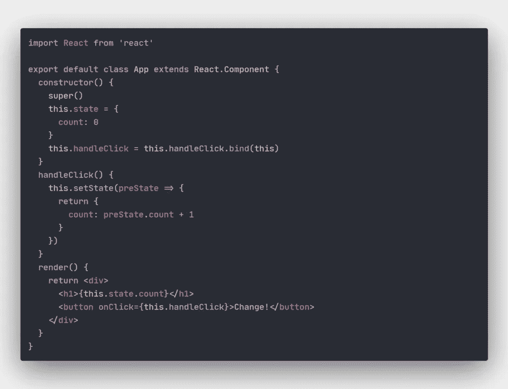

# 2)德古拉官方

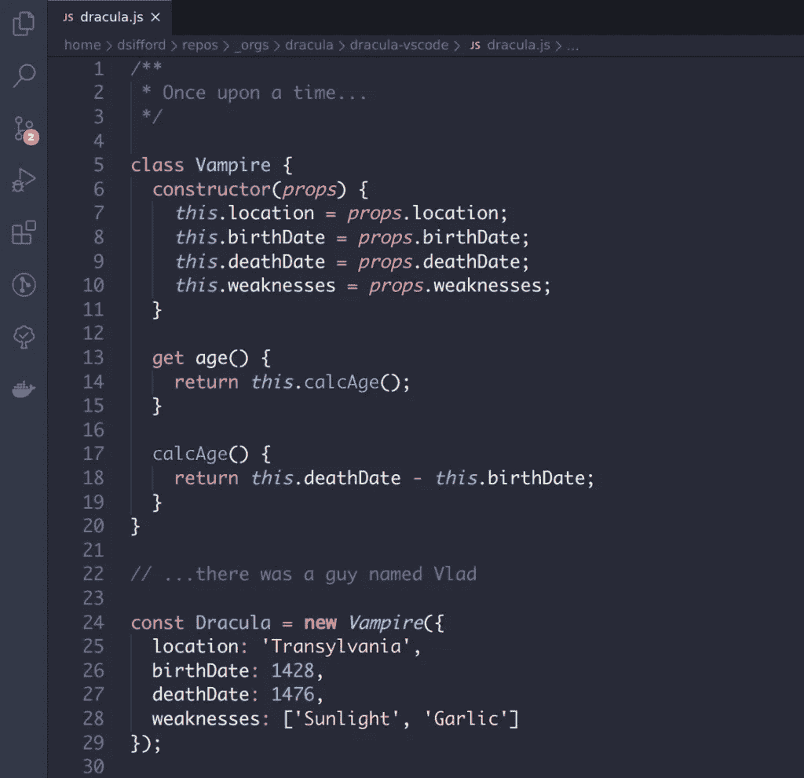

# 3)阿玉

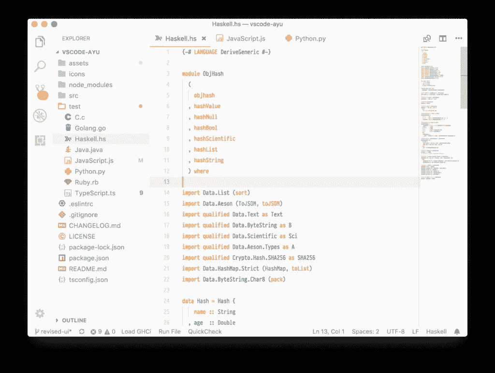

# 4)黑夜

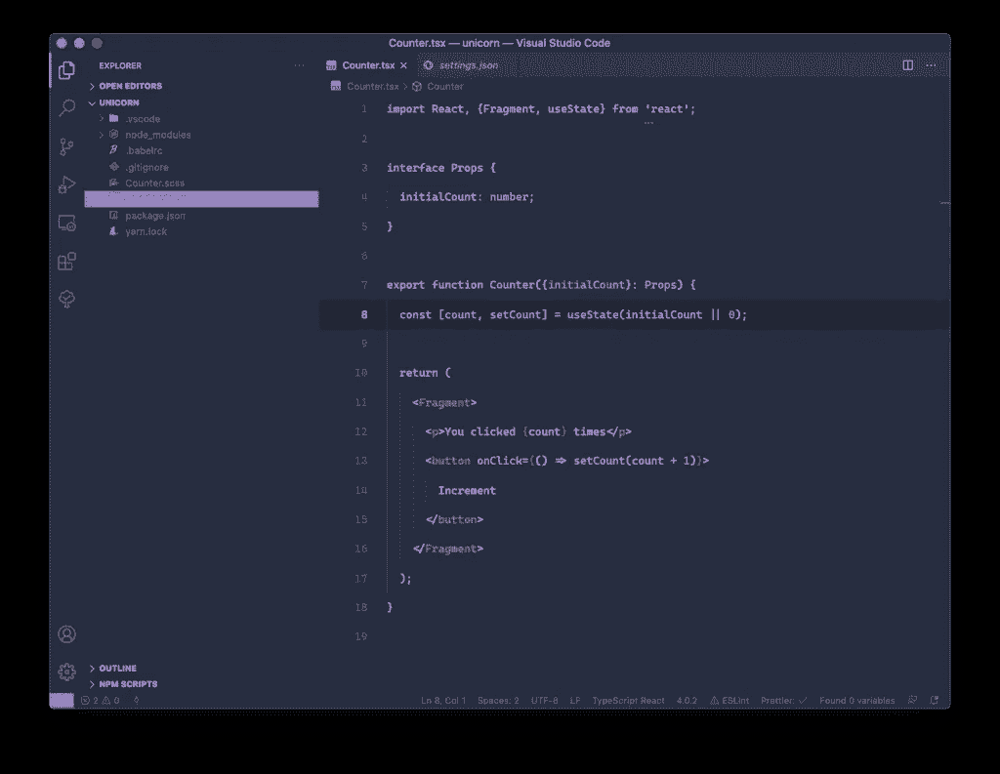

# 5)原子一

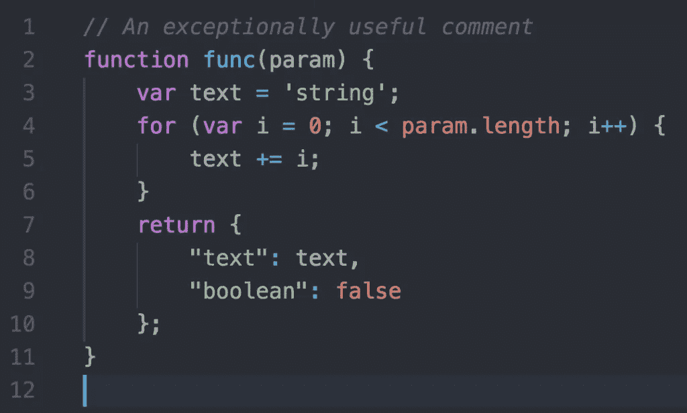

# 6)东京夜

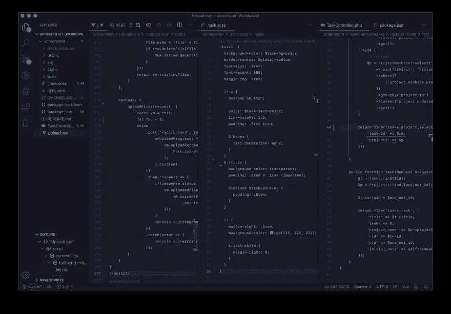

# 7)太空灰

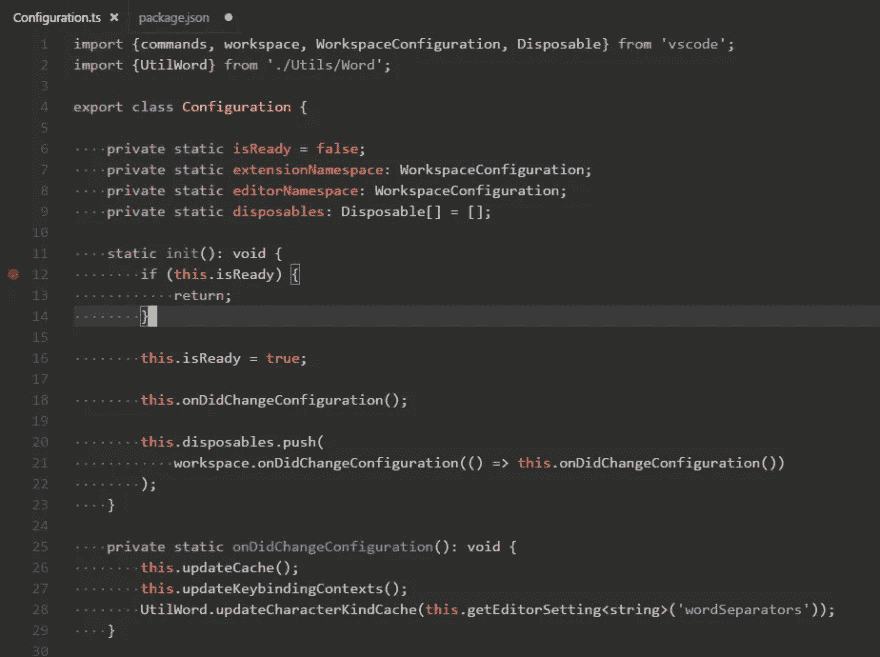

# 8)达尔库拉

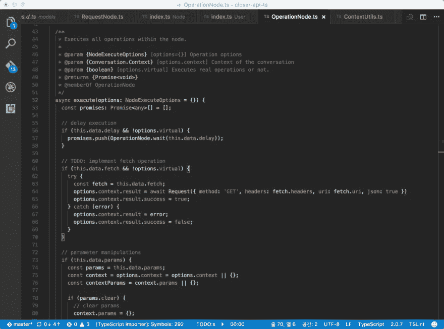

# 9)蓝色代码

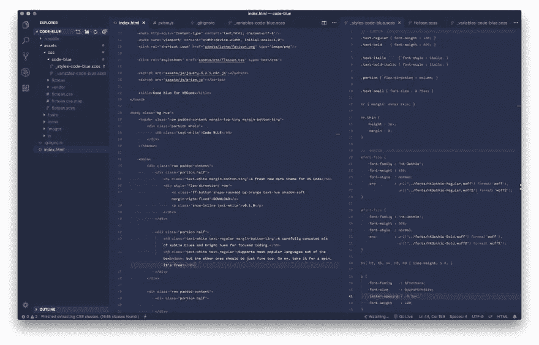

# 10) Github Plus

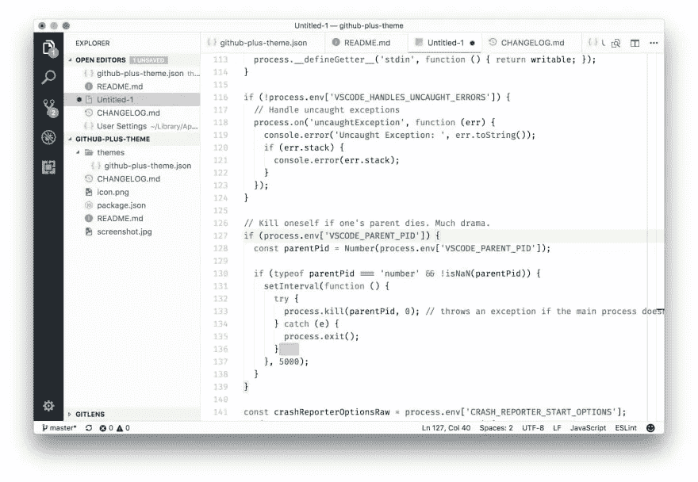

# 11) Monokai Pro

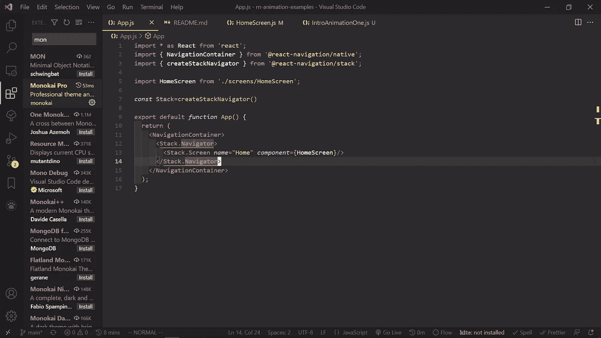

# 12)材料主题

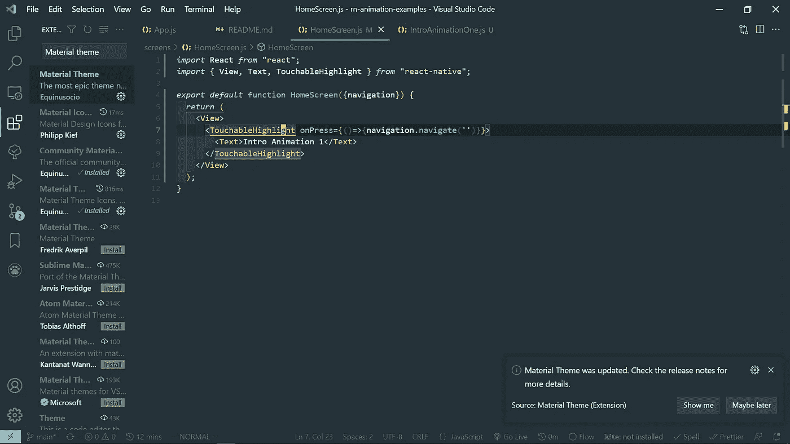

# 夜猫子

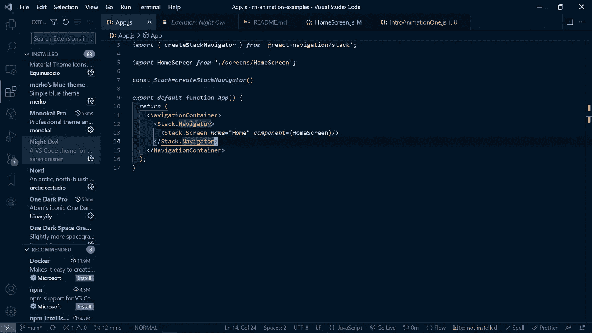

# 14)草莓主题

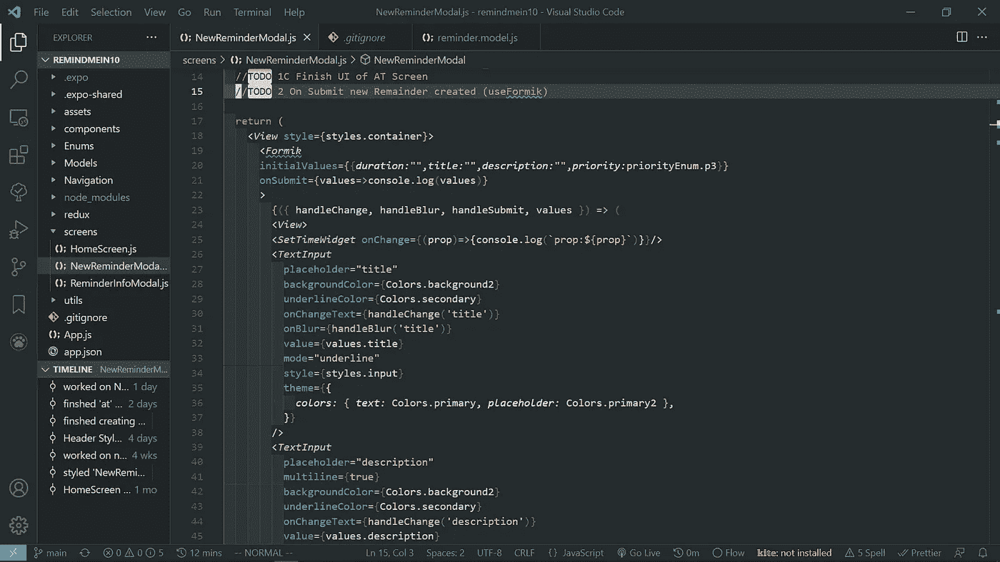

# 15)东京之夜

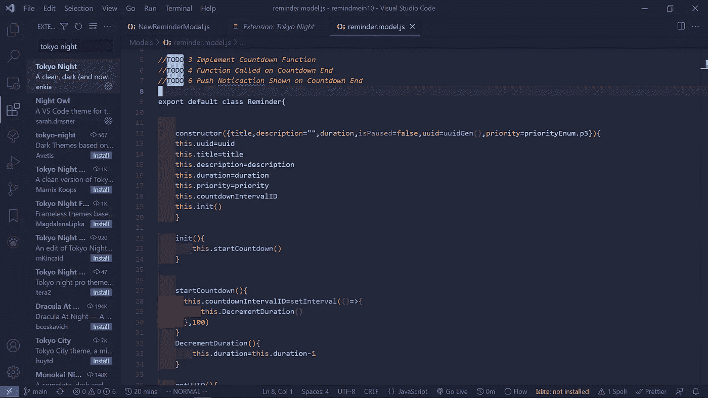

# 结论

感谢您阅读完我关于**‘15 个很酷的 VSCode 主题的文章，我想您会喜欢**。我希望你有美好的一天。

如果你是中级新手，你可以点击[这里的](https://bookeraziz.medium.com/membership)链接加入

以下是我的进一步解读:

 [## 如何使用 Moment.js 创建数字时钟

### 仅使用普通 JavaScript 和 Moment.js 库在浏览器中创建时钟的指南。

javascript.plainenglish.io](https://javascript.plainenglish.io/how-to-create-a-digital-clock-using-moment-js-8cd40c7b0899)  [## 你绝对需要了解的 8 个 React 原生库

### 当谈到使用 React Native 创建应用程序时，找到正确的库可以使开发过程变得更加…

javascript.plainenglish.io](https://javascript.plainenglish.io/8-react-native-libraries-you-absolutely-need-to-know-about-28f6038d0b76) 

*更多内容尽在*[*blog . dev genius . io*](http://blog.devgenius.io)*。*