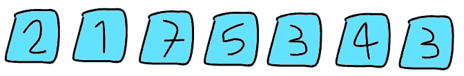
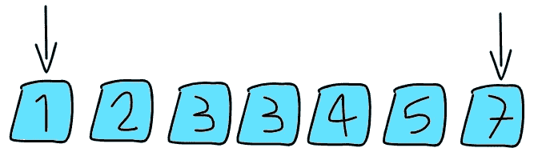
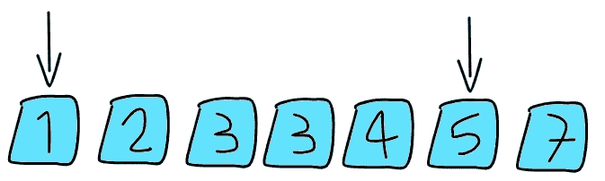
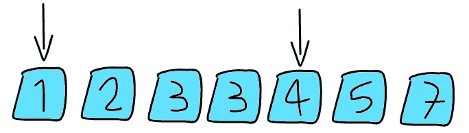
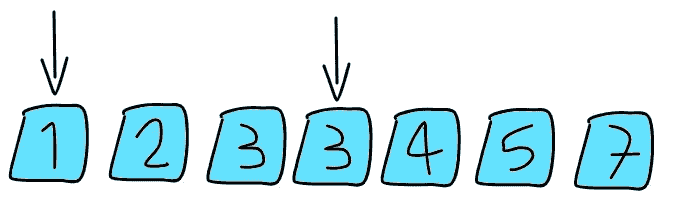
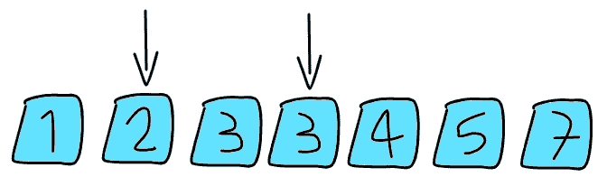
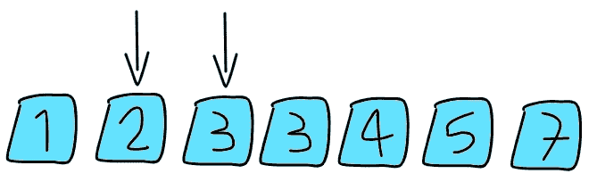
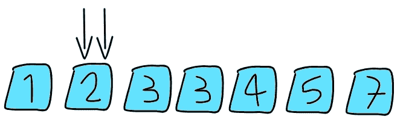

# 一周的 LeetCode(第 2/7 天)

> 原文：<https://blog.devgenius.io/15-days-of-leetcode-ace-that-coding-interview-day-2-15-fc47b4c8996?source=collection_archive---------1----------------------->


克里斯托夫·高尔在 [Unsplash](https://unsplash.com?utm_source=medium&utm_medium=referral) 上拍摄的照片

我很高兴在 Leetcode 系列的**周再次见到你，该系列经过精心设计，旨在帮助你**在编码面试过程中脱颖而出**，通过提供涵盖各种主题的 7 个算法任务的逐步分析，并激发在不同技术面试中经常出现的**批判性思维**策略。**

编码面试是在科技行业找工作的必要条件，也是 FAANG 的必备条件，所以准备好赢得编码面试吧。

准备好迎接今天的挑战了吗？让我们开始吧！

第二天:[3 总和](https://leetcode.com/problems/3sum/)

我假设你没有阅读任务描述，所以这里有一个摘要:

> 给定一个 n 个数字的序列 S，返回数字 S[i]，S[j]和 S[k]的所有唯一三元组，使得:
> 
> I、j 和 k 是不同的，S[i] + S[j] + S[k] = 0
> 
> 注:在本教程的其余部分，我将假设 WLOG，我< j < k, this assumption will make our life easier.

# First Approach: Brute-Force

You may be tempted to go for a bruteforce-ish solution, that is to try all triplets and return those that satisfy the criteria, but this is not efficient. Let’s do some [时间复杂度](https://en.wikipedia.org/wiki/Time_complexity)分析更多细节。

伪代码:

```
N = length of sequence S
result = []
for all i in [1,N] 
   for all j in [i+1,N]
      for all k in [j+1,N]
         if triplet(i,j,k) is good, then add it to result
```

我们有三个嵌套循环，这意味着我们的解是 O(N)，用 [big-O](https://en.wikipedia.org/wiki/Big_O_notation) 符号表示。

在我们的例子中，n ≤ 3000，所以 N 次太多了，我们需要做得更好。

> 提示:尽量把问题简化。让我们玩方程式看看。
> 
> s[i] + s[j] + s[k] = 0
> 
> 三个数加起来是 0，对吗？由此可见，它们中的任何两个都应该与第三个的负数相同(这样它们就能使总和相等)。
> 
> s[i] + s[j] = -s[k]
> 
> s[i] + s[k] = -s[j]
> 
> s[j] + s[k] = -s[i]

现在我们有一个稍微简单一点的问题，就是如果我们固定第一个元素 S[i]，条件是 S[j] + S[k] = C(记住 C = -S[i])有哪些对(S[j]，S[k])。

> 2-Sum 问题:
> 
> 我给你一个序列 A 和一个目标 t，你给我所有的数对(A[j]，A[k])，这样 A[j] + A[k] = t

但是我们如何解决这个问题呢？

让我提醒(或介绍)你两点技巧。


保罗·恩格尔在 [Unsplash](https://unsplash.com?utm_source=medium&utm_medium=referral) 上的照片

双指针技术是一种通过忽略不必要的计算来有效解决数组问题的方法。

它首先对序列进行排序，并定义两个指针(简单来说是 L 和 R)，最初 L 和 R 分别指向序列的第一个和最后一个数字。

左边的指针 L 只移动到右边，右边的指针 R 只移动到左边，以一种更可能给我们目标数 t 的方式。

一旦我们的两个指针相遇，这种搜索技术就结束了。到那时，它会找到所有的解决方案。

迷茫？让我们试一个例子。

看下面这个序列。



我们的目标是得到所有加起来等于 5 (t = 5)的配对

第一步:排序序列并定义两个指针。

## 第一次迭代 L = 1

算法知道，将总和减少到 5 的唯一方法是将 R 向左移动(因为 L 只向右移动，而将 L 向右移动会增加当前总和)。



L = 1，R = 7，sum = 8

因此，相反，它将右指针向左移动。



L = 1，R = 6，sum = 6

我们仍然需要减少总数。



L = 1，R = 5，sum = 5

酷，我们找到了一个加起来等于 5 的对，所以我们把它加到结果中，并继续移动右指针。



L = 1，R = 5，sum = 4

现在我们需要停下来想一想，我们现在的总和小于目标值 5，所以将右指针向左移动没有什么意义(因为它只会减少总和)，所以是时候移动左指针了。



L = 2，R = 4，sum = 5

同样，我们找到了一个解决方案，将其添加到我们的解决方案集，并移动您的右指针。



L = 2，R = 3，sum = 5

我们找到了另一个解，但它与我们之前的解(2，3)相同，实际上，对于固定的 L，我们所有的解都是相同的，所以我们不应该将它添加到我们的解集，因为我们正在寻找唯一的解。

好的，让我们再移动一下右边的指针。



L = 2，R = 2，你应该终止

现在两个指针相遇了，你已经找到了你所有的解决方案(仔细检查没有我们排除的可能的解决方案)。

持怀疑态度的读者可能会认为它仍然是 O(N ),因为我们有两个嵌套循环，令人惊讶的是，这竟然是 O(N ),但为什么呢？

注意，总体来说，左指针只向右移动，右指针只向左移动，是 2N 步那就是 O(N)，印象深刻！

伪代码的两个指针技术来寻找 t

```
t = targetN = length of sequence AL = 1
R = N
answer = []for all L in [1,N]
   while L < R and A[L] + A[R] > t
      decrease R by 1

   if L >= R
      terminate

   if A[L] + A[R] == t
      append the pair (A[L], A[R]) to the answer
      keep moving R to the left until A[L] + A[R] < t
```

回到我们最初的问题，我们现在已经找到了完整的解决方案。

伪码

```
answer = []
N = length of the sequence Sfor i in [1,N]
   run the 2-Sum algorithm on [i+1,N] 
    to find all pairs with sum -S[i] for all the pairs (j,k) found by the 2-Sum algorithm
      add the triplet (i,j,k) to the answer
```

总的复杂度是 O(N)

现在我们有了一个纸上的解决方案，让我们写一些代码吧！

我的 Python 实现:

我的 C++实现:

**我们如何应对今天的任务，以及如何应对其他挑战？**

*   考虑一个简单的解决方案，并在此基础上构建更智能的解决方案:我们从描述一个 O(N)解决方案开始，并不断改进它。
*   将你手中的问题分解成更小的子问题:这种技术非常有用，因为更小的问题往往有更简单、有时是众所周知的解决方案。
*   思考如何高效地解决更小的子问题，并将其组合成一个最终的快乐解决方案。
*   改变问题的设置，并做一些假设来帮助你更好地解释你面前的问题:注意，我们对原始数组进行了排序，以便运行两点算法，我们还假设(i < j < k) which changes nothing about the problem but it gives us the privilege of not thinking about the different orderings of the triplet.
*   Reread this article many times until you fully appreciate it, especially if it is your first time to see the two-pointers technique.

# Your Turn:

Congratulations! If you made it here in one sitting, I knew you could do it.

Now that you got some skills, Don’t stop here, put them into practice.

Go play with the code and write it by yourself from scratch, and challenge yourself to come up with applications of the two-pointers technique.

Bonus task: given a sequence S, Compute the number of pairs (i,j) with S[i] + S[j] ≤ X.

Use the two-pointers technique to come up with an O(N) solution.

**练习的其他问题:**

[最小尺寸子阵列和](https://leetcode.com/problems/minimum-size-subarray-sum/)

[4Sum](https://leetcode.com/problems/4sum/)

[统计好的子阵列数量](https://leetcode.com/problems/count-number-of-nice-subarrays/)

[将阵列分成三个子阵列的方法](https://leetcode.com/problems/ways-to-split-array-into-three-subarrays/)

[最大擦除值](https://leetcode.com/problems/maximum-erasure-value/)

[K 个不同整数的子阵列](https://leetcode.com/problems/subarrays-with-k-different-integers/)

如果你有问题要问我，请在 [**LinkedIn**](https://www.linkedin.com/in/mohamed-sobhy-12181b165/) 上联系我，在 [**Medium**](https://medium.com/@mohamedsobhi777) 上关注我，获取更多有趣的文章。

今天到此为止。感谢阅读！