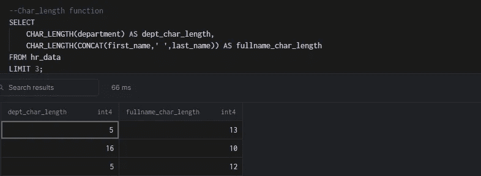
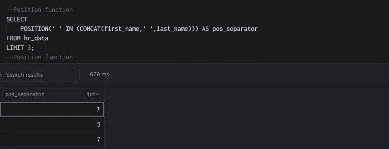
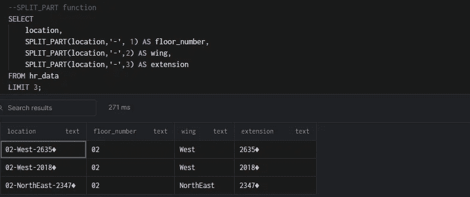

# 用于数据分析的 15 个常用 PostgreSQL 字符串函数

> 原文：<https://blog.devgenius.io/15-frequently-used-postgresql-string-functions-for-data-analysis-b4978a2079e1?source=collection_archive---------18----------------------->

如何在您的数据分析项目中使用 PostgreSQL 字符串函数


照片由老虎百合(Pexel)拍摄

由于数据存储方式的不一致，在数据库中处理文本数据可能会很有挑战性。

这篇博文解释了如何使用 PostgreSQL 中常用的二十个字符串函数来解决处理文本数据时遇到的一些挑战

1.  **串联**

函数的作用是:将两个或更多的字符串连接成一个。


hr _ 数据表

上表显示了 hr_data 中的前五行。我们将用 CONCAT 函数将名和姓连接起来作为全名。

连接名字和姓氏的 select 语句:


**2。INITCAP**

INITCAP()函数将每个单词的第一个字母转换成大写，其余的转换成小写。

CONCAT 函数的结果显示，某些名称的大小写不一致。当生成一个报告时，INITCAP 可以用格式名作为专有名词。

将一个单词的第一个字母转换成大写字母，其余字母转换成小写字母的 select 语句:


**3。上部**

UPPER()函数将字符串转换成大写字母。
将字符串转换成大写的 select 语句:


**4。降低**

LOWER()函数将字符串从大写转换成小写。

将字符串转换为小写的 select 语句:


**5。CHAR_LENGTH**

CHAR_LENGTH 函数计算指定字符串中的字符数。它通常与其他函数一起用作 POSITION，从给定的字符串中提取指定数量的字符。

计算字符串字符数的 select 语句:



**6。位置**

POSITION 函数在指定的字符串中查找子字符串的位置。

select 语句查找名和姓之间的空格:



**7。左侧**

LEFT()函数从给定字符串的左边提取 select 语句中指定的“n”个字符。使用 LEFT 和 POSITION 函数只能从包含全名的列中提取名字。


上表显示了“客户”表中的前五行。我们可以通过组合 LEFT 和 POSITION 函数来去掉 first_name 和 last_name。

从全名中删除名字的 select 语句:


**8。右**

RIGHT()函数从给定字符串的右边提取 select 语句中指定的“n”个字符。

可以使用 RIGHT、CHAR_LENGTH 和 POSITION 函数从全名中提取姓氏，如下面的 select 语句所示。


**9。子串**

SUBSTRING 函数从给定字符串中的特定位置提取特定数量的字符。SUBSTRING 函数比 LEFT 和 RIGHT 函数灵活得多，因为它允许您从字符串的任何部分提取字符。

您可以使用下面的 select 语句以及 SUBSTRING 和 POSITION 函数从全名中提取姓氏。


10。更换

REPLACE 函数搜索并使用新字符串替换指定字符串的所有匹配项。

select 语句将部门列中的销售替换为营销:


**11。反向**

REVERSE 函数反转字符串中的字符。

反转字符串字符的 select 语句:


**12。分割 _ 零件**

SPLIT_PART 函数根据分隔符分割给定的字符串，并从左边开始从指定的字符串中挑选出所需的部分。

```
**Syntax:** SPLIT_PART(string, delimiter, position) 
```

将一列拆分为三列的 select 语句:



13。修剪

TRIM 函数从字符串的开头、结尾或两边删除空格或字符集。

**语法:**

```
TRIM([leading|trailing|both] <removing_string> from <main_string>)
```

语法中的前导、尾随或两者都指示将移除 removing _ string 的 main_string 的位置。默认值为 both。

TRIM()函数对于处理列中字符串空格的不一致非常有用。

删除字符“0123456789 #”的 select 语句从字符串:


LTRIM()函数只删除字符串中的前导字符，而 RTRIM()函数也删除字符串中的尾随字符。

**14。LPAD**

函数的作用是:从左边开始用一个子串填充一个特定长度的字符串。

在下面的 Select 语句中，通过从左侧填充字符“01-”将 7 个字符的 id 列扩展为 10 个字符的 id 列。


**15。RPAD**

函数的作用是:从右边开始用一个子串填充一个特定长度的字符串。

在下面的 Select 语句中，通过从右侧填充字符“-01”，7 个字符的 id 列被扩展为 10 个字符的 id 列。


**结论**

这篇博文简化了 Postgresql 字符串函数在数据分析中的使用。

您可以从我的 [GitHub](https://github.com/amos-adewuni/freq_used_sql_string_func) 资源库下载数据集和 SQL 脚本供您练习。

关注我的 Twitter 以获取更多数据相关信息。