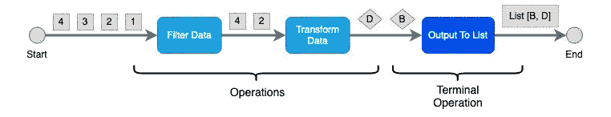
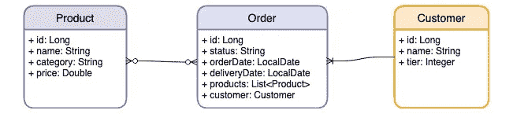

# 15 个实用练习帮助你掌握 Java Stream API

> 原文：<https://blog.devgenius.io/15-practical-exercises-help-you-master-java-stream-api-3f9c86b1cf82?source=collection_archive---------0----------------------->

## 使用强大的 Java 流 API 简化您的代码逻辑

照片由[在](https://unsplash.com/@comparefibre?utm_source=medium&utm_medium=referral) [Unsplash](https://unsplash.com?utm_source=medium&utm_medium=referral) 上对比纤维

自 Java 8 以来，Java stream API 的出现创造了一种新的编码方式，极大地简化了代码逻辑，减少了许多编程任务的代码行数。Stream API 不是遍历列表或数组中的每一项，而是与数据流一起工作，因此您可以通过向流中添加一系列操作来实现业务需求。

让我用一个例子向您展示 stream API 的强大。比方说，任务是将一组雇员记录分组到一个按职位组织的数据图中。下面是遍历列表并构建数据映射的传统方法。

Java Stream API imply 应用收集器来生成按雇员头衔分组的数据映射。您可以看到，使用 Stream API 的编码风格更简单，并且您可以编写更少的代码来实现相同的结果。

Java Stream API 不仅对数据操作有用，而且使数据合并和计算更加容易。让我们看另一个例子，它计算列表中所有雇员的平均工资

传统的方法是创建一个 for 循环，对每个雇员的工资进行求和，然后通过将总和除以记录数来计算平均值。

如何用 Java Stream API 实现？它将雇员记录转换为数据流中的薪金金额，然后计算平均值。我认为使用 Stream API 的代码更具表现力，也更容易阅读。

# 流 API 的关键概念

Java stream API 的设计符合函数式编程，它是一种通过组合函数并在数据流中执行来实现程序逻辑的编码风格。

Java Stream API 的一般概念如下图所示，流发出数据元素并通过一系列操作，如数据转换、过滤和排序。整个过程由终端操作结束，终端操作生成输出，如计算平均值和数据收集。

事实上，该机制类似于一个 for 循环，它迭代数据列表中的每个数据元素并执行程序逻辑。然而，程序代码更简单，可读性更好。

Java 流 API——典型的数据流

# Java 流 API 练习

实践动手练习是掌握一项新技能的快速方法。在本文中，您将经历 15 个练习，并涵盖广泛的场景，以提高您在 Java Stream API 方面的技能。

这些练习基于一个数据模型——客户、订单和产品。参考下面的实体关系图，客户可以下多个订单，所以是一对多的关系，而产品和订单是多对多的关系

数据模型

这是数据模型的源代码

为每个实体提供了 Spring JPA 存储库，因此您可以使用 findAll()之类的存储库方法来获取产品、订单和客户的记录。

我准备了一个 Spring Boot 项目，将数据模型、存储库和样本数据加载到内存 H2 中。因此，您可以使用示例数据来使用流 API。

 [## Gavin klfong/stream-API-练习

### 创建这个 GitHub 项目是为了作为练习 Java Stream API 的平台。我设计了 15 个练习…

github.com](https://github.com/gavinklfong/stream-api-exercises) 

在练习这 15 个练习时，您将学习以下 Java Steam API 操作，因此您将有足够的知识来进一步探索其他操作。

**非终端操作**

*   过滤器()
*   地图()
*   独特()
*   已排序()
*   peek()

**码头运营**

*   任意匹配()
*   收集()
*   计数()
*   findFirst()
*   最小值()
*   最大()
*   总和()
*   平均值()

## 练习 1 —获取价格> 100 的属于类别“书籍”的产品列表

这显然是一个过滤逻辑，输出应该满足两个过滤要求。因此，您可以应用 2 个**过滤器()**操作来获得结果。

## 练习 2 —获得属于“婴儿”类别产品的订单列表

您需要从订单实体的数据流开始，然后检查订单的产品是否属于“Baby”类别。因此，过滤器逻辑查看每个订单记录的产品流，并使用 **anyMatch()** 来确定是否有任何产品满足标准。

## 练习 3-获得一份类别为“玩具”的产品清单，然后享受 10%的折扣

在本练习中，您将看到如何使用 stream API 转换数据。使用 **filter()** 获得属于“玩具”类别的产品列表后，您可以使用 **map()** 对产品价格应用 10%的折扣。

# 练习 4 —获取第 2 级客户在 2021 年 2 月 1 日至 2021 年 4 月 1 日之间订购的产品列表

本练习说明了 **flatMap()** 的用法。您可以首先从订单列表开始，然后按客户层级和订单日期过滤列表。接下来，从每个订单记录中获取产品列表，并使用 **flatMap()** 将产品记录发送到流中。例如，如果我们有 3 个订单记录，每个订单包含 10 个产品，那么 **flatMap()** 将为每个订单记录发出 10 个数据元素，从而在流中产生 30 (3 x 10)个产品记录输出。

因为如果多个订单包含相同的产品，产品列表将包含重复的产品记录。为了生成唯一的产品列表，应用 **distinct()** 操作可以帮助生成唯一的列表。

# 练习 5 —购买“书籍”类别中最便宜的产品

获取价格最低的产品的有效方法之一是将产品列表按价格升序排序，得到第一个元素。Java Stream API 提供了 **sorted()** 操作，用于基于特定字段属性的流数据排序。为了获得流中的第一个元素，可以使用终端操作 **findFirst()** 。该操作返回由 Optional 包装的第一个数据元素，因为输出流可能为空。

这个解决方案只能返回一个价格最低的产品记录。如果有多个产品记录具有相同的最低价格，则应该修改解决方案，使其首先查找最低价格金额，然后按价格金额过滤产品记录，以获得具有相同最低价格的产品列表。

更新:

感谢您的建议，使用 min()是一个更好的解决方案，因为代码更干净，并且可以使用 2 个操作符(filter →min)而不是 3 个(filter → sorted →findFirst)。

## 练习 6 —获取最近下的 3 份订单

与前面的练习类似，显而易见的解决方案是按订单日期字段对订单记录进行排序。棘手的是，这次排序应该是降序的，这样就可以获得订单日期最近的订单记录。只需调用 **Comparator.reversed()** 即可实现。

## 练习 7 —获取 2021 年 3 月 15 日订购的订单列表，将订单记录记录到控制台，然后返回其产品列表

您可以看到，这个练习涉及两个操作— (1)将订单记录写入控制台，以及(2)生成产品列表。从一个流中生成不同的输出是不可能的，我们如何满足这个要求呢？除了运行两次流之外，操作 **peek()** 允许系统逻辑作为流的一部分执行。示例解决方案在数据过滤后立即运行****peek()***将订单记录写入控制台，然后执行 **flatMap()** 等后续操作输出产品记录。*

## *练习 8 —计算 2021 年 2 月下的所有订单的总额*

*所有以前的练习都是通过终端操作输出一个记录列表，这次让我们做一些计算。本练习旨在总结 2021 年 2 月订购的所有产品。通过前面的练习，您可以使用 **filter()** 和 **flatMap()** 操作轻松获得产品列表。接下来，您可以使用 **mapToDouble()** 操作，通过将 price 字段指定为映射值，将流转换为 Double 数据类型的流。最后，终端操作 **sum()** 将帮助您将所有值相加并返回总值。*

## *练习 9-计算 2021 年 3 月 14 日下单的平均付款额*

*除了总和之外，流 API 还提供平均值计算操作。您可能会发现返回数据类型与 **sum()** 不同，因为它是可选的数据类型。原因是数据流将是空的，因此计算不会输出空数据流的平均值。*

## *练习 10 —获取“图书”类别所有产品的统计数字集合(即总和、平均值、最大值、最小值、计数)*

*如果需要同时得到 sum，average，max，min，count 怎么办？我们应该运行数据流 5 次来一个接一个地得到那些数字吗？这种方法并不十分有效。幸运的是，通过使用终端操作 **summaryStatistics()** ，stream API 提供了一种方便的方法来一次获得所有这些值。它返回一个数据类型**DoubleSummaryStatistics**，其中包含所有需要的数字。*

## *练习 11 —获取一个包含订单 id 和订单产品数量的数据图*

*除了值计算，前面所有的练习都只是输出一个记录列表。助手类收集器为数据整合和数据收集输出提供了许多有用的操作。让我们来看一下创建一个数据映射的练习，其中 order id 作为键，而相关的值是 product count。终端操作 **Collectors.toMap()** 接受两个参数，分别指定键和值。*

## *练习 12 —制作一个包含按客户分组的订单记录的数据图*

*本练习旨在按客户合并订单列表。**collectors . grouping by()**是一个方便的函数，你只需简单地指定什么是关键数据元素，它就会为你聚合数据。*

## *练习 13 —制作一个包含订单记录和产品总额的数据图*

*这次的数据映射输出不是简单地从流中提取数据字段，您需要为每个订单创建一个子流，以便计算产品总和。因为，关键元素是订单记录本身而不是订单 id，所以使用 **Function.identity()** 来告诉 **Collectors.toMap()** 使用数据元素作为键。*

## *练习 14-获取一个数据图，其中包含按类别分类的产品名称列表*

*本练习帮助您熟悉转换数据映射条目的数据输出的方法。如果只使用**collectors . grouping by(Product::get Category)**，那么输出将是 Map <类别，产品列表>，但是预期的输出应该是 Map <类别，产品名称列表>。您可以使用 **Collectors.mapping()** 将产品对象转换为产品名称，以便构建数据映射。*

## *练习 15——按类别获取最贵的产品*

*类似于使用 **Collectors.mapping()** ， **Collectors.maxBy()** 的数据转换，作为数据映射构造的一部分，有助于获得具有最大值的记录。通过提供产品价格的比较器， **maxBy()** 能够获得每个类别中价值最大的产品。*

# *最后的想法*

*希望这些练习有助于您熟悉 Java Stream API 的使用以及用更简单的方法编写逻辑的方法。毫无疑问，采用 Java Stream API 是一种思维转变，因为你的思维过程将从传统的命令式编程转变为函数式编程。因此，练习对于帮助您思考数据流中的逻辑非常重要。有了 Java Stream API 的技能，你可以很容易地学会 Spring WebFlux 开发等技术，因为它的编码风格与 Java Stream API 有着相似的概念。*