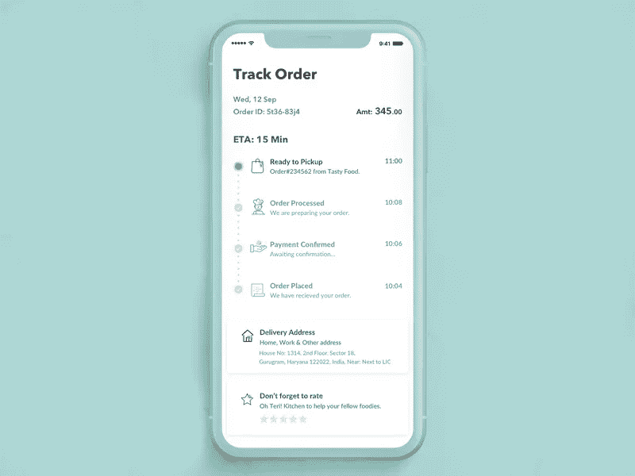

# 电子商务网站的 15 个基本功能|业务基本功能$$

> 原文：<https://blog.devgenius.io/15s-essentials-features-for-ecommerce-website-business-essentials-604e7f46fb73?source=collection_archive---------53----------------------->

特色创造价值——你的网站特色主要描述你的产品的价值

一个电子商务应用程序需要的不仅仅是它看起来的样子，简单来说就像一根针！

让我们一起来探索这个列表吧！！

**登录&注册**

*简化的登录流程&注册，即允许客户使用其电子邮件地址登录，或者让他们通过外部账户登录，如谷歌、电子邮件或任何其他账户..*

**产品描述(详细)**

*似乎谁会看这种详细的描述，但是……对你的产品进行详细描述会减少产品退货的几率*

**对产品进行强大且用户友好的过滤和分类**

*为了给客户他们想要的，你的应用程序必须具备过滤功能，这样你的客户就可以搜索他们的需求成本*

**图库视图和类别**

> 向顾客展示你的产品的第一步就是产品展示区。我相信它能让顾客在不阅读细节的情况下给出关于产品的全面完整的信息。

***其次*** *，分类可以让用户根据自己的口味非常有效、轻松地寻找产品。您可以保留您的类别，如—*

*   *畅销书*
*   *新增*
*   趋势
*   *最受欢迎*
*   *产品类别*
*   *精选*
*   *还有更多……*

**购物车**

*这是你的电子商务应用程序中必须具备的功能，它允许用户灵活地在一个地方添加产品，以完成其购买。您的客户在购买*时会欣赏这种努力

*“购物车让顾客在觉得舒服的情况下，分几个阶段实现购买。例如，用户可以将产品添加到购物车中，如果他们不想立即结账，可以轻松返回。”*

**航运**

> 您必须为您的应用程序提供可变的运输选项，这将为您的客户在从您的应用程序购买产品时提供舒适性

**订单汇总**

*当今电子商务最受欢迎的功能。its 为用户提供了检查他们的订单是否包括他们想要购买的所有商品的功能。*

*该功能非常适合批量购买的客户，为他们提供了在购买前检查订单的可靠性*

**简单安全的支付网关**

支付网关让用户选择通过网上银行、货到付款、合众国际社、借记卡或信用卡等方式购买产品的舒适度。etc

*此外，支付网关对管理员来说是一种选择，而不是一种功能，因为它具有安全性和易于使用的界面……*

**发票——顾客满意的关键**

发票是给顾客的商品，有助于在产品有缺陷的情况下退货或换货，也是忠诚度的保证。

***它比产品*** *更能满足用户，因为它解决了特定细分市场的需求，从而建立了客户忠诚度。*

**换货和退货**

*从某个角度来说，对用户来说，信任和忠诚是至关重要的，因为网上购物可能会很棘手，顾客收到的产品有时会与他们想象的不同，或者可能会有一些错误的特征，如尺寸、颜色、形状……*

*退换货的标签只是获得用户的信任和忠诚，而这对于一个公司来说是最有价值的*

**运输状态**

如今，许多在线商店提供的另一个不错的功能是——可以方便地查看在商店订购的商品的运输状态。

*这仅仅是* ***提供了透明度，提高了顾客与你的商店*** *互动的质量*

**物品可用性提醒**

*A 必须拥有许多用户欣赏的功能，有些产品非常有价值，以至于 A 的用户希望在库存中重新获得该产品*

*这一提醒对于那些急切等待购买产品的用户来说非常有用*

# **愿望清单**

用户保存自己喜欢的购买物品的地方，这样他/她就不会错过，这是一个非常好的功能..

**个性化供稿和推荐**

*个性化的订阅源和推荐有助于用户明智地购买产品，寻找其他商品的用户可以利用这些明智的推荐来获得符合其口味的产品。*

## **销售和折扣*$*$**

*销售是迫使你的用户购买的最有效的方式，而且价格非常实惠，这对买卖双方来说都是双赢的*

*你可以像这样保持销量—*

*   *旺季销售*
*   *年终销售*
*   *清仓销售*
*   *百思买和更多……*