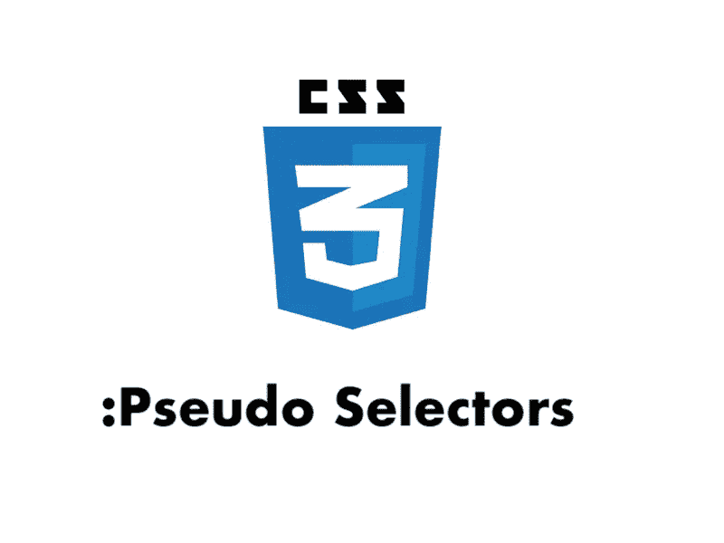

# 值得标记的 16 个 CSS 伪选择器

> 原文：<https://blog.devgenius.io/16-css-pseudo-selectors-worth-bookmarking-29fb6f840872?source=collection_archive---------17----------------------->



本文建议使用更多的 CSS 和更少的 JS 来构建 web UI。为了实现这个目标，最好是尽可能多地使用 CSS 特性。但是要了解所有的人是相当困难的。另一个解决方案是遵循最佳实践，减少代码量。

本文要介绍的伪选择器:

*   [1。:一线](https://pitayan.com/#1-first-line)
*   [2。:首字母](https://pitayan.com/#2-first-letter)
*   [3。选择](https://pitayan.com/#3-selection)
*   [4。:root](https://pitayan.com/#4-root)
*   [5。:清空](https://pitayan.com/#5-empty)
*   [6。:独生子女](https://pitayan.com/#6-only-child)
*   [7。:首款](https://pitayan.com/#7-first-of-type)
*   [8。:最后一种类型](https://pitayan.com/#8-last-of-type)
*   [9。:第 n 个类型()](https://pitayan.com/#9-nth-of-type)
*   [10。:n-last-of-type()](https://pitayan.com/#10-nth-last-of-type)
*   [11。:链接](https://pitayan.com/#11-link)
*   12。:已检查
*   13。:有效
*   14。:无效
*   15。:郎()
*   [16。:not()](https://pitayan.com/#16-not)
*   [参考文献](https://pitayan.com/#references)

# [1。:一线](https://pitayan.com/#1-first-line)

顾名思义，它代表文本的第一行。

浏览器兼容性:[https://caniuse.com/#search=%3Afirst-line](https://caniuse.com/#search=%3Afirst-line)

```
pre:first-line {
  font-size: 24px;
  color: green;
}::first-line
selector
```

# [2。:首字母](https://pitayan.com/#2-first-letter)

和`first-line`一样，代表正文的第一个字母。

浏览器兼容性:[https://caniuse.com/#search=%3Afirst-line](https://caniuse.com/#search=%3Afirst-line)

```
p:first-letter {
  font-size: 36px;
  color: green;
}
```

# [3。选择](https://pitayan.com/#3-selection)

`selection`选择器表示您选择并高亮显示的文本。默认情况下，大多数浏览器的颜色是蓝色。

浏览器兼容性:[https://caniuse.com/#search=%3Aselection](https://caniuse.com/#search=%3Aselection)

```
p::selection {
  background: orange;
}
```

# [4。:根](https://pitayan.com/#4-root)

`root`选择器代表文档的根元素。在`HTML`中，根元素是`<html>`元素。在`RSS`中，根元素是`<rss>`元素。

在大多数现代浏览器中，它用于存储自定义样式属性。使用`var()`作为存储值的获取器。

浏览器兼容性:【https://caniuse.com/#search=%3Aroot 

```
:root {
  --bg-color: lightgray;
  --text-color: green;
}p {
  background: var(--bg-color);
  color: var(--text-color);
}
```

# [5。:清空](https://pitayan.com/#5-empty)

`empty`代表一个空元素。没有`spacevisible content`或`children nodes`的元素是`empty`元素。

浏览器兼容性:[https://caniuse.com/#search=%3Aempty](https://caniuse.com/#search=%3Aempty)

```
p:empty {
  border: 1px solid black;
  height: 16px;
}<p></p><p> </p><p><div style="display:hidden;"></div></p>
```

# 6。:独生子女

`only-child`表示父节点只有一个子节点的子节点。

浏览器兼容性:[https://caniuse.com/#search=%3Aonly-child](https://caniuse.com/#search=%3Aonly-child)

```
div:only-child {
  background: lightgray;
}<div>
  <p>only child</p>
</div>
```

# [7。:首款](https://pitayan.com/#7-first-of-type)

`first-of-type`表示在其父元素的子元素列表中是其类型的第一个兄弟节点。

浏览器兼容性:[https://caniuse.com/#search=%3Afirst-of-type](https://caniuse.com/#search=%3Afirst-of-type)

```
p:first-of-type {
  background: lightgray;
}<div>
  <div>1</div>
  <p>2</p>
  <p>3</p>
</div>
```

# [8。:最后一种类型](https://pitayan.com/#8-last-of-type)

但是在`first-of-type`中，`last-of-type`代表最后一个。

浏览器兼容性:[https://caniuse.com/#search=%3Alast-of-type](https://caniuse.com/#search=%3Alast-of-type)

```
p:last-of-type {
  background: lightgray;
}<div>
  <div>1</div>
  <p>2</p>
  <p>3</p>
</div>
```

# [9。:第 n 个类型()](https://pitayan.com/#9-nth-of-type)

`first-of-type`和`last-of-type`只代表第一个或最后一个元素。通过`nth-of-type`，您可以使用它的索引来选择节点。记住 CSS 索引从 1 开始。

浏览器兼容性:[https://caniuse.com/#search=%3Anth-of-type](https://caniuse.com/#search=%3Anth-of-type)

```
P:nth-of-type(2) {
  background: lightgray;
}<div>
  <div>1</div>
  <p>2</p>
  <p>3</p><!-- this one -->
</div>
```

# [10。:n-last-of-type()](https://pitayan.com/#10-nth-last-of-type)

不同形式`nth-of-type`、`nth-last-of-type`从子列表的最后一个开始计数。

浏览器兼容性:【https://caniuse.com/#search=%3Alast-nth-of-type 

```
P:nth-last-of-type(2) {
  background: lightgray;
}<div>
  <div>1</div>
  <p>2</p><!-- this one -->
  <p>3</p>
</div>
```

# 11。:链接

`link`用 href 表示未访问的`<a>`标签。

浏览器兼容性:[https://caniuse.com/#search=%3Alink](https://caniuse.com/#search=%3Alink)

```
a:link {
  color: green;
}
```

# 12。:已检查

`checked`代表复选框/单选按钮中选中的项目。

浏览器兼容性:[https://caniuse.com/#search=%3Achecked](https://caniuse.com/#search=%3Achecked)

```
input:checked {
  background: lightgray;
}
```

# [13。:有效](https://pitayan.com/#13-valid)

它用在带有验证的表单中。`valid`表示通过验证的节点。

浏览器兼容性:[https://caniuse.com/#search=%3Avalid](https://caniuse.com/#search=%3Avalid)

```
input:valid {
  border: 1px solid green;
}
```

# [14。:无效](https://pitayan.com/#14-invalid)

所以对于`valid`，`invalid`表示没有通过验证的节点。

浏览器兼容性:【https://caniuse.com/#search=%3Ainvalid 

```
input:invalid {
  border: 1px solid red;
}
```

# [15。:郎()](https://pitayan.com/#15-lang)

`lang`代表指定语言的节点。

浏览器兼容性:[https://caniuse.com/#search=%3Alang](https://caniuse.com/#search=%3Alang)

```
p:lang(ja) {
  color: green;
}/* or */p[lang|="ja"] {
  color: green;
}
```

# [16。:not()](https://pitayan.com/#16-not)

`not`将一个简单的选择器作为参数。它表示一个不是由其参数表示的元素。

浏览器兼容性:[https://caniuse.com/#search=%3Anot](https://caniuse.com/#search=%3Anot)

```
div :not(p) {
  background: lightgray;
}<div>
  <div>1</div>
  <p>2</p><!-- p tag is not taking effect -->
  <div>3</div>
</div>
```

这是 16 个伪选择器。希望你已经有了这些选择器。实际上，还有很多非标准的伪选择器。所以我忽略了他们。如果你觉得这篇文章很棒，请分享到其他社交网络上。

感谢阅读！

# [参考文献](https://pitayan.com/#references)

*   [https://www.w3schools.com/cssref/css_selectors.asp](https://www.w3schools.com/cssref/css_selectors.asp)
*   [https://developer . Mozilla . org/en-US/docs/Web/CSS/CSS _ Selectors](https://developer.mozilla.org/en-US/docs/Web/CSS/CSS_Selectors)