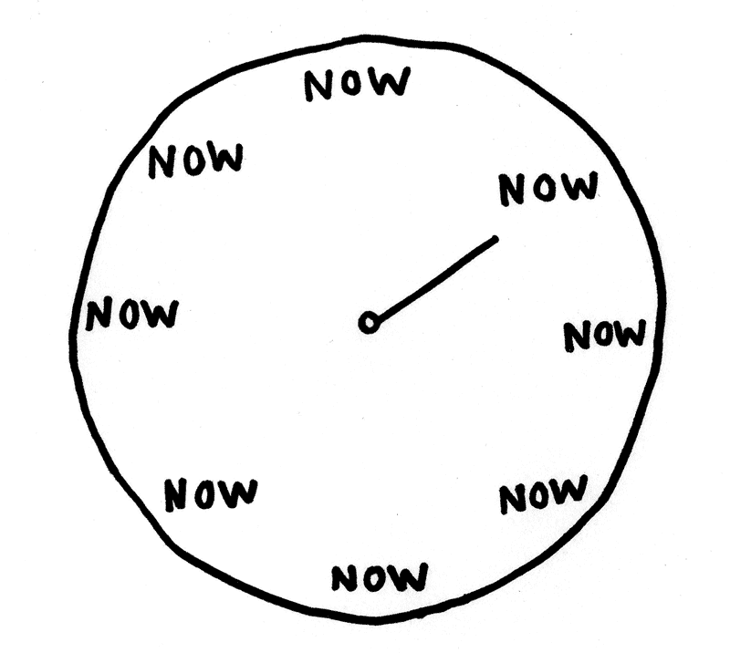

# 提高工作效率的 16 个简单技巧 x10

> 原文：<https://blog.devgenius.io/16-simple-tips-to-boost-your-productivity-x10-5977e2a00697?source=collection_archive---------3----------------------->

## 这些简单易行的建议将会大大提高你的产量。

# 1.删除通知🔔

*   几个小时后检查你的手机。
*   关注通知最多的应用。
*   挡住他们。
*   不要害怕*。*
*   *选择你的镜头。*
*   *你会失去一些内容。*
*   *处理好它。*
*   *观看[社交困境](https://www.imdb.com/title/tt11464826/)。*

# *2.分配你的时间🍕*

*   *不间断地使用时间段(时间框)。*
*   *我最喜欢的是[番茄工作法](https://en.wikipedia.org/wiki/Pomodoro_Technique)。*
*   *如果你遇到新任务，把它们写下来。*
*   *不要一心多用。*
*   *时间到了才能切换。*
*   *20 分钟这是一个很好的切片。*

# *3.收件箱 0📥*

*   *让你的收件箱总是空的。*
*   *退订所有无关的邮件(大部分时间只是一键操作)。*
*   *在收件箱外创建过滤规则。*
*   *如果你需要对邮件采取行动:(保持列表，创建一个特殊的文件夹)。*
*   *收件箱不是待办事项列表。*

# *4.找到你的🕯️之花*

*   *创意工作发生在【心流状态】([https://en . Wikipedia . org/wiki/Flow _(psychology)](https://en.wikipedia.org/wiki/Flow_(psychology))。*
*   *进入心流需要一些时间(大约 15 分钟)。*
*   *花一秒钟离开它，然后再去排队。*
*   *移除所有外部流程中断、通知、噪音*
*   *控制所有内部刺激。*

# *5.使用 [Zenware](https://searchunifiedcommunications.techtarget.com/definition/zenware) 💭*

*   *使用简单的软件。*
*   *像 [writemonkey](https://writemonkey.com/) 这样的极简任务编辑器和像 [Trello](https://trello.com/) 这样的简单管理软件。*
*   *不要拖延给你的文章镀金。*

# *6.关闭浏览器选项卡🔓*

*   *管理待办事项列表和项目。*
*   *不要打开多个选项卡。*
*   *没有操作系统或网络浏览器能很好地处理它们。你也不会。*
*   *不要一心多用。*
*   *如果某件事不到两分钟，就去做。否则把它添加到待办事项列表中。*
*   *网页标签不是待办事项列表。*

# *7.为一切找到家🏠*

*   *每个物体(真实的或虚拟的)都应该有一个家。*
*   *我们可以把东西的收件箱(或接收位置)保存几天。*
*   *我们需要简单的流程来清空这些收件箱。*
*   *当清空这些收件箱时，如果有必要，我们应该定义新的“家”。*

# *8.记下每日日程📅*

*   *每天从一个简短的日程开始。*
*   *您可以将个人项目和工作项目混合在一起，或者将它们放在两个单独的列表中。*
*   *计划未计划的工作。*
*   *每小时重温一次。*
*   *晚上关上它。*
*   *千万不要第二天再用。从头开始。*

# *9.自动化重复性任务🤖*

*   *寻找可重复的快捷方式。*
*   *自动化重复性任务。*
*   *这是一把两刃利刃。做任务的时候千万不要自动化。*
*   *自动化比做(拖延症)更令人愉快。*
*   *仅自动化日常任务。*
*   *不要将不常发生的事情自动化。*

# *10.避免无益的会议🤝*

*   *安排 25 或 50 分钟的会议。*
*   *这样你就有时间换了。*
*   *没有议程的会议是没有用的。*
*   *避免超过三个人的会议。*
*   *会议的结果应该是行动项目。*

*承诺必须包括:*

*   *谁/什么/什么时候*

# *11.避免多重任务👨‍💼*

*   *不要一心多用。*
*   *一次只做一件事。*
*   *多任务是一个神话，试图去做只会分散你的注意力。*
*   *人类的大脑是单任务的。*
*   *神经元的上下文切换代价太大，所以你大部分时间都在折腾。*

*专注->流量。*

# *12.避免语音通话📞*

*   *语音通话是干扰。*
*   *干扰是我们最大的敌人。*
*   *避免计划外的语音通话。*
*   *如果不紧急，你可以用异步方式通过消息传递来交谈。*
*   *如果很紧急，请再次确认是否紧急*
*   *如果你想谈谈，那就安排吧！*

# *13.[一大早吃青蛙](https://todoist.com/productivity-methods/eat-the-frog)🌤️*

*   *一大早就去做那些烦人的任务。*
*   *为一天做计划。*
*   *回顾前一天完成的所有事情。*

# *14.不要重复使用日常待办事项清单✔️*

*   *从不同的一天开始每一天。*
*   *用这种方法没有遗留问题。*
*   *每天检查昨天未完成的目标，评估它们是否值得出现在新的清单上。*

# *15.衡量目标📈*

*   *设定长期、中期和短期目标。*
*   *它们不应该是模糊的。*
*   *设定一个现实的、可衡量的标准。*
*   *如果它不能用退出条件来衡量，它就不是一个目标。*
*   *每周跟踪他们。*
*   *有需要就换。*

# *16.不要留着以后用🍓*

*   *留到以后是一个神话。*
*   *有像[口袋](https://getpocket.com/)、[in reader](https://www.inoreader.com/)、 [Evernote](https://evernote.com/) 等优秀的 app*
*   *但是除非你经常消耗这个列表，否则它将永远增长。*
*   *不要保存内容，消费它。*
*   *不要[囤积](https://en.wikipedia.org/wiki/Digital_hoarding%20is%20a%20disorder)。*

# *17.[更新]第二部分*

* [## 提高工作效率的 10 个简单技巧 x2 (2021 指南)

### 上一篇关于 lifehacks 的文章获得了巨大的成功。让我们以更多的生产力技巧开始新的一年吧！

mcsee.medium.com](https://mcsee.medium.com/10-more-simple-tips-to-boost-your-productivity-x2-2021-guide-8a44e761c4da)* 

*我相信周围有很多关于生产力的建议。哪一个对你有用？*

*请给我留言。*