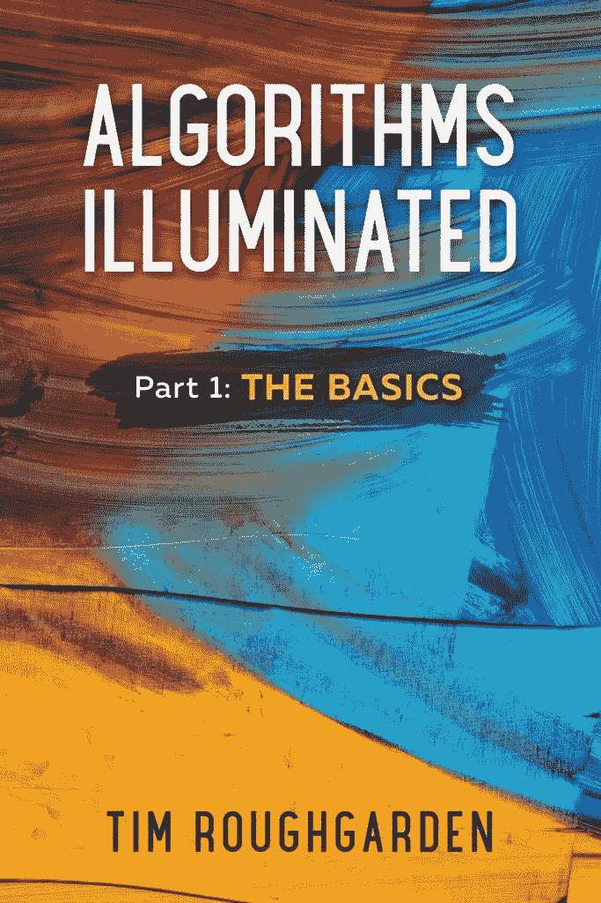

# 每个开发人员都应该阅读的 18 本书和博客

> 原文：<https://blog.devgenius.io/18-books-blogs-every-developer-should-read-3acfdabd362e?source=collection_archive---------8----------------------->

[网络学习和互联网教育](https://www.codemotion.com/magazine/articles/stories/3-ways-codemotion-tries-to-promote-continuous-learning/)的性质是非常压倒性的。你开始阅读一篇关于某个特定主题的文章，被关于这个主题的视频分散了注意力，然后被重定向到另一篇文章，这篇文章告诉你你读的第一篇文章一直都是错的。我们联系了 [Codemotion 社区](https://www.codemotion.com/magazine/dev-hub/community-manager/codemotion-community-platform-full-user-guide/)，询问你会推荐给其他开发者的书籍和博客(附带条件是没有先令)。我们得到了巨大的反响，让我们来看看:

# [信息和软件质量联盟(CISQ)(博客)](https://www.it-cisq.org/index.htm)

“这不是一本容易或有趣的读物，但是它提供了大量关于软件质量的信息。例子:令人大开眼界的是，由于软件质量不足，2018 年美国大约花费了 10%的 GDP(在 CISQ 白皮书中可以找到)。你可以找到 CISQ 提供的好资源列表。”

*–Frank Fischer，* [*的开发者关系 DeepCode*](https://www.deepcode.ai/)

# [Tim rough garden 阐释的算法](https://www.amazon.de/Algorithms-Illuminated-Part-1-Basics/dp/0999282905)

“这是一系列基于 Tim Roughdarden 的 Coursera/Stanford 在线课程的书籍，我非常喜欢。与其他算法书籍相比，它的一个优点是它不与任何编程语言相关联，而是使用伪代码。”

*——尼古拉·科瓦连科，高级* [*后端*](https://www.codemotion.com/magazine/dev-hub/backend-dev/) *工程师，*[*Humanitec*](https://humanitec.com/)

# 朱莉娅·埃文斯的《巫师杂志》

“朱莉娅的杂志绝对是许多技术概念的最佳基础教育材料。我最喜欢的杂志是关于 SQL、HTTP、Git 和命令行工具的。诚然，通过打破有时令人困惑的技术概念，Julia 帮助初学者和高级开发人员在很短的时间内非常容易地理解这些概念。

这些年来，我在教育网站开发材料上花了很多钱，但就教育价值而言，没有什么能与朱莉娅的杂志相比。所有杂志的捆绑价格为 78 美元，一本杂志的价格为 12 美元。朱莉娅经常在推特上免费发布这些照片。我希望她能创造出更多这样的作品！

她的个人博客涵盖了许多不同的话题。其中包括计算机工具、网络问题、容器、[机器学习](https://www.codemotion.com/magazine/dev-hub/machine-learning-dev/)和 Linux。"

*——莎拉·佩特洛娃，英特尔&软件工程师*[*techtest report*](https://techtestreport.com/)*联合创始人。*

# [Gene Kim、Jez Humble、Patrick Debois、John Willis 撰写的《DevOps 手册》](https://www.oreilly.com/library/view/the-devops-handbook/9781457191381/)

“我最初的想法是围绕一种特定的语言来推荐。但后来我看了看我的书架，发现了一个对任何开发软件的人都有价值的瑰宝，不管是语言还是框架。”

*–亚历克斯·米勒，高级软件工程师，* [*Uphail*](https://uphail.com/)

# 肖·豪的《学习 HTML 和 CSS 编码》

“这是一本很棒的书，概念深刻，非常容易理解。我仍然发现自己在卡住的时候会时不时地使用它。”

*——诺曼·纳尔坎德，* [*WP 冒险*](https://wpadventure.com/)

# [托马斯·e·科尔曼的算法导论](https://www.amazon.com/Introduction-Algorithms-3rd-MIT-Press/dp/0262033844)

“看这本书，里面描述的大部分算法都挺熟悉的。然而，阅读这些算法是如何被解释的以及它所带来的支持证据帮助我更好地理解它们是如何工作的，它们是如何以及为什么被推导出来的。如果你在研究算法的时候需要一本基础书籍，这本书就是你要找的。”

*——迈克尔·阿斯塔什克维奇、*[*CTO*](https://www.codemotion.com/magazine/dev-hub/cto/)*、* [*智能 IT*](http://www.smart-it.io/)

# [辛酸指南](https://poignant.guide/)

一本书和一个博客，我选择它是因为这是一本非常规的学习编程的书。这本书背后的思想是奇怪而疯狂的，虽然我仍然不确定我是否从它那里学到了任何 Ruby，但我知道技术书籍可以是它喜欢的任何格式。"

[*——克里斯·沃德*](https://chrischinchilla.com/) *，自由职业技术交流者*

# [对讲机(博客](https://www.intercom.com/blog/))

“这个博客有丰富的知识可以分享给开发者和非开发者。无论您使用何种技术，Intercom 都会分享您可以在日常工作中应用的最佳实践。”

*–首席技术官 Michael Astashkevich，* [*智能 IT*](http://www.smart-it.io/)

# 迈克尔·霍华德、大卫·勒布朗和约翰·维埃加的《软件安全的 24 宗死罪:编程缺陷和如何修复它们》

“作为软件开发人员，我们在编码时并不总是考虑我们的代码有多安全。我们经常依靠外部工具来发现代码中的任何安全漏洞，但是即使是最好的工具也不能检测到每一种情况。《软件安全的 24 宗罪》是一本简单易懂的书，包含了开发人员会犯的编码错误的例子以及如何避免/修复它们。对于在处理非常敏感的数据的行业工作的开发人员来说，这是一本必读的书。

*——马克·索托，软件开发人员，*[*Cybericus*](https://cybericus.com/)

# [弗拉维奥·科普斯(博客)](https://flaviocopes.com/)

弗拉维奥·科普斯每天都写博客。在他的博客上，你可以找到无尽的内容，如手册、课程和教程。有些帖子更像是片段，但仍然非常有帮助，不仅对初学者，对高级 Web 开发人员也是如此。

他的 React 手册仍然对我有很大的价值。即使有了五年的 WebDev 经验，我仍然会回来查找资料。它是免费的，他只是要求你的电子邮件作为他的通讯的交换，其中也包含了很多有趣的内容。"

*——莎拉·佩特洛娃，英特尔&软件工程师*
[*techtest report*](https://techtestreport.com/)*联合创始人。*

# 詹妮弗·尼德斯特·罗宾斯的《学习网页设计:HTML、CSS、Javascript 和网页图形入门指南》

"这是一本写得非常好的书，有大量的练习让你忙碌起来，磨练你的编码技能."

*—诺曼·纳尔坎德、* [*WP 冒险*](https://wpadventure.com/)

# 其他博客和 YouTube 推荐

*   [编码训练 YouTube 频道，](https://www.youtube.com/user/shiffman)有几个有趣的编码挑战和解释
*   David Walsh 的博客，由 Mozilla 一位受人尊敬的开发人员撰写
*   [网页设计者报告](https://www.webdesignerdepot.com/)
*   [砸弹匣](https://www.smashingmagazine.com/)
*   [顶级博客](https://www.toptal.com/blog)
*   [CSS-招数](https://css-tricks.com/)

"这些是我最喜欢的一些，我觉得它们非常有用，信息量也很大。"

*–Gustavo Pezzi，伦敦 BPP 大学计算机科学教授，英国高等教育学院研究员。* [*皮库马*](https://www.pikuma.com/) *的创始人。*

本文原载于 [Codemotion 杂志](https://www.codemotion.com/magazine/dev-hub/web-developer/18-books-blogs-every-developer-should-read/)。看看其他伟大的文章[https://www.codemotion.com/magazine/](https://www.codemotion.com/magazine/)