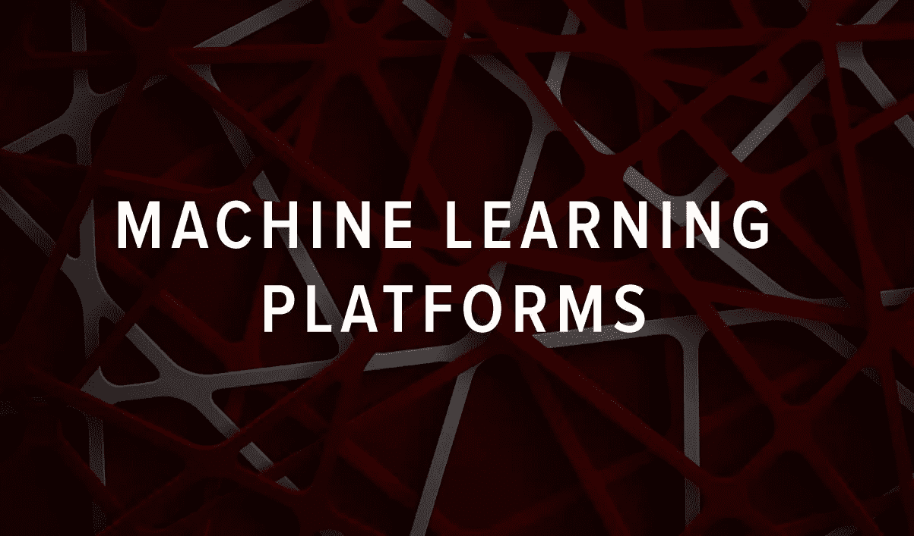
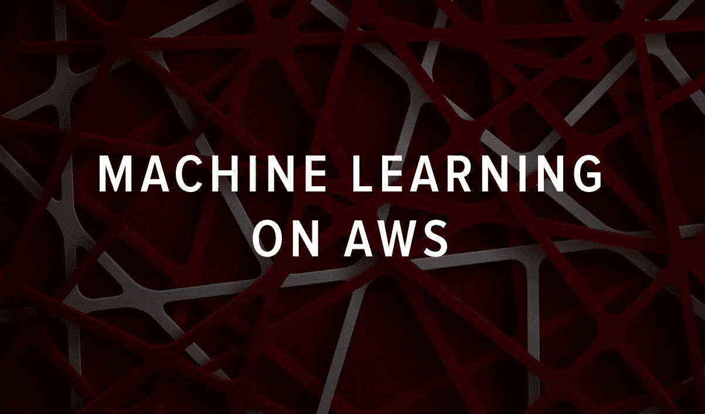
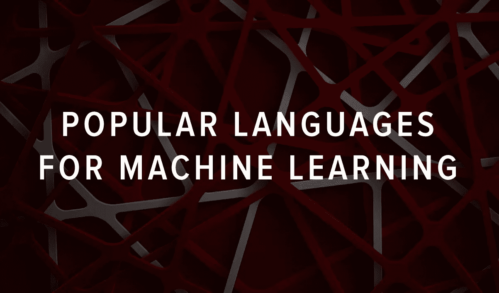
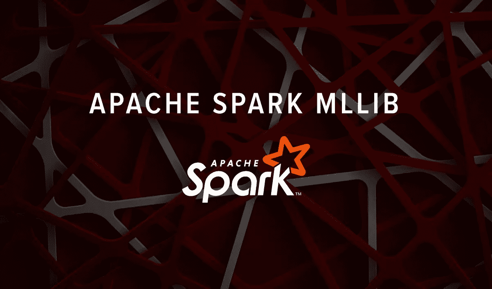

# 你不能没有的 18 个机器学习工具

> 原文：<https://blog.devgenius.io/18-machine-learning-tools-that-you-cant-go-without-2a293d74a05c?source=collection_archive---------16----------------------->

由 [Unsplash](https://unsplash.com?utm_source=medium&utm_medium=referral) 上的 [Pietro Jeng](https://unsplash.com/@pietrozj?utm_source=medium&utm_medium=referral) 拍摄

当你选择了一个机器学习工具，你就选择了你的未来。我们都知道人工智能世界中的一切变化有多快，所以保持“老狗，老把戏”和“昨天刚做出来”之间的平衡很重要。

在本帖中，我们将看看 **18 种流行的机器学习工具。**如果您刚刚开始使用 ML，我们建议您在深入研究这些工具之前浏览[一些 ML 资源](https://serokell.io/blog/top-resources-to-learn-ml)。

首先，我们要谈谈平台。它们建立在单通道架构上，并且以方便编程任务的方式设计。他们可能会提供其他服务，如在云中工作、协作工作选项或用于数据可视化的图形处理器。他们也使用谷歌、微软或亚马逊的流行框架。

然后，我们将看看在开发 ML 应用程序时使用的框架。

# 机器学习平台

如果你开始使用 ML，一个有现成数据集和标准模型模板的平台将允许你更快地创建你的第一个解决方案，并且有更少的错误。这些平台安装了所有必要的工具，让您可以立即开始工作。

## 1.谷歌云上的人工智能平台和数据集

任何 ML 模型的基本问题是你需要一个正确的数据集来训练它。它们制作起来很贵，而且要花很多时间。[谷歌云公共数据集](https://cloud.google.com/public-datasets)是由谷歌管理的数据集，定期更新。格式非常不同:从图像到音频、视频和文本。这些数据面向具有不同使用案例的广大研究人员。

此外，谷歌还提供其他[有用的服务](https://cloud.google.com/ai-platform)，你可能会感兴趣:

*   用于训练和管理 ML 模型的人工智能平台；
*   自然语言处理服务；
*   视觉人工智能(计算机视觉模型)；
*   30 多种语言的语音合成软件等。

谷歌以其在人工智能方面的专业知识而闻名，所以你可以放心地在自己的项目中使用他们的解决方案。

## 2.亚马逊网络服务

[AWS](https://aws.amazon.com/machine-learning/) 是一个为开发者提供人工智能和机器学习服务的平台。可以选择一种预先训练的人工智能服务来与计算机视觉、语言识别、语音生成、建立推荐系统和预测模型一起工作。

使用[亚马逊 SageMaker](https://aws.amazon.com/sagemaker/) ，你可以快速创建、训练和部署可扩展的机器学习模型，或者创建支持所有流行的开源 ML 平台的定制模型。

您还可以使用 Amazon 的服务为现有的业务解决方案提供新的功能。它们可以很容易地与不同的软件集成，例如，使联络中心现代化并增加客户保留率。AWS 可以帮助实现更高的客户满意度，并扩展标准的业务工具集。

## 3.微软 Azure

[Azure 机器学习工作室](https://azure.microsoft.com/)允许没有机器学习经验的开发者使用拖放功能。该平台允许您直接“在云上”构建解决方案，并轻松创建 BI 应用程序，而不管数据质量如何。

微软还提供 Cortana Intelligence，这是一种可以让你完全管理大数据和分析并将数据转化为有意义的信息和后续行动的工具。

总的来说，Azure 可以被团队和大型组织用来在云中共同开发 ML 解决方案。它有一套广泛的工具用于不同的目的，这使得它如此受国际公司的喜爱。

## 4.快速采矿机

RapidMiner 是一个数据科学和机器学习的平台。它有一个方便的图形界面，允许处理各种不同格式的数据，包括。csv，。txt，。由于这种易用性和对隐私的尊重，Rapid Miner 被全球数千家企业所使用。

当您需要快速构建自动化模型时，这个工具非常有用。它将帮助您自动分析数据，识别相关性、缺失值和稳定性方面的常见质量问题。但是，为了解决更复杂的研究问题，最好使用其他工具。

## 5.IBM 沃森

如果您正在寻找一个功能齐全的平台，为研究团队和企业提供大量工具，请查看 IBM 的 [Watson 平台。](https://www.ibm.com/watson)

Watson 是一个开源的 API 套件。它的用户可以访问样例代码，一个初学者工具包，并且可以创建认知搜索引擎和虚拟代理。任何开发人员都可以使用他们的工具在云中创建自己的软件，而且价格非常亲民，这使其成为中小型企业的良好解决方案。

此外，Watson 还有一个聊天机器人创建平台，机器学习初学者可以使用该平台进行更快的机器人训练。

## 6.蟒蛇

Anaconda 是一个用于数据分析的开源 ML 平台，可以与 Python 和 r 一起工作。它可以在其他平台支持的任何操作系统上运行。它允许开发人员使用超过 1，500 个 Python 和 R 数据科学包，管理库和环境(包括 Dask、NumPy 和 pandas)。

Anaconda 具有强大的报告和建模可视化功能。这个工具很受欢迎，因为它在一次安装中集合了许多工具。

现在，让我们仔细看看你不能错过的机器学习的框架、库和其他工具。

# 机器学习的流行语言

Python 是最流行的 ML 语言之一。它很灵活，也很容易学习。Python 是一种古老的语言，它有一套丰富的库和框架，并且定期更新。由于预先编程的元素集，这些资源有助于更快地开发机器学习解决方案。

机器学习应用程序的另一种相当流行的语言是 r。这种语言是为了处理统计分析而创建的。它具有强大的可视化功能。如果你想和 R 一起工作，你将需要特殊的包。Ubuntu 坑收集了 [20 个最好的 R 包](https://www.ubuntupit.com/best-r-machine-learning-packages/)供你在 ML 中使用。

你会在下面找到这些语言和更多语言(比如 C++、Julia、Ruby 和 Scala)的工具。

# 机器学习框架和工具

Python 是机器学习领域中使用最广泛的语言。所以很多机器学习的重要库都是 Python 的。

## 7.张量流

[TensorFlow](https://www.tensorflow.org/) 是 Google 的一套开源深度学习软件库。使用 TensorFlow 工具，ML 专家可以创建高度准确和功能丰富的机器学习模型。

该软件简化了构建和部署复杂神经网络的过程。TensorFlow 为 Python 和 C/C ++语言提供 API，允许出于研究目的探索其可能性。此外，世界各地的企业都获得了强大的工具，可以在廉价的云环境中处理自己的数据。

TensorFlow 库大大简化了为解决语音识别、计算机视觉或自然语言处理等高复杂性问题而设计的应用程序的自学元素的集成。

## 8.sci kit-学习

[Scikit-learn](https://scikit-learn.org/stable/) 简化创建分类、回归、降维算法的流程，并帮助进行预测性数据分析。这个库是开源的，可以用于研究和商业目的。Sklearn 建立在 [NumPy、SciPy、pandas、matplotlib](https://www.youtube.com/watch?v=oYTs9HwFGbY) 之上，这些都是 Python 中 ML 编程不可或缺的工具。

## 9.Jupyter 笔记本

[Jupyter Notebook](https://jupyter.org/) 是一个用于交互计算的命令外壳。这个工具不仅可以用于 Python，还可以用于其他编程语言:Julia、R、Haskell 和 Ruby。它通常用于数据分析、统计建模和机器学习。

基本上，Jupyter Notebook 有助于数据科学领域项目的交互式表示。它允许创建漂亮的分析报告，并存储和共享代码，可视化和评论。

## 10.科拉布

如果您正在使用 Python，另一个方便的工具是 Colab。Colaboratory，或简称为 Colab，允许您在浏览器中编写和执行 Python。它需要零配置，让您能够使用 GPU 的能力，并且结果易于共享。

## 11.PyTorch

[PyTorch](https://pytorch.org/) 是基于 Torch 的基于 Python 的深度学习开源框架。它像 NumPy 一样进行 GPU 加速的张量计算。除此之外，PyTorch 还提供了一个大型 API 库，用于编写神经网络应用程序。

PyTorch 不同于其他机器学习服务。与 TensorFlow 或 Caffe2 不同，它不使用静态图。相反，PyTorch 中的图形是动态的，并且是动态计算的。对于一些人来说，使用动态图形使 PyTorch 更容易使用，甚至允许初学者在他们的项目中应用深度学习。

## 12.克拉斯

[Keras](https://keras.io/) 是为 Python 提供深度学习库的神经网络 API。Keras 是 [Kaggle](https://www.kaggle.com/) 上获胜团队中选择最广泛的深度学习框架。对于那些以机器学习专家开始职业生涯的人来说，这是最好的工具之一。与其他库相比，Keras 更容易理解。此外，它是更高层次的，因此，使用 Keras 更容易概念化的大图片。流行的 Python 框架如 TensorFlow、CNTK 或 Theano 也可以使用它。

# 其他框架

机器学习是通过各种不同的语言和工具实现的。这里有一些不仅仅是“针对 Python”的框架。

## 13.Knime

你将需要 [Knime](https://www.knime.com/knime-open-source-story) 来处理数据分析和形成报告。这个开源的机器学习工具通过其模块化的数据流水线概念，集成了许多用于机器学习和数据挖掘的组件。该软件有定期发布和出色的支持。

这个工具的一大优势是它可以集成各种编程语言的代码，如 C、C++、R、Python、Java 和 JavaScript。它很容易被具有不同编程技能的团队采用。

## 14.Apache Spark MLlib

Apache Spark MLlib 是一个数据处理框架，拥有一个庞大的算法数据库。MlLib 是一个使用集群计算框架 Spark 的库。它在计算机之间分配计算，这是它的主要优势。其中，Apache Spark 允许您解决与分类、集群和协作过滤相关的问题。

在 Apache 生态系统内部，还有一个名为 [Singa](https://en.wikipedia.org/wiki/Apache_SINGA) 的开源框架，这是一个用于深度神经网络的可扩展分布式训练的软件工具。

## 15.阿帕奇看象人

[Apache Mahout](https://mahout.apache.org/) 是一个开源的跨平台框架，面向希望开发可扩展的机器学习应用的专业人士。Mahout 使开发人员能够使用 Apache Spark、H20 和 Apache Flink 的预建算法。

目前，Apache Mahout 算法通常用于构建推荐系统(协作过滤)，用于聚类和分类任务。然而，在理论上，它可以用来解决任何类型的 ML 相关问题，其中可伸缩性和性能是重要的。

## 16.咖啡

[Caffe](https://caffe.berkeleyvision.org/) 是一个知名的用于深度学习算法实现的 C ++库。它是开源的，并继续由第三方开发人员开发，重点是保持高水平的可读性、处理速度和数据整洁。它支持 Python，可以和 MATLAB 集成。

Accord.NET 是一个基于. NET 的机器学习框架，用 C#编写。该平台由几个库组成，涵盖了广泛的任务，如静态数据处理、机器学习和模式识别。它允许实现和测试各种各样的机器学习算法，并且是有据可查的。

## 18.将军

[幕府将军](https://www.shogun-toolbox.org/)是一个开源的机器学习解决方案，专注于支持向量机(SVM)。是用 C++写的。这个框架提供了基于可靠和可理解的算法的广泛的统一机器学习方法。普通程序员可以使用幕府将军完成各种各样的标准和尖端任务。科学家可以将其应用于快速原型制作和灵活嵌入工作流。该工具支持许多语言(Python、R、Java/Scala、C#、Ruby)和平台(Linux/Unix、macOS 和 Windows ),并且可以轻松地与科学计算环境集成。

# 最后的想法

智能机器学习工具有助于更快地开发模型，并提供强大的研究、分析和报告机会。无论你选择哪一个，都有一个广阔的世界等待你去探索，所以现在就开始吧！

*最初发布于*[*https://sero Kell . io*](https://serokell.io/blog/popular-machine-learning-tools)*。*