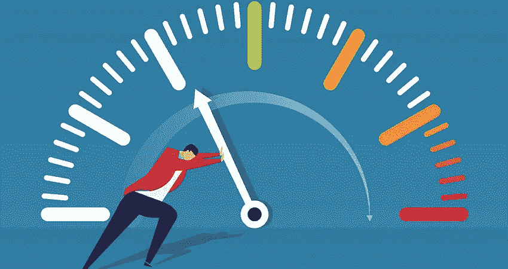

# 18 种工具和技术将提高你的工作效率

> 原文：<https://blog.devgenius.io/18-tools-techniques-that-will-boost-your-productivity-cfe56747dccc?source=collection_archive---------6----------------------->

图片来源:[https://multichannelmerchant . com/WP-content/uploads/2019/01/guy-pushing-needle-productivity-feature . jpg](https://multichannelmerchant.com/wp-content/uploads/2019/01/guy-pushing-needle-productivity-feature.jpg)

人们总是说你应该更聪明地工作，而不是更努力地工作。这是一件说起来容易做起来难的事情，在这个列表中，我将尝试总结我在日常活动中使用的工具和技术，这些工具和技术使我的生活变得更加轻松，并感到富有成效，如果你有更有效地做事的好技术或风格，请也添加进来。

**注:**

如果此处列出的任何工具存在已知的安全问题和漏洞，请立即报告。

1.  **镀铬钉扣标签**

使用 Chrome 固定标签功能来固定在其他标签中间丢失的重要 Chrom 标签。右击你喜欢的任何标签，选择“锁定标签”，我用它来锁定这些标签:
GMail
Slack
WhatsApp
Feeder(见下文)

2. **Chrome 标签组**

Chrome 允许你将多个标签分成一组，如果你有相关的标签一起打开，这非常有用。

3.**破坏 Mac 工具**

[为 MacBook touch bar 添加麦克风静音按钮。在线会议期间非常方便。Mac touch bar 有音量控制，但没有麦克风静音按钮(这是一个遗憾)。，从这里得到:https://mutify.app/#buy](https://mutify.app/#buy)
一次性付款 3.75

4.**进料器 Chrom 插件**

使用 feeder Chrom 插件从网站(如公司工程博客)或竞争对手那里读取 RSS 订阅源，以保持对我们竞争对手行为的警惕。离开这里

5. **Gmail 过滤器**

使用 Gmail 过滤器将不太重要的邮件移至其他文件夹，以便您可以稍后查看。以下是您需要的常用过滤器:
进入 GMail 设置→过滤器和被阻止的地址:
例如，过滤来自(spam@spam.com 的所有邮件)
操作→跳过收件箱，标记为已读

6.**谷歌快讯**

使用 [Google alerts](https://www.google.co.uk/alerts) 获得关于你感兴趣的特定主题的实时提醒，这对于跟踪完成情况或跟踪关于你最喜欢的关键词的在线发布非常有用。

7.**升华 Mac 文本**

打开文本文件，尤其是当它们非常大(> 1GB)时。来自:[https://www.sublimetext.com/](https://www.sublimetext.com/)

8.**梦幻 Mac 工具**

Mac 日历应用程序，使管理本地 mac 日历更容易，付费版本还增加了待办事项任务列表。来自:[https://flexibits.com/](https://flexibits.com/)

9.**拉伸 Mac 工具**

微博 app 提醒。重要的是，你可以时不时地休息一下，伸伸懒腰，喝点水，甚至远眺一下，缓解一下眼睛的疲劳。弹力会帮你的。来自:【https://hovancik.net/stretchly/downloads/ 

10.**夜班模式 Mac 选项**

如果您在晚上使用 Mac，请确定打开此选项来放松您的眼睛。遵循以下步骤:
选择苹果菜单 >系统偏好。

单击显示。

单击夜班选项卡。

11. **Gmail 未读邮件计数**

有时候，快速浏览一下 GMail 标签页，看看是否有新邮件，比打开标签页检查一下自己更快捷简单。要启用此功能，请执行以下操作:
打开 Gmail 设置→高级→启用未读邮件图标

12. **Gmail 未读优先**

在 Gmail 中，你可以将收件箱分为未读邮件和其他邮件，这样可以让你专注于重要的事情。
要启用此功能，请执行以下操作:
点击设置→收件箱类型→未读优先。
同样有用的是，在一天结束时，将所有已读邮件标记在“其他事项”中，并立即转移到存档。

13.**截图到剪贴板**

默认情况下，Mac 截屏工具会将捕获的照片保存到桌面上保存的 PDF 文件中。要改变这种行为，请确保使用正确的快捷方式将捕获的照片复制到内存中。
打开系统首选项→快捷键，指定一个简单的快捷键将选中区域的图片复制到剪贴板，我的是 Ctrl+Shift+R

14. **PresentationGO 网络工具**

免版税的谷歌幻灯片演示风格，你可以用它来使你的演示更吸引人。从现在开始，您可以完全避免使用项目符号，而是用他们库中的漂亮图表来替换它们。去这里:[https://www.presentationgo.com/](https://www.presentationgo.com/)

15. **Gmail 暂停**

需要找个人回复邮件吗？使用 Gmail 发送电子邮件，在发件箱中找到电子邮件，然后使用页面顶部的时钟图标“暂停”它。选择一个你认为他们可能需要再次追捕的时间。当这段时间过去后，它会重新出现在你的收件箱中，并且在右边会显示“x 天前打盹”,这样很容易看到。
如果收件人碰巧回复了，它会取消小睡，这意味着你永远不会有不必要的小睡邮件塞满你的收件箱。

16.**谷歌云搜索**

Google search for GSuite 用户，可以让你搜索你的账户、邮件、文档、演示文稿、表格等等。从浏览器。在谷歌 Chrome 中，进入设置->搜索->管理搜索引擎滚动到窗口底部，输入以下信息:新搜索引擎名称:云搜索关键字:cs URL:【https://cloudsearch.google.com/cloudsearch?q=%s 

点击“完成”

进行搜索:
在地址栏中，键入“cs”并按“Tab”

键入您的搜索查询

17.**磁铁 Mac 工具**

工具，自动组织你的窗口在屏幕上。可在苹果应用商店购买。

**18。临时邮件**

有些网站永远不会让你访问某些内容，除非你提供商务邮件(不允许私人邮件)，而且你知道接下来会发生什么，你的收件箱会被他们的营销邮件垃圾邮件。

永远不要使用您的电子邮件(除非您真的想使用)，使用此服务临时生成电子邮件，让您可以访问您想要的内容:

到这里:[https://temp-mail.org/en/](https://temp-mail.org/en/)