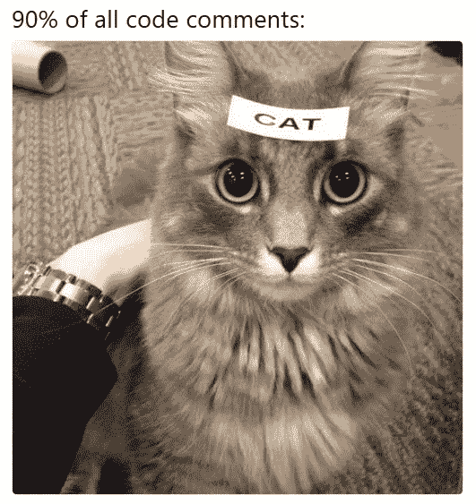

# 19 条让你捧腹大笑的代码注释

> 原文：<https://blog.devgenius.io/19-code-comments-that-will-crack-you-up-da8305d15057?source=collection_archive---------6----------------------->

## 并了解有用代码注释的规则



[来源](https://www.reddit.com/r/ProgrammerHumor/comments/8w54mx/code_comments_be_like/?utm_source=share&utm_medium=web2x&context=3)

**不**，规则不是:*“不写评论。”* ***是的，有一些好的经验法则你可以运用。*** *先看评论。*

[来源](https://stackoverflow.com/a/190139/5999670)

[来源](https://stackoverflow.com/a/344863/5999670)

[来源](https://stackoverflow.com/a/215166/5999670)

[来源](https://stackoverflow.com/a/210422/5999670)

[来源](https://stackoverflow.com/a/193577/5999670)

[来源](https://stackoverflow.com/a/192040/5999670)

无用的崩溃日志— [来源](https://stackoverflow.com/a/217681/5999670)

```
// drunk, fix later - [source](https://stackoverflow.com/a/185181/5999670)
```

```
/* I did this the other way */ - [source](https://stackoverflow.com/a/184670/5999670)
```

```
Exception up = new Exception("Something is really wrong."); 
throw up;  //ha ha - [source](https://www.quora.com/As-a-software-engineer-developer-and-or-programmer-what-is-the-most-savage-comment-you-have-ever-seen-in-a-codebase)
```

```
Before you go and change anything in the block below, please check out the PhD thesis of <X> from Kansas University engineering library and read each and every one of the 168 pages. Allocate a minimum of 2 months to be able to understand the thesis and then allocate another month to understanding the code and only then attempt to make any changes. You are hereby forewarned. - [source](https://www.quora.com/As-a-software-engineer-developer-and-or-programmer-what-is-the-most-savage-comment-you-have-ever-seen-in-a-codebase)
```

```
// I am sorry I had to do this ugly workaround. 
// I'll remove you soon, bastard! 
[Here goes the workaround code] - [source](https://www.quora.com/As-a-software-engineer-developer-and-or-programmer-what-is-the-most-savage-comment-you-have-ever-seen-in-a-codebase)
```

```
*/ the following code does not do anything but just a reminder that I am also human being, not a machine like computers, I may be a programmer , but not Robocop / Batman and this company is not Skynet, so next time don’t give me ridiculous deadlines just to cover up your frustration and fears . Be a real manager and manage yourself also/* - [source](https://www.quora.com/As-a-software-engineer-developer-and-or-programmer-what-is-the-most-savage-comment-you-have-ever-seen-in-a-codebase)
```

```
// This method takes two integer values and adds them together via the built-in
// .NET functionality. It would be possible to code the arithmetic function
// by hand, but since .NET provides it, that would be a waste of time - [source](https://stackoverflow.com/questions/143429/whats-the-least-useful-comment-youve-ever-seen?page=3&tab=active#tab-top)
```

```
// Don't know why we have to do this
```

```
//@TODO: Rewrite this, it sucks. Seriously.
```

```
// Autogenerated variables, do not edit. All changes will be undone - [source](https://www.reddit.com/r/ProgrammerHumor/comments/4zc2la/so_what_is_the_best_comment_in_source_code_you/d6ulrkj?utm_source=share&utm_medium=web2x&context=3)
```

```
Debugged by the Grace of God: Richard A. Fowlkes - [source](https://qr.ae/pGAAcp)
```

```
/*  
 * Dijkstra probably hates me. 
 */ - Linus Torvalds after using goto - linux/kernel/sched.c
```

# 代码注释不好吗？

什么时候应该使用注释？记录，如果描述不能在代码之外完成。记录供公众使用。使用注释来描述公共 API 或内部接口。

作为一个例子，我喜欢注释`env`属性。*为什么用属性代替另一个？这个属性配置的是什么？为什么我要用一个特定的值？*

*代码显示如何，注释显示为什么。*

*如何找到无用的评论？*多余的评论。描述琐碎的事情。自动生成的人工评论。注释代码。找到这些，删除它们，你会有一个更好的代码库。

*如何在没有实际评论的情况下* ***写评论*** *？测试。*我知道现在反 TDD 将会增加。如果我告诉你测试描述代码呢？*“测试可以帮助重新创建源代码”*——我公司的一位高管说。*覆盖率好的测试才是你需要的终极注释。*

*如何避免无用评论？错误的代码需要注释。避免不良代码。您可以在 clean code 上找到大量资料。*更干净的代码——更少无用的评论。**

> "多余的评论只是收集谎言和错误信息的地方."罗伯特·马丁
> 
> “每次写评论都要做鬼脸，感受自己表达能力的失败。”罗伯特·马丁
> 
> "一个长的描述性名称比一个长的描述性注释要好."罗伯特·马丁

# 参考

实用程序员安德鲁·亨特