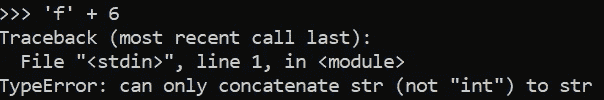
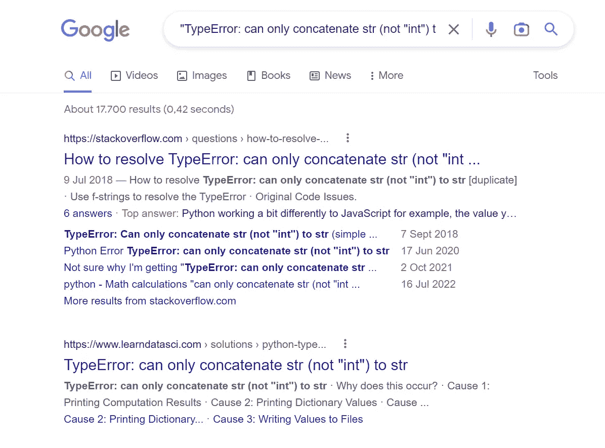
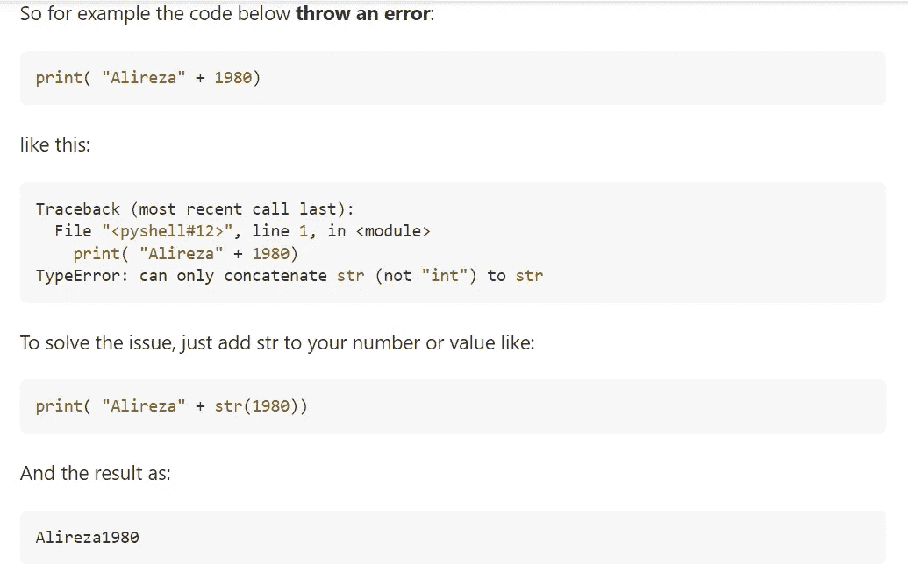
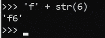

# #2.2 寻找帮助— Python 面向初学者

> 原文：<https://blog.devgenius.io/2-1-finding-help-python-for-beginners-b4938d2338b0?source=collection_archive---------15----------------------->

## 在开始编码之前，了解一些小步骤是有好处的

**编码的朋友们你们好！我回来了！**停顿了很长时间后(我会在另一篇文章中解释)，我现在要继续写作。当然，首先我将继续我的 Pyhon 初学者文章。**不再多说，我们开始吧！**

今天我们将了解如果你遇到困难或其他情况，如何寻求帮助。有一些**神奇的方法**可以帮助你找到问题的答案。

简·kopřiva 摄于 [Pexels](https://www.pexels.com/photo/photo-of-a-red-snake-3280908/?utm_content=attributionCopyText&utm_medium=referral&utm_source=pexels)

## 在互联网上寻找帮助(最佳方法)

所以，在我看来，寻找帮助的最好方法是把 Python 给你的错误复制到网上(用引号括起来)并搜索它。你会发现 houndreds 或数以千计的链接或具有相同问题的人。

请记住，很有可能另一个人以前也遇到过和你一样的问题，会有人解决了这个问题，然后给他们你的答案，你可以用这些答案。

> 对于一个问题，总有一个解决方案

一个例子:

错误

1.  Python 中出现了这个错误
2.  你想知道为什么会这样
3.  您进入浏览器，在引号中搜索问题，并添加您正在使用的编码语言(本例中为 Python)

" TypeError:只能将 str(不是" int ")连接到 str" Python

搜索

最后的步骤是:通过一个友好的、其他编码者的解释，你理解为什么会发生这种情况，并在你的代码中修复它。

[https://stack overflow . com/questions/51252580/how-to-resolve-type error-can-only-concatenate-str-not-int-to-str](https://stackoverflow.com/questions/51252580/how-to-resolve-typeerror-can-only-concatenate-str-not-int-to-str)

已修复问题—它正在工作！

**太好了，你解决了你的第一个编码问题！**

如果你不理解代码中的错误，这是解决问题的方法。我的意思是，如果你能理解他们，那就更好了，你不用去搜索任何东西。

> 好的编码员非常善于在互联网上快速搜索自己编码需要的东西。没有人能记住所有的事情。所以互联网是解决你的问题的绝佳方式。如果你知道如何在互联网上找到你想要的东西，你会成为一个更好更快的编码者！

## 其他方法(也是好方法)

解决编码问题的其他方法有:

*   如果你有一个比你更擅长编程的朋友或家人，你可以随时请他们帮助你
*   问网上的人(Discord，Reddit，…)
*   请在评论区提问
*   你可以去图书馆搜索你需要的相关主题的书籍(例如 Python )(或者购买这些书籍)
*   还有其他一些我没有写下来的好方法。有问题就想一个。但是请记住，我们随时欢迎你在这里提问，或者到网上使用你的“常用方法”

## 寻求帮助时要记住的几件事

首先要友好，不要强迫别人帮助你！人们在努力帮助你。

当你在网站上询问时，在网站上寻找问答，以遵循寻求帮助时的指导方针。

请记住这一点:

*   问的时候，不要只说发生了什么，还要说你试图做什么
*   当错误发生时说。当运行一个特殊部分或代码开始时？
*   解释你试图解决问题的方法
*   说出您使用的 Python 版本——2 或 3(在本 Python 课程中，我们使用 3)。两者之间有很大的不同。您还应该说明您使用的是哪个版本(例如:3.7)
*   说出您正在使用的操作系统(OS)(例如:Windows，…)

## 寻求帮助的良好平台

搜索问题或寻求帮助的好平台有(这些是我最喜欢的):

*   [堆栈溢出](https://stackoverflow.com/)
*   [GitHub](https://github.com/)
*   [Reddit](https://www.reddit.com/) (子编辑到编码(r/coding))
*   [不和谐](https://discord.com/)(编码的不和谐服务器)
*   还有更多

今天的课到此结束！记住上面提到的事情，你会成为一个更好的程序员，并且能够更快地解决问题。在下一课中，我们将从原始数据类型开始，开头是:**数字**。

**直到那时！**

*l0ckD2wN*