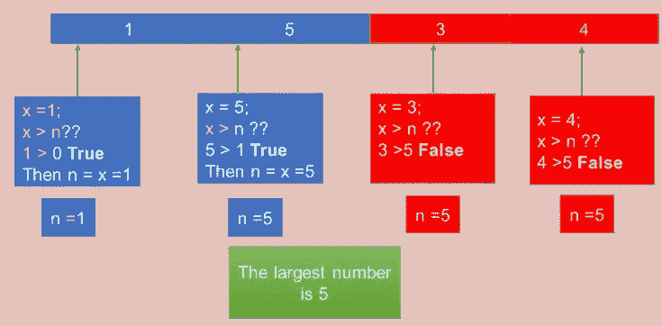

# 计算机算法简明介绍:Python 完整教程—第 2 部分

> 原文：<https://blog.devgenius.io/2-computer-algorithms-5f00efc74e6e?source=collection_archive---------7----------------------->

马库斯·斯皮斯克在 [Unsplash](https://unsplash.com/s/photos/algorithms?utm_source=unsplash&utm_medium=referral&utm_content=creditCopyText) 上的照片

**在我们开始之前，让我告诉你:**

这篇文章是 Python 完全初学者到专家课程
的一部分，你可以在这里找到它[。](https://medium.com/@samersallam92/python-complete-beginner-to-expert-course-f7626916df30)

这篇文章也可以作为 YouTube 视频[在这里](https://youtu.be/6uO9-g7H5O0)。

[https://www.youtube.com/watch?v=6uO9-g7H5O0](https://www.youtube.com/watch?v=6uO9-g7H5O0)

## 介绍

当你想用计算机解决一个问题时，首先要考虑的是求解算法。那么，什么是算法呢？它和计算机程序有什么不同？

**为了回答这些问题，本文将涵盖以下要点:**

1.  [什么是算法](#9093)
2.  [算法 VS 程序](#1ea0)
3.  [一个算法例子](#d3fe)

## **1。什么是算法**

通常，当我们遇到一个问题，想要用计算机来解决这个问题时，首先要考虑的就是求解**算法。**

算法是在有限的时间内解决问题并获得逻辑结果的一组有序的定义步骤，从这个定义中，我们可以理解，算法代表了为了解决问题而应该在程序内部实现的步骤。

通常，我们通过定义将输入映射到期望输出的(输入、输出和步骤)来制定算法。参见图 1。

图 1:算法公式(图片由作者提供)

此外，非常重要的一点是，要知道一个问题可以使用多种算法来解决，随着时间的推移，您将获得所需的经验来快速了解最佳算法。通常，我们使用不同的因素(如执行时间)来比较算法。例如，**，**我们说一种算法比另一种算法更好，如果它们达到相同的目标，但是它需要更少的执行时间。

接下来，让我们比较算法和程序，找出它们之间的关键区别。

## 2.算法 VS 程序

詹姆斯·哈里逊在 [Unsplash](https://unsplash.com/s/photos/program?utm_source=unsplash&utm_medium=referral&utm_content=creditCopyText) 上拍摄的照片

在我们理解了算法的含义之后，现在我们应该能够区分算法和程序了。

*   **算法:**它只是一个我们在其中定义(输入、输出、步骤)的问题解决方案描述。
*   **Program:** 它是使用一种编程语言的解决方案的实际实现。

因此，算法代表解决方案，而程序代表实现。

现在，为了更好地理解什么是算法，让我们看一个具体的例子。

## 3.一个算法例子

为了更好地理解这个想法，让我们举一个完整的算法例子。

假设你有下面的列表[1，5，3，4]并且你想知道这个列表中的最大数。

你作为人类，会直接说最大数是 5。

对你来说这是一个非常简单的问题，因为这个列表只有四个项目，但是如果这个列表有一百万个项目呢？

直接被你这个人类解决是很难的，还得用电脑。所以，你必须开始用电脑思考的方式来思考。

换句话说，你必须设置一个求解算法，其中你必须定义**输入**、**输出**和**步骤**。

在这种情况下:

*   **输入:**是一个正数列表，我们姑且称这个列表为(L)。
*   **Outputs:** 在这种情况下，我们有一个输出，它是这个列表中最大的数字，我们称这个最大的数字为(n)。
*   **算法步骤**
*   将(n)的初始值设置为零。
*   对于列表中的每个数字(x ),将该数字与最大的数字(n)进行比较。
*   如果发现(x)大于(n)，就用(x)的值更新(n)的值。

**我们来形象地解释一下这些步骤:** 首先，你有下面这个列表，它有[1，5，3，4]，你会把(n)的初始值设为(0)。参考图 2。

图 2:将(n)的初始值设置为(0)(图片由作者提供)。

现在我将比较 x=1 的第一项和(n)，很明显(1)大于(0)，所以我将(n)的值更新为等于(x)，x 等于(1)。参考图 3。

图 3:第一项与 n 项比较(图片由作者提供)。

对(5)做同样的比较，你会发现(5)比(1)的(n)大。所以，用(5)更新(n)的值。参考图 4。

图 4:第二项与 n 项比较(图片由作者提供)。

如果对(3)和(4)做同样的比较，会发现两种情况下(x)都小于(n)并且(n)的值不会更新，我们会保持 n 的值为 n=5。

最后，您将到达最后一项(4 ),并且不需要更多的比较，变量(n)将具有最大的数字(5)。参考图 5。

图 5:完成比较(图片由作者提供)。

## 现在，让我们总结一下我们在这篇文章中学到的内容:

安·H 在[像素](https://www.pexels.com/)上拍摄的照片

*   **算法:**是在有限的时间内解决一个问题并获得一个逻辑结果的一组有序的定义好的步骤。
*   如果我们想要制定任何算法，我们必须定义**(输入、输出和步骤)。**
*   **算法:**解决方案描述— **程序:**具体实现。

***附言*** *:万分感谢您花时间阅读我的故事。在你离开之前，让我快速地提两点*

*   *首先，要直接在您的收件箱中获得我的帖子，请在此订阅***并且您可以在此关注我***。***
*   ***第二，作家在媒介上制造了成千上万的***。为了无限制地访问 Medium stories 并开始赚钱，* [***现在就注册成为 Medium 会员***](https://medium.com/@samersallam92/membership)**，其中* *每月只需花费 5 美元。通过此链接* [***报名***](https://medium.com/@samersallam92/membership) *，可以直接支持我，不需要你额外付费。*****

**

萨梅尔·萨拉姆** 

## **Python 初学者到专家的完整课程**

**[View list](https://medium.com/@samersallam92/list/python-complete-beginner-to-expert-course-32d3a941c05e?source=post_page-----5f00efc74e6e--------------------------------)****21 stories**************

**要回到上一篇文章，您可以使用以下链接:**

**[第 1 部分:编程介绍](/1-introduction-to-programming-633ba4b94cba)**

**要继续阅读下一篇文章，您可以使用以下链接:**

**[第三部分:什么是蟒蛇](/3-what-python-is-c92b5656bd6d)**