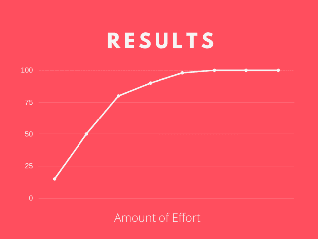
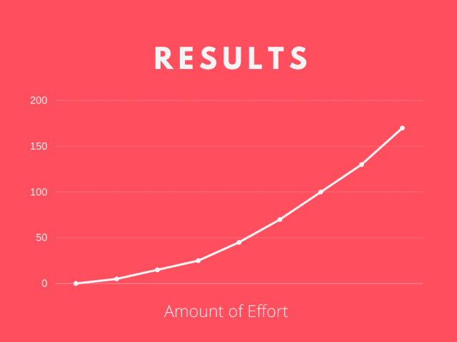

# 2 个简单的习惯让你成为更好的开发者

> 原文：<https://blog.devgenius.io/2-simple-habits-to-make-you-a-better-developer-305f4d92fd0e?source=collection_archive---------5----------------------->

## 通过这些简单可行的习惯，让你的开发生涯更上一层楼。

图片由 [Free-Photos](https://pixabay.com/photos/?utm_source=link-attribution&utm_medium=referral&utm_campaign=image&utm_content=1245714) 来自 [Pixabay](https://pixabay.com/?utm_source=link-attribution&utm_medium=referral&utm_campaign=image&utm_content=1245714)

在我大学毕业后的第一份工作中，我被卷入了新技术、电子邮件、管理和 JIRAs 的旋风中。当我掌握从学生转变为专业人士所需的所有新技能时，我只能勉强维持生活。

最终，我开始适应新的角色。我知道从日常会议中可以期待什么，并且可以完成一个改变(通过测试！)全靠自己。成为专业人士时，最初学习新技能的动力开始消退。我开始怀疑，是不是所有的都有了？不断追赶我的众所周知的尾巴，试图“跟上”最新的技术？

我带着一个问题来到我的导师面前:“我如何保持成长？”我满以为他会告诉我去学习一项新技术或者增加工作时间。相反，我得到了两个简单可行的习惯，与技术无关。从那以后，我的职业轨迹像火箭一样起飞了。

# 超额交货

我提前完成了我的代码修改，并且质量很高。我练习干净的代码，并且总是寻求反馈。我的经理对我的表现给予了积极的评价，但并不特别。我觉得自己已经准备好成长了，但我的经理似乎没有这种感觉。我对日复一日的单调工作感到沮丧，我已经准备好做更多的工作。为什么我的经理没有让我接手令人兴奋的新项目？我错过了什么？

我的导师向我解释了超额交付的重要性。如果你想让你的经理给你更多的责任，让他们知道你可以*做更多的工作。在没有任何证据表明我有能力处理新事物的情况下，我的经理为什么要信任我？我所展示的是我能处理好目前的工作量。如果我准备好了更多，我当然可以通过我的作品展示出来。*

# 足够好还不够好

在学校，做“足够多”通常是你获得最高分所需要的。没有理由做额外的事情，因为这对你的成功没有帮助。如果有什么不同的话，那就是它让你慢了下来。结果图表如下所示:

然而，在工作中几乎相反。尽最大努力完成任务是标准。简单地做要求做的事情很少有回报。结果图看起来更像这样:

不仅你在工作中可以达到的结果没有上限，而且额外的努力会带来更多的结果，而不是更少。一点点过度交付会导致很多额外的结果。超额交付很简单——只要比要求的做得更多。

有了努力影响的知识，我的导师建议我保持以下习惯:每分配给你 4 项任务，完成 1 项*额外的*任务。通过这样做，我向我的经理和同事灌输了这样一种观念:我足够高效，能够持续地做得比要求的更多。

实施这一做法后不久，我的经理很兴奋地给了我新的职责。显然，我不仅能处理好当前的任务，还能发挥创造力，找到提供额外价值的方法。

这里有一些简单的想法，可以为你的团队提供额外的价值:

1.  完成待办事项中的额外变更。最好是优先考虑的事情，或者是你的经理特别要求但没有人有时间去做的事情。
2.  为开发人员改变生活质量，或者重构一个已经引起麻烦的组件。
3.  创建或更新文档和培训材料。
4.  创建一个工具或过程来帮助你的团队更有效率。例如，测试框架或构建过程升级。

# 阅读

我愉快地航行着，定期超额交付，稳步增长我的职责和专业知识。通过继续超额交付，我不断学习新的*增量*技能。我非常关注我的工作质量，这给了我现有技能的增量收益。当我承担新的责任并从事超额交付时，我能够学习并掌握新的相邻技能。

这样过了几个月，我进入了一个不断提高技能的循环。我成为了一些技术和商业领域的主题专家。我帮助教育其他新人，让他们成长为自己的角色。但是*我的*下一步是什么？我觉得自己在成长，但这和我已经做的事情并没有太大的不同。

# 增量是不够的

我需要的是根本性的改变。我在寻找同样适用于我日常工作的全新技能和想法。这种新思想的来源是什么？答案很简单:读书。

通过阅读，你可以深入接触新思想。不管你读到什么，总会有交叉适用性。选择一个主题，然后开始阅读。我收到的最好的建议是，每天抽出 30 分钟来阅读。在你的日历上划掉它，并坚持下去。一旦你养成了定期阅读的习惯，你可以试着结合各种体裁:

1.  自我提升(传奇人物彼得·德鲁克的[高效执行者](https://www.amazon.com/Effective-Executive-Definitive-Harperbusiness-Essentials/dp/0060833459)
2.  软件工程理论([干净代码](https://www.amazon.com/Clean-Code-Handbook-Software-Craftsmanship/dp/0132350882)和[设计模式](https://www.amazon.com/Design-Patterns-Elements-Reusable-Object-Oriented/dp/0201633612)都是经典)
3.  创业([零比一](https://www.amazon.com/Zero-One-Notes-Startups-Future/dp/0804139296)是我的最爱)
4.  你的行业(我从事金融行业，所以我阅读了[Incerto](https://www.penguinrandomhouse.com/series/INO/incerto)
5.  技术(我目前正在通过[云原生 Java](https://www.amazon.com/Cloud-Native-Java-Designing-Resilient/dp/1449374646) 工作)

通过阅读这些书，我把我的世界观从我工作的直接关注扩展到许多高层次的想法。实施这些想法并采取行动，为我的职业生涯提供了不可估量的价值。给你的老板和同事留下你在事业上有所成就的印象的最简单的方法是成为新思想的持续来源。这意味着你不仅在做你的工作，还在思考你的工作。

最棒的是，图书馆的书是免费的。懒得像我一样去图书馆？使用像 [Libby](https://www.overdrive.com/apps/libby/) 这样的应用程序，在你最喜欢的 kindle 设备(或手机)上阅读免费书籍。即将到来的还书截止日期帮助我坚持阅读。

# 成功来自习惯

一致性是我职业生涯的关键。通过坚持超额交付和持续阅读，我总是比我的经理期望的要超前一两步。我的职业生涯开始腾飞，在短短的 3 年里，我接管了我们客户的新旗舰支付产品的功能架构。我敢肯定，如果你坚持下去，你也会粉碎你的目标。

1.  每分配 4 项任务，额外交付 1 项。
2.  每天阅读。