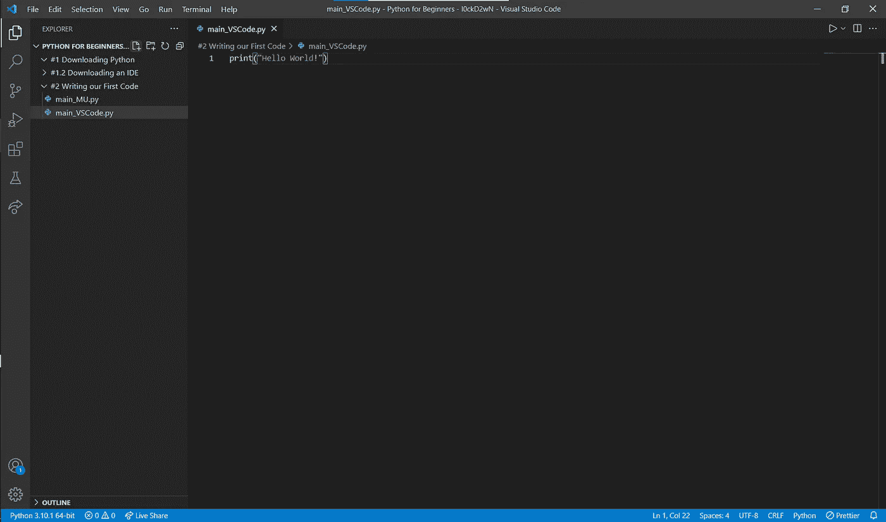

# #2 编写我们的第一个代码——面向初学者的 Python

> 原文：<https://blog.devgenius.io/2-writing-our-first-code-python-for-beginners-f1348337e526?source=collection_archive---------5----------------------->

## 成为职业程序员的重要一步

就像我说的，今天我们要写我们的第一个(源代码)代码！激动吗？

**我们开始吧！**

照片由 [**扬·kopřiva**](https://www.pexels.com/@koprivakart?utm_content=attributionCopyText&utm_medium=referral&utm_source=pexels)发自 [**Pexels**](https://www.pexels.com/photo/photo-of-a-red-snake-3280908/?utm_content=attributionCopyText&utm_medium=referral&utm_source=pexels)

# 如何用 Python 打印东西

我们的第一个程序将会输出 **Hello World。**为了打印出我们的文本，我们将使用——猜猜是什么——集成在 Python 中的打印功能。

print 函数是一个内置函数，可以用来打印一些东西。它的工作原理是输入 print 并在其后加上方括号“()”，您可以通过按下 **SHIFT+9** 来输入。在括号中，我们通过按下 **SHIFT+2** 来加上引号""，这是 Python 中的直引号。在引号之间，我们将放置我们的文本。

# 创建新文件

如果你知道如何在 VS 代码中创建一个文件和文件夹，你可以跳过这一步。否则，我就在这里给你看。

在 VS 代码中，点击**文件**，然后点击**将文件夹添加到工作区…**

完成后，会弹出一个小窗口，显示你要添加的文件夹。搜索你为这个系列创建的 **Python 初学者**文件夹(在 **#1 下载 Python** 中)。单击它，它会被标记为蓝色。现在点击**添加。**

现在，在 VS 代码编辑器左侧的文件部分中有了一个新的部分。点击右边的**+文件夹**，如图所示。

现在点击你创建的文件夹，它被标记为蓝色并被打开。接下来就是点击**+文件夹**按钮旁边的**+文件**。现在将文件命名为 **main.py** 。我们称它为 **main.py** ，因为当我们需要这样做时，在命令提示符下运行它会更容易。你也可以把它叫做 *banana.py* ，但是要记住你的名字要选好。结局**。py** 比名字更重要，因为你的计算机只知道它是一个 Python 文件。py 。否则，您将无法以正确的方式运行您的代码。你也不会得到建议。

现在你可以在你的文件中编码了。就像我在**一节中解释的如何用 Python** 打印一样，你需要输入 *print* ，这是一个内置函数。然后你需要在打印后加上括号，在括号之间加上引号。你需要把你要打印的信息放入引号中。当我们想要打印 **Hello World** 时，你必须把 **Hello World** 放在那里。下一步是运行代码。你可以使用快捷键 **CTRL+ALT+N** 或者点击 VS 代码右上角的“play”按钮(如果你安装了 Code Runner 扩展)来完成这个操作。几个步骤之后，我还将通过命令提示符向您展示更复杂的方法。

今天我还将向您展示如何在 MU 代码编辑器中编写和运行您的代码。您可以通过点击**新建**来创建一个新文件。之后你可以在这里写你的代码。键入 print，然后括号，然后引号，然后文本**Hello**World。您可以点击**运行来运行程序。**应该输出 Hello World。

# 在命令提示符下运行 Python 程序

要在命令提示符下运行代码，您需要将工作目录更改为保存 Python 文件的目录。你可以通过使用 **cd** 命令，然后把**文件路径**放在你的命令后面。之后，您可以通过键入 python 和文件名来运行您的代码。别忘了**。py** ！就像下面这样做。

今天的课到此结束！尽管这是一堂较短的课，但却是一堂重要的课。在下一课中，我们将从原始数据类型开始，在开头:**数字**。

**直到那时！**

*l0ckD2wN*