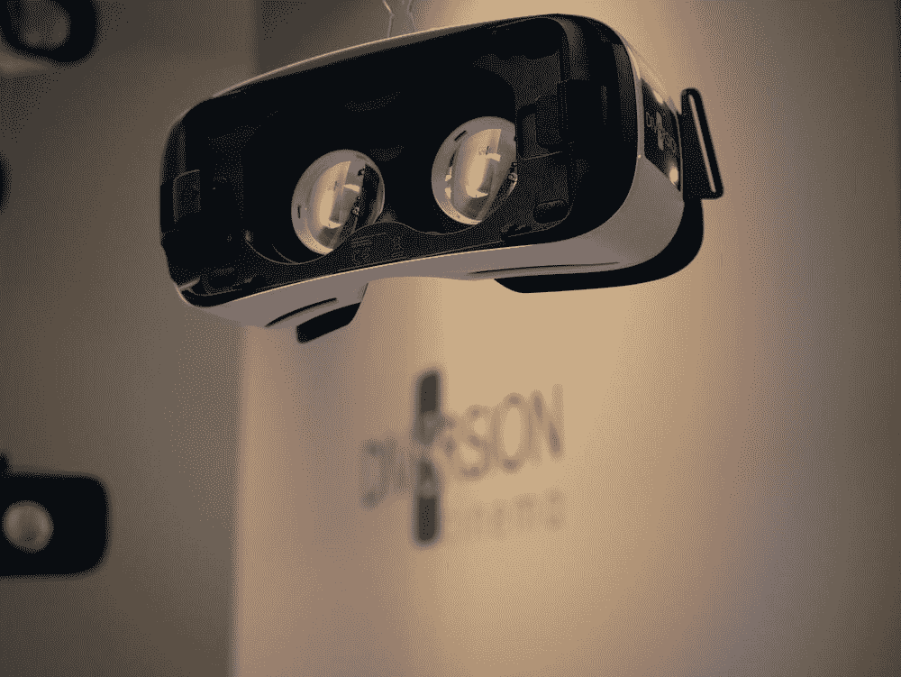
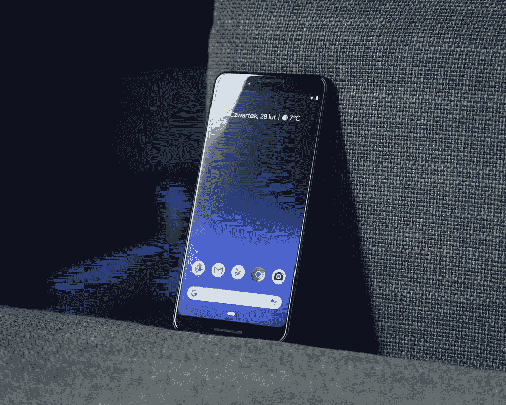
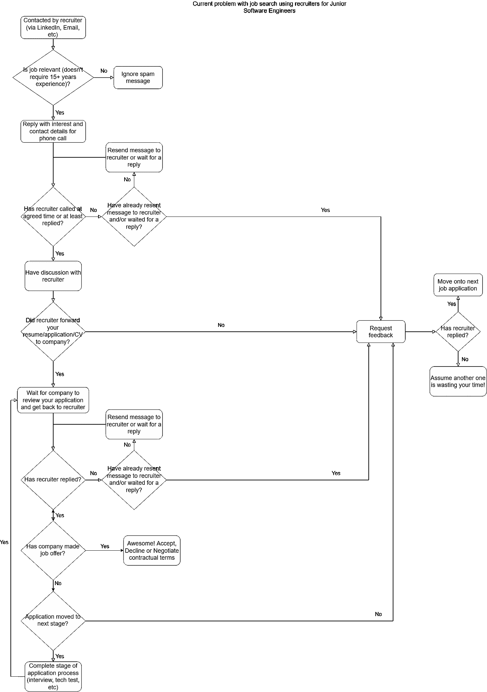

# 200 多份工作申请之后…

> 原文：<https://blog.devgenius.io/200-job-applications-later-479d41dbed93?source=collection_archive---------7----------------------->

这在现在绝对是荒谬的……(包括一个可能会有积极和意外帮助的结论！)

克里斯蒂安·埃尔富特在 [Unsplash](https://unsplash.com/) 上拍摄的照片

# 我的求职之旅

自去年 9 月(2019 年)以来，我大部分时间都在找工作，也就是说，我可能会在这里或那里休息几天或一周，但不是那么频繁。关于申请的数量，我至少在过去的 5 个月里一直在跟踪，我已经发出了 170 份申请(是的，我感觉到了找工作的倦怠！).

照片由[韦斯利·廷吉](https://unsplash.com/@wesleyphotography)在 [Unsplash](https://unsplash.com/) 拍摄

# AR/VR 开发者

斯特拉·雅各布在 [Unsplash](https://unsplash.com/) 上拍摄的照片

我开始申请 AR/VR 角色，因为这是我真正感兴趣的。经过了多个面试阶段，进入了面对面的面试阶段，**关于为什么我没有得到这个职位**，这归结为经验和具体技能。

# Android 开发者

[托马什·扎戈尔斯基](https://unsplash.com/@tomaszzagorski)在 [Unsplash](https://unsplash.com/) 上的照片

然后我开始申请我更有经验的东西，那就是 Android 开发。随着时间的推移，我已经完成了许多技术测试，有些需要我整个周末的时间，但我并不介意，因为我设法完成了所有必需和可选的任务，所以对进入下一次面试有着积极的感觉。除非你是一名软件工程师，或者经历过类似的应用程序流程，否则很难想象当你听到一个“不”字时会有多么沮丧和沮丧，因为你没有以某种方式实现应用程序，而这种方式实际上并没有在指令中传达给你。 我就遇到过这种情况，我被告知从一个 API 中检索数据，并以某种方式显示，添加某些 UI 转换(在 Android 中)。我完成了任务，并对我的解决方案感到满意。我基本上被告知，解决方案应该以某种方式被编程，并且有一个从未向我传达的这些期望的列表。那太荒谬了，会惹恼很多好人。

这是我在一年紧张的(我是说紧张的)求职、申请、积极的信号和失望之后的感受，没有人费心为你提供个性化的反馈……大多数时候……我也想感谢那些确实给我提供了有益反馈的人。

# 全栈开发者

[食客集体](https://unsplash.com/@eaterscollective)在 [Unsplash](https://unsplash.com/) 上的照片

不管怎样，我接着申请了一般的软件工程职位，也就是初级的全栈开发人员职位。我以技术测试和面对面的形式获得了一些面试机会。**一项技术测试花了 7 天时间才完成！这个特殊的技术测试与其他测试不同，它得到了回报，我进入了下一阶段……更多的编码测试形式的技术内容。老实说，我认为我在带回家的编码任务上花了太多的时间和精力，以至于在白板编码测试中犯了一些愚蠢的错误…尽管我们都是人！尽管我一直在等待一个不可避免的决定，那就是我的申请不会进入流程的下一个阶段，**反馈实际上非常有帮助和个性化** …这带来了很大的不同。不过，总的来说，正如我所料，我从事全栈开发工作的经历是一种混合的结果。我知道有很多其他人经历了同样的事情，所以当时只是接受了获得一个职位的过程和挑战。这之后不久，整个柯维德·疫情就出现了…**

> 只是澄清一下，Covid 和找工作的时机显然使任何人都更难找到工作，有些人已经失业了。我很感激所有这些事情，但是我对当前失败方法的经验以及缺乏招聘人员的个人经验等在很大程度上与 Covid 无关，也就是说，不是 100%由于 Covid……尽管 Covid 发生了也会发生。

# 自从 Covid 封锁以来

自从 Covid 被锁定到现在，我一直致力于教学软件开发，建立自己的副业项目，申请工作，并开始了这个博客。即便如此，一些公司、招聘人员等。无法理解给我(可能还有其他人)提供初级开发人员级别的薪水的投资回报，不像其他公司看到的那样，比如空中客车和华特·迪士尼公司。

我在 2019 年 9 月以来申请大三/研究生、入门甚至实习生级别的角色时，发现了以下几点:

1.  公司想要入门级等水平的工程师，薪酬反映了这一点，但他们希望你有这个行业和现实世界的项目经验，从头开始实施的事情。这根本不现实，因为你在大学里从来没有真正学到过(至少我没有)。
2.  申请过程是如此的严格，你可以花这么多时间进行技术测试、面试等，然后简单地给出一个“你的申请没有进展”，即使在询问了大约 95%的时间后也没有任何反馈。
3.  与招聘人员合作招聘初级职位…好吧，这是一个主要的痛点。*(注意:* ***我将在下面的段落中更多地提到这一点，以及我个人如何解决这一问题。*** )所以和招聘人员一起工作在很大程度上是很奇怪的。只是为了澄清一些事情。我用过的某些平台有点用，但不是真的…否则我不会写这篇文章。有些招聘人员很好共事，但是大多数都…很糟糕…我是说完全糟糕。
4.  即使在开了博客、完成了兼职项目和教授软件开发之后，公司仍然没有兴趣给我提供薪水！

我意识到这篇博客的大部分内容给人的感觉是咆哮……但是在花了一年时间申请工作并付出了 110%的努力却没有得到任何回报之后……我真的不在乎诚实和分享我的经验来帮助别人。

# 目前初级软件工程师的招聘问题

照片由[猎人在](https://unsplash.com/@huntersrace) [Unsplash](https://unsplash.com/) 上比赛

> 我希望下面的图表是可读的(我已经做了一些编辑，但是如果它是不可读的，请留下信息),并有助于显示当前问题的流程图和逻辑表示。这个过程是基于我的经验，我相信你能理解这个艰苦的过程。

我提到过这是初级软件工程师当前面临的问题，但是我相信还有其他工作和领域也适用于这个问题……虽然我不知道其他完全不同的求职经历，所以我不会假装也不会在这里写这些:)。

WTF 糟糕的当前求职经验使用招聘人员

# **开始自己的旅程(结论)**

帕特里克·托马索在 [Unsplash](https://unsplash.com/) 上拍摄的照片

综上所述，我已经决定着手解决这个问题。我想你会称之为创业:)，因为我打算和其他人一起工作来实现这个愿景。我决心用目前失败的方法为这种极其糟糕的求职经历提供一个解决方案，这样伟大的人(尤其是那些正在阅读这篇文章的人:)就不必经历我和许多其他人都经历过的充满焦虑的经历了！

感谢您的阅读，如果您想分享您的求职经验，请随时留言。如果你喜欢这个内容，请随时加入我的邮件列表:【https://www.subscribepage.com/x9b5l0】T5 T6

# 跟着我看 https://www.tiktok.com/@theinspiringprogrammer?lang=en 抖音⏰