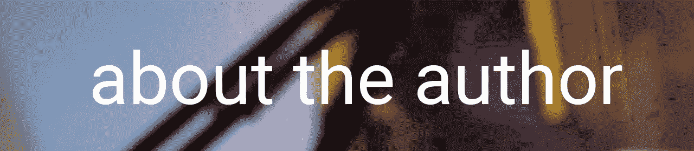

# 第 200 篇关于软件开发的文章

> 原文：<https://blog.devgenius.io/200th-article-on-software-development-fe4c8dbf7a6b?source=collection_archive---------16----------------------->

一天一篇文章会让你立刻拥有 200 篇文章。有点超现实。这让我想起了我开始阅读一万篇文章的时候。毫无疑问，这是一个雄心勃勃的目标，但我知道如果我继续阅读，它最终会实现:11，500 篇文章之后，我还在增加我的数量。

 [## 50 本书和 10，000 篇文章帮助我成为一名软件开发人员和一个人

### 在与陌生人交谈时，我收到的十大问题之一是“你读什么？”虽然我…

dinocajic.medium.com](https://dinocajic.medium.com/50-books-and-10-000-articles-that-helped-shape-me-as-a-software-developer-and-as-a-person-a3309e7950b2) 

目标是在 3 年内达到 1000 篇文章。开了个好头。开始是最困难的部分。有几次我想放弃，而且几乎放弃了一部分。直到我遇到了一个连续的博客。他给了我一些见解，最重要的是，他说他喜欢接受挑战来激励自己。

## 365 天挑战

在接下来的 365 天里，每天写一篇文章。不管你是快乐、悲伤、疲惫还是生病。每天写一篇文章，确保你在最好的日子里尽可能多的努力。这句话的最后一部分很难。有时候你想写只是为了把它从你的清单上划掉。好了，我做到了。我没有毁了我的 365 天挑战。

但是一旦你写了一定数量的文章，如果你没有写一些有意义的东西，你会开始感到尴尬。

## 我计划如何实现这一目标

*   人们感兴趣的软件开发研究课题。
*   围绕这些主题写作，并注入我的经验。
*   关注教程系列和行业经验文章的组合。

## 一些即将到来的内容的具体例子

*   结束 PHP 系列
*   Laravel 系列(PHP 系列引入了这一点)
*   算法代码系列
*   JavaScript 系列
*   Vue.js 系列
*   Java 系列
*   机器人建筑系列
*   软件开发代理成功
*   软件开发机构的客户成功(关注客户，因为我一直在过道的两边)

## 我曾经厌倦过写作吗？

绝对的。幸运的是，我有一个非常支持我的家庭:我的妻子和儿子。我儿子认为这是我的主要工作。他经常说，“有一天，当我长大了，我要像你一样写书和文章。”谁还需要更多的动力呢？

读者的反馈也非常令人鼓舞。我有一个读者说我写的关于 [C 编程语言](https://medium.com/swlh/a-high-level-introduction-to-the-c-programming-language-f5ada5a5bd5d)的文章帮助她进入了她的博士项目。那是我最快乐的时刻。

## 结论

我很兴奋地看到我看到了第 200 篇文章，并想感谢所有的读者和订阅者。再敬 800 块。

迪诺·卡伊奇目前是 [LSBio(生命周期生物科学公司)](https://www.lsbio.com/)、[绝对抗体](https://absoluteantibody.com/)、 [Kerafast](https://www.kerafast.com/) 、[珠穆朗玛生物](https://everestbiotech.com/)、[北欧 MUbio](https://www.nordicmubio.com/) 和 [Exalpha](https://www.exalpha.com/) 的 IT 主管。他还担任我的自动系统的首席执行官。他有十多年的软件工程经验。他拥有计算机科学学士学位，辅修生物学。他的背景包括创建企业级电子商务应用程序、执行基于研究的软件开发，以及通过写作促进知识的传播。

你可以在 [LinkedIn](https://www.linkedin.com/in/dinocajic/) 上联系他，在 [Instagram](https://instagram.com/think.dino) 上关注他，[订阅他的博客](https://www.dinocajic.com/)，或者[订阅他的媒体出版物](https://dinocajic.medium.com/subscribe)。

阅读 Dino Cajic(以及 Medium 上成千上万的其他作家)的每一个故事。你的会员费直接支持迪诺·卡吉克和你阅读的其他作家。你也可以在媒体上看到所有的故事。