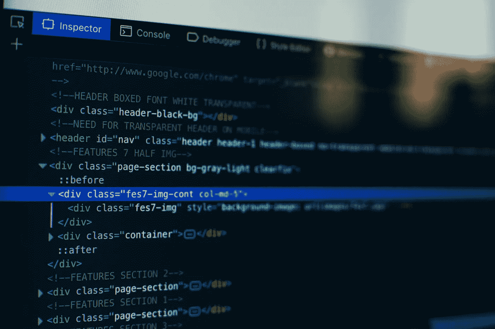

# 2020 年或以后，成为一名 web 开发人员的道路仍然是一样的。

> 原文：<https://blog.devgenius.io/2020-or-beyond-the-path-to-becoming-a-web-developer-remains-the-same-3f2aa168e77f?source=collection_archive---------26----------------------->

每年，成千上万的初级程序员都在努力成为一名 web 开发人员。在某种程度上，它让 YouTube 频道每年的“今年的网络开发技巧”视频受益匪浅。然而，大多数人没有意识到的是，这几乎是一条基本相同的道路，只是添加了一些新兴和流行的框架。

这里列出了一些将保持不变的重要事情。

## 1.你必须从 **HTML/CSS** 开始

所有新手都应该从 HTML 开始，学习浏览器如何理解代码。一旦熟悉了标签并能轻松地创建一个基本的模板，他/她就应该继续使用 CSS 进行适当的格式化和样式化，并尝试使用类和 id 等等。

## 2.学习至少一个 CSS 框架

一旦 HTML 和 CSS 被涵盖，所有新的开发者应该学习至少一个 CSS 框架，无论是 bootstrap 或 tailwind 或 bulma 或一些全新的东西。学习 CSS 框架可以减少一半的样式工作。

## 3.熟悉 DOM 操作(使用 JavaScript)

尽管像动画、幻灯片、显示文本等大部分内容都是由 CSS 处理的，但是引入 JavaScript 和 JS 库中臭名昭著的 jQuery 还是很有帮助的。您不仅可以操作 DOM，还可以在熟悉 JavaScript 的同时获得一些编程的想法。

## 4.想想吧！想想吧！！想想吧！！！这是你决定自己道路的地方

在我看来，这是你必须做出坚定决定的时间和地点。我希望当我达到学习的这个阶段时，有人告诉我这些。

也许你来自学习一些平面设计，并对模板和标志设计感兴趣，这一切对你来说已经太多了，或者你想继续建立你的前端开发技能。或者你可能想做一些服务器端编程，只做服务和后端，而其他人处理所有这些事情。无论哪种方式，或者任何其他方式，这是你必须决定的地方，然后采取正确的道路。**这里的大长毛是前端还是后端？**“问题来了。

**前端路径:**如果你的问题是“我喜欢设计吗？我喜欢操纵数据，把它们漂亮地呈现出来吗？我想让客户和用户轻松查看网站和应用程序并与之交互吗？”你对所有这些问题的答案都是肯定的，那么选择这条路就是正确的选择。以下是你现在的前进方式:

*   响应式设计:网站不太可能只在台式机或笔记本电脑上浏览。我最近访问的几个新网站都是通过手机浏览器访问的。所以，如何让一个网站兼容任何设备，是通过学习如何创建一个响应式设计。
*   **浏览器开发工具:**大多数高级浏览器都附带了开发者工具。这些工具允许你测试和检查你的站点上的错误和 bug。因此，如何网站的表现，有错误或没有，慢或快，所有这些都可以用这个工具来检查。
*   **选择一个 JS 框架:**虽然 JavaScript 功能强大，但是框架为你简化了很多事情。你将主要学习处理 UX(用户体验)，处理数据，把它们放在模板中正确的位置等等。新的 SPA(单页应用程序)框架每天都在涌现。但是我认为前三名是 VueJS、ReactJS 和 AngularJS，其中我个人推荐 Vue，因为它有更快的学习曲线。
*   **命令行:**现在您将使用一个现代 JS 框架，一些命令行知识是必须的。也许你需要为一个 reactJS 项目引入一些组件，或者让它在你的机器上本地运行，或者把它推到一个仓库，命令行将成为必须。

如果你已经决定把所有的前端任务留给其他人，而你在网站的服务端编程，那么你应该走这条路。作为后端开发人员，您需要学习以下内容:

*   **服务器端语言知识:**你之前学的那些框架(React、Vue 等)都是基于 JS 这种客户端语言的。你需要学习并精通至少一门后端语言。PHP、Ruby、Python、Java 是一些入门的语言。选择一个并着手去做。就像 Vue 和 React 一样，许多后端编程语言也有框架，所以你也应该深入研究一下。
*   **编写 API:** 如果你要和一个技术高超的前端开发人员或者移动应用程序开发人员一起工作，那么学习编写 API 是必须的。相信我，这些场景将出现在后端开发人员的生活中，他们必须至少与其中一人合作。
*   **数据库知识:**一个后端开发人员应该具备一定的数据库知识。如何通过查询并将逻辑思想写入代码，在大多数情况下也是由数据库知识支持的。

有了这两个，你可以隔离你的路径。然而，如果你有足够的时间和意愿来学习完整的前端和后端开发，那么你肯定可以这样做，并把自己称为一个**全栈开发人员**。而且有一些前端和后端开发人员都应该知道的常用技巧。其中一些列举如下:

*   饭桶
*   在服务器上部署应用程序
*   美国石油学会(American Petroleum Institute)

总而言之，对于全世界所有的开发者来说，一切都是一样的。当然，您可以探索更多，并从沿途继续的附加路径中获得更多。但大多数情况下，你最终会做到以上所有的，只是对你选择学习的语言做了一些改变。我建议你不要在不同的语言间跳跃。一旦你熟悉了一种特定的语言，切换到另一种语言会容易得多，而不是试图一次学会大多数语言。