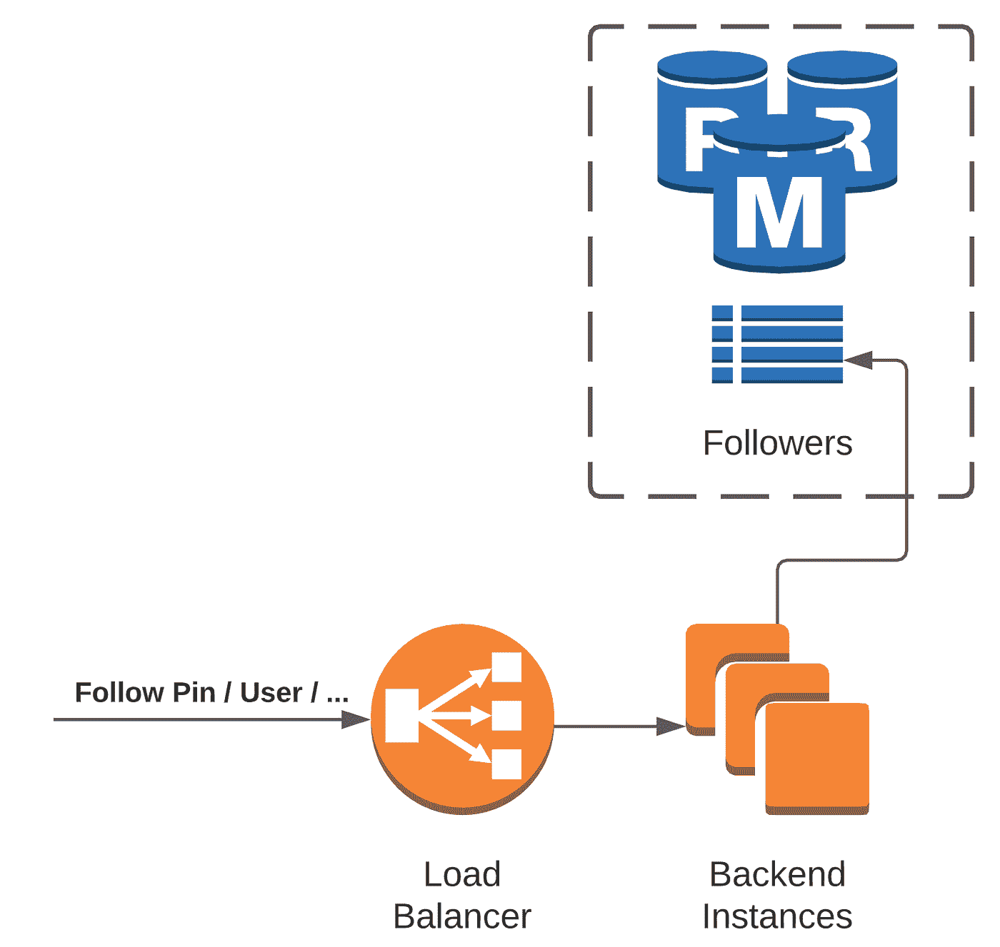

# Pinterest 系统设计面试(2020):跟随图钉

> 原文：<https://blog.devgenius.io/2020-pinterest-system-design-interview-1-37f3a721f3e?source=collection_archive---------0----------------------->

今天又为大家准备了一篇 Pinterest 技术面试教程。从上一个教程开始，我复习了从[第一次电话屏幕面试](https://intuting.medium.com/pinterest-technical-phone-interview-2020-6d211ab74dd1)收到的算法问题。那次面试后，我被邀请去做**远程现场面试**(由于 Covid..)

以下是我收到的远程现场面试的**邀请邮件**:

需要注意的一点是，因为这是远程现场面试，他们给你一个小时的时间进行系统设计面试，因为通过**代码板**解释事情会更困难。

# 系统设计面试问题

面试问题是为 Pinterest 中的新功能提出一个系统设计，用户**可以跟踪 pin 或用户更新**。例如，让我们说我跟随上面的大头针。每当这个 pin 码有更新，我都会收到通知。如果我关注某个用户，当他/她发布或编辑 pin 时，我应该会收到通知。

# 你自己试试

S 这样你会学到更多！！

# **了解问题&范围**

在开始设计之前，我们应该通过向面试官提出适当的问题来充分了解问题及其范围。

**功能需求:**

*   用户应该能够关注不同的用户或 pin。
*   应通知用户他们关注的用户/pin。

**利益相关方&用户:**

*   对于任何 Pinterest 用户来说。

# **了解模式/规模**

然后，我们应该尝试了解我们正在处理的是哪种请求/数据量。你可以问这样的问题:

*   Pinterest 的用户数量是多少？
*   我们正在处理多少请求？
*   读写操作的比率？

如果你在面试前做了一些调查，你应该能得出一个大概的数字。

*   **用户数量:几百万用户。**
*   ****引脚数:几十亿个引脚。****
*   ******QPS:** 假设有 100 万 QPS(某个合理的大数字)****

****此外，Pinterest 的应用性质决定了它必须处理更多的读取操作。你还可以问其他问题，但你应该在完成初始设计后再跟进，比如:****

*   ****理想的 SLA****
*   ****安全需要。****

# ****系统设计****

****我们可以将设计分成几个部分:****

*   ****关注实体(用户或 pin)****
*   ****为 pin 更新创建通知****
*   ****向用户发送通知****
*   ****处理太多关注者的更新(例如，100 万关注者)****

# ******1。跟随实体******

****问这里的主要问题是，当用户点击 pin 或用户上的“关注”按钮时会发生什么？****

****我们应该在后端服务器上创建一个端点来存储追随者关系。当前端(移动或 web)点击这个端点时，它会在数据库中持久化追随者关系，并将成功响应返回给用户。其他错误响应(例如，网络问题或无效响应)****

********

****这里，我们使用一个关系数据库来存储追随者关系。面试官肯定会问你为什么不使用其他类型的数据库(例如，基于图形或文档的数据库)。****

*   ******非关系数据库(如 MongoDB)** :不太适合存储关系。它适用于存储不经常更改的一对一映射数据。****
*   ******图形数据库(例如 Neo4j):** 当我们需要处理实体之间的深度关系时，图形数据库非常有用(例如，在脸书的社交网络中，我们希望找到朋友的朋友的朋友)。然而，在我们的例子中，我们只是指用户和实体之间的关系(一对多)。****

****因此，在这里使用关系数据库是有意义的。此外，我在采访前做了一些研究，Pinterest 使用关系数据库来存储 pin，因此使用另一种类型的数据库来存储追随者关系是没有意义的。****

****以下是 follower 表的示例数据模式:****

********

****用于用户和实体 uuids 的列。另一列指定实体的类型(PIN 与用户)。最后，用户开始关注实体时的时间戳列。****

# ****2.创建通知****

****现在我们有了数据库中持久的追随者关系，我们需要找出一种方法来创建通知，无论何时被跟踪的 pins 用户进行更新。****

********

****每个创建或编辑 pin 的请求都将通过调用后端服务器中的端点来完成。后端服务器会将更新保存在数据库中(Pinterest 使用关系数据库来存储 pin)。****

****我们可以选择异步**或同步**或**创建通知:******

*   ******同步方法:**在数据库中持久化更新后，后端服务器会在将成功响应发送回用户之前向相关关注者显式发送通知。这并不理想，因为这会显著增加写操作的延迟。****
*   ******异步方法:**在数据库中保存更新后，后端服务器将创建一个任务来发送通知，并将成功响应发送回用户，而无需等待通知完成。****

******异步方法**对于通知来说更有意义，因为它对于用户请求来说并不重要。我们不应该让用户等这么久才创建或编辑 pin。****

****一种方法是在 **pins 表上注册一个触发器，**监听任何更新，并向 Kafka(一个消息代理)发布更新消息。我们可以使用类似[卡夫卡连接](https://docs.confluent.io/platform/current/connect/index.html#:~:text=Kafka%20Connect%20is%20a%20free,Kafka%20Connect%20for%20Confluent%20Platform.)的东西来设置事情。另一种方法是在发送成功响应之前，根据用户请求向 Kafka 显式发布消息。****

****然后，我们可以创建订阅该主题的工人，并在有关于该主题的消息时创建通知。在创建通知之前，工作人员必须查找 followers 表来检索关注更新 pin 的用户列表。****

# ****3.发送通知****

****问我们实际上如何向用户发送通知？在采访的开始，他们告诉我要把通知服务当作一个黑盒。但是在最初的设计讨论之后，我们又回去讨论了它的实现。****

****在像 Pinterest 这样的大公司，最有可能有一个集中的通知服务。****

********

****通常，通知是异步发送的，它们有不同的优先级。为了处理不同种类的通知，不同的优先级会有不同的队列。****

****除非另有规定，否则我们可以将通知视为低优先级，并在低优先级队列中发布通知。****

****一旦我们在队列中发布了通知消息，就会有通知工作器订阅队列并尝试向用户发送通知。这些工作者必须找到与用户有开放连接的后端实例，并转发通知。****

## ****问用户连接是如何工作的？****

****一个移动/web 用户设备可以剥离一个后台服务来创建一个与我们的通知后端实例之一的 web 套接字连接。我们将把这个连接信息保存在键值对 DB 中(例如，userID -> machineID)。****

****当一个 worker 试图向一个特定的用户发送通知时，它必须通过在键值对 DB (userID -> machineID)中查找来找到管理与该用户的连接的后端实例，并转发请求。****

****我推荐你观看“[网飞数百万设备的缩放推送消息”youtube 视频](https://www.youtube.com/watch?v=6w6E_B55p0E&ab_channel=InfoQ)。这个人用漂亮的幻灯片很好地解释了通知服务。****

# ******4。手柄> 1M 从动件…******

****当追随者的数量相对较少时，当前的设计工作良好。然而，让我们考虑一个例子，有超过 100 万的用户在关注一个名人。试图向超过 100 万的粉丝发送通知只会让系统崩溃。****

****我们应该对有太多追随者的用户/pin 进行特殊处理。我们可以采用类似 Twitter 的混合方法。****

********

****对于具有太多追随者的更新，我们可以使客户端(用户)周期性地(例如，每 5 分钟)呼叫端点(例如，syncNotification)以获得关于具有太多追随者的实体的更新，而不是发送突发通知。您需要确保不是所有设备都同时调用此端点。为了防止这种情况，我们可以随机化呼叫该端点的周期(例如，random(0，5 分钟))。****

********

****好了，我们完成了。当然，我们还可以讨论这个系统设计的其他方面，但这应该足以完成一个小时的面试。如果您想讨论任何其他组件，或者对我们刚刚检查过的设计有任何问题或建议，请在下面评论。****

****我很乐意讨论进一步的改进或替代方案。此外，我想听听你会如何设计这个。****