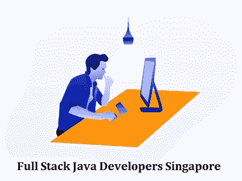

# 2022 年:成为全栈 Java 开发者的额外津贴

> 原文：<https://blog.devgenius.io/2022-perks-to-be-a-full-stack-java-developers-c233746ba70a?source=collection_archive---------9----------------------->

# Java 简介

Java 被广泛认为是可用的最稳定的编程语言，自从二十多年前推出以来，它一直保持着编程行业的顶级地位。那么，Java 成功的秘诀到底是什么呢？由于它的适应性和普遍性，这是一种只需编写一次代码就可以在任何地方运行的能力。此外，Java 因其高度的跨平台互操作性而享有良好的声誉。通过使用 Java 虚拟机(JVM ),在一系列设备和平台上工作成为可能。大多数财富 500 强企业都使用 Java 来开发他们的后端应用程序。

# **成为全栈开发者意味着什么？**

具有前端和后端 web 开发专业知识的软件专家、全栈工程师需求量很大。专业人士熟悉大多数编程语言，可以帮助你尽快将你最少的有说服力的价值主张推向市场。当开发一个网站或 API 应用程序时，开发人员经常被迫为项目的重要 MVP 阶段雇用一个全栈开发人员。

大多数企业在发展到基于网络的产品之前，都是从 MVP 阶段开始的。在这一阶段，你将把你的概念特征付诸实践，同时将调查阶段的客户洞察牢记在心。MVP 阶段可能会帮助您在正式发布之前对产品进行微调，以满足客户的需求。

一个全栈 Java 开发人员有能力用专业知识和能力执行快速项目，把你几十年的工作专业知识全部投入进去，以便为客户提供最大可能的结果。由于这些专家对项目有全面的了解，他们也可以担任技术总监。当有必要将新的软件项目推向更高的成功高度时，这些专家有权做出决策。 [**全栈 Java Developers Singapore**](https://www.aegissofttech.com/en-sg/hire-java-programmer-developers.html) 提供了伟大的、创造性的、适应性强的技术，从而满足了一些企业和客户的需求。

**1。异常轻便**

谈到前端和后端技术，全栈 Java 开发人员是对这两方面都有广泛理解的专家。在网站前端工作的开发人员创建代码(使用 HTML、CSS 和 JavaScript ),控制在浏览器中查看时网站的外观和交互。后端工程师设计代码，将你的网站连接到其他内容管理系统，如 WordPress 或 Drupal。

**2。节省时间和金钱**

由于全栈开发人员提供的端到端透明性，他或她对公司应该如何创建有更好的理解。由于他们能够控制两种频谱，这有助于他们更简单地在前端和后端之间移动。

这甚至有助于向项目团队添加少量人员，从而减少管理和财务费用。对于中小型企业来说，招募这样的人是可能的，他们拥有全方位的能力来管理各个层面的表演。Full Stack web developer 是开发 web 应用程序各个方面的专家，从前端到后端和数据库技术，Full Stack Java Developers Singapore 提供定期开发和更新的编程模块，以满足新兴 IT 行业的需求。

**3。良好的能见度**

不同的技术以不同的方式提供透明度，因为意识不仅取决于您的 IT 基础架构的组成，还取决于您想要深入了解的内容。最后但同样重要的一点是，对您的工具、应用、网络、流程和职责集的全面深入了解使您能够做出更明智的决策。可以通过多种方式获得对应用程序、服务和系统的可见性:通过数据表、状态仪表板、生产力图表和图形以及热图；监控；系统健康指标；分析；和报告，仅举几个例子。全栈透明可以通过使用许多不同的技术来实现。

**4。大量的专业知识**

参与过各种项目并对各种技术有透彻理解的 Java 全栈开发人员已经获得了宝贵的专业知识。将项目的所有权交给全栈开发人员既简单又直接，因为凭借他们的专业知识和经验，他们能够自始至终对项目承担全部责任。

**遗言**

这些只是促使全栈开发成为良好职业选择的几个因素。获得全面的开发能力可能会帮助你实现工作目标，无论你是一名希望进入技术领域的有抱负的专业人士，还是一名希望将职业生涯提升到下一个水平的有经验的程序员。

任命全栈 Java 开发新加坡是一个很好的方法，以确保您的职业为未来做好准备。得益于实际动手的项目，您将按照自己的速度高效地学习全栈开发人员的技能集，等待的意义何在？要开始您的全栈开发职业生涯，现在就迈出第一步。