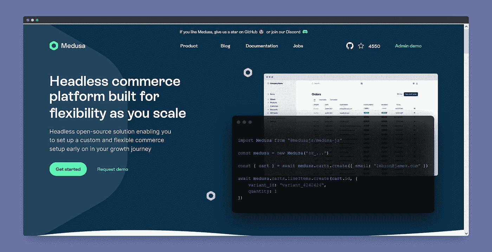

# 开发者必看的 25 个黑仔网站

> 原文：<https://blog.devgenius.io/25-must-visit-killer-websites-for-developers-7d15aceb7508?source=collection_archive---------0----------------------->

有这么多网站让开发者的工作变得更容易。每个人都不知道全部。在本文中，我们将看到 **25 个开发者必看的黑仔网站**。

# 1. [DevDocs](https://devdocs.io/)

DevDocs 在一个单一的、可搜索的界面中汇集了大量的 API 文档。您将在一个地方找到与各种编程语言、技术相关的文档。

# 2.[雷.索](https://ray.so/)

这个网站可以让你截取漂亮的代码截图。它也有一个黑暗模式和一些预装的不同编程语言的主题。也可以使用它的 VS 代码扩展。

# 3. [Poet.so](https://poet.so/)

这个网站对希望在社交媒体上发布推文照片的开发者很有用。网站将你的推文转换成一个漂亮的可编辑的设计。

# 4. [roadmap.sh](https://roadmap.sh/)

该网站提供路线图、指南和其他教育内容，以帮助开发人员选择路径和指导他们的学习。这对于初学者和需要指导的学习者都很有帮助。

# 5. [LambdaTest](https://www.lambdatest.com/)

LambdaTest 是一个基于云的跨浏览器测试平台，允许您在 2000 多种不同的浏览器、操作系统和设备上测试 web 应用程序。LambdaTest 允许您手动和自动测试跨浏览器兼容性。

# 6.[每日开发](https://app.daily.dev/)

这是一个平台，在这里你可以找到很多好文章每天阅读。它会在你的订阅源中直接显示来自不同平台的最佳文章。通过使用其扩展，将来自不同平台的优质内容直接更新到您的浏览器中。

# 7.[显示案例](https://www.showwcase.com/)

Showwcase 是一个新的社交媒体网站，专门为编码连接、建立社区和寻找新机会的人服务。这是一个类似 LinkedIn 的平台，但只专注于开发者。你可以加入，然后跟我去那里。

# 8.[CSS-招数](https://css-tricks.com/)

通过从这个网站学习关于 CSS 的每一个基础知识，你可以掌握你的网络开发技能。如果你还不知道，CSS 是使网页看起来漂亮的东西。

# 9.[美杜莎](https://www.medusajs.com/)

开源的 Shopify 替代品。Medusa 是一个开源的无头商业引擎，速度快，可定制。它是免费的。

# 10.[智能模型](https://smartmockups.com/)

为什么要花时间学习如何使用 Photoshop。Smartmockups 允许您在浏览器中直接生成华丽的高分辨率模型，并使用单一界面跨众多设备生成模型。最快的基于网络的模型工具，不需要以前的经验或能力，并且专业模型库一直在增长。

# 11.[代码美化](https://codebeautify.org/)

让你的源代码更漂亮，更易读使用代码来美化它的 AI 技术会让你的源代码更有吸引力，更易读。

# 12.[过度夸张](https://overapi.com/)

对于所有开发者来说，OverAPI 是最漂亮、最有用的网站之一。这个网站有大多数编程语言的备忘单。现在就看一看。

# 13.[响应性地](https://responsively.app/)

这是一个开源网站，将 web 应用的开发速度提高了 5 倍。所有目标屏幕并排显示在一个窗口中。缩短开发时间！

# 14.[色彩狩猎](https://colorhunt.co/)

Colorhunt 是一个允许你选择华丽调色板的网站。网页设计者会发现选择美丽和吸引人的颜色，以及接受其他艺术家和艺术项目的颜色建议是非常有益的。

# 15.[碳](https://carbon.now.sh/)

这个网站将帮助你创建和分享漂亮的源代码图片。它还允许您对照片进行更改。你现在应该试一试。

# 16.[元标签](https://metatags.io/)

这是一个网站标签生成器，它还允许你在看到内容出现在谷歌、脸书、LinkedIn 和其他社交媒体网站上之前，更新和试验你的内容。

# 17.[剖面图制作工具](https://pfpmaker.com/)

该网站为您的 Web 开发人员作品集中的每张照片创建了一个专业且漂亮的个人资料。作为开发者，你会接触到社交媒体。你只需要上传你的任何一张图片，它就会对它们进行编辑和增强。现在就试试吧。

# 18.[小型开发工具](https://smalldev.tools/)

该网站提供各种免费的开发工具，包括编码器/解码器、HTML/CSS/Javascript 格式化程序、minifies、伪造或测试数据生成器等等。它还允许您共享代码。

# 19. [resume.io](https://resume.io/)

这个网站允许你创建一份高质量的简历。它将为你提供经过充分测试的模板，从而帮助你创建一份专业的简历。试试看。

# 20.[密码笔](https://codepen.io/)

CodePen 是一个基于 web 的开发平台，允许用户修改 HTML、CSS、JavaScript 等前端语言，而无需安装任何软件。最棒的一点是结果是实时可见的，这使得故障排除更加容易。开发人员和设计人员还可以与世界上的其他人交换代码样本(称为笔)。

# 21.[故事片](https://storytale.io/)

Storytale 是一个收集了插图的网站，这些插图用令人敬畏的人物使你的项目引人注目。可以个人使用，也可以商用。这是一个对网页设计师很有帮助的网站。获得 web 和移动项目的高级资产。

# 22. [readme.so](https://readme.so/)

这个网站允许你非常容易地创建项目自述文件。其简单的编辑器可以帮助您快速添加和定制项目自述文件所需的所有部分。您可以使用它来快速创建您的开源项目的文档。

# 23.[胡椒型](https://www.peppertype.ai/)

Peppertype 是一个新工具，有助于自动化内容制作和构思过程。它分析你的业务运营，了解你的品牌和目标受众，然后使用卓越的机器学习和人工智能为你创造新鲜的内容。如果你是一个经常创建内容的开发者，那么这是为你准备的。

# 24.[合成](https://www.synthesia.io/)

Synthesia 帮助你用 50 多种语言创作基于人工智能的视频。你不需要一个摄像头，麦克风，或真实的脸来创建视频内容。你只需要上传你的脚本，你就会得到一个 AI 视频。

# 25.[程序员幽默](https://programmerhumor.io/)

即使是开发者也需要娱乐。你可以访问这个网站，了解与编程和开发人员有关的各种迷因和笑话。玩得开心。

**奖金网站**:我在本文中使用了 [**Screely**](https://www.screely.com/) 拍摄的截图。

## 如果你❤️我的内容！在 [Twitter](https://mobile.twitter.com/Astrodevil_) 上联系我，或者[给我买杯咖啡](https://www.buymeacoffee.com/Astrodevil) ☕来支持我！你也可以在我位于 [Gumroad](https://astrodevil.gumroad.com/) 的商店购买数码产品

*更多内容尽在*[*blog . devgenius . io*](http://blog.devgenius.io)*。*