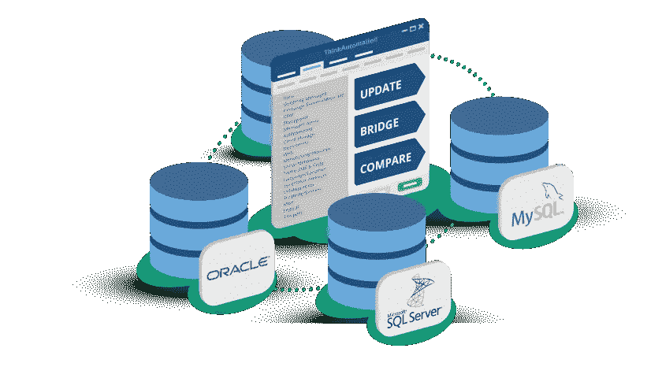

# 每个工程师/架构师都需要知道的关于数据的 25 件事

> 原文：<https://blog.devgenius.io/25-things-about-data-that-every-engineer-architect-needs-to-know-9330e6a51cd4?source=collection_archive---------11----------------------->

图片来源于:[https://www . think automation . com/WP-content/uploads/2019/09/workflows-category-databases . png](https://www.thinkautomation.com/wp-content/uploads/2019/09/workflows-category-databases.png)

这篇文章是一个系列的第二部分(见关于安全性的[第一部分](https://medium.com/@amralieg/25-things-about-security-that-every-cloud-solutions-architect-need-to-know-d8a0dc3f7456)和关于网络的[第三部分](https://medium.com/@amralieg/25-things-about-networking-that-every-engineer-architect-needs-to-know-313e634b9456)),讲述了所有软件工程师和解决方案架构师需要知道的关于在云上产生一个安全的、可伸缩的、有弹性的和架构良好的解决方案的最重要的事情。

该列表不是详尽的列表。但是，它应该足够好，可以快速上手。

对于这个列表中的每一项，都有一个附带的链接，主要是引导你到谷歌，并为你设置了正确的关键词。

让我们进入列表，如果你觉得有什么不对，或者想在列表中添加一项，请在下面留下评论。

**数据/解决方案架构师需要了解:**

1.  SQL 数据库、NoSQL 数据库和 NewSQL 数据库之间有什么区别(参见 [XeonStack](https://www.xenonstack.com/blog/sql-vs-nosql-vs-newsql/) )，以及 NewSQL 数据库的不同实现选项(内存中如 SAP HANA(参见 [Google](https://www.google.com/search?safe=strict&rlz=1C1GCEU_en&sxsrf=ALeKk03QArJJMyx0GqJtD3RGZWTNhCf1_Q%3A1594497050594&ei=GhgKX__mI8ThxgPK6JroBg&q=SAP+HANA+newSql&oq=SAP+HANA+newSql&gs_lcp=CgZwc3ktYWIQAzIECAAQDTIGCAAQFhAeMggIABAIEA0QHjIICAAQCBANEB4yCAgAEAgQDRAeOhEIABCwAxCKAxC2AxDlAhCLAzoHCAAQRxCwAzoECAAQQzoCCAA6BwgAEBQQhwI6BggAEA0QHlDtCFiTFWD-FmgBcAB4AIABRIgBpQOSAQE3mAEAoAEBqgEHZ3dzLXdpergBAg&sclient=psy-ab&ved=0ahUKEwj_266y_MXqAhXEsHEKHUq0Bm0Q4dUDCAw&uact=5) )、硬件辅助时钟同步如 Google CloudSpanner(参见 [DZone](https://dzone.com/articles/google-spanner-a-newsql-journey-or-beginning-of-th) )和分片实例如 Vitess(参见 [Vitess](https://vitess.io/) ))
2.  了解不同类型的 NoSQL 数据库([宽列](https://studio3t.com/knowledge-base/articles/nosql-database-types/#wide-column-store)、[文档](https://studio3t.com/knowledge-base/articles/nosql-database-types/#document-store)、[键值存储](https://studio3t.com/knowledge-base/articles/nosql-database-types/#key-value-data-store)、[图形](https://studio3t.com/knowledge-base/articles/nosql-database-types/#graph-store)和[多模型](https://studio3t.com/knowledge-base/articles/nosql-database-types/#multi-model))以及何时使用每种类型的数据库。
3.  了解不同类型的数据库，如 OLTP 数据库(参见[数据库指南](https://database.guide/what-is-oltp/))、OLAP 数据库(参见 [OLAP](https://olap.com/olap-definition/) )和 HTAP 数据库(参见[维基百科](https://en.wikipedia.org/wiki/Hybrid_transactional/analytical_processing))以及适用于每种类型的正确用例。
4.  了解 OLTP 数据库的 ACID 属性，以及了解 NoSQL 数据库的 BASE 属性(参见 [Google](https://www.google.com/search?q=acid+vs+base+database&rlz=1C1GCEU_en&oq=ACID+vs+BASE+datab&aqs=chrome.0.0j69i57j0l6.4298j1j7&sourceid=chrome&ie=UTF-8) )，还了解最终一致性模型的变体，例如读你的写、偶然一致性、单调读取等(参见 [AllThingsDistributed](https://www.allthingsdistributed.com/2007/12/eventually_consistent.html) )。
5.  了解 ANSI SQL 语法以及如何使用它对 MySQL 或 Postgre(参见 [Quora](https://www.quora.com/What-is-ANSI-SQL-Oracle-SQL-and-MySQL) )等开源数据库执行传统 CRUD(创建、读取、更新/更新和删除)操作，还了解两个表的笛卡尔积(交叉连接)(参见 [DBA-Oracle](http://www.dba-oracle.com/t_garmany_9_sql_cross_join.htm) )以及如何使用连接来进一步减少连接(使用两种类型的 SQL 连接(内部连接和外部连接)以及不同类型的外部连接(左、右和完整连接)(参见【T24
6.  了解 RDBMS 中的事务生命周期，知道提交、回滚和前滚意味着什么(参见[数据库管理](https://databasemanagement.fandom.com/wiki/DIFFERENCE_BETWEEN_ROLLFORWARD_AND_ROLLBACK))，了解锁级别和锁升级及其对性能的影响(参见 [Actian](https://docs.actian.com/ingres/11.0/index.html#page/DatabaseAdmin/Lock_Levels.htm) )，什么是 2PC(两阶段提交)及其工作原理(参见 [Google](https://www.google.com/search?q=2PC+(Two-Phase+Commit)&rlz=1C1GCEU_en&oq=2PC+(Two-Phase+Commit)&aqs=chrome..69i57&sourceid=chrome&ie=UTF-8) )以及事务日志在事务回滚中的作用(参见 [TechRepublic](https://www.techrepublic.com/article/understanding-the-importance-of-transaction-logs-in-sql-server/) )，还知道如何解决常见的事务问题，如死锁和活锁(参见 [Google](https://www.google.com/search?safe=strict&rlz=1C1GCEU_en&sxsrf=ALeKk023QIip8keFSvHEgdcLqOsy8YvGPw:1594651595715&q=database+livelock+vs+deadlock&spell=1&sa=X&ved=2ahUKEwjMv5yPvMrqAhVLa8AKHeMAAxEQBSgAegQIZRAn&biw=1477&bih=782) )，较慢的查询
7.  了解数据库索引如何使用 BTree 或 Hash(参见 [Stackoverflow](https://stackoverflow.com/questions/7306316/b-tree-vs-hash-table) )以及全文索引来支持基本搜索，还能够执行使用数据库索引的成本/收益分析(参见 [ITPro](https://www.itprotoday.com/sql-server/indexing-dos-and-don-ts) )并能够进行简单的查询分析来了解表扫描与索引搜索和索引扫描(参见 [SqlAuthority](https://blog.sqlauthority.com/2007/03/30/sql-server-index-seek-vs-index-scan-table-scan/) )
8.  了解垂直可伸缩性(向内扩展)和水平可伸缩性(向外扩展)在数据库方面的区别。(参见 [StackOverflow](https://stackoverflow.com/questions/11707879/difference-between-scaling-horizontally-and-vertically-for-databases) )以及为什么 OLTP 数据库难以支持水平可伸缩性。
9.  了解不同类型的数据(事务性、主数据、黄金数据和参考数据)(参见[语义](https://blog.semarchy.com/backtobasics_data_classification))，以及使用 ERD 建模对关系数据库进行建模的知识(参见[谷歌](https://www.google.com/search?q=ERD+modelling&rlz=1C1GCEU_en&oq=ERD+modelling&aqs=chrome..69i57&sourceid=chrome&ie=UTF-8))，了解关系数据库中数据规范化的三个级别(1NF、2NF、3NF)(参见[维基百科](https://en.wikipedia.org/wiki/Database_normalization))并了解数据建模的级别(概念、逻辑和物理)(参见[可视化范例](https://online.visual-paradigm.com/knowledge/visual-modeling/conceptual-vs-logical-vs-physical-data-model/))
10.  了解如何使用读取副本在 OLTP 数据库中横向扩展数据库读取，读取副本和故障转移副本之间的区别，以及数据同步在每种副本类型(同步、异步或半同步)中的工作方式(参见[中的](https://medium.com/awesome-cloud/aws-difference-between-multi-az-and-read-replicas-in-amazon-rds-60fe848ef53a))，以及如何避免常见的数据库副本问题，如漂移/滞后(参见[几行](https://severalnines.com/blog/top-mistakes-avoid-mysql-replication))。
11.  了解 CAP 定理及其对分布式数据库管理系统的影响(参见 [Google](https://www.google.com/search?q=CAP+theorem&rlz=1C1GCEU_en&oq=CAP+theorem&aqs=chrome..69i57&sourceid=chrome&ie=UTF-8) )及其三个组成部分(一致性、可用性和分区)，以及对于不同的 NoSQL 数据库，这三者中哪一个被放弃了。
12.  了解数据湖和数据仓库(DWH)之间的区别以及何时使用它们中的每一种(参见 [Talend](https://www.talend.com/resources/data-lake-vs-data-warehouse/) )以及新的数据湖如何将两者融合在一起(参见 [Databricks](https://databricks.com/glossary/data-lakehouse#:~:text=A%20data%20lakehouse%20is%20a,(ML)%20on%20all%20data.) )，还了解数据仓库如何由多个数据集市组成(参见 [Panoply](https://panoply.io/data-warehouse-guide/data-mart-vs-data-warehouse/) )以及 DWH 如何用于商业智能(BI)(参见 [Panloply](https://panoply.io/data-warehouse-guide/bi-and-data-warehousing/) )。
13.  在构建大数据解决方案时，了解 Lambda 架构和 Kappa 架构的区别。(参见 [Youtube](https://www.youtube.com/watch?v=iJUgyuNsak4) )，同时了解 5 大数据集成模式(参见 [SnapLogic](https://www.snaplogic.com/glossary/data-integration-patterns#:~:text=A%20data%20integration%20pattern%20is,provide%20usable%20and%20accessible%20data.) )
14.  了解不同的数据仓库设计(Kimball 和 Inmon)(参见 [Zentut](https://www.zentut.com/data-warehouse/kimball-and-inmon-data-warehouse-architectures/) )、数据集市中使用的不同类型的模式(Star、Galaxy 和 Snowflake 模式)以及何时使用每种模式(参见 [Google](https://www.google.com/search?safe=strict&rlz=1C1GCEU_en&sxsrf=ALeKk02w1UbshbHzda4USTvyDq3UtB4Hlg%3A1594501274613&ei=migKX_iKJcGM8gL3r4GwBg&q=star+snowflake+galaxy+schema&oq=Star+Galaxy+schema&gs_lcp=CgZwc3ktYWIQARgBMgQIIxAnMgYIABAHEB4yBggAEAcQHjIGCAAQBxAeMggIABAHEAUQHjIGCAAQCBAeMgYIABAIEB4yBggAEAgQHjoRCAAQsAMQigMQtQMQ5QIQiwM6BwgAEEcQsANQz_QfWM_0H2CWlSBoAXAAeACAAT-IAT-SAQExmAEAoAEBqgEHZ3dzLXdpergBAg&sclient=psy-ab) )，了解数据集市中的事实、维度和度量(参见 [Google](https://www.google.com/search?q=Facts%2C+Dimensions%2C+and+Measures+inside+data+marts) )，还了解数据立方体及其构建方式(参见[维基百科](https://en.wikipedia.org/wiki/OLAP_cube))。
15.  了解如何使用 ETL 将数据从 OLTP 转移到 OLAP 系统，了解 ETL 和 ELT 之间的区别、每种类型的优缺点以及何时使用它们(参见 [XPlenty](https://www.xplenty.com/blog/etl-vs-elt/)
16.  了解 MemSql、Redis 和 Memcache 等内存数据库(参见 [AWS](https://aws.amazon.com/nosql/in-memory/) )，还了解 Redis 和 Memcached 之间的区别以及各自的功能和限制，以及如何使用它们来扩展频繁使用的数据的数据库读取(参见 [Medium](https://medium.com/@Alibaba_Cloud/redis-vs-memcached-in-memory-data-storage-systems-3395279b0941) )。
17.  了解不同的缓存读写技术(通读、直写、后写和提前刷新)(参见 [Oracle](https://docs.oracle.com/cd/E15357_01/coh.360/e15723/cache_rtwtwbra.htm#COHDG198) )和不同的缓存回收策略(最近最少使用(LRU)、
    先进先出(FIFO)、随机和延时)(参见 [Apache](https://apacheignite.readme.io/v1.0/docs/evictions) )
18.  了解 MapReduce 的工作原理(参见 [Youtube](https://www.youtube.com/watch?v=bcjSe0xCHbE) )和 Hadoop 如何使用它来分析数据，以及大规模并行处理 MPP 如何扩展 MapReduce 以进行大数据分析和 MPP 数据库示例(AWS Redshift、Google BigQuery、Snowflake 等)。)(参见[观察器](https://looker.com/databases/analytical))
19.  了解用于存储数据的大数据文件格式(AVRO、ORC、PARQUET)以及何时使用哪种格式(参见 [Datanami](https://www.datanami.com/2018/05/16/big-data-file-formats-demystified/) )以及 HDFS 过去如何存储这些文件(参见 [IBM](https://www.ibm.com/analytics/hadoop/hdfs) )，以及 AWS S3 和 GCP 云存储等对象存储过去如何存储非结构化数据，还了解两种主要的标准文本数据文件格式(基于文档(XML 和 JSON)和基于记录(带分隔符(CSV、TSV)、固定宽度、可变宽度))以及如何处理它们。
20.  了解什么是大数据(参见 [SAS](https://www.sas.com/en_gb/insights/big-data/what-is-big-data.html) )和大数据的 5v(量、速度、多样性、准确性和价值)(参见 [Geeks4Geeks](https://www.geeksforgeeks.org/5-vs-of-big-data/) )，还在高层次上了解大数据生态系统(参见 [this](https://themakingofamillionaire.com/6-money-rules-ill-follow-until-i-die-81510a82fe59) )(雪花、BigQuery、红移、Glue、Presto、Athena、Kafka、Airflow、Flink、Hadoop、YARN、Pig、Hive、Sqoop、Flume 和 Apache Spark)(参见 [Dataflair](https://data-flair.training/blogs/hadoop-ecosystem-components/) )，还知道如何
21.  理解批处理和流处理之间的区别以及何时使用每种类型。(参见 [Syncsort](https://blog.syncsort.com/2017/07/big-data/big-data-101-batch-stream-processing/) )，以及 Apache Spark 如何用于处理流数据处理。
22.  了解数据挖掘和机器学习之间的区别以及何时使用每种方法(参见 [BernarrdMar](https://bernardmarr.com/default.asp?contentID=1741) )，还在较高层次上了解不同类型的机器学习算法(监督学习、非监督学习、半监督学习、强化学习)(参见 [TowardsDataScience](https://towardsdatascience.com/types-of-machine-learning-algorithms-you-should-know-953a08248861) )，还了解使用 PowerBI 和 Tableau 生成仪表盘可视化的不同选项(参见 [TechnologyAdvice](https://technologyadvice.com/blog/information-technology/power-bi-vs-tableau/)
23.  了解数据治理以及我们为什么需要它和它的四个支柱(管理、质量、主数据管理、用例)(见 [Youtube](https://www.youtube.com/watch?time_continue=1&v=BqdPuwvwPk4&feature=emb_logo) )以及主数据管理(MDM)系统在数据生态系统中的作用(见 [Profisee](https://profisee.com/master-data-management-what-why-how-who/) )，还了解不同的可用治理模型，如 DAMA-DMBOK 和 DCAM(见 [DataCrossRoads](https://datacrossroads.nl/2019/10/06/dama-dmbok-vs-dcam/) )。
24.  了解如何保护静态和瞬态数据(参见 [DigitalGaurdian](https://digitalguardian.com/blog/data-protection-data-in-transit-vs-data-at-rest) )，还了解 SQL 注入攻击以及如何保护您的数据应用免受其害(参见 [PortSwigger](https://portswigger.net/web-security/sql-injection) )。
25.  了解什么是数据压缩(参见[谷歌](https://www.google.com/search?q=data+compression&rlz=1C1GCEU_en&oq=data+compression&aqs=chrome..69i57&sourceid=chrome&ie=UTF-8))、重复数据删除(参见[微软](https://docs.microsoft.com/en-us/windows-server/storage/data-deduplication/understand#how-does-dedup-work))和数据清理(参见[谷歌](https://www.google.com/search?q=data+sanitisation&rlz=1C1GCEU_en&oq=data+sanitisation&aqs=chrome..69i57&sourceid=chrome&ie=UTF-8))是什么。

我真的相信知识是产生适当的架构良好的解决方案的第一步，然而，仅仅有知识并不能保证你能开发这样的解决方案，你还需要经验、指南、[最佳实践](https://d1.awsstatic.com/whitepapers/AWS_Cloud_Best_Practices.pdf)、[架构框架](https://cloud.google.com/blog/products/gcp/new-google-cloud-architecture-framework-guide)、[参考架构](https://gcp.solutions/)等等。

不要忘记查看关于安全的第一部分和关于网络的第三部分的[，并在](https://medium.com/@amralieg/25-things-about-security-that-every-cloud-solutions-architect-need-to-know-d8a0dc3f7456) [Linkedin](https://www.linkedin.com/in/amralieg) 上随意连接。如果你喜欢这篇文章，请在下面留下评论或鼓掌。