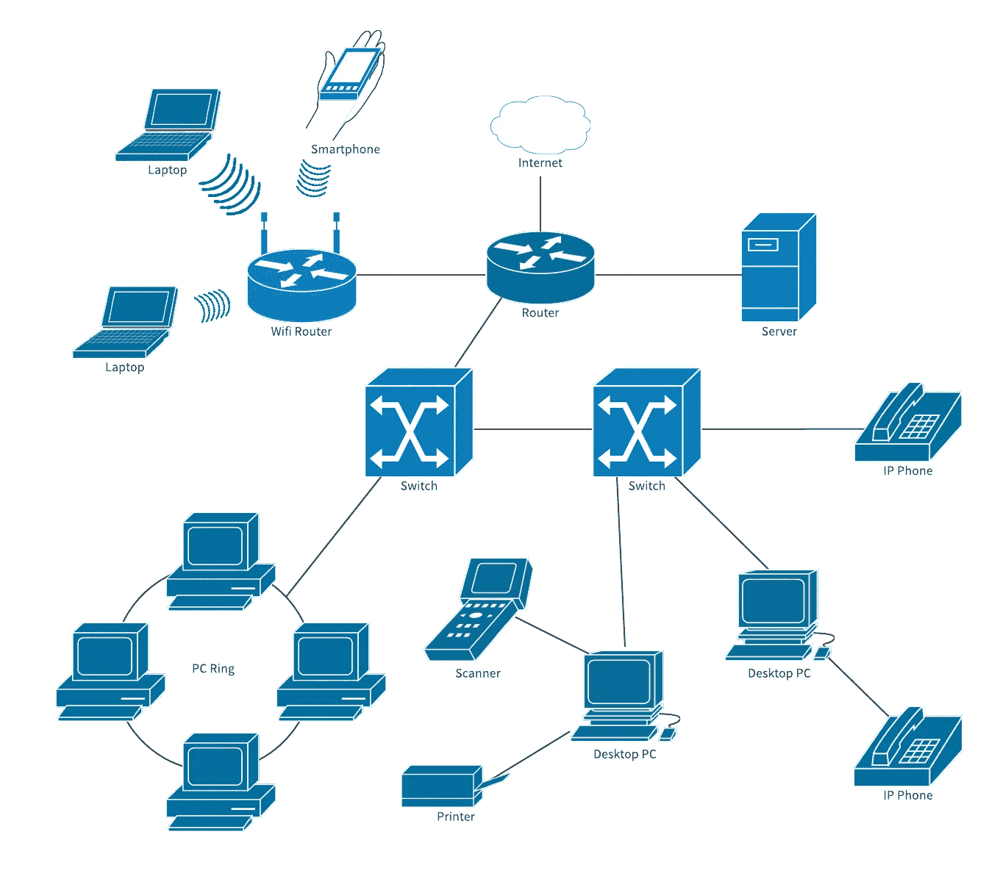

# 每个工程师/架构师都需要知道的关于网络的 25 件事

> 原文：<https://blog.devgenius.io/25-things-about-networking-that-every-engineer-architect-needs-to-know-313e634b9456?source=collection_archive---------9----------------------->

[图片来源:https://www . lucid chart . com/pages/templates/network-diagram/internet-network-diagram-template](https://www.lucidchart.com/pages/templates/network-diagram/internet-network-diagram-template)

这篇文章是一个系列的第三部分(见[第一部分](https://medium.com/@amralieg/25-things-about-security-that-every-cloud-solutions-architect-need-to-know-d8a0dc3f7456)关于安全性和第二部分[关于](https://medium.com/dev-genius/25-things-about-data-that-every-engineer-architect-needs-to-know-9330e6a51cd4)数据),是所有软件工程师和解决方案架构师需要知道的关于在云上产生一个安全的、可伸缩的、有弹性的和架构良好的解决方案的最重要的事情。

该列表并不详尽。不过应该够好了，可以快速上手。

对于这个列表中的每一项，都有一个附带的链接，主要是引导你到谷歌，并为你设置了正确的关键词。

让我们进入列表，如果你觉得有什么不对，或者想在列表中添加一项，请在下面留下评论。

**网络/解决方案架构师需要了解:**

1.  了解网络中的数据、数据包和帧，以及网络内部如何使用 IP 和 MAC 地址进行路由。(参见 [Youtube](https://www.youtube.com/watch?v=zhlMLRNY5-4) )
2.  了解什么是网络地址转换 NAT，它是如何工作的，以及它的不同变体 SNAT、DNAT、PAT 和端口转发(见 [Youtube](https://www.youtube.com/watch?v=wg8Hosr20yw)
3.  了解什么是子网划分(参见[Youtube](https://www.youtube.com/watch?v=ecCuyq-Wprc))RFC 1918 如何使用三个 IP 类 10 中的一个为您的子网选择合适的 IP 范围。*, 172.16.*和 192.168。*(参见 [IETF](https://tools.ietf.org/html/rfc1918) )以及何时使用。
4.  了解不同类型的网络(局域网、无线局域网、广域网(见 [Quora](https://www.quora.com/What-is-the-difference-between-LAN-WAN-Ethernet-LAN-and-WLAN-Are-a-few-of-them-the-same-or-are-they-all-different-Who-can-simply-explain-them) ))以及局域网和 VLAN 的区别(见 [Youtube](https://www.youtube.com/watch?v=jC6MJTh9fRE) )，还知道集线器、路由器和交换机的基础知识以及它们在网络连接中的作用(见 [Youtube](https://www.youtube.com/watch?v=1z0ULvg_pW8) )。
5.  了解网络上不同类型的攻击，如 DOS/DDOS/EDOS 攻击以及如何保护网络免受它们的攻击(参见 [CyNet](https://www.cynet.com/cyber-attacks/network-attacks-and-network-security-threats/) )，还了解什么是经济 DOS (EDOS)攻击以及如何防范它们(参见 [ZDNet](https://www.zdnet.com/article/will-edos-be-the-next-ddos/) )，还了解入侵检测系统(IDS)和入侵防御系统(IPS)之间的区别(及其变体 HIDS 和 NIDS)(参见 [DNSStuff](https://www.dnsstuff.com/ids-vs-ips) )
6.  了解 DHCP 协议如何获取动态新 IP(参见 [Youtube](https://www.youtube.com/watch?v=e6-TaH5bkjo&t=215s) )，了解静态 IP 和动态 IP 的区别(参见 [Google](https://support.google.com/fiber/answer/3547208?hl=en) )，还了解地址解析协议(ARP)及其用途(参见 [Youtube](https://www.youtube.com/watch?v=zTWa2Pqlgp0) )，还了解带宽、延迟和速度的区别(参见 [Youtube](https://www.youtube.com/watch?v=YgBOT3bWukg) )
7.  了解 OSI 模型 APSTNDP 的 7 层(7-应用层、6-表示层、5-会话层、4-传输层、3-网络层、2-数据链路层、1-物理层)(参见 [CloudFlare](https://www.cloudflare.com/learning/ddos/glossary/open-systems-interconnection-model-osi/) )，也知道每一层的典型职责，以及在哪一层运行的标准协议(HTTP - >第 7 层、TLS/SSL- >第 6 层、SMB- >第 5 层、UDP/TCP- >第 4 层等)。)(参见[维基百科](https://en.wikipedia.org/wiki/List_of_network_protocols_(OSI_model)))
8.  了解 TCP、UDP 等不同网络协议的特点(见 [Youtube](https://www.youtube.com/watch?v=Vdc8TCESIg8&t=7s) ，以及 FTP、s FTP、FTPS(见 [GoAnyWhere](https://www.goanywhere.com/blog/2016/11/23/sftp-vs-ftps-the-key-differences) )、POP3、SMTP(见 [ServerSMTP](https://serversmtp.com/pop-and-smtp/) )，以及它们之间的区别和各自适合的应用，也了解什么是单播、组播、广播(见 [Youtube](https://www.youtube.com/watch?v=Z6O__3UEltE) )。
9.  了解什么是软件定义的网络、它如何工作(参见 [Ciena](https://www.ciena.com/insights/what-is/What-Is-SDN.html) )及其在云网络中的作用。
10.  了解什么是 VPC(虚拟私有云)(参见 [AWS](https://aws.amazon.com/vpc/) )，以及它如何在云上使用，以及如何将 VPC 划分为子网(参见 [AWS](https://docs.aws.amazon.com/vpc/latest/userguide/VPC_Subnets.html) )，还了解什么是 CIDR 块，以及如何选择满足您需求的 CIDR 范围(参见 [AWS](https://docs.aws.amazon.com/vpc/latest/userguide/working-with-vpcs.html#Create-VPC) )。
11.  了解 VPC 对等以及我们为什么需要它(参见 [AWS](https://docs.aws.amazon.com/vpc/latest/peering/what-is-vpc-peering.html) )以及如何使用瞬态网关在 perm 网络上连接云网络或者将不同的 VPC 连接在一起(参见 [AWS](https://docs.aws.amazon.com/vpc/latest/tgw/what-is-transit-gateway.html) )，还了解 Bastion 主机(跳转框)以及它们如何被用来访问你的 VPC 内部的私有实例(参见 [Youtube](https://www.youtube.com/watch?v=Mwf17O45IA0) )。
12.  了解内部数据中心如何使用 VPN 或私有连接连接到云数据中心，如 AWS [DirectConnect](https://aws.amazon.com/directconnect/) ，谷歌专用[互连](https://cloud.google.com/network-connectivity/docs/interconnect/concepts/dedicated-overview)和微软 [ExpressRoute](https://azure.microsoft.com/en-gb/services/expressroute/#overview) ，以及如何使用私有连接而不通过公共互联网访问内部云服务，如 AWS [VPC 端点/PrivateLink](https://docs.aws.amazon.com/vpc/latest/userguide/endpoint-services-overview.html) ，谷歌 [PrivateAccess](https://cloud.google.com/vpc/docs/private-access-options) 。
13.  了解 DNS 如何工作，以及个人笔记本电脑详细解析 IP 地址需要经过的不同跳数(浏览器 DNS 缓存->操作系统 DNS 缓存->ISP 解析服务->根服务器-> TLD 服务器->权威名称服务器(参见 [Youtube](https://www.youtube.com/watch?v=mpQZVYPuDGU) )，还知道 DNS 如何使用端口 53 上的 UDP 进行通信(参见 [Google](https://www.google.com/search?q=which+protocol+used+by+DNS&rlz=1C1GCEU_en&oq=which+protocol+used+by+DNS&aqs=chrome..69i57j0l6.5924j1j4&sourceid=chrome&ie=UTF-8) )以及最近向 TLS 上的安全 DNS 的过渡(参见[维基百科](https://en.wikipedia.org/wiki/DNS_over_TLS))并知道 BIND9 是什么(参见[ISC【13】](https://www.isc.org/bind/)
14.  了解 DNS 缓存的工作原理和 TTL 设置的作用(参见 [Varonis](https://www.varonis.com/blog/dns-ttl/) )，也了解常见的 DNS 记录类型(CNAME、A、AAAA 等。)(参见[简单域名系统](https://simpledns.plus/help/dns-record-types))。
15.  了解不同的 DNS 路由选项(故障转移、延迟、地理定位、多值、加权)(参见 [AWS](https://docs.aws.amazon.com/Route53/latest/DeveloperGuide/routing-policy.html) )，还了解什么是 DNSSEC(参见 [NameCheap](https://www.namecheap.com/support/knowledgebase/article.aspx/9717/2232/what-is-dnssec) )，以及 DNS 服务何时在 TCP 和 UDP 之间切换(参见 [ServerFault](https://serverfault.com/questions/404840/when-do-dns-queries-use-tcp-instead-of-udp) )。
16.  了解什么是 VPN(见 [Youtube](https://www.youtube.com/watch?v=_wQTRMBAvzg) )以及它如何使用 OSI 第三层协议(IPSec 协议)与服务器通信。还要了解一些关于 OpenSwan 的知识，以及它是如何从内核 2.3 开始成为 Linux 上的标准 IPSec 实现的(参见 [OpenSwan](https://www.openswan.org/) )，以及如何使用 UDP 封装 IPSec 数据包以通过 NAT(参见 [StackOverflow](https://serverfault.com/questions/435279/why-does-vpn-ipsec-client-use-udp) )，还要了解 IPSec 隧道及其在站点到站点 S2S VPN 中的作用(参见 [Youtube](https://www.youtube.com/watch?v=CuxyZiSCSfc) )，以及点对点 P2S(参见[微软](https://docs.microsoft.com/en-us/azure/vpn-gateway/point-to-site-about))，还要了解何时使用 IPSec vs
17.  了解互联网协议套件的 4 层(1:应用，2:传输，3:互联网，4:链接)(见[维基百科](https://en.wikipedia.org/wiki/Internet_protocol_suite))互联网如何使用 TCP/IP 连接客户端和服务器。
18.  了解所使用的标准互联网协议，例如在网络间广播路由的 BGB 协议(参见 [Youtube](https://www.youtube.com/watch?v=_aLmzq-23pE&t=46s) )和 eBGB 与 iBGB 的区别(参见 [Youtube](https://www.youtube.com/watch?v=YTegD-y2Sx0) )，以及 MPLS 如何使用标签来加速路由(参见 [Youtube](https://www.youtube.com/watch?v=BuIWNecUAE8) )。
19.  了解每个协议使用的标准端口(参见 [PearsonCertification](https://www.pearsonitcertification.com/articles/article.aspx?p=1868080) )用于从客户端到服务器的出站流量。短暂端口对于从服务器到客户端的响应流量的作用(参见 [Techopedia](https://www.techopedia.com/definition/19157/ephemeral-port) )，还了解 IPv4 和 IPv6 寻址之间的差异，并了解简化从 IPv4 到 IPv6 过渡的不同技术(双栈、隧道和转换)(参见 [Youtube](https://www.youtube.com/watch?v=s0TNGC9GP48) )。
20.  了解什么是正向代理，以及它如何用于阻止请求、缓存内容、记录日志和对服务器隐藏客户端的身份，还了解什么是反向代理，以及它如何用于对客户端隐藏服务器的身份(参见 [Youtube](https://www.youtube.com/watch?v=SqqrOspasag) )，还了解反向代理和负载平衡器之间的区别(参见 [Youtube](https://www.youtube.com/watch?v=S8J2fkN2FeI) )。
21.  对负载平衡器(参见 [Youtube](https://www.youtube.com/watch?v=17AFseaBDgk) )和所使用的不同类型的路由(循环法、加权 RR、最少连接数、一致散列法)(参见 [KempTechnologies](https://kemptechnologies.com/load-balancer/load-balancing-algorithms-techniques/) )以及负载平衡器如何使用 HTTP 头 X-Forwarded-For 维护原始请求者 IP(参见 [AWS](https://docs.aws.amazon.com/elasticloadbalancing/latest/classic/x-forwarded-headers.html#x-forwarded-for) )有一个共同的理解。
22.  了解防火墙，有状态防火墙和无状态防火墙之间的区别，以及第 7 层防火墙(WAF)和第 4 层防火墙之间的区别(参见 [Youtube](https://www.youtube.com/watch?v=JujrW1C83LU) )，以及如何使用防火墙在网络中创建 dmz(参见 [Barracuda](https://www.barracuda.com/glossary/dmz-network) )
23.  知道如何使用标准网络实用程序来解决网络问题，如 PING、Tracert、Telnet、ARP、Netstat、Nbtstat、NSLookup 和 IPConfig/IFConfig(参见 [PluralSight](https://www.pluralsight.com/blog/it-ops/top-7-tcpip-utilities-every-networking-pro-should-know) )，以及常见实用程序的工作原理，如 Ping(参见 [Youtube](https://www.youtube.com/watch?v=vJV-GBZ6PeM) )、Trace Routing tracert(参见 [Youtube](https://www.youtube.com/watch?v=G05y9UKT69s) )、Telenet(参见 [Youtube](https://www.youtube.com/watch?v=tZop-zjYkrU) )。
24.  了解如何使用 WebSockets(参见 [Youtube](https://www.youtube.com/watch?v=8ARodQ4Wlf4) )或服务器发送的事件(参见 [Youtube](https://www.youtube.com/watch?v=Z4ni7GsiIbs) )在服务器和客户端之间创建全双工双向通信通道，以及这两种方法之间的区别(参见 [Telerik](https://www.telerik.com/blogs/websockets-vs-server-sent-events)
25.  了解什么是内容交付网络(CDN)以及它们如何工作(参见 [Youtube](https://www.youtube.com/watch?v=Bsq5cKkS33I) )以及它们如何加速内容交付，还要了解什么是存在点弹出(参见 [StackPath](https://blog.stackpath.com/point-of-presence/) )以及什么是边缘位置(参见 [Edureka](https://www.edureka.co/community/600/what-is-an-edge-location-in-aws) )。

我真的相信知识是产生适当的架构良好的解决方案的第一步。然而，光有知识并不能保证你能开发出这样的解决方案；您仍然需要经验、指南、[最佳实践](https://d1.awsstatic.com/whitepapers/AWS_Cloud_Best_Practices.pdf)、[架构框架](https://cloud.google.com/blog/products/gcp/new-google-cloud-architecture-framework-guide)、[参考架构](https://gcp.solutions/)等。

不要忘记查看关于安全性的第一部分和关于数据的第二部分的[，并随时连接到](https://medium.com/@amralieg/25-things-about-security-that-every-cloud-solutions-architect-need-to-know-d8a0dc3f7456) [Linkedin](https://www.linkedin.com/in/amralieg) 。如果你喜欢这篇文章，请在下面留下评论或鼓掌。