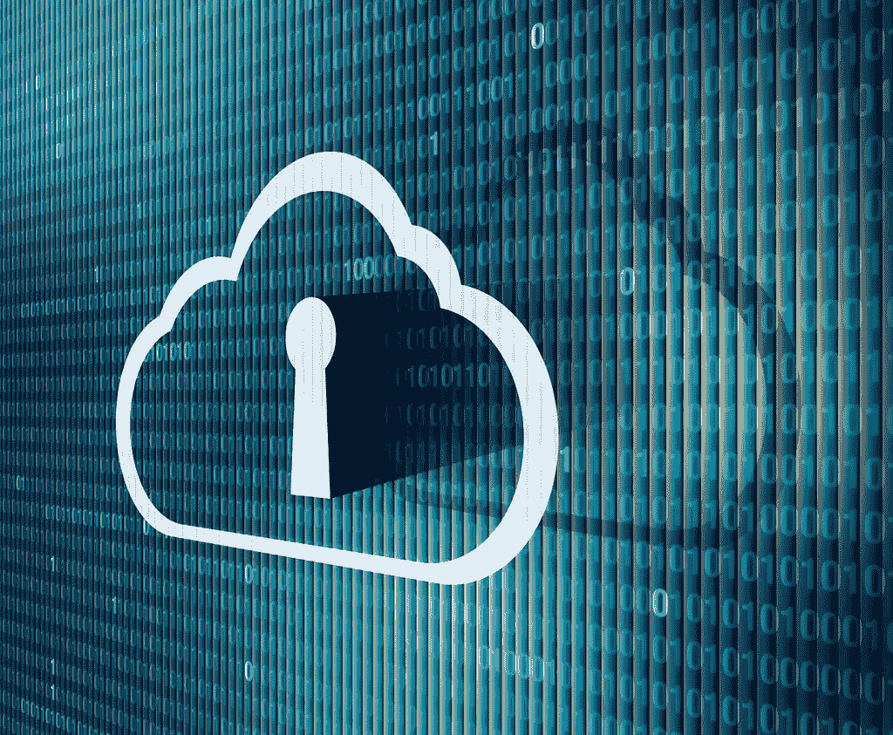

# 每个工程师/架构师都需要知道的关于安全性的 25 件事

> 原文：<https://blog.devgenius.io/25-things-about-security-that-every-cloud-solutions-architect-need-to-know-d8a0dc3f7456?source=collection_archive---------0----------------------->

图片来源([https://live . static Flickr . com/8604/16042227002 _ 1d 00e 0771d _ b . jpg](https://live.staticflickr.com/8604/16042227002_1d00e0771d_b.jpg))

这篇文章是一个系列的一部分(参见[第二部分](https://medium.com/@amralieg/25-things-about-data-that-every-engineer-architect-needs-to-know-9330e6a51cd4)关于数据和[第三部分](https://medium.com/@amralieg/25-things-about-networking-that-every-engineer-architect-needs-to-know-313e634b9456)关于网络),所有软件工程师和解决方案架构师需要知道在云上产生一个安全的、可伸缩的、弹性的和架构良好的解决方案。

该列表不是详尽的列表。但是，它应该足够好，可以快速上手。

对于这个列表中的每一项，都有一个附带的链接，主要是引导你到谷歌，并为你设置了正确的关键词。

让我们进入列表，如果你觉得有什么不对，或者想在列表中添加一项，请在下面留下评论。

**安全/解决方案架构师需要了解:**

1.  对称和非对称加密之间的区别，不同算法(RSA、DES、Triple DES、AES)使用的加密类型，以及何时使用每种类型。(参见[谷歌](https://www.google.com/search?q=Difference+between+Symmetric+and+asymmetric+encryption&rlz=1C1GCEU_en&oq=Difference+between+Symmetric+and+asymmetric+encryption&aqs=chrome..69i57&sourceid=chrome&ie=UTF-8))
2.  如何管理加密密钥(客户管理、客户提供和云管理)以及为您的密钥选择哪个选项(参见 [AWS](https://docs.aws.amazon.com/kms/latest/developerguide/concepts.html#master_keys) )
3.  什么是秘密管理和密钥管理服务(KMS)及其在云安全中的作用？(参见[谷歌](https://cloud.google.com/secret-manager/docs/overview))，以及了解加密密钥层级和信任根(参见[谷歌](https://cloud.google.com/security/encryption-at-rest/default-encryption#encryption_key_hierarchy_and_root_of_trust))
4.  静态加密和传输中加密的区别。(参见[谷歌](https://www.google.com/search?q=encryption+at+rest+and+encryption+in+transit&rlz=1C1GCEU_en&oq=encryption+at+rest+and+encryption+in+transit&aqs=chrome..69i57&sourceid=chrome&ie=UTF-8))
5.  了解信封加密及其如何用于保护您的安全密钥，以及加密过程中使用的不同类型的密钥([主密钥、DEK、KEK](https://www.google.com/search?q=DEK%2C+KEK&rlz=1C1GCEU_en&oq=DEK%2C+KEK&aqs=chrome..69i57&sourceid=chrome&ie=UTF-8) 等)。).(参见 [IBM](https://cloud.ibm.com/docs/key-protect?topic=key-protect-envelope-encryption) )
6.  了解不同的安全模型(RBAC、ACL、IAM)安全上下文中策略、角色和组之间的区别。(参见 [AWS](https://docs.aws.amazon.com/IAM/latest/UserGuide/id.html) )
7.  了解身份联盟如何使用 ADFS 或其他服务在云和本地之间工作。(参见 [Google](https://www.google.com/search?q=dentity+federation+works+between+cloud+and+on-prem&rlz=1C1GCEU_en&oq=dentity+federation+works+between+cloud+and+on-prem&aqs=chrome..69i57&sourceid=chrome&ie=UTF-8) )，以及身份感知代理如何在普通的旧 VPN 上提供更安全的连接(参见 [Medium](https://medium.com/google-cloud/what-is-beyondcorp-what-is-identity-aware-proxy-de525d9b3f90) )
8.  了解 AAA(AAA)安全性(认证、授权和审计)。(见[谷歌](https://www.google.com/search?rlz=1C1GCEU_en&sxsrf=ALeKk03Nn0yqIMObHCgemQUjhZw3Rbh2DA%3A1589807315137&ei=04jCXpL2B-WX1fAP38GNiAc&q=AAA+%28Authentication%2C+Authorisation+%26+Audit%29&oq=AAA+%28Authentication%2C+Authorisation+%26+Audit%29&gs_lcp=CgZwc3ktYWIQA1DnLVjhMGCKNmgAcAB4AIABZYgB9wGSAQMyLjGYAQCgAQGqAQdnd3Mtd2l6&sclient=psy-ab&ved=0ahUKEwjSq57ivb3pAhXlSxUIHd9gA3EQ4dUDCAw&uact=5))，以及了解 CIA 三要素(保密性、完整性和可用性)。(参见[什么是](https://whatis.techtarget.com/definition/Confidentiality-integrity-and-availability-CIA))
9.  SSL/TLS 握手如何工作，握手过程中何时使用非对称密钥和对称密钥？(参见 [Cloudflare](https://www.cloudflare.com/learning/ssl/what-happens-in-a-tls-handshake/) )以及 SNI 如何促进在同一个 IP 地址上使用多个证书(参见 [GlobalSign](https://www.globalsign.com/en/blog/what-is-server-name-indication) )
10.  了解什么是单点登录 SSO，SAML、OpenID、JWT 和 OAuth-2.0 是如何工作的，以及不同类型的访问令牌(长期令牌、刷新令牌等)之间的区别。).(参见[谷歌](https://www.google.com/search?rlz=1C1GCEU_en&sxsrf=ALeKk01xAB3hzgTIgExgQZ2rnEezXGRSmw%3A1589879775324&ei=36PDXt6fE76k1fAPjpG-yAc&q=SAML%2C+OpenID%2C+JWT%2C+OAuth-2.0&oq=SAML%2C+OpenID%2C+JWT%2C+OAuth-2.0&gs_lcp=CgZwc3ktYWIQAzoECCMQJ1C0O1jGP2DtQWgAcAB4AIABQYgB-AGSAQE0mAEAoAEBqgEHZ3dzLXdpeg&sclient=psy-ab&ved=0ahUKEwiei_nZy7_pAhU-UhUIHY6ID3kQ4dUDCAw&uact=5)和 [Youtube](https://www.youtube.com/watch?v=CPbvxxslDTU) )
11.  知道如何使用 HTTP 基本身份验证、API 密钥、JWT 令牌等来保护公共 API。(参见[谷歌](https://blog.restcase.com/4-most-used-rest-api-authentication-methods/))
12.  了解 SIEM 解决方案的作用以及 DevSecOps 的含义。(参见[谷歌](https://www.google.com/search?rlz=1C1GCEU_en&sxsrf=ALeKk02UCPPl1VR_LwzRvhEV4GGBvGwXrg%3A1589876789204&ei=NZjDXoKADMyH1fAPg7-8mAo&q=SIEM+DevSecOps&oq=SIEM+DevSecOps&gs_lcp=CgZwc3ktYWIQAzIECCMQJzoECAAQR1DFlAFYxZQBYJyoAWgAcAF4AIABZYgBZZIBAzAuMZgBAKABAaoBB2d3cy13aXo&sclient=psy-ab&ved=0ahUKEwjC7obKwL_pAhXMQxUIHYMfD6MQ4dUDCAw&uact=5))
13.  了解不同类型的安全威胁以及 WAF ( [Web 应用防火墙](https://www.google.com/search?rlz=1C1GCEU_en&sxsrf=ALeKk01XHZV5NGnzkX4BKj8k24L0utQrRA:1589829467336&q=Web+Application+Firewalls&spell=1&sa=X&ved=2ahUKEwjIlJ2lkL7pAhWUtHEKHWkyAbwQBSgAegQIbBAn&biw=1477&bih=782))的作用，以抵御这些攻击( [DDoS &僵尸网络](https://www.google.com/search?rlz=1C1GCEU_en&sxsrf=ALeKk01Ybg1H3Io1390n_N0xLh-Md5efOQ:1589807546816&q=DDoS+and+BotNets,&spell=1&sa=X&ved=2ahUKEwid-NrQvr3pAhURu3EKHZFMAdAQBSgAegQIZhAn&biw=1477&bih=742)、[中间人(MitM)](https://www.google.com/search?q=Man+in+the+Middle+(MitM)&rlz=1C1GCEU_en&oq=Man+in+the+Middle+(MitM)&aqs=chrome..69i57&sourceid=chrome&ie=UTF-8) 、 [SQL 注入](https://www.google.com/search?q=SQL-Injections&rlz=1C1GCEU_en&oq=SQL-Injections&aqs=chrome..69i57&sourceid=chrome&ie=UTF-8)、[跨站点脚本 XSS](https://www.google.com/search?q=Cross-site+scripting+XSS&rlz=1C1GCEU_en&oq=Cross-site+scripting+XSS&aqs=chrome..69i57j69i59&sourceid=chrome&ie=UTF-8) 、 [CSRF 攻击](https://www.google.com/search?q=CSRF+attack&rlz=1C1GCEU_en&oq=CSRF+attack&aqs=chrome..69i57&sourceid=chrome&ie=UTF-8)、[混合 HTTP/HTTPS 内容](https://www.google.com/search?q=Mixed+HTTP%2FHTTPS+content&rlz=1C1GCEU_en&oq=Mixed+HTTP%2FHTTPS+content&aqs=chrome..69i57&sourceid=chrome&ie=UTF-8)、[端口扫描](https://www.google.com/search?q=Port+Scanning&rlz=1C1GCEU_en&oq=Port+Scanning&aqs=chrome..69i57&sourceid=chrome&ie=UTF-8)、[彩虹表](https://www.google.com/search?q=rainbow+tables&rlz=1C1GCEU_en&oq=rainbow+tables&aqs=chrome..69i57&sourceid=chrome&ie=UTF-8)
14.  了解防火墙的作用，它如何处理[入站和出站](https://www.google.com/search?q=ingress+vs+egress&rlz=1C1GCEU_en&oq=ingress+vs+egress&aqs=chrome..69i57&sourceid=chrome&ie=UTF-8)流量，以及它如何帮助在网络中创建隔离区。(见 [Azure](https://docs.microsoft.com/en-us/azure/architecture/reference-architectures/dmz/nva-ha) )，也知道有状态防火墙和无状态防火墙的区别。(参见 [CDW](http://cdw.com/content/cdw/en/articles/security/2019/04/29/stateful-versus-stateless-firewalls.html) )
15.  数字签名如何工作，以及在技术上“签署”文档意味着什么。(参见[文档设计](https://www.docusign.co.uk/how-it-works/electronic-signature/digital-signature/digital-signature-faq))
16.  了解零信任安全模型(参见[谷歌](https://www.google.com/search?q=Zero+Trust+Security+Model&rlz=1C1GCEU_en&oq=Zero+Trust+Security+Model&aqs=chrome..69i57&sourceid=chrome&ie=UTF-8))、最小特权原则(POLP)(参见[谷歌](https://digitalguardian.com/blog/what-principle-least-privilege-polp-best-practice-information-security-and-compliance))、以及安全上下文中的职责分离(SoD)(参见[谷歌](https://www.google.com/search?q=Separation+of+duties+(SoD)&rlz=1C1GCEU_en&oq=Separation+of+duties+(SoD)&aqs=chrome..69i57&sourceid=chrome&ie=UTF-8))
17.  如何使用 Bastion 主机(跳跃盒)访问网络，为什么它比其他方式更安全。(参见[谷歌](https://www.greenhousedata.com/blog/whats-a-jumpbox-or-bastion-host-anyway))
18.  知道如何使用 PenTest(参见 [Google](https://www.google.com/search?q=PenTest+and+how+it+works&rlz=1C1GCEU_en&oq=PenTest+and+how+it+works&aqs=chrome..69i57&sourceid=chrome&ie=UTF-8) )和 Kali Linux(参见 [Google](https://www.google.com/search?q=kali+linux&rlz=1C1GCEU_en&oq=Kali+&aqs=chrome.1.69i57j0l2j46j0l2j46j0j46l2.2740j1j7&sourceid=chrome&ie=UTF-8) )、公钥基础设施 PKI(参见 [Google](https://www.google.com/search?q=Public+Key+Infrastructure+PKI&rlz=1C1GCEU_en&oq=Public+Key+Infrastructure+PKI&aqs=chrome..69i57&sourceid=chrome&ie=UTF-8) )等强化 Linux 发行版以及硬件安全模块 HSM 来发现解决方案中的安全漏洞吗？(参见[谷歌](https://www.google.com/search?rlz=1C1GCEU_en&sxsrf=ALeKk03MVzPe2Y6ppGApOtyCkgBFNEd3Fg%3A1589809311895&ei=n5DCXrSaNpShgAbhzLxg&q=HSM&oq=HSM&gs_lcp=CgZwc3ktYWIQAzIECAAQQzIECAAQQzIECAAQQzICCAAyBAgAEEMyAggAMgIIADICCAAyAggAMgIIADoECCMQJzoFCAAQkQI6BQgAEIMBUMdUWLxYYNZcaABwAHgAgAFwiAGuApIBAzEuMpgBAKABAaoBB2d3cy13aXo&sclient=psy-ab&ved=0ahUKEwj05a6axb3pAhWUEMAKHWEmDwwQ4dUDCAw&uact=5))
19.  风险、脆弱性和威胁的区别？。(参见[谷歌](https://www.google.com/search?q=risk%2C+vulnerability+and+threat&rlz=1C1GCEU_en&oq=risk%2C+vulnerability+and+threat&aqs=chrome..69i57&sourceid=chrome&ie=UTF-8))
20.  了解入侵检测系统(IDS)和入侵防御系统(IPS)(及其变体 HIDS 和 NIDS)之间的区别。(参见 [DNSStuff](https://www.dnsstuff.com/ids-vs-ips) )
21.  编码、加密、哈希、盐析哈希和混淆之间的区别。(参见 [Google](https://www.google.com/search?q=encoding%2C+encryption%2C+hashing%2C+salting+hashing+and+Obfuscation&rlz=1C1GCEU_en&oq=encoding%2C+encryption%2C+hashing%2C+salting+hashing+and+Obfuscation&aqs=chrome..69i57&sourceid=chrome&ie=UTF-8) )，以及匿名化和标记化的区别(参见 [Google](https://www.google.com/search?q=anonymization+vs+tokenization&rlz=1C1GCEU_en&oq=annonymisation+vs+toke&aqs=chrome.1.69i57j0l2.10873j1j7&sourceid=chrome&ie=UTF-8) )，以及什么是数据净化(参见 [Blanco](https://www.blancco.com/resources/article-data-sanitization-definition/) )
22.  多因素身份认证的工作原理，尤其是最常见的实施方式(双因素身份认证)。(参见[谷歌](https://www.google.com/search?q=Multi-factor+authentication+works&rlz=1C1GCEU_en&oq=Multi-factor+authentication+works&aqs=chrome..69i57&sourceid=chrome&ie=UTF-8))
23.  对通用隐私立法/标准(GDPR、HIPAA、COPPA、PCI DSS)有较高的认识。(见[谷歌](https://www.google.com/search?q=GDPR%2C+HIPAA&rlz=1C1GCEU_en&oq=GDPR%2C+HIPAA&aqs=chrome..69i57&sourceid=chrome&ie=UTF-8))，以及如何准备信息安全审计(见 [Dashlane](https://blog.dashlane.com/conduct-internal-security-audit/) )
24.  了解安全通信协议，如 TLS/SSL、IPSec、SFTP 和 FTPS。(参见[谷歌](https://www.rebex.net/kb/secure-ftp/))
25.  Ping 和 traceroute 的工作原理。(参见 [Youtube](https://www.youtube.com/watch?v=G05y9UKT69s) )

我真的相信知识是产生适当的架构良好的解决方案的第一步，然而，仅仅有知识并不能保证你能开发这样的解决方案，你还需要经验、指南、[最佳实践](https://d1.awsstatic.com/whitepapers/AWS_Cloud_Best_Practices.pdf)、[架构框架](https://cloud.google.com/blog/products/gcp/new-google-cloud-architecture-framework-guide)、[参考架构](https://gcp.solutions/)等等。

别忘了查看[第二部分](https://medium.com/@amralieg/25-things-about-data-that-every-engineer-architect-needs-to-know-9330e6a51cd4)关于数据和[第三部分](https://medium.com/@amralieg/25-things-about-networking-that-every-engineer-architect-needs-to-know-313e634b9456)关于网络，并在 [Linkedin](https://www.linkedin.com/in/amralieg) 上随意连接。如果你喜欢这篇文章，请在下面留下评论或鼓掌。