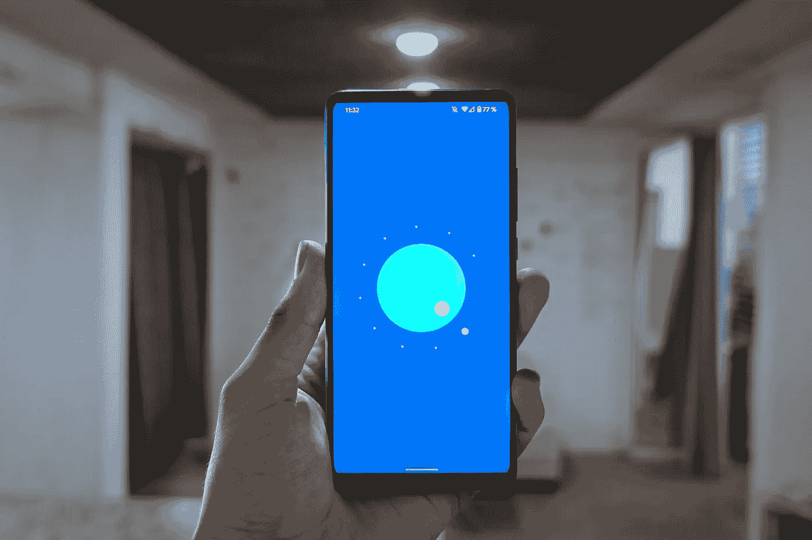
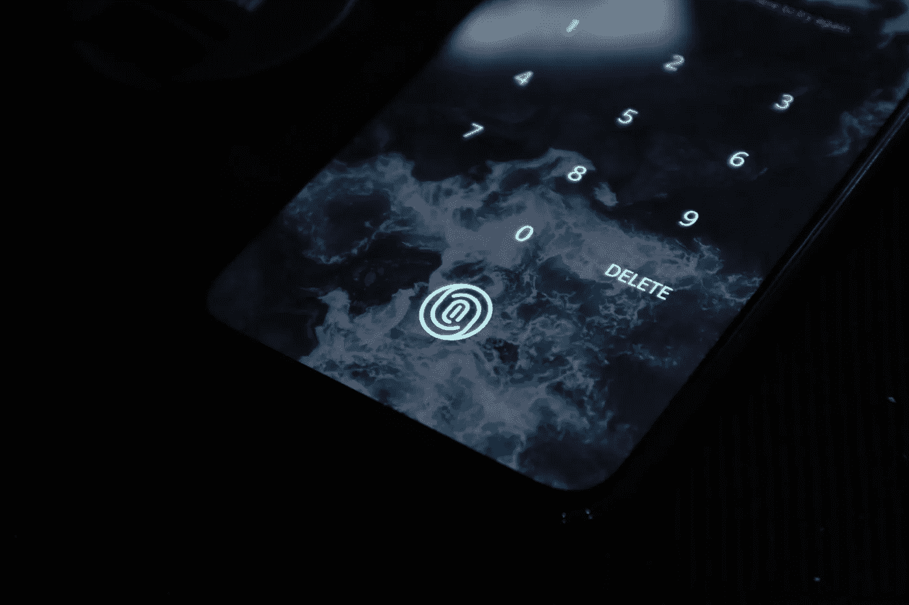
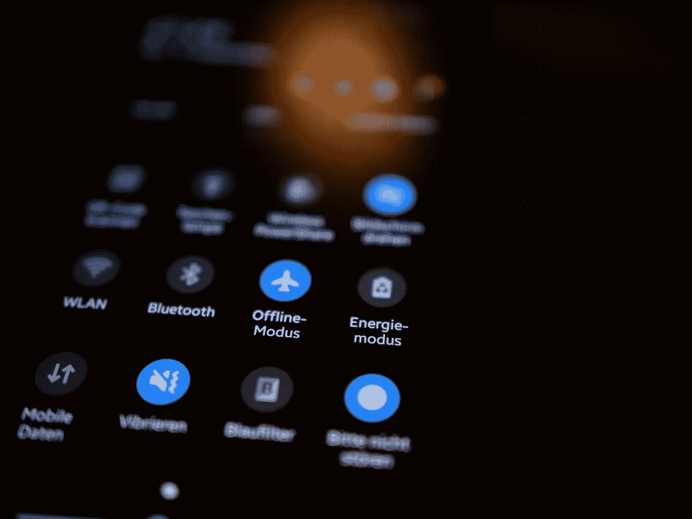

# 从 Android 6 到 Android 11 的 27 大变化

> 原文：<https://blog.devgenius.io/27-major-changes-from-android-6-to-android-11-f38e41aeb4e6?source=collection_archive---------4----------------------->

## 不同版本的 Android 更新概述

Android 在每个版本中都带来了很多实质性的变化。据我所知，Android 5 是 Android 版本历史上最大和最重要的变化之一。在那之后，许多可见和不可见的变化在后来的版本中逐渐出现。在这里，我将介绍一些从 Android 6 到 Android 11 的可见和广泛讨论的功能。

## 安卓 6:

# 1.指纹认证

通过扫描指纹来验证用户是 Android 6 中引入的 Android 设备的最大里程碑之一。

卢肯·萨贝拉诺在 [Unsplash](https://unsplash.com/s/photos/fingerprint?utm_source=unsplash&utm_medium=referral&utm_content=creditCopyText) 上拍摄的照片

# 2.应用程序链接

开发者可以设置 Android 应用链接，将用户直接带到应用中某个链接的特定内容。

# 3.应用程序数据的自动备份

android 平台负责应用程序的完整应用程序数据备份和恢复。

# 4.直接共享

用户可以直观快速地定义*直接分享目标*，从而在应用中发起特定活动。

# 5.语音交互 API

这是一个语音交互 API，允许开发人员在[语音动作](https://developers.google.com/voice-actions/)的帮助下，将对话式语音体验构建到他们的应用程序中。

# 6.辅助 API

从 Android 6 开始，用户可以在任何应用程序中启动助手，只需长按 **Home** 按钮。

## 安卓 7:

# 7.多窗口支持

这是 android 平台的多任务功能。从 Android 7.0 开始，用户可以在分屏模式下并排或上下运行两个应用程序。用户可以通过拖动应用之间的分隔线来调整应用的大小。

# 8.通知增强功能

在 Android 7.0 中，通知被重新设计，以使它们更容易和更快地使用。一些变化包括**模板更新**、**消息风格定制、捆绑通知、直接回复**、**定制视图。**

# 9.Vulkan API

Android 7.0 将一种新的 3D 渲染 API[Vulkan](http://www.khronos.org/vulkan)集成到平台中。像[OpenGL ES](https://www.khronos.org/opengles/)一样，Vulkan 是由 Khronos 集团维护的 3D 图形和渲染的开放标准。

# 10.来电显示

Android 7.0 允许默认的手机应用程序筛选来电。它允许手机应用程序根据来电的详细信息执行一些操作，例如拒绝来电。

# 11.Chrome + WebView，一起

从 Chrome 51 和 Android 7.0，你设备上的 Chrome APK 是用来提供和渲染 Android 系统 WebViews 的。

# 12.Android 电视录制

Android 7.0 通过新的录制 API 增加了录制和播放 Android TV 输入服务内容的能力。

# 13.应用快捷方式

用户可以从启动器直接使用该功能来完成应用程序中的关键操作。用户只需长按应用程序的启动器图标来显示应用程序的快捷方式，然后点击快捷方式来跳转到相关的操作。

## 安卓 8:

# 14.画中画模式

画中画(PIP)是一种特殊类型的多窗口模式，主要用于视频回放。从 Android 8.0 开始，这一功能在 Android 设备上可用，而以前仅在 Android TV 上可用。

# 15.神经网络 API

Android 8.1 神经网络 API 面向开发者开放，为 TensorFlow 等设备上的机器学习框架提供加速计算和推理。

## 安卓 9:

# 16.使用 Wi-Fi RTT 进行室内定位

在运行有硬件支持的 Android 9 的设备上，开发人员可以使用[RTT API](https://developer.android.com/reference/android/net/wifi/rtt/package-summary)来测量到附近支持 RTT 的 Wi-Fi *接入点* (APs)的距离。

# 17.多摄像头支持和摄像头更新

在运行 Android 9 的设备上，开发者可以同时从[两个或更多的物理摄像头](https://developer.android.com/reference/android/hardware/camera2/CameraMetadata#REQUEST_AVAILABLE_CAPABILITIES_LOGICAL_MULTI_CAMERA)访问视频流。

# 18.动画图像

Android 9 引入了用于绘制和显示 GIF 和 WebP 动画图像的新 API。

## 安卓 10:

# 19.可折叠

Android 10 带来了强大的多窗口支持，扩展了应用程序窗口之间的多任务处理，并提供了屏幕连续性，以便在设备折叠或展开时保持应用程序的状态。

# 20.5G 网络

Android 10 引入了 5G，以提供持续更快的速度和更低的延迟。5G 给用户带来身临其境的高带宽体验。

# 21.通知中的智能回复

默认情况下，Android 10 提供的智能回复和操作会直接插入到通知中。

# 22.黑暗主题

Android 10 带来了全系统黑暗主题，有助于弱光和增加电池寿命。这个功能可以用 Force Dark 为 app 动态创建一个黑暗主题。

斯登冲锋枪·里特菲尔德在 [Unsplash](https://unsplash.com/s/photos/dark-mode?utm_source=unsplash&utm_medium=referral&utm_content=creditCopyText) 上拍摄的照片

# 23.手势导航

Android 10 引入了全手势导航模式，消除了导航栏区域，允许应用程序使用全屏来提供更丰富、更身临其境的体验。

# 24.用户隐私

Android 10 带来了广泛的变化，以保护隐私并给用户更多的控制权，改进了系统 UI，更严格的权限，以及对应用程序可以使用的数据类型的限制。

## 安卓 11:

# 25.设备控制

Android 11 引入了控件提供者服务 API，您可以使用它来为连接的外部设备公开控件。

# 26.媒体控制

Android 11 带来了出现在快速设置附近的媒体控件。多个应用程序会话被安排在一个可旋转的转盘中。用户可以从转盘恢复之前的会话，而无需启动应用程序。

# 27.更好地支持瀑布显示

Android 11 支持*瀑布显示器*，环绕设备边缘的显示器。

# 结论

Android 引入了许多以用户为中心、安全、隐私和性能相关的功能，这些功能与旧的功能不同，并且大多数功能对于普通用户来说不太明显。如果你是一个普通用户，你不一定要了解洞察，但如果你是一个开发者，你必须了解他们更深一点。

祝你有美好的一天。😊

## 参考

[1].[https://developer.android.com/about/versions](https://developer.android.com/about/versions)