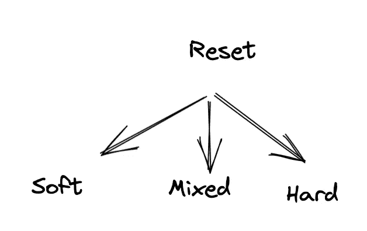

# 3… 2… 1… git 开始

> 原文：<https://blog.devgenius.io/3-2-1-git-start-dbbe9989c045?source=collection_archive---------12----------------------->

Git 是程序员的时间机器。这是一个版本控制、源代码控制系统。在 Git 的帮助下，我们可以跟踪和管理软件代码的变更。在这一课中，我们将讨论使用 Git 时需要记住的基本事项。所以，让我们探索我们的时间机器…

我们可以从官网安装 Git。如果使用 Brew，运行 ***brew 安装 git*** 即可安装 Git。安装 git 后，我们可以通过运行以下命令来检查版本:

```
git --version

//Output: git version 2.30.1
```

现在，是时候通过运行下面的配置命令让我们的时间机器知道我们是谁了:

```
git config --global user.name "{username}" 
git config --global user.email "{mail}"
```

让我们创建一个存储库，在这里我们将能够测试我们将在本文中讨论的所有东西。如果你不知道存储库这个术语，它也是我们存放所有代码的目录/文件夹。这可以通过运行以下命令来完成:

```
mkdir learningGit 

//mkdir is a bash command used to create directories.
//learningGit is the directoryName
```

***git init*** 这是我们可以在任何存储库中初始化 git 的命令。它将创建一个 ***。目录中的 git*** 文件夹，它将包含关于存储库的基本信息，如配置、描述、头文件和钩子，我们将在后面讨论。现在，当我们准备好我们的存储库，让我们添加一些内容，并开始版本控制我们的存储库。

```
➜  learningGit git:(master) echo "Hello World" >> welcome.txt
```

> 注意: **git status** 是用来检查存储库当前状态的最流行的命令之一。在整篇文章中，我们将在许多地方使用这个命令。

现在，当我们在存储库中创建了一个名为 welcome.txt 的文件后，让我们看看 status 命令要说什么。

```
➜  learningGit git:(master) ✗ git status
On branch master

No commits yet

Untracked files:
  (use "git add <file>..." to include in what will be committed)
 welcome.txt

nothing added to commit but untracked files present (use "git add" to track)
```

*   在第一行中，它告诉我们在 branch master 上(当我们执行 git init 时，master/main 将是默认创建的分支)。
*   在下一行中，我们可以看到我们还没有创建任何提交(很快将在本文中讨论这个问题)。
*   下一行描述有一个未被跟踪的文件名 welcome.txt，建议我们可以通过运行 ***git add*** 命令将该文件添加到版本系统中。
*   最后一行总结了没有什么可提交的，但是我们可以通过运行指定的命令来跟踪未被跟踪的文件。

# 添加:

好了，现在我们已经看到，默认情况下 git 不会将新创建的文件添加到版本系统中。我们必须手动输入。我们可以运行以下命令:

```
➜  learningGit git:(master) ✗ git add welcome.txt
➜  learningGit git:(master) ✗ git add --all
➜  learningGit git:(master) ✗ git add -A
```

*   正如我们在第一个命令中看到的，我们可以传递文件名，只有该文件将被跟踪。
*   通过运行第二个命令，我们可以将所有当前未跟踪的文件添加到跟踪文件列表中。
*   第三个命令是第二个命令的缩写。它将执行与第二个命令相同的操作。

让我们看看状态命令为我们提供了什么…

```
➜  learningGit git:(master) ✗ gst
On branch master

No commits yet

Changes to be committed:
  (use "git rm --cached <file>..." to unstage)
 new file:   welcome.txt
```

第一和第二行已经讨论过了。让我们看看第三行中有什么，它表示我们有要提交的更改，这意味着我们添加的 welcome.txt 文件现在已移动到 staged(tracked ),可以进行版本控制，他们还建议使用命令来取消这些更改。

# **提交:**

在提交中，我们拍摄项目的快照。一个项目的保存点，也是我们想改变历史某件事的时候的回归点。

```
➜  learningGit git:(master) ✗ git commit -m "Making my first commit"

[master (root-commit) 63c1d52] Making my first commit
 1 file changed, 1 insertion(+)
 create mode 100644 welcome.txt
```

Git commit 返回以下输出，其中包含 sha-id(将用于返回历史记录)、提交消息，以及其他信息，即 1 个文件已更改，有一个插入，welcome.txt 是我们创建的文件。

> N 注意:“-m”是我们为传递内联提交消息而给出的标志。如果我们不传递“-m”，它将打开 vim 编辑器，我们也可以在其中写入提交消息。
> 
> 注意:通过使用"-am "，我们可以一起添加和提交。

日志:作为技术人员，我们都知道日志的重要性。下面是一些有用的命令，我们可以用它们来获取关于每次/所有提交的信息。让我们学习一些最有用的 git 日志命令。

git ls-tree <tree-ish>:这个命令将给出我们在提交过程中修改过的所有文件。这里我们可以看到两个东西，一个是树，一个是 blob(二进制日志对象)。在 Tree 中，添加的东西是一个目录，在 Blob 中，它是一个文件。当我们在每次提交中添加多个文件时，这是非常有用的，这样我们就可以跟踪所有更改的历史。</tree-ish>

```
➜  learningGit git:(master) git ls-tree Head
040000 tree c439ae2735cc8c2ab66ed3d820eb1cbcb0bf3f78 history
100644 blob 557db03de997c86a4a028e1ebd3a1ceb225be238 welcome.txt
```

# 日志:

git log 命令为我们提供了提交 id、添加时间和添加者。

```
➜  learningGit git:(master) git log

commit 3014bcecfc86ec8f8ecdf4706caf02d0be91d769 (HEAD -> master)
Author: Vikram Singh <58028680+bcalm@users.noreply.github.com>
Date:   Sun Nov 27 06:33:19 2022 +0530

    Added history folder

commit 63c1d528863bb2d93d6bf1140c40bdebb2fada5b
Author: Vikram Singh <58028680+bcalm@users.noreply.github.com>
Date:   Sun Nov 27 06:12:06 2022 +0530

    Making my first commit
```

还可以查看从/到特定日期的提交以及特定目录的提交。

```
git log - since=2021–21–2 //From a specific day to present
git log - until=2021–21–2 //Till a specific date
git log <filename/directory>
```

git 日志中还有几个可用的标志，在某些特定情况下非常有用。

```
git log -p //See the actual changes in every file
git log --stat //This command will show the statics of each file that was changed in each commit.
git log --format=oneline //shaId + commit message
git log --oneline //shortShaId + commit message
git log --graph --all --oneline --decorate //shortShaId + commit message + graph representation of branches and merge
```

# 重置:

假设我们已经提交了一些代码，但是出现了一些问题。有一种方法可以重置历史。重置可以通过三种方式完成。



重置类型

**软复位:**在软复位中，我们可以通过 commitId，它会删除所有在此之上的提交。那么这些提交的更改将在登台环境中可见。我们可以相应地修改内容并创建新的提交。

```
➜  learningGit git:(master) git reset --soft 63c1d52
➜  learningGit git:(master) ✗ gst
On branch master
Changes to be committed:
  (use "git restore --staged <file>..." to unstage)
 new file:   history/history.txt
```

**混合重置:**在混合重置中，将删除上述提交，但更改仍会出现在未登台环境中。

```
 learningGit git:(master) git reset --mixed 63c1d52
➜  learningGit git:(master) ✗ gst
On branch master
Untracked files:
  (use "git add <file>..." to include in what will be committed)
 history/

nothing added to commit but untracked files present (use "git add" to track)
```

**硬重置:**在硬重置期间，所有提交以及这些提交的更改都将丢失。

```
➜  learningGit git:(master) git reset --hard 63c1d52
HEAD is now at 63c1d52 Making my first commit
➜  learningGit git:(master) gst
On branch master
nothing to commit, working tree clean
```

> **注意:除非非常关键，否则不要执行复位。**

在下一篇文章中，我们将学习分支、合并、rebase 和更多的东西。

谢谢，祝阅读愉快。