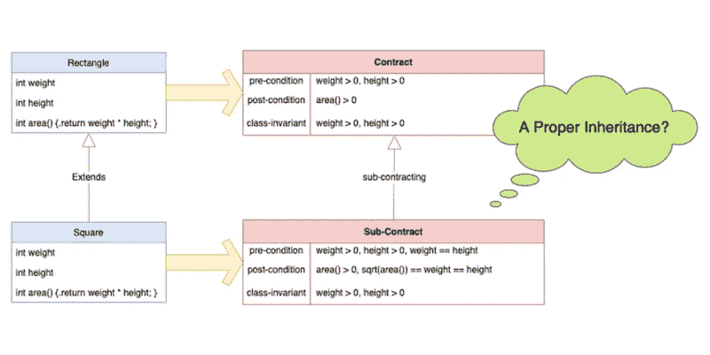

# 3 按合同设计的好处

> 原文：<https://blog.devgenius.io/3-benefits-of-design-by-contract-d5752f3c7468?source=collection_archive---------6----------------------->

# **熟能生巧**

我从一月份就开始调查 DbC，并在我的[锈边项目](https://github.com/tsunghsiang/pokemon-trading-platform)中采纳了它的精神。在运用这项技术的过程中，我想和那些还没有尝试过的人分享一下我的想法和感受。

毕竟，在工作中接受一种新方法最有力的方式就是把它变成现实。据估计，一个习惯可以通过连续做 21 天没有任何中断。我也是。

我已经写了 3 个帖子:[Step Inside Contract Design by Contract](/step-inside-design-by-contract-a06a7a49271f)、[机具 Contract Design in Rust](/implement-design-by-contract-in-rust-3842ec9ba3c4)、[Contract and heritage](https://uragilecoach.medium.com/contract-and-inheritance-dee312b9d066)，以记录我对技能的想法。令我非常惊讶的是，它确实为我节省了很多时间来澄清调用方和被调用方之间的责任，并为我从另一个角度重新检查“测试”打开了一扇门。

# 3 DbC 的主要优势

在我看来，有 3 个主要的专业技能带来的工程师。

*   **编码为文件**

> **写合同定义模块**的业务规范。

以上面的代码段为例，它取自一个查询特定订单状态的数据库模块，我写下了 3 个前置条件(关键字: **requires** )、后置条件(关键字:**insurance**)和类不变量(关键字:**不变量**，检查在不同的执行阶段是否满足某些需求。

一般来说，我们会添加测试用例来验证业务逻辑是否正确实现。换句话说，测试用例被视为业务文档的一部分，开发者可以在没有纸面工作的情况下快速调查发生了什么。**借助 DbC，成为陈述模块规范的测试用例的替代**。因此，它减少了测试用例的数量，变得更具描述性。

**“编码为文件”可通过 DbC** 实现。

*   **责任澄清**

> **DbC 帮助工程师澄清应该由呼叫者还是被呼叫者负责修复缺陷。**

DbC 声明了客户(调用者)在前置条件下应该满足什么，供应商(被调用者)在后置条件下应该满足什么，以及在所有条件下什么是永远正确的。基于这一假定，我们能够认识到谁应该承担修复缺陷的责任。

让我们重新考虑一下上面的代码段，查询函数上有 3 个“ **requires** 标识符，用于说明客户应该遵循什么。例如，所查询的订单应该通过检查函数“order_status_exist(uuid)”存在于数据库中，否则程序将死机，要求客户端修复该问题。

此外，让我们再调查一个关于“**确保**标识符”的案例。该功能是将订单的状态添加到数据库中。我们假设执行之后数据库中应该存在相应的字段。因此，有一个 post 条件要求被调用方确保状态的存在。

明确客户(呼叫者)和供应商(被呼叫者)之间的责任非常重要。DbC 提供了明确的指导。

*   **忌早退不当继承**

> DbC 会告诉您继承是否有效。

说到继承，越来越多的文章都提到要尽量避免使用它。更重要的是，一些现代语言，比如 [go](https://go.dev/) 和 [rust](https://www.rust-lang.org/) ，只提供接口继承而不提供类继承，以防止开发人员滥用。然而，到目前为止还没有人能够提供一个简明的指南来解释“什么是有效的继承”，当它有时是不可避免地必须采用的时候。

DbC 为实现这一点提供了一个指导原则。

本质上，代码合约类似于业务合约。我们可以以租房为例来说明**分包**的原则是如何调节遗产继承的正确性的:

合同一经订立，双方应遵循预先确定的义务；从而享受其他人提供的好处。

如果有第二个业主监管分包合同，如下所示:

让我们从客户(调用者)的角度来看一下分包合同。你不会签署分包合同，因为它要求你支付超过什么母公司合同宣布，虽然它提供了额外的维护服务，母公司合同不承诺。**遗产是房东和第二房东之间关系的隐喻**。

**分包原则**通过以下方式确认有效继承:
【1】前置条件弱于子类中的继承
【2】后置条件强于子类中的继承

记住**分包**的原则，让我们回顾一个经典案例:一个矩形和一个正方形。在数学定义中，正方形被视为矩形的特化。因此在外观上我们不会拒绝这个设计。尽管如此，当我们写下矩形类和正方形类的合约时，真相可能会被揭示。我们发现，前置条件变得更强，这违反了分包原则。因此，该设计是不适当的，最好将它分成独立的模块。

DbC 为确认适当的继承提供了一个指导原则。

# DbC 不受欢迎

不幸的是，DbC 的概念在台湾并不受欢迎。就连我自己而言，我也只是偶尔在 T2 TeddySoft 的博客上看到它，因此我开始自己调查相关资料。通常在西方国家被提及。

从我的角度来看，有三个原因，为什么它是不常见的在这里。首先，正是 T4 在 20 世纪 90 年代早期提出了“T5”，当时互联网还很少见。因此，这个想法不可能在全球传播。其次，现代编程语言不支持 DbC 的实现；只有并非主流语言的 [Eiffel](https://www.eiffel.org/doc/eiffel/Learning_Eiffel) 支持该语义。即使生锈了，它也只提供了一个[插件](https://docs.rs/contracts/latest/contracts/)和异常处理机制。最后，从延迟控制的角度来看，DbC 的前置/后置条件检查可能会导致性能问题，因此开发人员宁愿编写更多的测试用例，而不是压缩他们的模块。

嗯，以上的理由都是从我的观点来看的，所以它们可能不是真的。欢迎下面那些访问我的媒体评论；与我分享你想法。:)

# 蔻驰的低语

对于那些想追求软件正确性的人来说，按合同设计是一个很好的开始。它提供了一个新手从不同的角度来验证他们的模块:业务规范而不是测试用例。为一个模块编写合约与同时为它制定规范完全相同。它不仅消除了不必要的测试用例，还通过分包的原则避免了早期不正确的继承，为我们度量继承的正确性打开了一扇新的大门。

我很高兴提倡采用合同设计，因为它给我提供了另一个角度来看待软件设计。还有很多宝藏等着我们从软件工程材料中挖掘出来。

—

如果你认可我与你分享的价值，请做如下:
1。**鼓掌**文章
2。**订阅**我最新内容
3。**在其他平台关注**我了解更多信息
-IG:[@ ur _ Agile _ coach](https://www.instagram.com/ur_agile_coach/)
-播客(中文):[敏捷火箭](https://player.soundon.fm/p/7f7dc3df-d738-405c-8cf9-02157a92ec61)
- Youtube: [你的敏捷蔻驰](https://www.youtube.com/channel/UCzD0wQmD1n4MuTKk-JocACA)
- LinkedIn: [吴宗祥](https://www.linkedin.com/in/tsung-hsiang-wu-8542409b/)

如果您需要咨询或其他形式的合作，请发送邮件至:【urscrummaster@gmail.com】