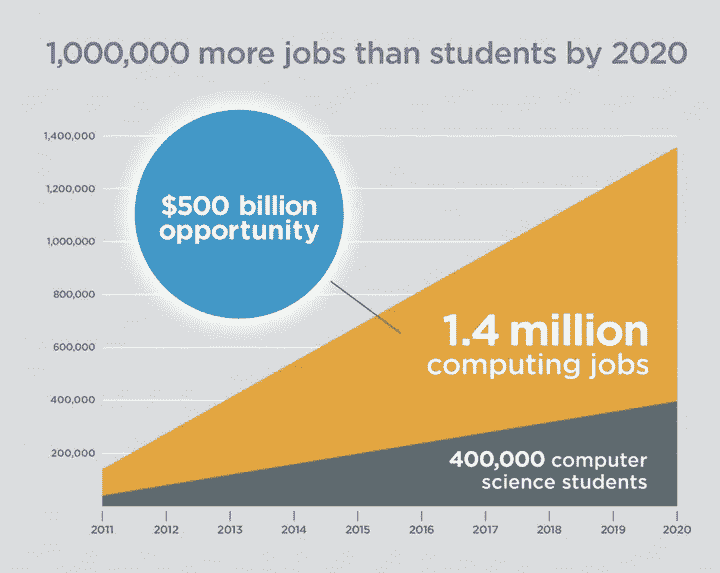
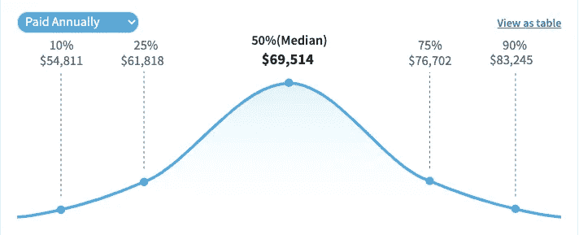
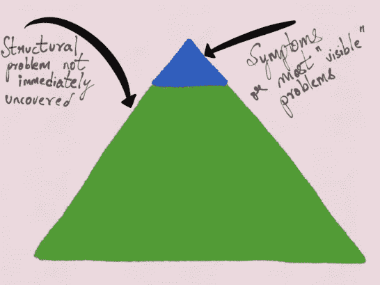

# 软件开发的三大误区

> 原文：<https://blog.devgenius.io/3-biggest-software-development-misbeliefs-c6854a86c531?source=collection_archive---------9----------------------->

## 揭开软件开发人员的真相

莎伦·麦卡琴在 [Unsplash](https://unsplash.com?utm_source=medium&utm_medium=referral) 上的照片

目前最赚钱的职业是软件开发。需求真的很高，所以大家都需要开发者。这没什么不好，尽管很多人对软件开发有误解。

[https://cheesecakelabs . com/blog/why-nearshore-software-development-to-Latin-America/](https://cheesecakelabs.com/blog/why-nearshore-software-development-to-latin-america/)

我将揭开围绕软件开发的最大误区。

# 高薪

软件开发是一个数百万富翁的生意。确实是。不是每个开发者都能成为百万富翁。获得高薪需要很多知识。你需要提供高价值，才能获得高价值的回报。

[软件开发人员工资分配](https://www.salary.com/research/salary/benchmark/software-engineer-i-salary)

如果你为第一个软件解决方案获得报酬，你是非常幸运的。大多数开发人员必须先做一些免费项目。除了形式上的知识，开发者还需要在技术本身上投入大量的时间。

你需要提供更多的价值来获得更高的薪水。更多的价值意味着更多的知识和更多的经验。学习软件开发需要几年的时间才能达到想要的知识水平。获得经验也不容易。

想象一下，在一个流量很大的网站上加速页面加载。你会带来多少价值？为了正确理解为什么开发人员如此有价值，请阅读下面这段话:

> 尽管这一切可能令人惊讶，但这种不耐烦的暗示更令人震惊。据亚马逊计算，页面加载速度每慢一秒钟，每年就会损失 16 亿美元的销售额。谷歌计算出，只要将搜索结果的速度降低 0.4 秒，他们每天就会失去 800 万次搜索——这意味着他们会少提供数百万条在线广告。 [FastCompany 文章](https://www.fastcompany.com/1825005/how-one-second-could-cost-amazon-16-billion-sales#:~:text=Amazon's%20calculated%20that%20a%20page,many%20millions%20fewer%20online%20adverts)

# 开发人员做出明智的决策

这种错误的信念是开发者做出最好的决定。虫子根本就不会存在。开发人员会犯很多错误。决策是在团队讨论中做出的，而不是作为一只孤狼。

无私的开发人员编写糟糕的代码，期望其他人会掩盖它。他们只是在等待薪水，大多数承包商都是这样工作的。

为了应对这种情况，团队中有好的和不太好的开发人员。建设性的讨论导致伟大的决定。

技术决策也非常重要。大多数时候开发者只看到冰山一角。很少有人能真正解决原因，而不是结果。那些为了高薪而不是刺激的人不会看到更大的图景。

[https://medium . com/@ copy construct/technical-decision-9 b 2817 c 18 da 4](https://medium.com/@copyconstruct/technical-decision-making-9b2817c18da4)

UI 对于全栈开发者来说也真的很重要。对如何构建一个页面、一个组件有一个清晰的认识通常并不容易。开发者不能决定出现的每一个问题。前端、后端、UI/UX 都是很大的专业领域，所以决策是由专门的团队做出的。

# 没那么大压力

JESHOOTS.COM 在 [Unsplash](https://unsplash.com?utm_source=medium&utm_medium=referral) 上[的照片](https://unsplash.com/@jeshoots?utm_source=medium&utm_medium=referral)

截止日期、讨厌的测试人员、错误的代码会导致紧张的局面。虽然看起来开发人员整天坐着，偷懒，但也有一些严重的压力。

大多数有压力的情况都是由对他人的忽视或无知造成的。承包商做了他们得到报酬的工作，然后离开。解开他们写的代码通常是一个痛苦的经历。

# 任何人都可以成为开发者

这个我听了很多。你只需要一门课程，从一些甚至不会编程的人那里学，你很棒。经验不是学来的，而是挣来的。开发人员需要创建尽可能多的辅助项目。

开发人员与众不同。他们有很强的逻辑思维，思考负面场景，以及很强的文化素养。编写代码是一门艺术，开发者需要通过编写的代码来最好地表达。

如果你有管理者的脾气，你就不适合。开发人员的大部分日常生活都充斥着修复 bug。你在决策中没有发言权，就像企业决定的那样。做好被告知该做什么的准备，而不是自己去做。

处理抽象的东西可能很难。即使在工作之外，开发人员也会在头脑中思考项目。你会记得你修复的每一个 bug，和你做的每一个特性。

## 感谢阅读！

相关文章:

 [## 软件工程师不告诉你的事情

### 在媒体上，在 YouTube 上，在整个互联网上，人们都在谈论他们是如何成为软件工程师的…

medium.com](https://medium.com/swlh/what-software-engineers-dont-tell-you-5e9660b87fe6)  [## 为什么软件工程师工资高

### 固执己见的前端开发人员的回答

medium.com](https://medium.com/@ferzos/why-software-engineers-are-highly-paid-af0399ceab1c)  [## 决策:软件工程中最被低估的技能

### “普通人每天会做出令人瞠目结舌的 35000 个选择”

medium.com](https://medium.com/hackernoon/decision-making-the-most-undervalued-skill-in-software-engineering-f9b8e5835ca6)