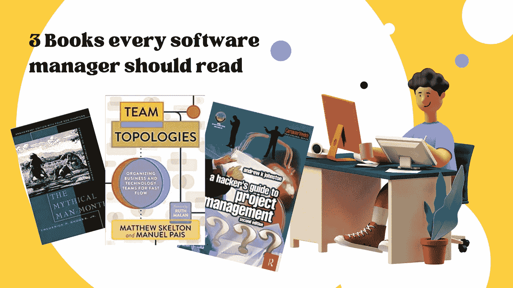
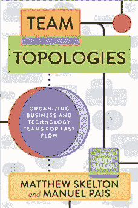
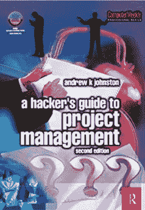

# 每个软件经理都应该阅读的 3 本书

> 原文：<https://blog.devgenius.io/3-books-every-software-manager-should-read-698e7e467628?source=collection_archive---------1----------------------->

## 开始你的管理书架的几本书建议

在收集了大量书籍后，我向自己挑战，我会向一个有抱负的或新的软件工程经理推荐哪三本书。

我想出这三个是因为它们是众所周知的文本，我经常参考它们，每次阅读它们都能学到一些新的或发人深省的东西:

*   神话中的人月——是的，它是古老的，但奇怪的是，它仍然是相关的。这是一个故事集，写得很优雅，举例说明了团队和项目的某些方面，包括事情没有按计划进行时的场景。
*   [**团队拓扑**](https://teamtopologies.com/key-concepts)**——这本书建立在 [**康威定律**](http://www.melconway.com/Home/Conways_Law.html) 的基础上，与当今的微服务架构以及交付这些架构所需的人员结构特别相关。**
*   ****项目管理黑客指南**——一本直截了当的项目管理指南。以一种易于理解的格式来完成，这使得一个新的软件经理看起来很专业，并能与一个专门的项目经理相抗衡。是的，它主要与瀑布流程相关，但是客户约定是典型的固定成本，所以这是军械库中的一个有用工具。**

**或者从另一个角度来看，如果你刚刚起步，需要:**

**1 — **建立**一个团队**

**2 —决定团队**结构****

**3 — **利用团队执行**项目**

**那么这些书有有用的方法和例子会有所帮助。**

# **神话中的人月**

**神话人月:软件工程论文，周年纪念版:Brooks Jr .，Frederick: 8580001065793 [在亚马逊](https://www.amazon.co.uk/gp/product/0201835959/ref=as_li_tl?ie=UTF8&camp=1634&creative=6738&creativeASIN=0201835959&linkCode=as2&tag=osduk-21&linkId=d40168fa15016d5c6979c12dc4afc938)上找书**

****

**我最喜欢的一章是外科团队，它类比了外科团队是如何由各种医疗职业组成的。我曾多次使用的鼓舞萎靡不振的测试人员的故事是本书中描述的 IBM 黑色团队的故事。**

**在 20 周年纪念版中甚至有一章思考了自第一版以来的 20 年中发生了什么变化。**

# **团队拓扑**

**团队拓扑:组织业务和技术团队实现快速流动:Skelton、Matthew、Pais、Manuel、Malan、Ruth: 9781942788812 [在亚马逊上查找书籍](https://www.amazon.co.uk/gp/product/1942788819/ref=as_li_tl?ie=UTF8&camp=1634&creative=6738&creativeASIN=1942788819&linkCode=as2&tag=osduk-21&linkId=54381ba2f3c3933be4fbadc6a7b9935f)**

****

**这本书涵盖了康威法则、成功的团队模式和四种基本的团队拓扑。然后详细描述这些拓扑结构。这本书有一个干净的外观和感觉，但它的简单掩盖了如何成功组建团队的巧妙信息。**

# **项目管理黑客指南**

**黑客项目管理指南(计算机周刊专业版):Johnston，Andrew: 9780750657464 [在亚马逊上找书](https://www.amazon.co.uk/Hackers-Project-Management-Computer-Professional/dp/0750657464/ref=sr_1_1?dchild=1&keywords=9780750657464&qid=1629972298&s=books&sr=1-1)**

****

**这本书通过提出一系列问题来探讨这个话题。还是什么？然后用一两页纸来回答。这使得这本书非常容易以简短的片段来阅读，或者直接进入某个特定主题来获得建议。我向许多高级开发人员推荐了这一点，他们开始做更多的管理任务，需要一些简明的建议。**

# **进一步阅读**

** [## 敏捷团队的配方是 45 年前的吗？

### 当雇佣更多的开发人员来创建一个新的团队，并选择混合技能来填补角色时，这使我…

medium.com](https://medium.com/outsource-dev/is-the-recipe-for-an-agile-team-45-years-old-a8466abb170c)  [## 书评——动态复习

### 标题“动态重新训练”用两个词表达了一个复杂的主题，但是它涵盖了许多复杂性:

medium.com](https://medium.com/outsource-dev/book-review-dynamic-reteaming-26c039ac3896)  [## 给关键路径上的经理们的便利提示

### 作为一名经理，当你开始感受到截止日期的压力，大量的任务要做，或者雪崩…

greg-billington.medium.com](https://greg-billington.medium.com/handy-tips-for-managers-on-the-critical-path-4250c4a364d5) 

# 关于作者的更多信息

**Greg** 是一名经验丰富的软件专业人士，也是[**outsource . dev**](https://outsource.dev/)**，**的首席技术官，他曾在多家公司工作过，现在热衷于帮助他人在软件开发、管理和外包方面取得成功。

如果你喜欢这篇文章，请鼓掌👏和**关注**我或者 [**订阅**](https://greg-billington.medium.com/subscribe) 一封邮件✉️。**