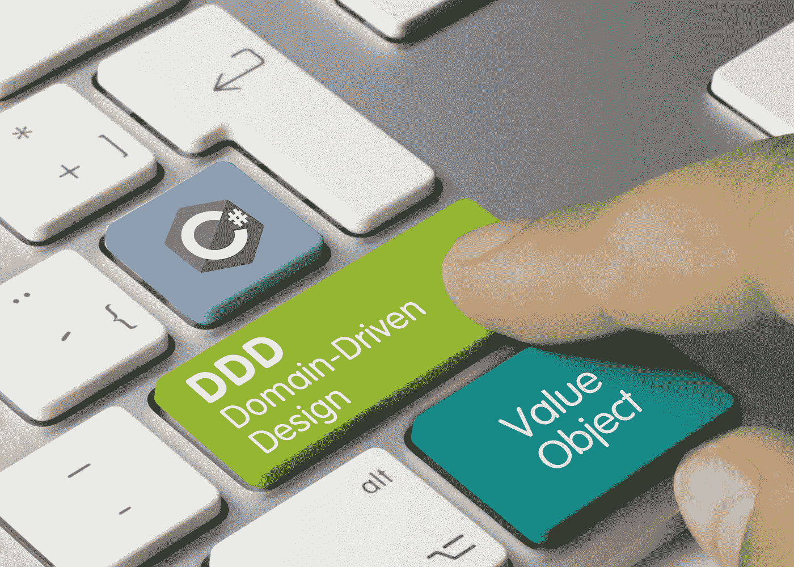
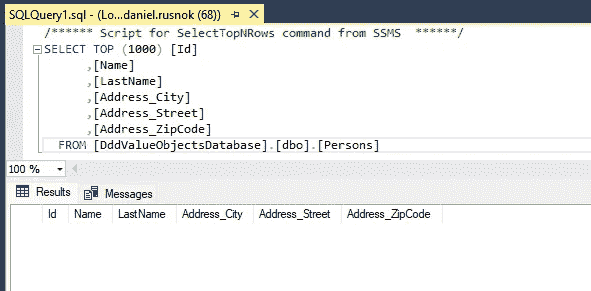
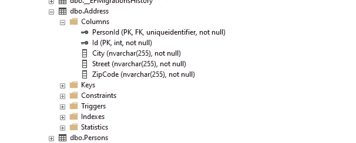
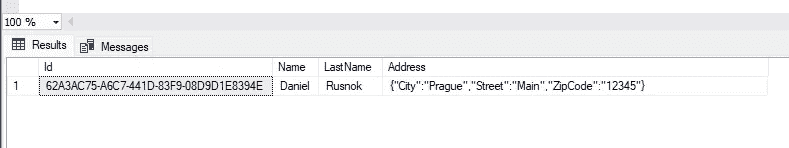

# C# 10 中实现值对象的 3 种不同方法

> 原文：<https://blog.devgenius.io/3-different-ways-to-implement-value-object-in-csharp-10-d8f43e1fa4dc?source=collection_archive---------0----------------------->

## 领域驱动设计

## 让我们来看看如何用 EF Core 6.0 实现值对象，并将它们映射到一个数据库表。

# 什么是价值对象

值对象是没有显式标识符的对象。它的第一个主要特点是**不需要身份**。

第二个主要特征是值对象必须是不可变的。这意味着一旦值对象属性被初始化，我们就不能改变它们的值。您只能通过在其属性中引入具有不同值的新值对象来更改它们。

一个很好的例子是**地址**。它由城市、街道和邮政编码组成。一旦你改变了其中的一个，你就改变了整个地址。它是完整的。

值对象的第三个主要特征也是**值** **相等**。一旦值对象的类型和属性值相等，它们就相等。值对象的每个实现都必须支持这样的行为。

值对象是**领域驱动设计**模式之一，作为领域建模的实体和集合。我已经在下面的另一篇文章中写了一些关于 DDD 的内容。

如果你刚到 DDD，你仍然可以从这篇文章中获得令人兴奋的知识。但是我也建议看看朱莉·勒曼和史蒂夫·史密斯的 Pluralsight 课程[领域驱动设计基础](https://www.pluralsight.com/courses/fundamentals-domain-driven-design)。

 [## 每个软件开发人员都应该知道的 3 个以领域为中心的架构

### 建筑师首先关心的是确保房子是可用的，而不是确保房子是…

levelup.gitconnected.com](https://levelup.gitconnected.com/3-domain-centric-architectures-every-software-developer-should-know-a15727ada79f) 

# 不同的实施方式

## 值对象父级

C#中值对象的第一个典型实现之一是`ValueObject`抽象类。从它继承的每个类都被认为是一个值对象。

您可以看到一个被覆盖的`GetHashCode`方法。此方法用于返回对象实例的哈希代码。哈希代码用于标识基于哈希的集合中的对象。该方法为需要快速检查对象相等性的算法提供哈希代码。

如果我们想将对象作为值对象进行比较，我们必须根据其属性的散列码来计算散列码。属性的值由`GetEqualityComponents`抽象方法提供。

`ValueObject`父节点的每个子节点都必须实现`GetEqualityComponents`方法。

地址类别

注意，我在每个属性上使用了`init`关键字，而不是特定的`set`关键字。这样，您将属性定义为 [Init Only](https://docs.microsoft.com/en-us/dotnet/csharp/language-reference/proposals/csharp-9.0/init) ，并且您可以确定它的不变性。

## 记录

从 C# 9 开始，记录就一直伴随着我们。您可以使用`record`关键字来定义一个引用类型，为封装数据提供**内置功能。内置功能是由编译器自己在编译时添加的。**

对于`record`关键字，我们可以使用**位置语法**。这是定义自动不可变类的一种更简单的方法:

因此，通过使用位置语法，我们满足了一个主要特征— **不变性**。

另一个特点是**值相等**。微软文档是这样描述记录类的:

> 对于记录类型，包括记录结构和只读记录结构，如果两个对象属于同一类型并存储相同的值，则它们是相等的。

**值相等**行为是安全的，这要感谢编译时内置的对`Equals`方法的覆盖。

最后一个特征是**标识符**的效力。既然我们不会引入任何独特的属性，我们应该是好的。

我们可以说 record 类是定义值对象的一种快速而直接的方式。

## 结构

结构是值类型。意味着结构类型变量**直接包含一个实例**，而不是引用。变量值在赋值时被复制，将一个参数传递给一个方法，并返回一个方法结果。

另一方面，引用类型变量包含一个对实例的**引用。Assign 语句不复制实例，而只传递其引用。此外，将引用类型变量传递给方法意味着对方法的修改是在同一个实例上进行的，而不是在它的副本上。**

该结构也可以用关键字`record`和**位置语法**来定义。

`public record struct Address(string Street, string ZipCode, string City);`

因此，我们再次满足所有三个主要特征— **不变性，标识符的效力，**和**值相等**。所以 struct 是实现值对象的另一种可靠方式。

## 摘要

Value object parent 是最复杂的实现，我建议更高级的 DDD 开发人员使用它。Vladimir Khorikov 做了一篇关于价值对象父优于记录的伟大文章[在这里](https://enterprisecraftsmanship.com/posts/csharp-records-value-objects/)。

我在较低的层次上使用值对象，我更“亲记录”，所以我将在我的最后一句话中关注它们。

**什么时候我们应该用** `**record class**` **而不是** `**record struct**` **反之亦然？**两者都满足值对象实现的主要要求。

结构在堆栈上分配。结构应该很小。**如果数据太大，那么在方法之间传递数据的成本会很高，因为我们每次传递都会创建一个值类型的新实例**。当保存的数据量有限时使用它们。

在堆上分配一个类。它是一个引用类型，**所以通过方法传递对象的开销并不大**。如果要定义更重要的值对象，应该使用类。

更多的是关于**何时使用引用类型和值类型**。微软文档中有一篇文章专门解答这个问题[这里](https://docs.microsoft.com/en-us/dotnet/standard/design-guidelines/choosing-between-class-and-struct?redirectedfrom=MSDN)。

值对象是预定义为保存在实体中并持久保存在数据库中的不可变变量。**在方法间传递的次数总是更多，这意味着**记录类(引用类型)比记录结构(值类型)更适合值对象的实现。

# 价值目标和 EF 核心

## 拥有的类型

用于映射值对象的**实体框架核心**的便利特性是拥有类型。微软文档中的定义是:

EF Core 允许你对只能出现在其他实体类型的导航属性中的实体类型进行建模。这些被称为拥有的实体类型。包含拥有的实体类型的实体是其所有者。

所以，从 EF 核心的观点来看，价值对象不能没有它的拥有者而存在。大多数情况下，所有者是某个**实体**。想象一个类`Person`作为一个实体(所有者)，类型`Address`的属性作为它的值类型(拥有类型)。

Person.cs

为了将实体`Person`映射到数据库表，我将使用 fluent model builder 并直接在`DbContext`类中覆盖方法`OnModelCreating`。

AppDbContext.cs

如你所见，我对 EF Core 说,`Person`拥有一个地址，然后在它的子构建器中定义了`address`属性。生成的数据库表如下所示。

地址属性的值存储在 Persons 表的列中，其名称带有特定的指令——“ValueObjectName _ property name”

但是如果我有一个**地址集合**呢？如果你在一个实体中有一个值对象的集合，你应该使用方法`OwnsMany`，EF Core 将把它们映射到带有外键`PersonId`的表中。

OwnsMany

地址表的列

但是如果你选择`struct`作为你的值对象，你**还不能为它使用拥有的类型**。您必须将值对象序列化为 JSON，并将其存储在 varchar 列中。[但随着 EF Core 7.0 的推出，可能会有所改变。](https://docs.microsoft.com/en-us/ef/core/what-is-new/ef-core-7.0/plan#value-objects)

引入从 address 到 JSON 的转换非常简单，但是您不会更方便地读取数据库，就像 address 属性的值都存储在其列中一样。

价值对象文章

数据库中的结构地址

从 EF Core 6.0 开始，我们可以使用特性**预约定模型配置**，并通过为值对象类型引入`ValueConverter`并在`DbContext`类的`ConfigureConventions`方法中配置它来全局定义从类型`Address`到 JSON 的转换。

地址转换器

# 来源

*   [C# 9 记录作为 DDD 价值对象的弗拉基米尔·霍里科夫。](https://enterprisecraftsmanship.com/posts/csharp-records-value-objects/)
*   [EF Core 6.0 中的新特性。](https://docs.microsoft.com/en-us/ef/core/what-is-new/ef-core-6.0/whatsnew#pre-convention-model-configuration)
*   [微软文档中的数值转换。](https://docs.microsoft.com/en-us/ef/core/modeling/value-conversions?tabs=data-annotations#examples)
*   在微软文档中选择类和结构。
*   [在 StackOverflow 上为值对象选择不可变对象和结构。](http://Choosing between immutable objects and structs for value objects)
*   [微软文档中的结构类型。](https://docs.microsoft.com/en-us/dotnet/csharp/language-reference/builtin-types/struct#readonly-struct)
*   [Pluralsight 课程领域驱动设计基础。](https://www.pluralsight.com/courses/fundamentals-domain-driven-design)

# 遗言

感谢你的关注。我在这里为我的每篇博文列出了非限制性链接。我是 Itixo 公司的一员。NET 中欧会议，[布拉格更新会议](https://www.updateconference.net/en)。

赞助商

# 进一步阅读

 [## 每个软件架构师都应该知道的软件体系结构的层次

### “所有的架构都有相同的目标——关注点的分离。都是通过分软件来实现的…

levelup.gitconnected.com](https://levelup.gitconnected.com/layers-in-software-architecture-that-every-sofware-architect-should-know-76b2452b9d9a)  [## 每个软件架构师都应该知道的 3 个 CQRS 架构

### 关注点分离是一种有效整理一个人思想的技术。你应该集中注意力…

levelup.gitconnected.com](https://levelup.gitconnected.com/3-cqrs-architectures-that-every-software-architect-should-know-a7f69aae8b6c)  [## 我如何使用？网络 6

### 我想和你分享一下。NET 6 的新特性。扩展。AttributedBehaviors NuGet 包帮助…

levelup.gitconnected.com](https://levelup.gitconnected.com/how-i-upgrade-my-code-style-of-mediatr-pipeline-using-net-6-ed49aca61f47)